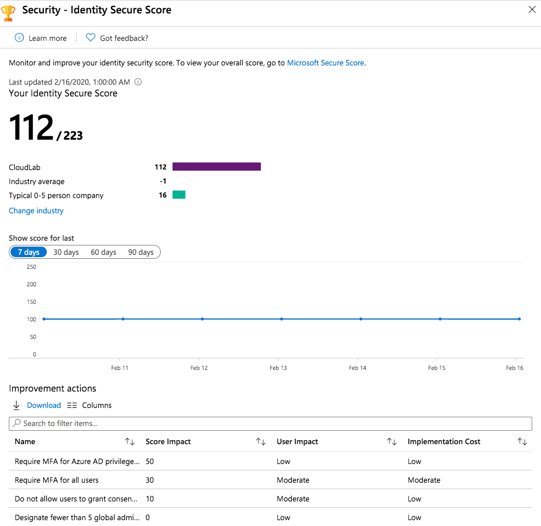
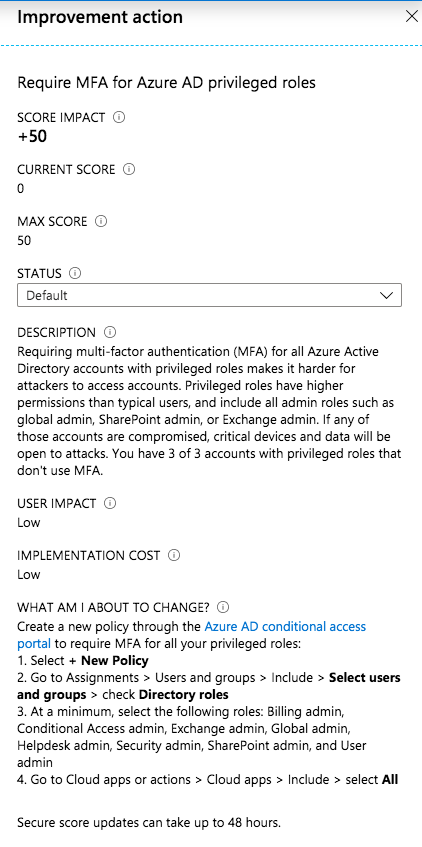
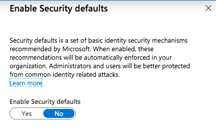
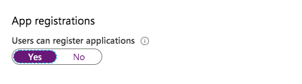
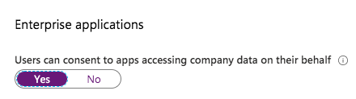
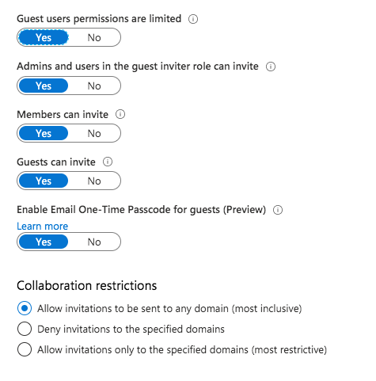
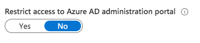
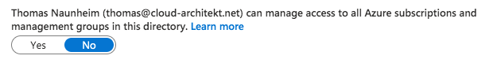
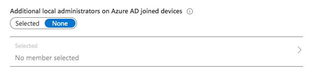
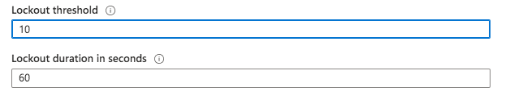

_Every created Azure AD tenant has default configurations by Microsoft.
These settings should be reviewed and cross checked with your security requirements, strategy of self-services and governance policies.
In these blog post I like to give you an overview of using “Identity Secure Score” and few hardening settings that needs particular attention._

**Microsoft’s default settings**

Default tenant settings seems to be chosen by Microsoft to fits for most (small or mid-sized) organizations. Nevertheless the customer is still responsible to review "by default" settings and comparing these with business and organizational requirements.

Azure AD, as every cloud service, is not a shipped product and therefore you should regularly assess previous and new settings. Best practices may have been changed or new features (including default settings) was enabled in your tenant.

Follow the [release notes of Azure AD](https://docs.microsoft.com/en-us/azure/active-directory/fundamentals/whats-new) to be aware of changes in Azure AD.

**Identity Secure Score**

Microsoft did a good job to implement “Identity Security Score” for Azure AD which is similar designed to other security scores in Microsoft Cloud services (Office 365 and Azure Security Center).

Providing every customer a built-in measurement of their “identity security configuration" is the primary goal.
It is very easy to follow Microsoft’s security recommendations and guidance to improve your identity security posture.
You’ll find the “[Identity secure score](https://docs.microsoft.com/en-us/azure/active-directory/fundamentals/identity-secure-score#how-do-i-get-my-secure-score)” in the “Azure AD Security” blade of your Azure Portal:

On the one hand many findings are very clear and obviously (such as require MFA for privileged roles).
But on the other hand some action descriptions and guidance should be well thought out and not followed blindly.

In this example you should take care on your “Emergency access accounts” (“Break glass”) if you like to exclude them from MFA (as planned in case of MFA service outage). You’ll find more details in my blog post [about managing these special kind of accounts for emergency scenarios](https://www.cloud-architekt.net/how-to-implement-and-manage-emergency-access-accounts/).

Configuration of [Azure AD Identity Protection](https://docs.microsoft.com/en-us/azure/active-directory/identity-protection/overview-identity-protection), [Privileged Identity Management](https://docs.microsoft.com/en-us/azure/active-directory/privileged-identity-management/pim-configure) or (Global) [Password Protection](https://docs.microsoft.com/en-us/azure/active-directory/authentication/concept-password-ban-bad) and other latest security features are also part of the recommended actions if you have not already enabled it.

Score impact of improvement actions, overall score of your tenant and relevant benchmarks (industry average or company size) are also available from this blade. This should help you to estimate and raise awareness of configuration risks.

I can strongly recommended to review the score and improvement actions on a regular basis.
These information are also available from the [Microsoft Graph Security API](https://docs.microsoft.com/en-us/graph/api/resources/security-api-overview?view=graph-rest-1.0#common-use-cases) and can be integrated to your existing operational dashboard (KPI/ITSM or monitoring) solution.

**Further consideration and aspects**

In the following sections I like to give an overview of some settings that are not part or fully covered by the “Identity Secure Score” (yet).

_The recommendations that I will referred below are based on my personal view and assessment.
You should cross review these with your environment and requirements (as always).
In addition my statements could be also out-dated after certain time after publishing these article._

## Security Defaults (Baseline policies / Conditional Access)
_Azure AD Portal > Properties > Manage Security Defaults_

Security defaults was introduced in November 2019 to replace  “Baseline policies” in Azure AD Conditional Access. It is an "one-click" solution to implement the most **basically** recommendations (by Microsoft) for your new Azure AD tenant. It’s available for every organization to achieve a basic level of security without extra costs. Design and scope of this minimal security level are [documented by Microsoft](https://docs.microsoft.com/en-us/azure/active-directory/fundamentals/concept-fundamentals-security-defaults). Every organization should prefer to create custom “Conditional Access Policies” to implement their own security, identity and access strategy. Configuring exclusions (such as emergency access or temporary exclusions of users) are also possible with custom policies only.

### Default value:
Every Tenant has enabled “security defaults” that was created after October 2019.
Existing or older tenants are configured without these option by default.

### My recommendation:
* Turn it on if you have no Conditional Access Strategy designed or resources for configuration (yet):
	* Consider that you have no option to exclude “[Emergency Access Accounts](https://www.cloud-architekt.net/how-to-implement-and-manage-emergency-access-accounts/))” from the security policies. 
* Replace “security defaults” by configuring [equivalent policies](https://docs.microsoft.com/en-us/azure/active-directory/fundamentals/concept-fundamentals-security-defaults#conditional-access) in Azure AD Conditional Access as soon as possible.
There are no excuses to postpone these steps after creation of the tenant.
	* Afterwards start working on a strategy for “Conditional Access” design for your organization. 
	Microsoft released good examples about [common identity and device access policies](https://docs.microsoft.com/en-us/microsoft-365/enterprise/identity-access-policies). This could help you to plan or draft your own (custom) policies.
* As soon you are using “Conditional Access Policies” this setting should be not relevant for you anymore.

## Application registrations and user consent
_Azure AD Portal > User settings (> Enterprise applications)_

### Default value:
All users are able to proceed app registration and consent user permission. This was already [a topic of my recent blog post](https://www.cloud-architekt.net/detection-and-mitigation-consent-grant-attacks-azuread/) and you should take care of the security risk. 

### My recommendation:
* Turn off app registration and user consent
* Automate a process to register and on-board new Azure AD-integrated apps (3rd party and internal apps)
	* Delegate permissions with least privileges (“Application Administrator”)
* Implementing admin consent workflow and delegate "reviewer" (permissions)

## Invitation of external users (B2B)
_Azure AD Portal > User settings > Manage external collaboration settings_

### Default value:
Every user is able to invite “Guest users“ and even invited Guests are able to invite other Guests.
By default Guest users has limited permission in your tenant. Check the Microsoft documentation to [compare member and guest default permissions](https://docs.microsoft.com/en-us/azure/active-directory/fundamentals/users-default-permissions#compare-member-and-guest-default-permissions).

### My recommendation:
* Disable permission to invite guests by your (member and guest) user 
* Optional: Restrict invitation from specified domains only (for example "Trusted partners")
* Be aware of other B2B options such as B2B OTP (preview feature) or direct sharing in Office 365.
* Implement a workflow and governance process for invitation of B2B users via [connected organization in Azure AD entitlement management](https://docs.microsoft.com/en-us/azure/active-directory/governance/entitlement-management-organization)
* Configure [a secure guest sharing environment](https://docs.microsoft.com/en-us/office365/enterprise/create-a-secure-guest-sharing-environment%E2%80%AC) and consider [Microsoft’s best practices for B2B scenarios](https://docs.microsoft.com/en-us/azure/active-directory/b2b/b2b-fundamentals)
* Consider that restriction of invitation will have an high impact for your end-users if there are already use it as part of the external collaboration in Office 365

## Access to Azure Portal
_Azure AD Portal > User settings_

### Default value:
Every user is able to access Azure AD administration portal and use default permissions (such as read users or groups). This behavior is roughly comparable to Active Directory (on-premises) and authenticated user that are able to browse the directory objects. 

### My recommendation:
* This really depends on your desired objective. Enabling the access restriction of Azure AD admin portal for non-admins is not covered by other access paths (PowerShell and other REST-Clients are still able to browse).
You should first think about the benefit, scope and need/use case of this kind of restriction.
* Default permissions for your member users still exists even if you prevent access to the portals.
There are a few [default permissions that can be restricted](https://docs.microsoft.com/bs-cyrl-ba/azure/active-directory/fundamentals/users-default-permissions#to-restrict-the-default-permissions-for-member-users) (e.g. ability to read other users).
	* Be aware of disadvantages in case of modify the defaults (such as side effects of self-services or Office 365 collaboration).
* Conditional Access can be used to restrict access to several Azure management endpoint (Azure portal, ARM provider, Az PowerShell) as documented in Microsoft docs to [manage access to Azure](https://docs.microsoft.com/en-us/azure/role-based-access-control/conditional-access-azure-management).

## Access management for Azure resources
_Azure AD Portal > Properties_

### Default value:
Global Admins are not allowed to manage access to all Azure subscription and management groups as “User Access Administrators”.

### My recommendation:
* Prevent (regular or permanent) elevated access of Global Admins:
	* Design a process to regain access to a specific subscription or management group in case of lost access
	* Delegate read-only permission to browse and review permissions of Azure resources to Global Admins (if needed)
* Implement [Azure Privileged Identity Management (PIM)](https://docs.microsoft.com/en-us/azure/role-based-access-control/pim-azure-resource) to manage permissions to your Azure resources
* Monitor [all assignments at root scope](https://docs.microsoft.com/en-us/azure/role-based-access-control/elevate-access-global-admin) to detect elevated access by Global Admins

## Local administrators on Azure AD joined devices
_Azure AD Portal > Devices > Device settings_

### Default value:
No specific user is configured and shown in the portal as local administrator but the following 3 types of users are granted by default:

* Users with “Global Administrator” role
* Users with “Device Administrator” role
* User which has performed the Azure AD join

### My recommendation:
* Prevent usage of accounts that has local admin permissions granted to all devices
	* Using Privileged Account Management (PAM) or alternate LAPS (e.g. “[Serverless LAPS](https://github.com/jseerden/SLAPS)”) solution to manage and rotate passwords for local admin accounts of all Windows devices in your Azure AD.
* Remove default permission for GA as local admin
	* No local admin tasks by Tier0 account (similiar to on-premises environments)
* Avoid usage of Device Administrator
	* Consideration: Removed role assignments can be still granted with local admin permissions as you might expected.
	Check the following blog post about [challenges to manage privilige access to your Azure AD-joined devices by Kenneth van Surksum](https://www.vansurksum.com/2020/02/11/challenges-while-managing-administrative-privileges-on-your-azure-ad-joined-windows-10-devices/).
* Configure AutoPilot profile to prevent that an initial user is assigned as local admin.

## Smart lockout thresholds and duration
_Azure AD Security > Authentication Methods > Password protection_

### Default value:
By default Azure AD locks accounts from sign-in attempts for one minute after 10 failed accounts.

### My recommendation:
* Consider the following facts:
	* Each Azure AD data center tracks lockout independently
	* Familiar and unfamiliar locations will be used to differentiate between bad actor and genuine user.
	Therefore separated lockout counters will be used by Azure AD.
* In case you are using PTA: Lockout threshold in Azure AD must be less than the Active Directory account lockout threshold.
Azure AD lockout duration must be set longer than AD reset account lockout.
Verify your [on-premises account lockout policy](https://docs.microsoft.com/en-us/Azure/active-directory/authentication/howto-password-smart-lockout#verify-on-premises-account-lockout-policy) to set suitable values.
	* Recommendation: Reconsider your existing AD lockout policy and check alternative approaches to prevent attackers from (on-premises) brute-force attempts. Azure ATP and automated response process (as part of Azure Sentinel) can be used to detect and mitigate attacks.
	In this case you are able to lock out attackers explicitly without negative impact for genuine user.
	Otherwise attackers are aided by your local account lockout policy to use denial-of-service attack for locking out accounts in your on-premises environment.

Original cover image by [Pettycon / Pixabay](https://pixabay.com/de/users/Pettycon-3307648/?utm_source=link-attribution&amp;utm_medium=referral&amp;utm_campaign=image&amp;utm_content=1674891)
