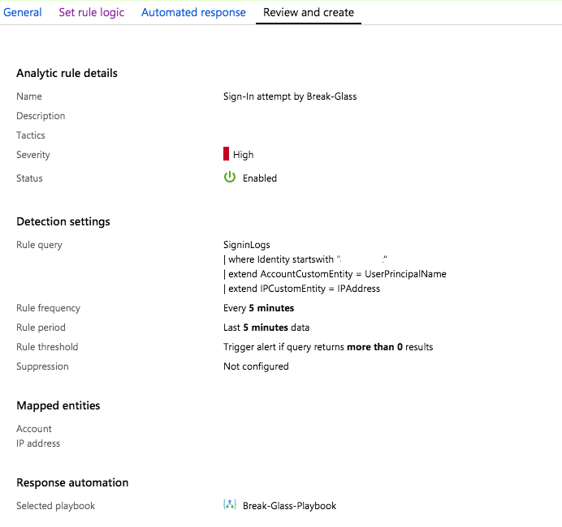
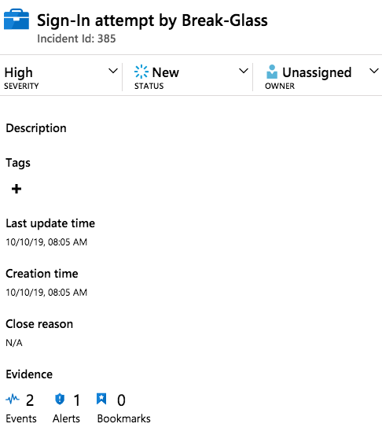
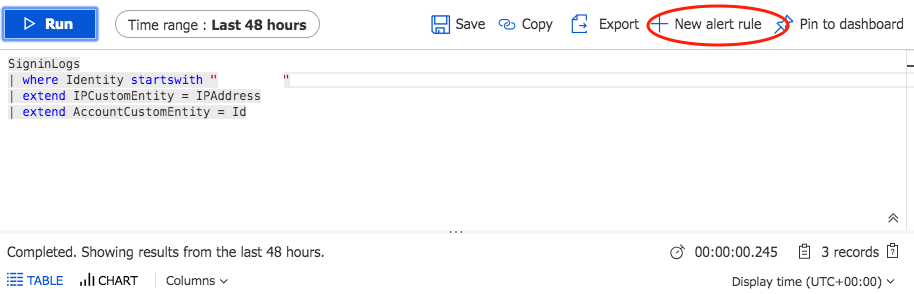
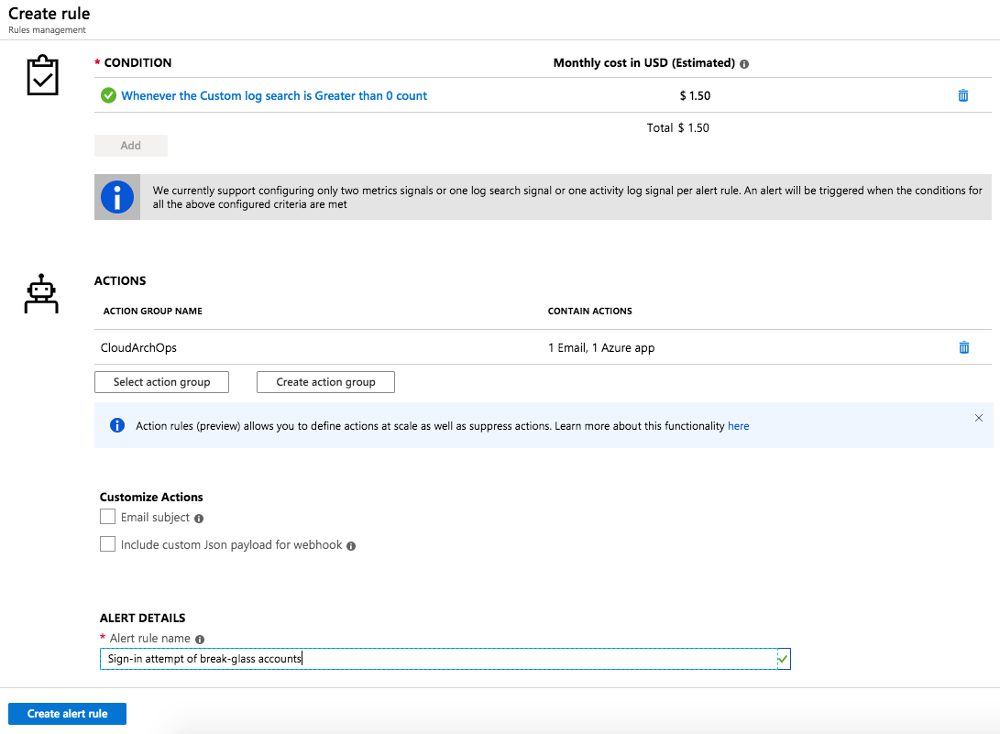
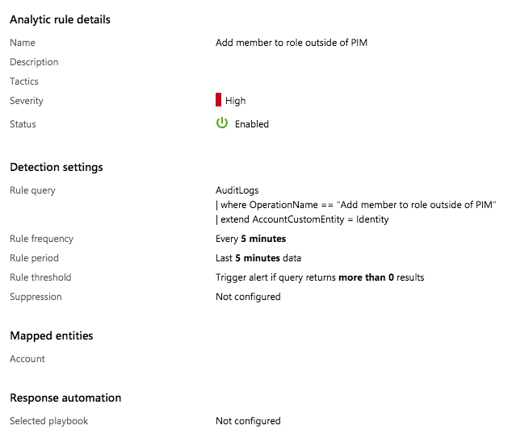
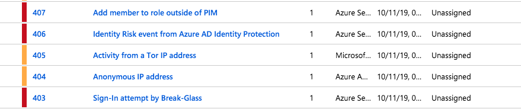
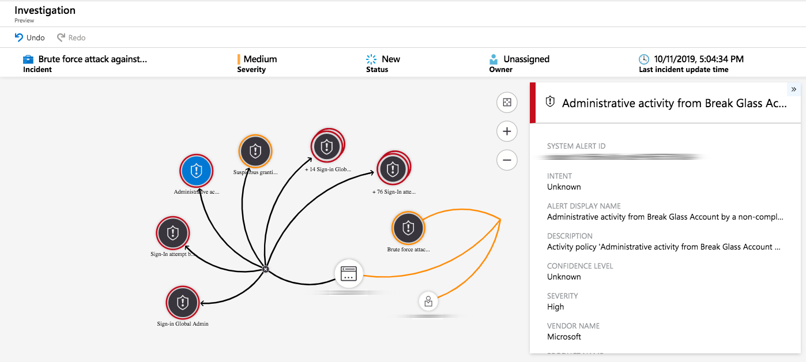
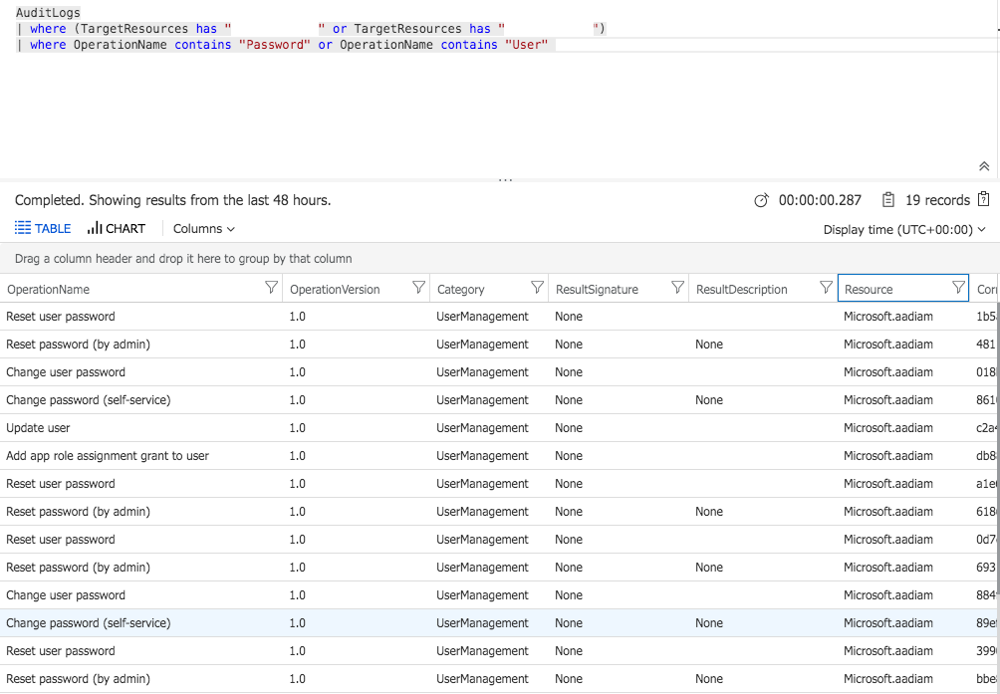

_Microsoft strongly recommends to implement emergency access accounts. This article gives an overview and step-by-step guide to configure and monitor this type of accounts_

# Overview of break glass accounts
Emergency access accounts, also known as “break glass accounts”, should be included in every deployment plan of Azure AD tenants. These accounts are an essential part in case of disaster recovery or emergency access. Outage and downtime of Microsoft’s Azure MFA service (as it happens in 2018 twice in a row) is just one real world example that shows the need of this kind of accounts.

Microsoft strongly recommends to implement two or more emergency access accounts in your Azure tenant environment. This non-personal and high-privileged accounts should be only used in emergency cases and strictly monitored. This applies also to self-inflicted problem such as “lock yourself out from tenant” (e.g. misconfigured Conditional Access policy) or downtime of hybrid identity components (e.g. ADFS or PTA). Regular use to bypass limited (RBAC) permissions or security baselines must be prevented. 

A well-documented guide of emergency access accounts is also available from Microsoft:
[Manage emergency access administrator accounts - Azure Active Directory | Microsoft Docs](https://docs.microsoft.com/en-us/azure/active-directory/users-groups-roles/directory-emergency-access)

_Note: Spend some time to design practical process chains for access, audit, validation and maintenance of the credentials (such as password rollover after number of days or IT personnel change) . This part of the implementation and management is often underestimated and must always proceed smoothly (particular in case of emergency)._

# Configuration of break glass accounts
The simple creation of one break glass account will be described in the following steps. You are able to run this PowerShell Core samples from the Azure Cloud Shell or from your local (admin) workstation (installed with the latest AzureAD module).

_Note: This is a very simple example that shows some aspects of implementing emergency access accounts. You should also consider the security policies or other technical conditions of your organization._

1. Generate a complex password and set option to disable the force of change password (at next logon). In my sample I have used the script function “New-RandomPassword” from the TechNet Script Center ([Script Function - New-RandomPassword](https://gallery.technet.microsoft.com/scriptcenter/Function-New-RandomPassword-3f3703ac)) to simplify the generation of a password In this sample. 

	```
	$PasswordLength = "<YourPasswordLength>"
	$PasswordProfile = New-Object -TypeName Microsoft.Open.AzureAD.Model.PasswordProfile
	$PasswordProfile.Password = New-RandomPassword -PasswordLength $PasswordLength
	$PasswordProfile.ForceChangePasswordNextLogin = $False
	```

	_Note: Microsoft supports passwords with a length up to 256 characters in Azure AD (since May 2019)._
	/Source: [Removal of the 16-character limit for passwords in Azure AD - Microsoft Tech Community - 565275](https://techcommunity.microsoft.com/t5/Azure-Active-Directory-Identity/Removal-of-the-16-character-limit-for-passwords-in-Azure-AD/ba-p/565275)/

	_Advice: Generated password in this script will be stored in the variable ($PasswordProfile.Password). Make sure you are using a securely transfer to your target system (password safe, PAM solution or export function to create the “offline copy” in a sealed envelope).  Secured Azure KeyVault (limited to Global Admins) can be used to temporary store created or updated passwords._

2. Define the required parameters to create an account including default tenant domain name and a username (recommend to use ones that is not easy to guess).
Set “other mail address” to a non-privileged account mailbox:
	```
	$BreakGlassAccountName	= “<YourHardToGuessBreakGlassName>”
	$DefaultDomainName		= (Get-AzureADDomain | Where-Object IsInitial -eq $true).Name
	$ForwardedMailbox		= “<YourOpsMailbox@YourCompany.com>”
	$Location				= “<YourCountryCode>”
	```

3. Create a security groups with all emergency access accounts as members to exclude them from Conditional Access Policies and MFA Registration:
	```
	$BreakGlassAccountGroup = “<Your Naming convention>”
	New-AzureADGroup -DisplayName $BreakGlassAccountGroup -MailEnabled $false -Description “All accounts for emergency access which are configured on internal policies” -SecurityEnabled $true -MailNickName “NotSet”
	```

	_Advice: Use Azure AD Access Review to set-up a regular review in addition to auditing. Only the related accounts should be member of this security group._

4. Create break glass account with pre-populated variables:
	```
	$BreakGlassAccount = New-AzureADUser `
		-UserPrincipalName ($BreakGlassAccountName + "@" + $DefaultDomainName) `
		-DisplayName $BreakGlassAccountName `
		-MailNickName $BreakGlassAccountName `
		-AccountEnabled $true  -UsageLocation $Location `
		—PasswordPolicies “DisablePasswordExpiration” `
		-PasswordProfile $PasswordProfile `
		-OtherMails $ForwardedMailbox
	```

5. Assign permanent Global Admin role assignment to account:
	```
	$DirectoryRole = Get-AzureADDirectoryRole | Where-Object {$_.displayName -eq 'Company Administrator'}
	Add-AzureADDirectoryRoleMember -ObjectId $DirectoryRole.ObjectId -RefObjectId $BreakGlassAccount.ObjectId
	```

	_Note: Directory role “Global Administrator” is named as “Company Administrator” in PowerShell and Microsoft Graph API_

6. Exclude the emergency access security group ($BreakGlassAccountGroup) from the following policies manually (there is no API for automation/scripting):

	* All Azure AD Conditional Access Policies
	* Risk-based Conditional Access Policies in Azure AD Identity Protection
	* MFA Registration in Azure AD Identity Protection

	_Note: Please be aware that Microsoft’s baseline policies (“Require MFA for all Admins”) does not allow to exclude users or groups._
	_I can strongly recommended to create your own conditional access policy to enforce MFA for all admins excluding the emergency accounts._

7. Verify that all related accounts are not covered by your “Self Service Password Reset (SSPR)” assignment.

	_Note: Currently there is no option to exclude users by a group:_
	/[Disable SSPR by group (exclude group from SSPR) – Customer Feedback for Microsoft Azure](https://feedback.azure.com/forums/169401-azure-active-directory/suggestions/35797822-disable-sspr-by-group-exclude-group-from-sspr)/


# Sign-in Alerting und Auditing

## Alerting “Sign-in attempt” with Azure Sentinel
First of all you should check if you have already connected “Azure AD logs” as data source in Azure Sentinel: [Connect Azure AD data to Azure Sentinel | Microsoft Docs](https://docs.microsoft.com/en-us/azure/sentinel/connect-azure-active-directory)

### Create custom rule to detect sign-in attempts 
Use the “Rule creation wizard” in Azure Sentinel to create a simple analytics:

1. Start with a simple KQL query to get all sign-in activities from your emergency access accounts (filtered by your naming convention) as you can see in this example:

	```
	SigninLogs
	| where Identity startswith “<BreakGlassNamingConvention>”
	| extend IPCustomEntity = IPAddress
	| extend AccountCustomEntity = UserPrincipalName
	```

2. Query scheduling and lookup data should be set to 5 minutes (minimal interval).  
3. Choose or create a Playbook (based on Logic Apps) to automate response or interact with other systems (e.g. reporting to ticket system or trigger other workflows).
4. The following analytic rule will be generated finally:




### Incident case based on created custom rule
You will see the incident case in Azure Sentinel in case of any sign-in attempt (successful or unsuccessful):



### Alerting by Log Analytics / Azure Monitor Alerts
You are able use the same KQL query in Log Analytics if you aren’t using Azure Sentinel. More details on how to implement Azure AD logs to Logs Analytics are available here:  [Stream Azure Active Directory logs to Azure Monitor logs | Microsoft Docs](http://aka.ms/AzureADLogAnalytics)

Run the query in your “Logs” blade to validate the results and click on “New alert rule”.




Configure your existing or a new action group to trigger Logic apps or other notify the Operations Team. 



## Alerting “Add Global Admin outside of PIM” with Azure Sentinel
You should also trigger an alert in case that someone is creating an emergency account or permanent “Global Admin”. For this reason, we create another custom rule to alert in case of adding members to “Global Admin” role outside of “Azure AD Privileged Identity Management (PIM)”. 

Use the following (KQL) query to the detection settings and with the same settings as described above:

```
AuditLogs
| where OperationName == “Add member to role outside of PIM”
| extend AccountCustomEntity = Identity
```

_Note: OperationName must be set to “Add member to role” if you are not using Azure AD PIM._

By the end of the configuration you will get the following custom analytic rule:




## Investigation of account activity with Azure Sentinel
Identity Protection is essential for your emergency access accounts even if you are not protecting those accounts with risk-based policy for automated responses. But you can collect logs from Azure Identity Protection and create incidents in Azure Sentinel based on sign-in or user risk alerts. 

Get an overview of all incidents which may be linked to an emergency access account by implementing default or custom rule templates in Azure Sentinel:



_Note: Learn more about the out-of-box threat detections in Azure Sentinel on Microsoft Docs:_
/[Investigate alerts with Azure Sentinel](https://docs.microsoft.com/en-us/azure/sentinel/tutorial-detect-threats-built-in)/

Microsoft Cloud App Security (MCAS) can also be used to monitor activities of break glass accounts and trigger specific (policy-based) alerts.

At the end you are able to investigate incidents as in the following example:




Internal brute-force attack of emergency access account and successful sign-in (after several attempts) with administrative activity from a non-compliant device. Suspicious granting of permissions to an account was detected. 

## Audit of emergency access management by Azure AD Activity logs
Break glass accounts and related security group (to exclude them from conditional access) must be covered by particular monitoring.  Make sure to configure alerts (similar to sign-in attempts) based on Azure AD Audit.

This query shows all audit-related logs of break-glass accounts (based on defined naming pattern):
```
AuditLogs
| where (TargetResources has “YourBreakGlassAccount1” or TargetResources has “YourBreakGlassAccount2”)
```

Filtered out activities by security-critical operations as you can see in this example:

<br>
<br>
<span style="color:silver;font-style:italic;font-size:small">Cover Image by [CGP Grey / Wikipedia](https://de.wikipedia.org/wiki/Datei:Sign_-_Key_-_Glass_(4891398099).jpg)</span>