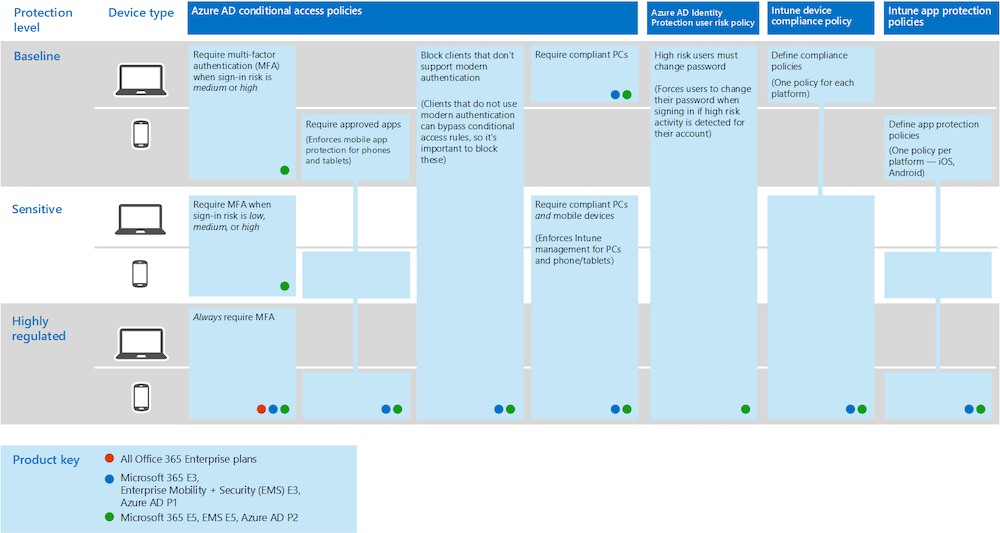
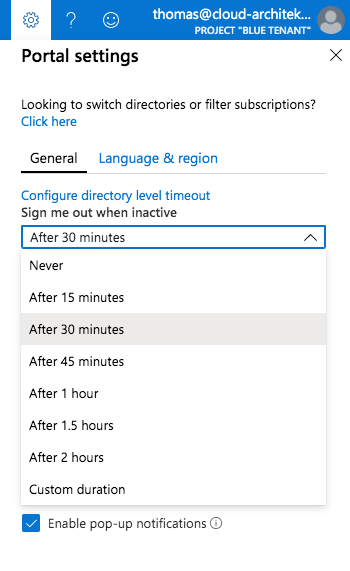
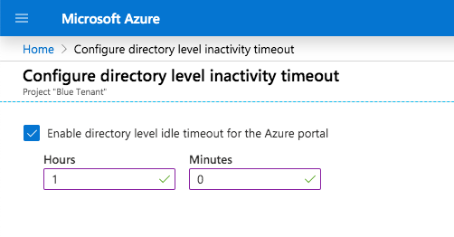
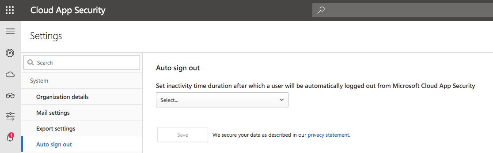
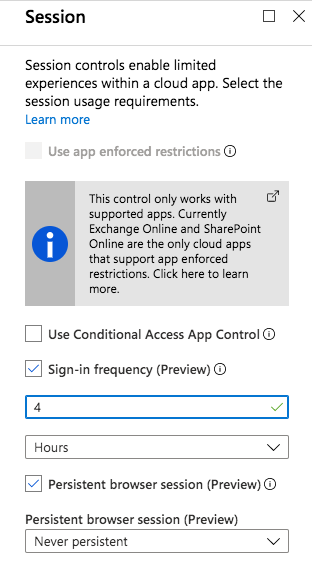
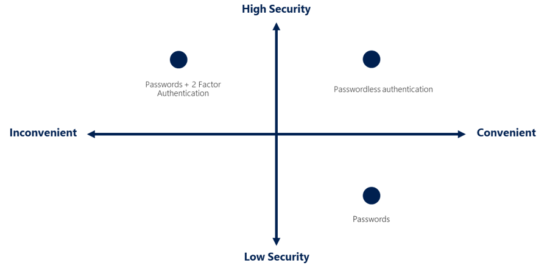

It is recognized that privileged access and management of IT services needs particularly protection and high security policies. There are already some concepts for securing privileged access that has been proven very useful in management of an on-premises infrastructure. Some of them can be adopted to hybrid or cloud-native environments as well.

However, it seems quite common to use a browser on a productivity (standard) workstation to manage Azure or Microsoft 365 workloads. Few years ago Microsoft has designed a concept of [Privileged Access Workstations (PAW)](https://docs.microsoft.com/en-us/windows-server/identity/securing-privileged-access/privileged-access-workstations) to use dedicated high-secured devices for privileged tasks only. 
This security approach generally seems not be applied in many cases to manage Azure resources as expected.

Scenarios and concepts for PAW or SAW (Secure Admin Workstations) in (hybrid) cloud environments are also part of my community talks about [“Securing and monitoring Azure AD accounts”](https://github.com/Cloud-Architekt/meetups/blob/master/2019-08-20%20AzBonn-Securing-and-monitoring-AAD.pdf). **I can only strongly recommended to use a PAW** to separate privileged and productivity workloads. This allows you to apply a sufficient security baseline for privileged tasks on Device-/OS-level and adopt security pattern such as "clean source"-principal approach and "secure keyboard".
But there are various deployment options from physical to shielded VM-based PAWs. The choiche also depends on your rating of convenients, security and costs.
More details on design approaches and implementation of SAW devices will be followed in one of my next blog posts.

The need of a fundamental concept for privileged identity management will not covered in this article and therefore it will not replaced by the following recommendation. You should **ensure that all admins have a privileged account for Azure Management** which is separated from “productivity” accounts (e.g. internet and mail access) or (high-privileged) on-premises admin accounts.

In this blog post I like to give you some recommendations and advices to increase your security and usability on level of browser- and identity-configuration. This can be use as part of your PAW/Admin workstation implementation or decrease the risk by using your standard (productivity) client.

Now, at that point, when I’m writing this post, some of the features are in “public preview”. Please take also in consideration that these features are not recommended to use in production (yet).
This article has no claim for completeness.

# Identity and device access policies
The following diagram shows recommended set of policies from Microsoft Docs. Some settings of the protection level “highly-regulated” environment can be adopted to protect your privileged accounts and devices:

_Source: Microsoft Docs: [Common identity and device access policies - Microsoft 365 Enterprise](https://docs.microsoft.com/en-us/azure/active-directory/authentication/concept-authentication-passwordless#enable-new-passwordless-authentication-methods)_

## Always require MFA
Every identity which can be used to manage Azure resources, Microsoft 365 services or your subscriptions (Enterprise Agreement Portal) should be (always) forced to use multi-factor authentication.

Microsoft has well documented how to create a Conditional Access policy to **require MFA for administrators**:
[Conditional Access - Require MFA for administrators | Microsoft Docs](https://docs.microsoft.com/en-us/azure/active-directory/conditional-access/howto-conditional-access-policy-admin-mfa)

Microsoft’s documentation described to use a list of “directory roles” as user assignment but other critical roles are not covered (e.g. Intune service Administrator is missing) in this introduction. 

Consider to create (dynamic) security groups that includes all your admin accounts. This group can be used as user assignment for the “Conditional Access policies” of all privileged accounts.  Further more I personally prefer to force these CA policies before a user account is eligible to request or assign the privileged role.

In addition to this you can also configure **require MFA for Azure Management** services for all users. Every user will be prompted for MFA if they attempt to access Azure Service Management apps such as Azure Portal.

A common policy is also documented by Microsoft to achieve this goal:
[Conditional Access - Require MFA for Azure management](https://docs.microsoft.com/en-us/azure/active-directory/conditional-access/howto-conditional-access-policy-azure-management)

_Advice: Make sure that your admins are able to use passwordless methods as strong authentication for MFA to avoid daily use of annoying verification options such das text messages or phone calls._

## Require compliant devices
Microsoft Intune can be used to identify if devices meet compliance requirements. Various Device Compliance policy settings such as requiring a PIN or operating system version can be configured in Intune. 
Device-compliance policies defines the requirements that devices must passed **to be marked as compliant.**
Another baseline policy to require compliant devices is also documented in Microsoft Docs:
[Conditional Access - Require compliant devices](https://docs.microsoft.com/en-us/azure/active-directory/conditional-access/howto-conditional-access-policy-compliant-device).

Define your security baseline for device configuration as “device compliance policy”.
This policy really depends on your needs of OS and security configuration (e.g. BitLocker encryption, OS version):  
[Create device compliance policies in Microsoft Intune | Microsoft Docs](https://docs.microsoft.com/en-us/intune/protect/create-compliance-policy)

Take a look on the MDM Security Baseline if you are planning to review or to rebuild your policies:  
[Intune security baselines settings for Windows 10 MDM | Microsoft Docs](https://docs.microsoft.com/en-us/intune/protect/security-baseline-settings-mdm-all?pivots=mdm-may-2019)

Please keep in mind to exclude emergency or break glass accounts from these policies as I described in [my previous blog post](https://www.cloud-architekt.net/how-to-implement-and-manage-emergency-access-accounts/).

## Identity protection risk policies
Identity protection should be applied to privileged accounts for detection of risky users. Verify that the user risk policy also includes your privileged accounts:  [How to configure and enable risk policies in Azure Active Directory Identity Protection | Microsoft Docs](https://docs.microsoft.com/en-us/azure/active-directory/identity-protection/howto-identity-protection-configure-risk-policies)

# Separated browser (user) profiles
Every privileged identity should have at minimum a separated browser profile.
Create seperated profiles for each account, for example based on (staging/customer) environement or split critical role. Increase your security by level of separation: Dedicated hardware or single device with browser on virtualization or sandboxing platform.

Google’s Chrome and Edge Insider (Chromium-based) are able to manage multiple user profiles and allow sign-in option of Azure AD work accounts:
* Microsoft Edge (Chromium) has native support to sign-in with your Azure AD account on profile level and manage the refresh token for single-sign on:
[Sign-in and sync with work or school accounts in Microsoft Edge Insider builds - Microsoft Edge Blog](https://blogs.windows.com/msedgedev/2019/08/21/sign-in-sync-work-school-accounts-aad-websso/)

* Google Chrome requires “Windows 10 Accounts” extension to support device compliance and sign-in + SSO of your Azure AD account on profile level.
[Windows 10 Accounts - Chrome Web Store](https://chrome.google.com/webstore/detail/windows-10-accounts/ppnbnpeolgkicgegkbkbjmhlideopiji)

_Advice: Do you like to know more about Azure AD tokens and browser cookies in Chrome and Edge (Classic)? Technical details on Azure AD WAM plug-in and how it also enables SSO on browser (by injecting the PRT) are described in this excellent PRT documentation by Microsoft:_
[Primary Refresh Token (PRT) and Azure AD - Azure Active Directory | Microsoft Docs](https://docs.microsoft.com/en-us/azure/active-directory/devices/concept-primary-refresh-token)

## Hardening of browser settings
Review your browser settings and validate some options such as:
* Clear cookies and cache after you close the browser
* No (3rd-party) extensions installed on profiles
* Increased tracking prevention (Edge Insider only) 
* Disable crash report or user feedback
* Enable Microsoft Defender SmartScreen
(required extension on Google Chrome)
* Set page layout and content to Focus (Edge Insider only) 

Do not use the browser (profile) for non-privileged activities and (if possible) technically disable for preventation.

## Sync browser settings (Edge Insider only)
Synchronization of user settings increase the usability but can be risky. Therefore you should limit the synchronization of browser settings to “Favorites” or “Settings” only. If you are able to manage the browser settings you should also exclude the sync of settings.

## Limit risk time with Azure AD Privileged Identity Management
Azure AD Privileged Identity Management (PIM) supports you to manage just-in-time elevated access for users. Request/approval process, access reviews, alerts or auditing are just few of the features.

In my opinion PIM is not replacing the need of separated privileged accounts for users and isolation of critical roles. Therefore I can not recommended to assign privileged access to your standard users even with time-bounded access only.

There are lot of good documentations and videos about the implementation of Azure AD PIM such as the following ones:

* [Privileged Identity Management documentation](https://docs.microsoft.com/en-us/azure/active-directory/privileged-identity-management/)
* [Protect the keys to your kingdom with Privileged Identity Management](https://www.youtube.com/watch?v=w7wTpZYJJeQ).

Therefore I will not describe this part in more detail.
But I would like to share a tip to handle activation of an Azure AD or Azure Resource PIM role. I myself daily use this process to activate a role without sign out and log back:

1. Open Azure AD Portal with deep link to blade “Identity Governance” for request/activate role (bookmarked in browser):

- [Azure AD Portal - PIM - Directory Roles - My Roles](https://aad.portal.azure.com/#blade/Microsoft_Azure_PIMCommon/ActivationMenuBlade/aadroles)
- [Azure AD Portal - PIM - Azure Resources - My Roles](https://aad.portal.azure.com/#blade/Microsoft_Azure_PIMCommon/ActivationMenuBlade/azurerbac)

2. Navigate to [Azure Portal](https://portal.azure.com) (bookmarked in browser) and activated role can be used.

_Tip: If you like to integrate Azure AD PIM to an existing self-service portal or create a own app (front-end):
Jan Vidar Elven has written a great blog post about building an [Azure AD PIM App with PowerApps and Flow using Microsoft Graph](https://gotoguy.blog/2018/09/15/create-your-own-azure-ad-pim-app-with-powerapps-and-flow-using-microsoft-graph/)._

## Sign me out when inactive (Azure Portal)
Azure Portal settings allows you to enable a "sign out" of users after specific time of inactivity. Idle timeout can be individually configured by the user.
Click in the Azure Portal on the portal settings to choose the level timeout:

It is also possible to configure the inactivity timeout on tenant-level (applied to every user). Click in the portal settings on “Configure directory level timeout” to move to to this config blade:

Current users are able to override the directory level timeout for their account only. But the value must be more restrictive (allow less time) than the directory level policy it is overriding.

In case of inactivity it ensures that a user signed-out before the token expired.

_Advice: Keep in mind that MCAS and other admin portals have also the option to configure auto-log out:_

# Non-persistent session und sign-in frequency
Microsoft has implemented session controls as option in "Conditional Access" to control sign-in frequency and persistent of browser sessions.
Both settings are currently in public preview.

**Sign-in frequency** allows to configure refresh token lifetimes. This feature will also replace the preview of [“Configure token lifetimes”](https://docs.microsoft.com/en-us/azure/active-directory/develop/active-directory-configurable-token-lifetimes).
You are able to reduce the rolling windows of 90 days (by default) and asking users for credentials. This option only applies to apps with OAuth2 or OIDC authentication.

Control of **persistent browser sessions** allows to prevent users to choose “stay signed-in” at the Azure AD sign-in page. So the user will not remain signed in of the cloud app after closing and reopening their browser window.

The configuration of both policies are described in Microsoft Docs:  
[Configure authentication session management with Azure Active Directory Conditional Access | Microsoft Docs](https://docs.microsoft.com/en-us/azure/active-directory/conditional-access/howto-conditional-access-session-lifetime#persistence-of-browsing-sessions)

Choose the token lifetime wisely with regard of idle timeout and activation duration of Azure AD PIM eligible roles.

_Advice: I can strongly recommended to read [Peter van der Woude](https://www.petervanderwoude.nl/)’s detailed blog post about [Sign-in frequency](https://www.petervanderwoude.nl/post/conditional-access-and-sign-in-frequency/) and [persistent browser session](https://www.petervanderwoude.nl/post/conditional-access-and-persistent-browser-sessions/) controls._

## Passwordless authentication
There is no doubt that passwordless authentication methods increase security and usability for administrators. This method also avoids to use (unsecure) MFA verification options such as phone call or text messages everyday. Microsoft has invested strongly to support passwordless options in Azure Active Directory in the recent months.

_Source: Microsoft Docs: [Passwordless authentication options](https://docs.microsoft.com/en-us/azure/active-directory/authentication/concept-authentication-passwordless#enable-new-passwordless-authentication-methods)_

With a Windows device, you have the freedom to choose between built-in Windows Hello or FIDO2 security keys (such as YubiKeys) to achieve a passwordless sign-in. Security keys can be preferred if you like to separate Windows device and authentication key or using non-Windows devices.

Microsoft documented a deployment guide including comparison of the various passwordless authentication methods and technical considerations:
[Complete a passwordless authentication deployment with Azure AD | Microsoft Docs](https://docs.microsoft.com/en-us/azure/active-directory/authentication/howto-authentication-passwordless-deployment)

In general you have the following three options to implement passwordless for your privileged accounts. 

* **FIDO2-compatible security key:**
Following the introduction in this Microsoft Docs article if you like to evaluate security keys on a Windows 10 device: [Enable passwordless security key sign in for Azure AD (preview) - Azure Active Directory | Microsoft Docs](https://docs.microsoft.com/en-us/azure/active-directory/authentication/howto-authentication-passwordless-security-key)

_Advice: Security keys works also on macOS. In my tests Google Chrome and Edge Insider works very well._

_Note: FIDO2-support is not supported on iOS and iPadOS platform (yet). So it would be great to enable the passwordless option for this scenarios as well. For example: Using Microsoft's Azure app or portal and FIDO2 key would be very helpful in case of on-call service. Therefore I’ve posted a user voice: [Adding YubiKey Support to Azure AD and Edge on iOS/iPadOS](https://feedback.azure.com/forums/169401-azure-active-directory/suggestions/38878600-adding-yubikey-support-to-azure-ad-and-edge-on-ios)_

* **Microsoft Authenticator app (“phone sign-in”)**
If you prefer to use your (full managed) mobile device with Microsoft’s authenticator app to sign-in:  [Enable passwordless sign-in with the Microsoft Authenticator app (preview) - Azure Active Directory | Microsoft Docs](https://docs.microsoft.com/en-us/azure/active-directory/authentication/howto-authentication-passwordless-phone) 

* **Windows Hello for Business (WHfB)**
Some organizations already adopted “Windows Hello for Business” and therefore it could be an easy option to use this method for your privileged accounts as well:  
[Windows Hello for Business (Windows 10) | Microsoft Docs](https://docs.microsoft.com/en-us/windows/security/identity-protection/hello-for-business/hello-identity-verification)

_Advice: This is also a passwordless option if you like to use virtual machines  (Hyper-V with vTPM-enabled) for remote management or as "virtualized" PAW/SAW devices._

_Note: Microsoft only supports biometric methods on Windows platform. Google already started to support Apple’s Touch ID sensor on macOS-Devices for authentication. I’ve posted a user voice to request for Azure AD support: [Adding Touch ID Support for MFA/password-less on Chromium (macOS)](https://feedback.azure.com/forums/169401-azure-active-directory/suggestions/38878789-adding-touch-id-support-for-mfa-password-less-on-c)_

 
Original cover image by [Geralt / Pixabay](https://pixabay.com/illustrations/productivity-work-businessman-1995786/)
