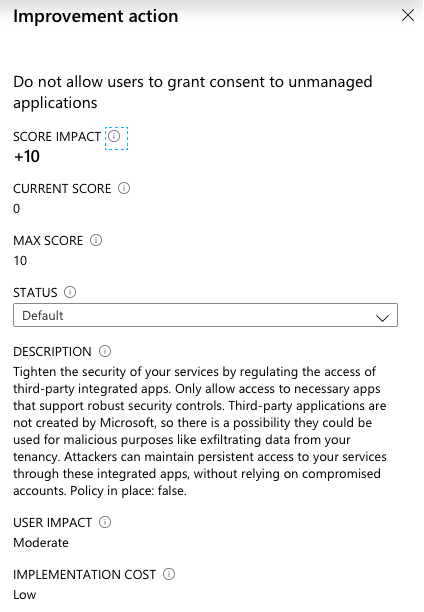

_Popular phishing attacks are using consent requests to gain access to company or user data. In this article we will cover the detection (with Azure Sentinel, Microsoft Cloud App Security or Azure AD portal) and mitigation of illicit consent grant attacks._

## Consent Framework and Default (Tenant) Settings
In the first step it’s very helpful to know the permission and consent framework in the Microsoft Identity platform. You need to understand the delegation process and potential attack surface.
Microsoft has already documented this in details:
[Microsoft identity platform scopes, permissions, and consent | Microsoft Docs](https://docs.microsoft.com/en-us/azure/active-directory/develop/v2-permissions-and-consent)

By default, all users in Azure AD can register applications and set consent permission on their behalf. This represent a risk and and you need to ensure that your organization wants to allow end-users to acquire application as self-service without any compliance or risk check.
So regardless of phishing attacks this default setting should be reviewed by IT compliance, risk and governance management of your company.

The user settings are splitted in **”User can register applications”**...

...and **”Users can consent to apps accessing company data on their behalf”**:

Follow Microsoft’s step-by-step guide to find out which setting is configured in your tenant:
[Configure how end-users consent to applications using Azure AD | Microsoft Docs](https://docs.microsoft.com/en-us/azure/active-directory/manage-apps/configure-user-consent)

_Tip: Use the PowerShell cmdlet for monitoring your desired state of the "UsersPermissionToUserConsentToAppEnabled” setting in your tenant._

This default settings makes it easy for users to enable access or onboard any SaaS applications.
Nevertheless it is [recommended by Microsoft to disable user consent operations](https://docs.microsoft.com/en-us/azure/security/fundamentals/steps-secure-identity#restrict-user-consent-operations).
This is also part of the identity secure score:

In the last month we are seeing increased numbers of consent grant attacks by phishing mails but also Microsoft introduced new (public preview) features to detect/manage consent request.
By now every organization should review their settings and methods to detect, remediate and mitigate these attacks.

## Attack methods and scenarios
Many popular phishing attacks and campaigns tries to take over accounts by user consent requests from apps that looks like Office 365 services.
Attackers sending mails with subjects like “storage upgrade” or “shared OneDrive files” to fools the victims that permission to Office 365 is required.

In my opinion it’s unrealistic to prevent this attacks or minimize the risk trough end-user education even by a clear statement during the app consent process:

Source: [Azure AD app consent experiences](https://docs.microsoft.com/en-us/azure/active-directory/develop/application-consent-experience)

Once the user has been granted the consent, the attacker has account-level access without stealing credentials or infecting user’s device.
Enforcement of MFA and Conditional Access is also not effective because of the interaction model of the application.

It is impressive to see how simple and efficient this attacks can be executed.
[Joosua Santasalo](https://securecloud.blog/2019/12/17/helsec-azure-ad-write-up-phishing-on-steroids-with-azure-ad-consent-extractor/) demonstrates an attack from user and attacker perspective with “Azure AD Consent Extractor” in the following video:

<iframe width="560" height="315" src="https://www.youtube.com/embed/ZCF1jdajaIg" frameborder="0" allow="accelerometer; autoplay; encrypted-media; gyroscope; picture-in-picture" allowfullscreen></iframe>

Details on this illicit consent grant attack is described in his [blog post](https://securecloud.blog/2018/10/02/demonstration-illicit-consent-grant-attack-in-azure-ad-office-365/).

There are also other real world examples and toolkits for attack scenarios like this:

* Ransomware of Office 365 user data:
[https://blog.knowbe4.com/heads-up-new-ransomware-strain-encrypts-cloud-email-real-time-video](https://blog.knowbe4.com/heads-up-new-ransomware-strain-encrypts-cloud-email-real-time-video)

* Pawn Storm OAuth attacks:
[https://blog.trendmicro.com/trendlabs-security-intelligence/pawn-storm-abuses-open-authentication-advanced-social-engineering-attacks/](https://blog.trendmicro.com/trendlabs-security-intelligence/pawn-storm-abuses-open-authentication-advanced-social-engineering-attacks/)

* Office 365 Attack Toolkit:
[https://www.mdsec.co.uk/2019/07/introducing-the-office-365-attack-toolkit/](https://www.mdsec.co.uk/2019/07/introducing-the-office-365-attack-toolkit/)

* FireEye PwnAuth:
[https://www.fireeye.com/blog/threat-research/2018/05/shining-a-light-on-oauth-abuse-with-pwnauth.html](https://www.fireeye.com/blog/threat-research/2018/05/shining-a-light-on-oauth-abuse-with-pwnauth.html)

Microsoft takes care on this attack patterns and tries to detect and remediated the users on the Office 365 platform. In the past phishing campaigns were able to bypass the ATP protection as you can see on several tweets ([December 2019](https://twitter.com/itguysocal/status/1209778676587323392?s=12), [January 2020](https://mobile.twitter.com/itguysocal/status/1212251786129498112?s=12)) from [Joe Stocker](https://mobile.twitter.com/ITguySoCal).

## Detection: Several ways for detecting and alerting of suspicious OAuth apps
Microsoft offering several solutions to detect or create alerts in case of consent permission to OAuth apps. This is a summary of different ways to implement a detection:

### Investigation and Alerting of OAuth apps with MCAS
Microsoft Cloud App Security (MCAS) is detecting risky OAuth Apps and allows to get insights of app permissions in the portal.

The following information should support your investigation and decision if a consent to a risky app was granted:
* “Community use” rating to understand how common is the use of this app in other organization (such as default Office 365 apps)
* Authorized by single/multiple users or admin consented
* Permission level from Low (Sign-in and read user profile) to High (Access your data anytime)

If you decided to use MCAS you should [create a OAuth app policy](https://docs.microsoft.com/en-us/cloud-app-security/app-permission-policy#create-a-new-oauth-app-policy) to be notified in case of risky app consent or registration. Filters for the alert can be set on the above described values.

In addition it makes sense to create an [anomaly detection](https://docs.microsoft.com/en-us/cloud-app-security/app-permission-policy#oauth-app-anomaly-detection-policies) to identify misleading app or publisher names.

Follow [Microsoft’s tutorial](https://docs.microsoft.com/en-us/cloud-app-security/investigate-risky-oauth) for guided steps to investigate risky OAuth Apps.

_Tip: Consider to [report suspected apps](https://docs.microsoft.com/en-us/cloud-app-security/manage-app-permissions#send-feedback) to Microsoft’s Cloud App Security team as feedback to enhance OAuth App risk score and analysis._

More details on [working with the OAuth apps page](https://docs.microsoft.com/en-us/cloud-app-security/manage-app-permissions#ban-or-approve-an-app) are described on Microsoft Docs and further information on managing risky 3rd party app permission with MCAS are [available here](https://techcommunity.microsoft.com/t5/enterprise-mobility-security/managing-risky-3rd-party-app-permissions-with-microsoft-s-casb/ba-p/276401).

MCAS is the most powerful tool for review of risky OAuth apps and in combination with alerting and global investigation by Azure Sentinel a recommended option.

### Azure AD Workbook “App Consent Audit”
Azure Monitor Workbooks is visualizing log data from a Log Analytics workspace. Several workbooks related to Azure AD analysis are part of the Azure AD Portal (built-in).

You’ll find an “App Consent Audit” workbook to get more insights on consent permissions and a visual overview of your configuration:

###  Hunting and Analytics (Alerting) with Azure Sentinel
#### Azure Sentinel Hunting of “Consent to application” operations
Threat hunting is one of the essential features of Azure Sentinel and supports search for attackers.
The following (built-in) hunting query looks at a period of time for any “Consent to application” operation occurs by a user or app:

The KQL query behind this hunting is also usable for any Log Analytics Workspace Query that contains the latest Azure AD Audit Logs. 
You’ll find the hunting query in the GitHub repo of Azure Sentinel:
[Azure-Sentinel/ConsentToApplicationDiscovery.yaml at Azure/Azure-Sentinel · GitHub](https://github.com/Azure/Azure-Sentinel/blob/a3d9984d88377a02a2f94caaf67e3d5828d972de/Hunting%20Queries/AuditLogs/ConsentToApplicationDiscovery.yaml)

#### Azure Sentinel Analytics (Alert) of "Rare application consent"
You should configure Azure Sentinel or Azure Monitor Alerts (via Azure AD Audit Logs in Log Analytics) if you want to received an alert when a “consent to application“ is triggered.

Microsoft has released a detection rule for this activity on the Azure Sentinel GitHub page:
[Azure-Sentinel/RareApplicationConsent.yaml at master · Azure/Azure-Sentinel · GitHub](https://github.com/Azure/Azure-Sentinel/blob/master/Detections/AuditLogs/RareApplicationConsent.yaml)

It is available as built-in rule template in Azure Sentinel:

The KQL-based query can be also used in [Azure Monitor as Alert rule (Analytics query using Custom Log search)](https://devblogs.microsoft.com/premier-developer/alerts-based-on-analytics-query-using-custom-log-search/) in case you have not already implemented Azure Sentinel. This implies that Azure AD Audit Logs are forwarded to a Log Analytics Workspace.

### List grant permissions with PowerShell
Required information of granted permissions are available from Microsoft Graph API.  So you are able to build a custom integration for your existing analytics/alert tool or any other programmatically access. Some great PowerShell scripts are already available and "ready to use".

#### Get-AzureADPSPermissionGrants.ps1
[Philippe Signoret](https://gist.github.com/psignoret) has written a PowerShell script to lists all delegated permission grants. 
Example:

`Get-AzureADServicePrincipal -All $true | .\Get-AzureADPSPermissionGrants.ps1 -Preload `

This script is regular updated and available from his GitHub page:
[Get all permissions granted to an app in Azure AD · GitHub](https://gist.github.com/psignoret/9d73b00b377002456b24fcb808265c23)

#### AzureADAssessment Module (MSCloudIdAssessment)
Microsoft published a PowerShell module to gather configuration information across the Azure AD tenant. It includes a cmdlet (“Get-MSCloudIdConsentGrantList”) to get a list of all consent grants in the directory.
Example:

`Get-MSCloudIdConsentGrantList | Export-Csv -Path “.\ConsentGrantList.csv” `

This module is available from the AzureAD GitHub repo:
[AzureADAssessment/MSCloudIdAssesment.psm1 at master · AzureAD/AzureADAssessment · GitHub](https://github.com/AzureAD/AzureADAssessment/blob/master/MSCloudIdAssesment.psm1)

## Remediate: Process to remove consent permission
### Option 1: Guided review in Azure AD Portal (required)
Azure AD portal supports you to review the granted permission of an app.
Click on the “Review permissions” button on the “Permissions” blade of the app:

Afterwards you have several options to proceed the review:

Choose “This application is malicious and I’m compromised” to get a preview of the required PowerShell scripts to remediate the issue.

All the steps should be executed to ensure that an illicit consent grant attack is remediated:
* Removal of Service App Role Assigment
* Revocation of all permission granted to the application (application and delegated permissions)
* Revocation of refresh token for all users assigned to the application

### Option 2: Revoke OAuth consent grant and Service App Role via Azure Sentinel Playbook
Automation of threat response can be configured by an Playbook (Logic App) which is triggered by an incident in Azure Sentinel.

You can revoke the OAuth consent grant and Service App Role Assigment with the PowerShell cmdlets (Remove-AzureADOAuth2PermissionGrant and Remove-AzureADServiceAppRoleAssignment) which are already described in Option 1.

Revocation of user’s refresh token is already available as Playbook sample from the Azure Sentinel GitHub repo:
[Azure-Sentinel/Playbooks/Revoke-AADSignInSessions at master · Azure/Azure-Sentinel · GitHub](https://github.com/Azure/Azure-Sentinel/tree/master/Playbooks/Revoke-AADSignInSessions)

### Option 3: Ban app from OAuth investigation in MCAS 
Suspicioned apps can be marked as banned and will forced to disable permission. Future access of user consent will be automatically revoked by MCAS. Consider in this scenario the delay until the policy effects.

Follow [these steps](https://docs.microsoft.com/en-us/cloud-app-security/manage-app-permissions#ban-or-approve-an-app) to ban the affected app and notify users who granted access. During my tests I was not able to verify that MCAS will revoke the user's refresh token automatically. So keep that in mind if you like to include this step in your remediation process.

### Not recommended: Revoke individual user consent as user
Users are also able to manage their app (user) consent in MyApps portal including revocation by click on "Remove":

Not all required steps (that I have already described above) will be executed in this case. So I can’t recommend this option to remediate the issue.
 
## Mitigation: Presentation of illicit consent permissions by user
### Step 1: Blocking user consent of apps
Disable the permission for a user to set consent permission on their behalf is the most effective and easiest way to mitigate this kind of attacks.

Open the “[User settings](https://portal.azure.com/#blade/Microsoft_AAD_IAM/ActiveDirectoryMenuBlade/UserSettings)” blade in the Azure (AD) Portal to disable “User can register applications”:

Finally go to the “[Enterprise applications](https://portal.azure.com/#blade/Microsoft_AAD_IAM/StartboardApplicationsMenuBlade/UserSettings/menuId/UserSettings)” blade (“Manage how end users launch and view their applications”) on the same page to disable consent permissions:

_Advice: The only alternative would be to keep the default setting AND using MCAS for reactive measures (including OAuth policies, monitoring and auto-revoke). But this will not mitigate the issue proactively in my opinion. So I’ve decided to exclude this scenario as option for mitigation._   

### Step 2: Admin approval flow for user consent

#### Use case
Initially it is a pain if you are disabling the user consent without any alternate (user friendly) option or process to request consent permission by non-admins. End-users are facing generic error message and increased helpdesk calls will be one of the consequences.
Microsoft implemented a new feature to request user consent as part of a workflow:

#### Benefit
Admin consent workflow gives end-users an option to request a consent permission which can be reviewed by an admin.

_Advice: Consider to use least privilege access to approve admin consent requests (prevent usage of Global admin). To approve requests, a reviewer needs cloud application administrator or application administrator only._

#### Configuration
The configuration of admin consent request and workflow is very easy.
You can find the required settings in the blade of the disabled user consent:

The following Microsoft docs article describes how to enable this preview feature in details:
[Configure the admin consent workflow - Azure Active Directory](https://docs.microsoft.com/en-us/azure/active-directory/manage-apps/configure-admin-consent-workflow) 

#### Limitations
Currently there are two limitations in the (public preview) implementation:

1. Only permanent privileged user accounts can be assigned to review consent permissions. You can’t choose an admin with (Azure AD PIM) eligible roles.

2. Notification are limited to e-mail, no support of Microsoft Graph API to automate the process.

### Step 3: Monitoring approved user consents and OAuth apps
Consider to implement an inventory and monitoring of OAuth apps and permissions even if you configure the consent approval flow in your organization. In my opinion MCAS for risk detection and inventory management of your (OAuth) apps is required and has great features. Make sure that every alert will be forwarded to Azure Sentinel or your existing SIEM. This gives you the option for a comprehensive investigation (from phishing mail to consent grant request), hunting and incident management.

Original cover image by [Tumisu / Pixabay](https://pixabay.com/illustrations/phishing-fraud-cyber-security-3390518/)
