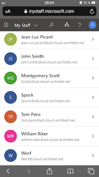
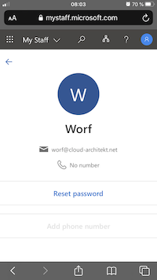
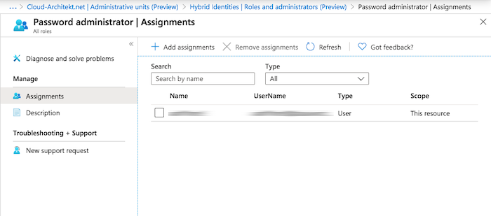
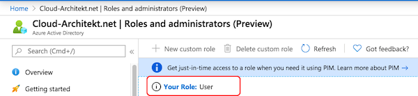

/Administrative Units (AUs) allow Azure AD admins to delegate admin permission to a custom segment of a tenant_organization (such as region, department, business units). In this blog post I like to share my experience including use cases, considerations and limitations of the AU management (preview) feature./
 
## What are “Administrative Units” (AUs)?
In general, Azure AD has a flat structure where objects are located on the same “level”. In the (old) days of Active Directory the management “Organizational Units” (OUs) helps to delegate administration and apply  policies (GPO) based on a designed structured. That is why customers has mostly the initial thought that AUs are an 1:1 adoption of the traditional OUs concept in Azure AD. On second place it will be clear that this concepts has some major differences (as described in this blog post).

However, you may looking for a solution to segment users or groups for delegation of permissions on a self-named structure (container) now or at any future time.

Administrative Units are available as public preview since [December 2014](https://azure.microsoft.com/en-us/updates/public-preview-administrative-units/) (!).  But the management of AUs was limited to Graph API and [PowerShell](https://docs.microsoft.com/en-us/powershell/azure/active-directory/working-with-administrative-units?view=azureadps-2.0).  In the latest preview release (April 2020), Microsoft introduce the option to using the Azure Portal. 

This is a good time to check how this feature can support you and what are the considerations or limitations.

## General purposed use of AUs
Global and Privileged Role Admins are able to manage AUs in an Azure AD tenant.
This container are purposed for management and delegation tasks only.
It is obvious that Microsoft has decided to separate the authorization model
(such as using Security Groups) from a “resource grouping” approach (in this case with AUs).

This model should assists to assign least-privileges on a minimum scope and provide an option to build a management structure for resources within a single tenant. It supports also large or multi-side organizations to bring structure to your tenant. 😉

## Characteristics of AUs
* Only certain types of resources can be assigned
(so far restricted to users and groups)
* Relationship can be established in one-to-many (resource to AU)
* No necessary one-to-one relation or unique allocation
(strong difference to Organizational Units in AD)
* No hierarchical structure and inheritance
(in the style of “Sub-AUs” 😀) 
* Membership to AU with single assignment of built import
(no dynamic assignment support yet)
* Directory Roles can be assigned on scope of AUs
(has to support this as well, currently very limited)
* Management via PowerShell, Graph API and Portal UI

## Management of AUs
Microsoft has written a very good documentation on how to manage and assign resources and delegate permissions to a directory role.
Saying this, I like to reference on the related official Microsoft Docs:

* [Manage administrative units](https://docs.microsoft.com/en-us/azure/active-directory/users-groups-roles/roles-admin-units-manage) with Azure Portal and PowerShell
* Add and manage [users](https://docs.microsoft.com/en-us/azure/active-directory/users-groups-roles/roles-admin-units-add-manage-users) and [groups](https://docs.microsoft.com/en-us/azure/active-directory/users-groups-roles/roles-admin-units-add-manage-groups) in an AU
* [Assign scoped roles](https://docs.microsoft.com/en-us/azure/active-directory/users-groups-roles/roles-admin-units-assign-roles) to an AU

## Real-world use cases and scenarios of AUs
In the past I’ve faced the following limitations or questions around the existing flat structure of Azure AD:

	* Scoped or delegated permission on geographical, organizational or intra-company units
		* Example: Local helpdesk should be able to manage groups or user limited to the local office only
	* Privileged (sensitive) accounts and work (hybrid) accounts
		* Example: User or Password Administrator are able to reset passwords for “non-administrator” only. Microsoft already [mentioned in the documentation](https://docs.microsoft.com/en-us/azure/active-directory/users-groups-roles/directory-assign-admin-roles#user-administrator) that accounts with owner-permissions of subscription (Azure resources) or delegation outside of Azure AD RBAC/Directory Roles (such as Intune- or MDATP-RBAC) also involved as “non-administrators”. 

Both scenarios seems to be a perfect scenario to prevent privileged escalation by delegate Directory Roles on a limited scope with AUs.

## Visibility and usage of AUs in Portals
### My Staff portal
This portal (mystaff.microsoft.com) seems to be a great way for administrators manage users on a strong scope level with AUs.
It is also optimized for touch based input and the UI is sharply reduced (compare to Azure AD portal). 
Therefore, it could be also interesting for on-call service or mobile admins.

Access to the “MyStaff” portal can be restricted by the user feature preview settings in the Azure portal:

Delegated admins are able to see the assigned AU:

List of all users in the AU will be displayed:

Password Admins are able to reset the password in the reduced UI. Option to “Add phone number” is grayed-out because of the missing directory role assignment of “Authenticator Admin”:

### Microsoft 365 Admin Portal
Users with assigned directory roles of an AU are also able to use the Microsoft 365 Portal. They will find a drop down in the left corner for showing them the current and assigned AU scope. Resources from this AU will be displayed in the portal only:

### Azure Audit and sign-in logs
Currently the Azure AD Audit Log schema contains already an “administrativeUnits” column of the TargetRessources entry. But has not been filled or used until now. So it seems that Microsoft is planning to include the information of AU assignment(s):

### Role Assignments in the Azure Portal
Assigned directory roles on level of AUs are not visible in (tenant-level) Azure Portal overview (outside of the AU management):

Directory Role Assignment in **Azure AD Roles and Administrators**:

Directory Role Assignment in the certain **Administrative Unit Management**:

This also covers when the current role will be displayed in the overview of “Roles and administrators” in the Azure AD portal:

This can be confusing because of a missing overall view of directory role assignments in the portal. 

## Missing support and potentially side effects of Azure AD PIM
What I was missing the most during my test was the missing support for Azure AD PIM. I hope this will be added very soon.
You should take care that PIM is not supported even if you have the option to convert a AU-scoped role assignment in Azure AD PIM.

In contrast of the Azure AD blade, PIM shows the assignment of “Password Administrator”. But unfortunately in scope of “Directory”:

This is displayed scope is incorrect because of the missing support of the AU as a configurable scope in Azure AD PIM.  Please be aware that converting this permanent to eligible assignment will also set the permission scope on a Directory-level scope. Your previous scoped permission will be overwritten.

## Conclusion: *Current* limitations and considerations of AUs
Administrative Units is a great way to build a flexible structure for delegation and management.  From my point of view there are already use cases where it covers all requirements. But keep in mind the following limitations and considerations (at the time of writing this blog post): 

* Currently assignments of resources is limited to users and groups
(no support for devices, service principals,…)
* Using of automation/scripts is the only option to have a initially or dynamic assignment yet
* Consider the [supported scenarios](As I written before the a) of using Graph API, Azure and M365 Portal for AU management
* Be aware that users can be assigned to one or more administrative units
* Only a few [Directory Roles are available](https://docs.microsoft.com/en-us/azure/active-directory/users-groups-roles/roles-admin-units-assign-roles#roles-available) for assignment to AUs yet
* Azure AD PIM is currently not supported, Permanent assignment can be used only
* This feature needs Azure AD P1 (or higher) for admins that are using AUs 
	* Therefore it seems not supported in B2C tenants
