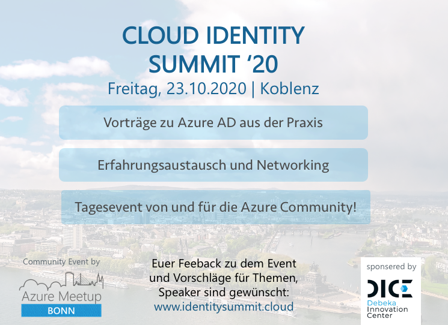

Ich freue mich sehr, ein besonderes Community-Event für den Herbst anzukündigen.
Wir, das Orga-Team des “Azure Meetup Bonn”, planen für den **23. Oktober 2020** in meiner Heimatstadt Koblenz eine **ganztägige Veranstaltung rund um das Thema Azure Active Directory**.

Der **“Cloud Identity Summit”** wird eine deutschsprachige und kostenfreie Veranstaltung sein, die dabei nicht nur Vorträge zum Identitätsmanagement in Azure bietet, sondern vor allem einen starken Fokus auf den Austausch zwischen den Teilnehmern setzen wird.

Dabei würden wir uns freuen **Identity-Experten aus verschiedenen Bereichen und Branchen** wie z.B. Microsoft Partnern bzw. Systemhäusern oder Unternehmen (mit Internal IT) begrüßen zu dürfen.

Wir freuen uns sehr, dass wir das **Debeka Innovation Center (DICE) als Sponsor und Location** für dieses besondere Community Format gewinnen konnten.

Wir möchten im Vorfeld die Community einbinden, um das **Event für Euch zu planen und auf Eure Wünsche eingehen** zu können.

Daher bitten wir Euch, bei Interesse an der Veranstaltung, an der nachfolgenden **Umfrage teilzunehmen um Themenschwerpunkte zu setzen und uns Feedback sowie Ideen mitzuteilen**.
Wir haben bereits für Euch auch  Themenvorschläge vorbereitet, über die Ihr abstimmen oder eigene Ideen einbringen könnt.

Hinweis: **Alle Teilnehmer der Umfrage werden vorab informiert, sobald die Registrierung möglich ist.**

Weitere Informationen und die Umfrage findet Ihr auch auf der **Event-Webseite “https://www.identitysummit.cloud”**.

Oder *folgt uns auf Twitter [@identitysummit](https://twitter.com/identitysummit)* um aktuelle Neuigkeiten rund um das Summit zu erfahren.

Bei weiteren Fragen oder Anmerkungen könnt Ihr mich gerne auch per E-Mail, Twitter oder LinkedIn kontaktieren.
