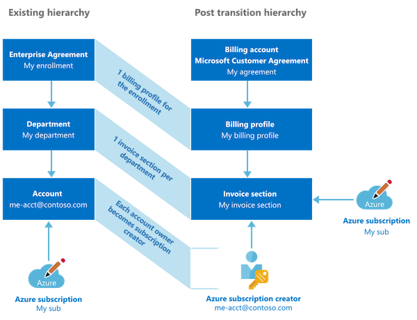

*In the recent years many organizations used the Microsoft Enterprise Agreement (EA) portal or APIs for creation and initial setup of their subscriptions. I like to give an overview about security considerations and preventation of (potential) privilege escalation to „takeover“ subscriptions from EA enterprise or account administrators in your organization. In addition you’ll find some side notes about changes and differences to the management of the new Microsoft Customer Agreement (MCA) enrollment.*

## Overview of Enterprise Agreement (EA) Portal
It was for a long time a valid (and the only) option to structure and manage subscriptions by functional, business- or geographic units in the EA portal. Until a later time, Microsoft introduced „Management Groups“, „Tagging“ and the improved „Cost Management“ in the Azure portal.

_Samples of simple Azure EA hierarchies which was also part of Microsoft‘s Cloud onboarding guidelines. Image source: [Get started with the Azure Enterprise portal](https://docs.microsoft.com/en-us/azure/cost-management-billing/manage/ea-portal-get-started)_

Today this superordinate level and separated portal seems to be „outdated“. Microsoft has moved more and more features to the Azure Portal such as [creating enterprise subscriptions for EA customers](https://azure.microsoft.com/de-de/blog/create-enterprise-subscription-experience-in-azure-portal-public-preview/). And also most organizations using „Tags“ and „Management Groups“ instead of creating a custom hierarchy (incl. departments or accounts) in the EA portal.

_Azure Portal will be also used for cost management of enterprise subscriptions today. Original the EA portal was designed for most billing and financial aspects of the enterprise enrollment. Image source: [Microsoft Security Compass Workshop](https://github.com/MarkSimos/MicrosoftSecurity/tree/master/Azure%20Security%20Compass%201.1)_

Today some enterprise organizations are still using the EA portal or delegated permissions by the enterprise enrollment admin.
There are some security aspects to consider, especially if you have not implemented a secure automation process to on-board subscription programmatically.

Understanding of  configured organizational structure and the impact of assigned roles in the EA portal are neccessary, even if it's primarily used for billing or enrollment tasks.

In this article I like to consider some potential misconfiguration or over-privileged permissions as part of the EA portal roles that could be a security risk for your Azure workloads and environment.

### Note: Microsoft Customer Agreement (MCA)
Microsoft introduced a [new purchase model („Microsoft Customer Agreement“)]() last year. Some organizations has been already switched to this model and other companies will migrate as part of EA renewal or expiration. Direct purchase channel to Microsoft but also using the Azure portal instead of the EA portal are some big differences of MCA management (compare to EA). This article has a strong focus on considerations of EA management and maybe even cover some aspects that could be related to MCA migration or management as well.

## Roles and Permissions in EA Portal 
Enrollment hierarchy of the EA portal can be confusing or complex. Basically there are admin roles that can be assigned to the three different levels (Enrollment, Department, Account).

[Ed Mondek](https://www.edmondek.com/about) has created a great diagram that helps to understand the relation, assignment between delegation level, roles and range of permissions. It also includes the management level and units in Azure (portal):

_“Account Owner“ has assigned permissions to manage the subscription in the scope of an associated „Account“. Users with assigned "Enterprise Administrator" role has indirect permissions to the subscription as well by change the Account Owner role. Image source: „Azure Enterprise Enrollment Hierarchy“ on [EdMondek.com](https://www.edmondek.com/Azure-Enterprise-Enrollment-Hierarchy/)_

A detailed list of all permissions by EA role is also available in [Microsoft Docs](https://docs.microsoft.com/en-us/azure/cost-management-billing/manage/understand-ea-roles#organization-structure-and-permissions-by-role).
Be aware who has assigned permission to this EA roles even if you haven‘t implemented a detailed three-level hierarchy.

### Transition of roles by moving to Microsoft Customer Agreement (MCA)
MCA has also a new enrollment and billing management for every customers that is moving to this contract model.
Existing roles will be transitioned to the new hierarchy management as you see in this diagram from Microsoft:

_Previous „Account Owner“ will named as „Azure Subscription Creator“ with similar set of permissions as before. Source: [„Set up your billing account for a Microsoft Customer Agreement“ 
](https://docs.microsoft.com/en-us/azure/cost-management-billing/manage/mca-setup-account#changes-to-billing-administrator-access)_

_Note: Currently I did not have the opportunity to proof the following potential escalation paths in MCA-managed Azure environments. So I can‘t say it with certainty that all aspects will also apply in scenarios with MCA management._

_Details on the [administrative roles in MCA](https://docs.microsoft.com/en-us/azure/cost-management-billing/manage/mca-setup-account#changes-to-billing-administrator-access) are documented by Microsoft. These roles are in addition to built-in Azure RBAC to delegate billing management permissions only._

### EA portal roles and Azure classic administrators
Let‘s have a look on the „Account Owner“ role:

This role has permission to „manage resources in Azure portal“ [(as well as documented on the EA management RBAC matrix)](https://docs.microsoft.com/en-us/azure/cost-management-billing/manage/understand-ea-roles#usage-and-costs-access-by-role). This table shows also that changing the „Account Owner“ role is a permission which is assigned to the EA portal roles „Enterprise Administrator“ and „Department Administrators“ (for accounts in their scope). 

It‘s important to understand that permissions around the EA roles will be applied to the subscription as part of the „Azure Classic Subscription roles“. These are admin roles from the "Azure Service Management" (ASM) model which is mostly replaced by "Azure Resource Manager" (ARM) and "Azure RBAC". But the "clasic administrator" permissions are still effective even if ASM was deprecated as part of the ARM introduction in 2018. 

_Three different admin role models could have impact or assigned privileges to manage permissions of your Azure subscriptions:
Elevated Global Admin (Azure AD Directory Roles), Azure RBAC (ARM) and Classsic Subscription Admin Roles (ASM)._

Nevertheless, every new subscription which was created by „Account Owner“ in the EA portal has the following default permissions:

*„By default, for a new subscription, the "Account Administrator" is also the Service Administrator.*
*The "Service Administrator" has the equivalent access of a user who is assigned the Owner role at the subscription scope.*
*"The Service Administrator" has full access to the Azure portal.“*
_Source: [Classic subscription administrator roles, Azure roles, and Azure AD roles](https://docs.microsoft.com/en-us/azure/role-based-access-control/rbac-and-directory-admin-roles)_

_Properties of an Azure Subscription shows you the assigned Account and Service Admin_

_Access control (IAM) of subscription still allows you to manage "Classic administrators". In this sample my account "Thomas" has assigned "Service Administrator" permission by default as "Account Owner"._

_Level of access can be reviewed for classic administrators by using the "Check access" feature in the Access control (IAM) blade._

Users with assigned roles as „Account Owner/Service Admins" are able to delegate „Co-Administrators“ permission as part of this role in the Azure Portal.
Co-Admins have similar high-privilege permissions as the Service-Admins which means full management and access of all Azure resources within the subscriptions.
Microsoft has been well documented the [different classic subscription admin roles](https://docs.microsoft.com/en-us/azure/role-based-access-control/rbac-and-directory-admin-roles#classic-subscription-administrator-roles).

_In this sample I've just added another user account as "Co-Administrator" to the classic administrator roles._ 

_Level of access for the added user will be also displayed as "full access to all resources"._

_User logged on with assigned "Co-Admin" role will be seen "Owner" in the display of "My Role"._

Nowadays mostly all permissions will be managed by the (modern) "Azure RBAC" model via Portal or Resource Manager (ARM) APIs. It‘s also strongly recommended to use them because of the great options to manage fine-grained role-based access in Azure.

But it‘s very important to know (for our next use cases) that the "classic admin" model is still working and permissions seems to be effected for managing Azure resources via Portal/ARM as well.

Legacy roles such as "Service Admin/Co-Admin" have assigned „Owner“ permissions on all resources at the subscription scope.
So be aware of all „classic administrators“ entries in your Access Control (IAM) tab!

## Privilege Escalation Paths
As a result of this insights, the following escalation paths could be a potential scenario if organizations assigned the EA portal roles to lower privileged admin accounts (e.g. license or purchase department):

- **Subscription takeover by EA account owner**
Account Owner is able to modify "Azure RBAC" entries and "classic administrator roles" by default. This behavior is by the design but you should be aware that this could bypass your existing security approaches (Azure PIM eligible and/or security group-assigned roles). Take care and choose wisely all your assigned users which has direct permission to manage the IAM of your Azure workloads. I prefer to use in this cases the analogy to the [Active Directory administrative tier model](https://docs.microsoft.com/en-us/windows-server/identity/securing-privileged-access/securing-privileged-access-reference-material):
EA Account Owner will have access to all your assets in Tier1 (Azure resources). But perhaps also (in)direct escalation for high-privilege permissions (similar to Tier0), especially if you are running „AD DS domain controllers“ as virtual machines or any other IAM-related resources/workloads (e.g. KeyVault) in the affected subscriptions.

- **Subscription takeover by changing account owner from an EA enterprise admin**
Enterprise or department administrators are able to change the account owner as already described in this article.
In this way, it allows also these EA roles to gain subscription-level access as well. There are two scenarios:

1. Existing RBAC assignment will be removed if you transfer the subscription to another Azure AD tenant [(as documented by Microsoft)](https://docs.microsoft.com/en-us/azure/cost-management-billing/manage/billing-subscription-transfer).
Only the new "Account Owner" will have access to manage permission and resources after the movement.

2. Current "Azure RBAC" entries and "service administrator" will be retained in case of transfer the subscription to another account in the same tenant.
But the new assigned "Account Owner" is able to change the "service administrator" from the Account Center (https://account.azure.com/subscriptions).

So in the end the "Enterprise" and "Department" admins are able to set "service administrator" by assign "Account Owner"
and modify "Azure RBAC" permissions of the certain subscriptions.
Therefore you should review and monitor all EA roles in your organization. Unfortunately there‘s no built-in auditing available in the EA portal. This makes it even harder!

- **EA admin takeover by helpdesk/local admins**
Some organizations delegates Azure AD Directory Roles such as „Password Admins“ or „Authenticator Admins“ to their local helpdesk or 1st-level support team. At first glance this delegation seems not to be too risky or eligible for privilege escalation. The description of roles shows that only authentication methods and password resets of non-admin users can be managed. But as already mentioned in other blog posts this not exclude privilege roles like the „Azure Subscription Owner“ or in this case „EA Admins“. So keep that always in mind!

		
## Hardening and security options
### Disable Microsoft accounts (MSA)
EA portal supports various types of authentication levels. Ensure that only access to work accounts can be granted. Choose „Work or School Account Only“ if you are located in a single-tenant environment. Otherwise consider the „Cross-Tenant“ option.

Details on updating the authentication level are described in the Microsoft Docs article of „[Troubleshoot Azure EA portal access](https://docs.microsoft.com/en-us/azure/cost-management-billing/manage/ea-portal-troubleshoot#authentication-level-types)“.

### Privileged accounts / Break Glass access for EA administration
Access to the EA portal and assigned permissions can be critical as already discussed. Make sure to limit the number of admins and access. Ensure to apply organizational and security measures similar to other high-privilege accounts such as "Global Admins". 

Microsoft has mentioned in the „Azure Security Compass“ workshop materials to use "Service Admins" just for emergency access or initial configuration of subscription:

_Image source: [Microsoft Security Compass Workshop](https://github.com/MarkSimos/MicrosoftSecurity/tree/master/Azure%20Security%20Compass%201.1)_

 I think this is a good approach but you should consider to configure an account seperatly from your „Break Glass“ of Azure AD. Even if security considerations as „sign-in attempt alerts“ should be also applied to this kind of emergency accounts. By the way: Sign-ins to the „Azure EA Portal“ are logged by Azure AD Sign-in logs.
 
In general, accounts with assigned „Service Admin“ or „Subscription Owner“ permissions should be used in case of initial configuration only (not for daily operations).

### Simple account and department hierarchy
From my point of view a complex setup of accounts and departments in EA portal has huge disadvantages compared to the options of subscription and cost management in the Azure portal. Therefore you should try to configure a minimum hierarchy with minimal set of delegation users and roles. Keep it simple! 

### Automation of subscription management via API
Microsoft provides a [.NET core sample app](https://github.com/Azure-Samples/create-azure-subscription-dotnet-core) that is using the Azure SDK to create EA subscription.

This should supports you to automate and standardize the creation process of subscriptions under an enrollment account. You need to configure a service principals and [grant access with „Owner“ permissions on this scope](https://docs.microsoft.com/en-us/azure/azure-resource-manager/management/grant-access-to-create-subscription?tabs=azure-powershell%2Crest-2).

Automation as part of an "IT service management" (ITSM) process or pipeline should gives you central control and advanced security options. This also helps to achieve the goal to assign **and** use permissions for emergency access by break glass accounts only.

But keep in mind to configure an audit to identify who has created the subscription via API. Consider the [current limitations to track subscription creation in Azure Portal/CLI](https://docs.microsoft.com/en-us/azure/azure-resource-manager/management/grant-access-to-create-subscription?tabs=azure-powershell%2Crest-2#audit-who-created-subscriptions-using-activity-logs).

Standarized RBAC model (designed by least privilege access approach) and managed by Azure PIM (eligible roles instead of permanent assignment) should be applied to the subscription as part of the on-boarding process. I can strongly recommended to automate this process as well.
It could be a great way to manage your RBAC definitions "as code" if you are already using Azure Blueprint or other centralized "Cloud Governance and Deployment" tools.

### Using MCA APIs with Azure AD Authentication 
Microsoft replaced the existing EA APIs by modern APIs for MCA. This APIs are using Azure AD authentication and previous EA customers needs to update their existing configuration in case of migrating their enrollment contract.

[Migration steps and details on updated APIs](https://docs.microsoft.com/en-us/azure/cost-management-billing/costs/migrate-cost-management-api#ea-apis-replaced-with-mca-apis) are documented. Integration to your internal cost management or ITSM tools can also reduce the need for portal access by non-privileged users.

### Alerting on adding classic administrators
„Classic Administrators“ roles are still valid and effective as already written. Azure AD PIM is not supporting the "classic administrator" roles and maybe your auditing queries are scoped for monitoring "Azure RBAC" permissions only. Therefore you should configure a detection on suspicious changes of classic administrators. Azure Sentinel and MCAS can be used to trigger alerts if someone is modify classic administrator roles:

*Azure App connector of MCAS allows you to investigate activity logs which contains also „write“- and „delete“-operations of „classicadministrators“. Alerts of this suspicious activity can be created in MCAS.*

*Alerting from Azure Sentinel is also an option if you are using it as your SIEM solution. The illustrated [query is available in my GitHub repository](https://github.com/Cloud-Architekt/azuresentinel/blob/master/WriteClassicAdministratorsOfAzSubscription.kusto) for free use as detection (without any warranty).*
 

Original cover image by [mohamed Hassan / Pixabay](https://pixabay.com/illustrations/residence-rent-housing-online-3663528/)
