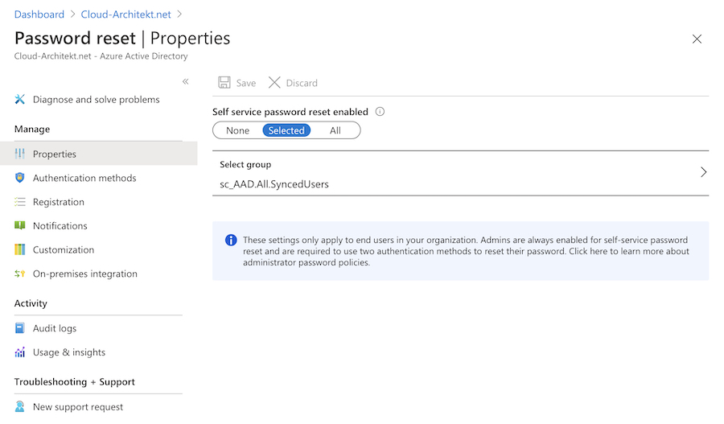
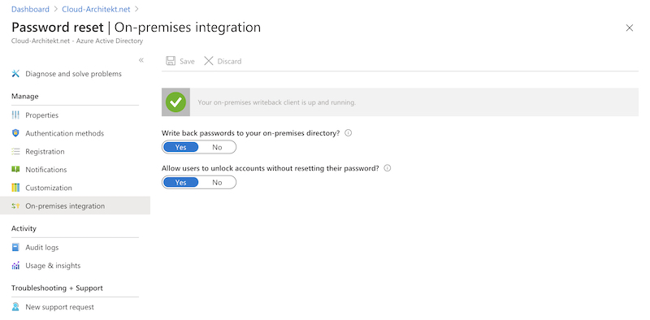

_End-users are able to reset their passwords as part of the Azure AD „self-service password reset“ (SSPR) service. Including an option to write back passwords resets from Azure AD to on-premises AD. Consideration of security aspects and detection of any suspicious activity in the password reset process should be included in your implementation._

## First off: Password resets in an era of “passwordless”
Most organizations are moving to passwordless options to “kill” passwords and all the weakness and (risk) management that comes with it.
There is a wide range of options such as Windows Hello, Microsoft Authenticator and FIDO2.

Nevertheless, there are currently use cases where initial user (self-service) enrollments based on password-based credentials or fallback options are required (e.g. to enable or recover passwordless authenticators).
In addition there’s no option to force “passwordless only” yet. 
I guess many of those “challenges” will be resolved or fixed in the near feature.

If, however, passwords will be used in rare cases it’s more likely that users will forget their credentials.  Many organizations have been chosen similar authentication methods for reset passwords and 2nd factor authentication. This could be an interesting attack scenario to gain (strong authentication) credentials if it’s been even harder to attack passwordless authentication methods.

## Overview and Architecture
At first, it is necessary to know the architecture and technical flow before we go into details about design considerations and options for securing and monitoring SSPR events in Azure AD.

So check out Microsoft’s description of [Key benefits](https://docs.microsoft.com/en-us/azure/active-directory/authentication/howto-sspr-deployment#key-benefits) and [User flow](https://docs.microsoft.com/en-us/azure/active-directory/authentication/howto-sspr-deployment#solution-architecture) if you aren‘t already familiar with the fundamentals of Azure AD SSPR. This content is part of [planning guide of SSPR deployment](https://docs.microsoft.com/en-us/azure/active-directory/authentication/howto-sspr-deployment#plan-configuration)which includes many guidance and best practices by Microsoft. In my opinion it’s a great start to get an good overview as you can see in this overview graphic of the user flow:
 

I can also strongly recommended to watch the [official learning videos about "Azure AD SSPR" on YouTube](https://www.youtube.com/watch?v=hc97Yx5PJiM&feature=youtu.be).

## Considerations in Deployment and User Flow
### Access to password reset page
User flow within the SSPR portal is very straight forward and [well documented by Microsoft](https://docs.microsoft.com/en-us/azure/active-directory/authentication/concept-sspr-howitworks#how-does-the-password-reset-portal-work) (including prerequisite checks to verify that users are able to reset their passwords).

In the most scenarios the users will be forwarded to SSPR by using the link „Can‘t access your account?“ or “Forgot my password” at the organization‘s Azure AD sign-in page. But there is also an short URL link available (https://aka.ms/sspr).

The option to start the SSPR process is public available for everyone who is able to enter the UserID and CAPTCHA. In this case the CAPTCHA is implemented by Microsoft to prevent bots from using the SSPR gate.

Unfortunately the initial access to the use this portal can not be restricted or protected by any further advanced options. 

_Note: In my opinion it would be a helpful to give admins the option to restrict access by conditions such as trusted location or registered devices. It seems there are no built-in security options which also prevents access from risky or anonymous IP address._

An overview of all authentication methods of the users is visible as part of the next step:

Details of the phone number or mail addresses will be hidden. It is, however, possible to see the domain name and first characters of the alternate mail addresses.

Failed attempts of the CAPTCHA input will not be audited but all other events are part of the Azure AD Audit Log:

More details on auditing of SSPR will be included in the second part of this blog post.

### Throttling of multiple attempts to reset passwords
Microsoft has implemented some limitations and locked out processes to reduce number of SSPR attempts.

* Users can try only five password reset attempts within a 24 hour period before they're locked out for 24 hours.
	
* Users can try to validate a phone number, send a SMS, or validate security questions and answers only five times within an hour before they're locked out for 24 hours.
	
* Users can send an email a maximum of 10 times within a 10 minute period before they're locked out for 24 hours.
	
* The counters are reset once a user resets their password.

_Source: [Password management frequently asked questions](https://docs.microsoft.com/en-us/azure/active-directory/authentication/active-directory-passwords-faq#password-reset)_

### Write-back to Active Directory (on-premises)
SSPR gives you also the option to write-back the password to on-premises / Active Directory. An detailed tutorial to [configure and enable the write-back option](https://docs.microsoft.com/en-us/azure/active-directory/authentication/tutorial-enable-sspr-writeback) is available on Microsoft Docs.

All events of the SSPR write-back will be audited in the Application Eventlog (Source „PasswordResetService“) on the Azure AD Connect Servers:

EventLog entries includes a „TrackingId“ which is identical with the „CorrelationID“ in the Azure AD Audit Log. This allows to build an correlation between SSPR events in Azure AD and Active Directory.

I can strongly recommended to delegate “write” permissions of passwords in AD to the certain scope of hybrid users which are planned to use SSPR.
[Aaron Guilmette](https://www.undocumented-features.com/about/) has written a [PowerShell script to set this permissions](https://www.powershellgallery.com/packages/AADConnectPermissions/) on an organizational unit scope. 

_Note: There are reports in Microsoft (Support) forums where customers are running into issues in environments with implemented ATA and (domain-wide) configured SAM-R (for lateral movement). Check [this forum post](https://social.msdn.microsoft.com/Forums/SECURITY/en-US/6082daf5-2893-407b-b009-bc49464df984/aadsync-password-reset?forum=WindowsAzureAD) for further details._ 

### Other considerations
Some other general considerations and implementation questions around SSPR are already written down by Microsoft:

* SSPR requests of [B2B users (guests)](https://docs.microsoft.com/en-us/azure/active-directory/authentication/concept-sspr-howitworks#password-reset-for-b2b-users)
* Password write-back is a feature of Azure AD Connect, so keep the components up-to-date (no support for versions that were released more than 18 months).  Regular check of [version history](https://docs.microsoft.com/en-us/azure/active-directory/hybrid/reference-connect-health-version-history) is recommended to follow changes.
* [Frequently asked questions of SSPR management](https://docs.microsoft.com/en-us/azure/active-directory/authentication/active-directory-passwords-faq)
	(incl. password policy and cloud-only scenarios)

I can strongly recommend to have in-place an actively monitor of your SSPR audit events and insights (as written in the next part of this blog post).

## Registration and options of authentication methods methods for SSPR
Users must already have been registered for SSPR with authentication method(s) before they begin the reset process. It’s recommended to [enable combined registration for SSPR and MFA](https://docs.microsoft.com/en-us/azure/active-directory/authentication/concept-registration-mfa-sspr-combined) for those users. This step should be part of the (Azure AD) user on-boarding process and configured right from the start.

/Advice: It‘s important to restrict access of MFA and SSPR registration based on trusted location or device. Check out to [secure the registration process by Conditional Access](https://docs.microsoft.com/en-us/azure/active-directory/conditional-access/howto-conditional-access-policy-registration)./

But you should also verify the number of days where users will be prompted to re-confirm their authentication information:

In General you should also decide if you like to enable users to manage their authentication methods themselves or to manage them as part of IAM processes. I guess the most regulated or larger companies will facing some compliance and governance requirements around this decision.

_Tip: Microsoft introduced recently a [new Microsoft Graph (beta) API to manage users‘ authentication methods (combined registration) programmatically.](https://techcommunity.microsoft.com/t5/azure-active-directory-identity/manage-your-authentication-phone-numbers-and-more-in-new/ba-p/1257359). A highly-requested feature to pre-register and manage all aspects of Authenticator that are used for MFA and SSPR._ 

Alongside to configure the registration of SSPR as part of Conditional Access Policies you need to enable this feature and set a scope in the SSPR settings.

_Note: Unfortunately there‘s no option to create multiple groups or configurations for SSPR. But there‘s already an [Azure Feedback](https://feedback.azure.com/forums/169401-azure-active-directory/suggestions/31990900-allow-multiple-groups-for-sspr-rather-than-only-on) for requesting multiple group support and the product group „planned“ to add some solution of this missing function._

### Options of Authentication methods
I can only strongly recommend to require two different methods for a SSPR request.

In my opinion it isn‘t easy to choose the right methods and you should try to find the right balance between security and dependency in case of the reset process:

* Authentication methods which can be configured by users to (personal) mobile device, phone number or mail address are possibly in access without PIN (stolen device scenario).
* Office phone could be a bad option if you are using softphones or Microsoft Teams only.
* Security questions have some disadvantages in usability (hard to remember the answers) or vulnerable for social engineering (if the questions and answers are too easy). 

Some of you will say... that‘s the reasons why two authentication methods are required. But it‘s even harder to find two good options.

You‘ll find a list of [supported authentication methods](https://docs.microsoft.com/en-us/azure/active-directory/authentication/concept-authentication-methods) and description in Microsoft Docs.

_Note: Admins have the option to enable SSPR requests from Windows login screens. It would be a great option if Microsoft allows to limit SSPR reset from user‘s owned device (in combination with registered or AAD-joined devices). This would helps to reduce the attack surface and can be include as additional authentication method._

## Notification of users
Currently it‘s limited to enable notification for admins and users via e-mail notification (as part of the SSPR configuration).

If you need any further options you should verify to build an automation with Azure Logic Apps or PowerAutomate.

_Note: Microsoft already [supports to sending security notifications](https://techcommunity.microsoft.com/t5/azure-active-directory-identity/microsoft-authenticator-app-now-sends-security-notifications/ba-p/328281) (such as event of a password change) for Microsoft Accounts as part of the Microsoft Authenticator App. I hope this feature will be added for Work accounts (Azure AD) as well._

## Unlocking accounts by SSPR
Active Directory accounts (on-premises) will also be „unlocked“ if user resets their password and write-back is enabled.

But you have also the option to separate both operations by enabling to „unlock accounts“ without resetting the password of the account:

 
## Other options to reset password of users
By default the following Directory Roles in Azure AD are able to reset passwords as "admin":
* Authenticator Administrator
* Helpdesk Administrator
* Password Administrator 
* Privileged Authentication Administrator
* User Administrator 
	
There’s no built-in option to notify users if admins are resetting their credentials. This activity is only covered by the Azure AD reports.

_Advice: Be aware of the various directory roles and their permission to reset passwords and „non-password credentials“ (authentication methods such as MFA or passwordless). A very good example is the „Authentication Administrator“ role which can reset passwords and other authentication methods of non-admins. This means that admins assigned to the role are able to „take over“ any „non-admin account“. In this case „non-admin“ means also accounts with privileged permissions as subscription owner or outside of Azure AD RBAC (such as Intune or Exchange Online RBAC). In a case like this, it is always a good idea to check the detailed description and notes from Microsoft‘s documentation on „[Administrator role permissions](https://docs.microsoft.com/en-us/azure/active-directory/users-groups-roles/directory-assign-admin-roles#authentication-administrator)“._

 
 
 

Original cover image by [mohamed Hassan / Pixabay](https://pixabay.com/illustrations/cyber-security-security-lock-3216076/)

