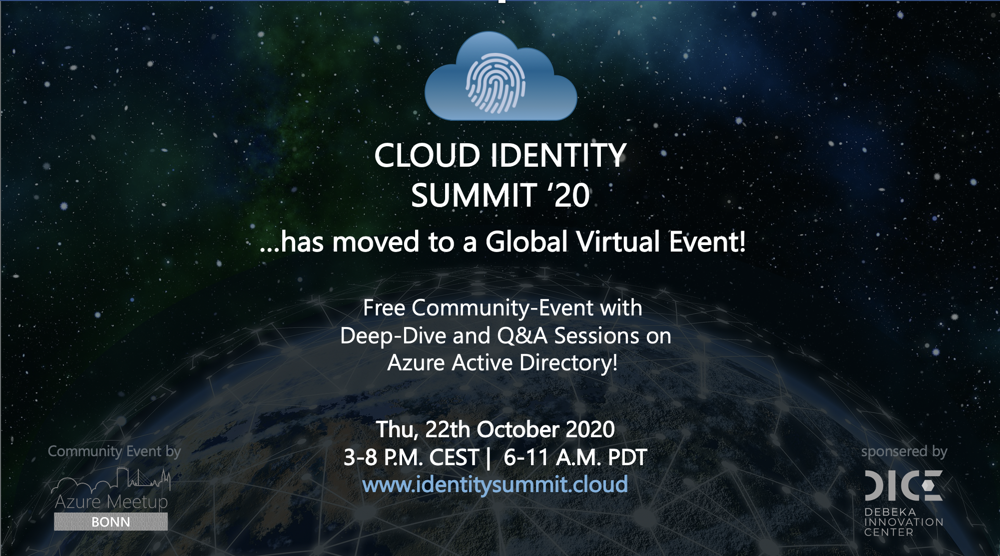

Originally we had planned to run the 1st edition of the „Cloud Identity Summit“ as local event.
But as many other community events, we are still facing an unstable situation and restrictions around COVID-19. This makes it unsuitable for attendees and the organization team for any fixed statements or reliable planning.

Therefore we have decided to reschedule this free community event to consider the special situation and potential health risks or restrictions for our attendees. 

I‘m very pleased to announce that this year's „Cloud Identity Summit“ will be take place on Thursday, **October 22th as global virtual event**. We are happy to give everyone the opportunity to be part of this special format with a unique combination of deep-dive session and discussions!

We hope that members of the global Azure community and already pre-registered attendees will join the virtual summit.

Currently we are planning **various deep dive-sessions on current Azure AD topics**. Open discussion, experience exchange or questions will be follow as part of „Ask-me-anything“ (AMA) after each session.

The first round of speakers will be announced soon.
Event details and the upcoming free registration will be available here: [www.identitysummit.cloud](https://www.identitysummit.cloud)
Follow us on twitter ([@identitysummit](https://twitter.com/identitysummit)) to get latest updates around registration, schedule and speaker announcements.
