*Azure Privileged Identity Management (PIM) allows to assign eligibility for membership as part of "Privileged Access Groups" (PAG). In this blog post I like to give an overview of current challenges and use cases of privileged access management outside of Azure AD roles (by using RBAC in Azure DevOps or Intune) and where PAG seems to offer new management capabilities.* 

### What are Privileged Access Groups (PAG)?

Microsoft introduced the public preview of [role-assignable groups](https://docs.microsoft.com/en-us/azure/active-directory/users-groups-roles/roles-groups-concept) and support of ["Privileged Access Groups"](https://docs.microsoft.com/en-us/azure/active-directory/privileged-identity-management/groups-features) (PAG) in Azure AD recently. At first glance it seems that these features are primarily relevant to assign groups to built-in directory roles..
This is also described in the target scenario in the documentation of the current preview.
But the option to manage eligible assignment of membership as part of "Privileged Identity Management" (PIM) allows also new opportunity for "just-in-time" (JIT) and "zero standing" access outside of eligible assignments to Azure AD (RBAC) built-in directory roles.

Microsoft describes this recent public preview feature as follows:

> Privileged Access Groups enable just-in-time (JIT) access to the Owner or Member role of this group. JIT access by Azure AD PIM provides enhanced security for owners with delegated administrative tasks.
>
>Enforce just-in-time access for owners and members of this group by requiring them to activate for a limited period of time. Create just-in-time access policies for these users like approval workflow, MFA challenge and much more.

This brings me to the question where it is suitable to use PAGs for other administrative roles and therefore take advantage of PIM features (approval or activation requirements, auditing, etc.).
It could be a potentially flexible and centralized solution to manage privilege role assignments by Azure PIM (alongside of Azure AD Directory Roles).

For example, using Azure PIM capabilities to manage eligible assignment to "3rd Party RBACs" (AWS, Salesforce,..) or other Microsoft RBAC models (presumed role assignment to security groups are supported).

## Overview of RBACs in Microsoft's Cloud services

It‘s makes sense to get an overview of Microsoft's RBAC implementations before we go into details of advanced role-based assignment scenarios in Microsoft Cloud services. 

Microsoft has implemented different RBAC models across various Microsoft 365 (M365) services and portals in the recent years. Examples are:

- Azure Advanced Threat Protection (ATP)
- Billing and Enterprise Agreement (Portal)
- Compliance Manager
- Exchange Online
- Microsoft Cloud App Security (MCAS)
- Microsoft Defender Advanced Threat Protection (ATP)
- Microsoft Intune
- Microsoft Compliance Manager

A full list of all [M365 related administrator roles and content](https://docs.microsoft.com/en-us/azure/active-directory/users-groups-roles/roles-m365-workload-docs) is also documented.
Most Microsoft cloud services were represented by a dedicated Azure AD admin role which covers permission to "manage all aspects of the product" (for example Azure DevOps-, Dynamics 365-, Intune-, Kaizala Administrator, etc.). Assigned users to those roles will have "full" permissions within the certain cloud service but some of them have delegated permission within Azure AD as well.

All other general admin roles (e.g. Security- or Compliance-Administrator) are mostly inherited to the the various RBAC model for achieving an unified access. One good example are roles such as "Global Admin" and "Global Reader" which have the option for read/full-access across all Microsoft Cloud services.

I‘ve extended the following RBAC diagram (diagram from the [Microsoft Security Compass](https://www.notion.so/Privileged-Access-Groups-Manage-JIT-access-outside-of-Azure-AD-RBACs-with-PIM-714d851b565042c2b3ca33ec534ed09e#adc66ed4201741c1b4ce147f973bed91)) to give a general overview (in parts it should shows the inherited permission from AAD roles to portal-/product-related RBACs):

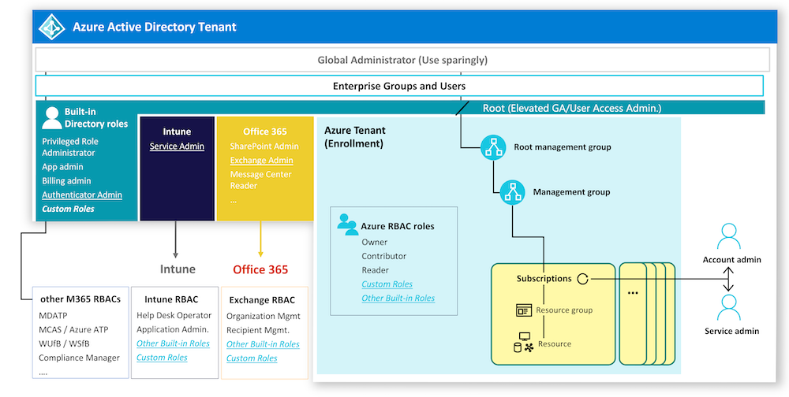

Apart of using Azure AD roles to gain (comprehensive) access to several Microsoft cloud services, the option to delegate administrative tasks within the individual portal- or product-specific RBACs is also available. Flexibility to create custom roles and scopes are one of the advantages of well-designed RBAC models, as you can find in Microsoft Defender ATP (MDATP) or Intune.

Different quality and feature sets of RBAC implementation across Microsoft's products does not permit to draw any general conclusion.
For example, MCAS is not supporting assignment to security groups which makes it also unusable to delegate admin roles to PAGs or any other kind of security groups in Azure AD.
So keep in mind that only RBACs which includes support of security group assignment are in scope of possible solution approach regarding PAGs. 

In contrast, Azure DevOps allows to use security groups from Azure AD for [assignment to roles on the various levels (Project or Collection)](https://docs.microsoft.com/en-us/azure/devops/organizations/security/set-project-collection-level-permissions?view=azure-devops&tabs=preview-page#add-a-user-or-group-to-a-security-group).

In the past some organizations preferred to use Azure AD built-in roles to take advantage of Azure AD PIM support and reduce complexity of role assignments.

*Attention: PIM role activation could lead to delays from many minutes up to a few hours before the permission will also be effective in the target admin portal. Microsoft worked on this issues for various M365 services ([one example is Exchange Admin role](https://feedback.azure.com/forums/169401-azure-active-directory/suggestions/19243510-pim-to-work-correctly-with-the-exchange-admin-role)). But some other M365 workloads have still issues (for example [SharePoint Admin, device admin and Compliance Center](https://docs.microsoft.com/en-us/azure/active-directory/privileged-identity-management/pim-roles)).
This can also be a blocker for a potential scenario to use PAGs for eligible assignments.*

## Possible scenarios of privileged role assignment by PAGs

### Scenario I: PIM-managed and JIT access to Azure DevOps roles

### Problem: No PIM-managed role assignments in Azure DevOps

Azure DevOps will be used mostly for automated deployment to Azure resources as part of Continuous Deployment (CD) pipelines. [Service Connections](https://docs.microsoft.com/en-us/azure/devops/pipelines/library/service-endpoints?view=azure-devops&tabs=yaml) allows to use "Service Principals" or "Managed Identities" to execute the privileged tasks (ARM Provider, KeyVault access,...).

Some organizations are securing their privileged admin accounts in Microsoft Azure but aren't aware of privileged service identities as part of Azure DevOps project. Developers or Project managers may also have (indirect) permission to use those service connection by other pipelines (as originally planned or delegated).

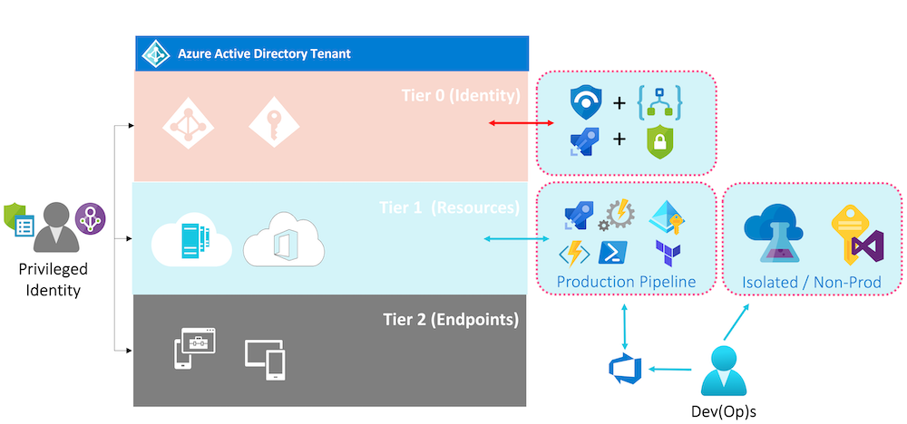

Therefore it's recommended (in my opinion) to analyze who has permission to service connections and manage them as eligibility assignment by PIM (incl. approval workflows and auditing). 

_Note: Microsoft already documented some general recommendations on [securing a service connection](https://docs.microsoft.com/en-us/azure/devops/pipelines/library/service-endpoints?view=azure-devops&tabs=yaml#secure-a-service-connection)_

### Solution approach: Using PAGs to assign (PIM-managed) membership of Azure DevOps roles

Check that your target user has currently no privileged access to Azure DevOps before we configure PAG and eligible assignment:

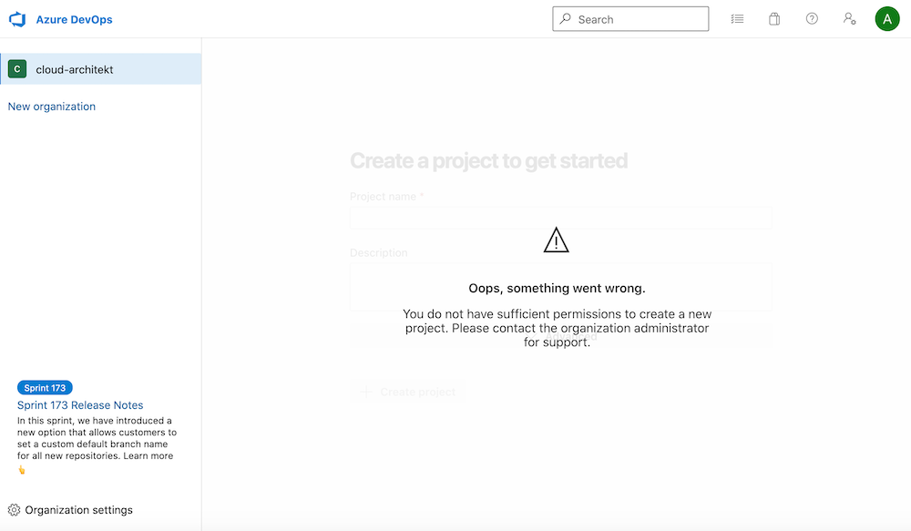

**Create PAG and configure role settings**

1. Create a new PAG to manage assignment to Azure DevOps role "Team Project Collection" later.

    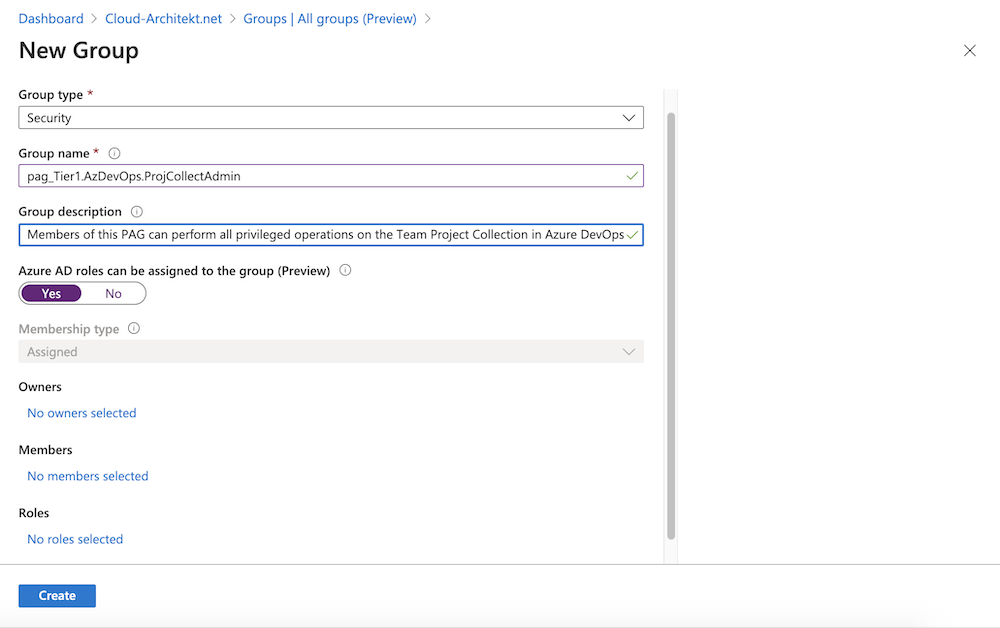

2. Enable "Privileged access" (preview feature) in the "Activity" area of the "Group" blade.

    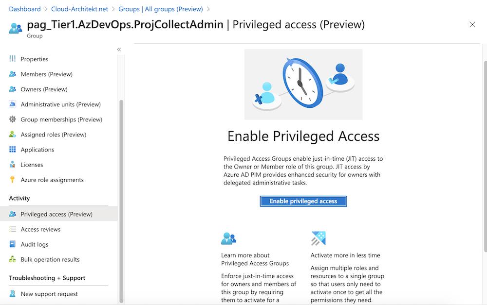

3. Go to the Azure PIM blade and choose the new created PAG to assign eligible membership:

    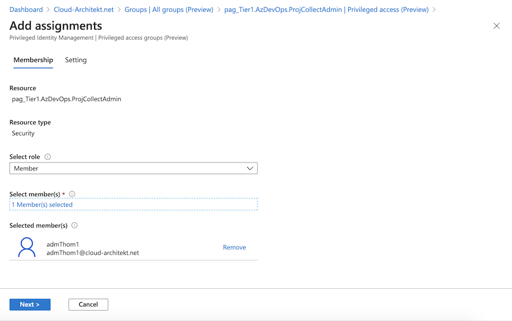

4. In the next steps you are able to configure duration of the eligible assignment. The max. allowed eligible duration can be configured in the role setting of the PAG.

    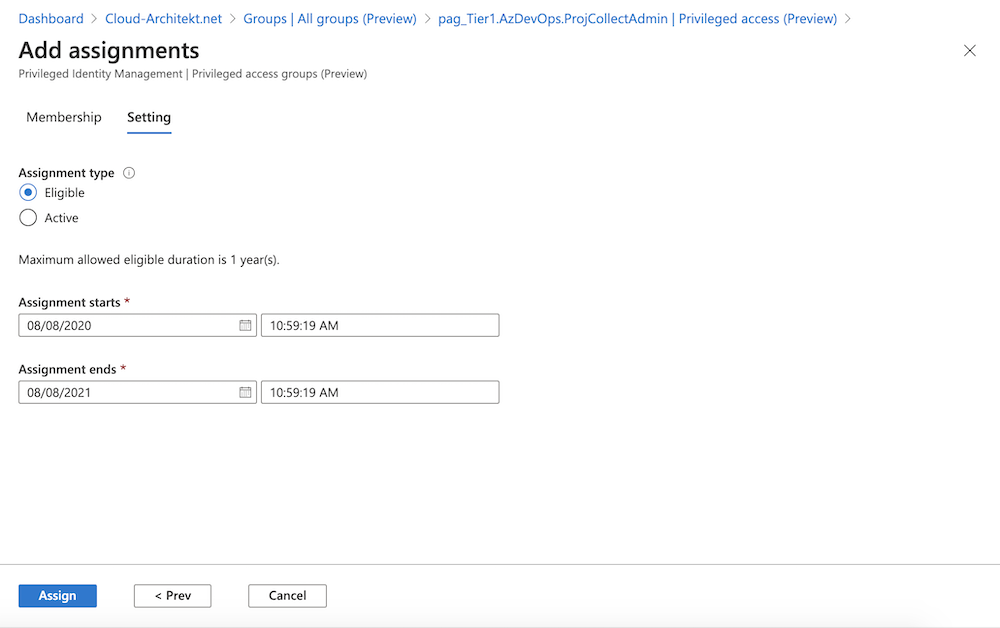

5. The eligible assignment to the PAG should be visible in the "Privileged access" blade of PIM after few seconds.

    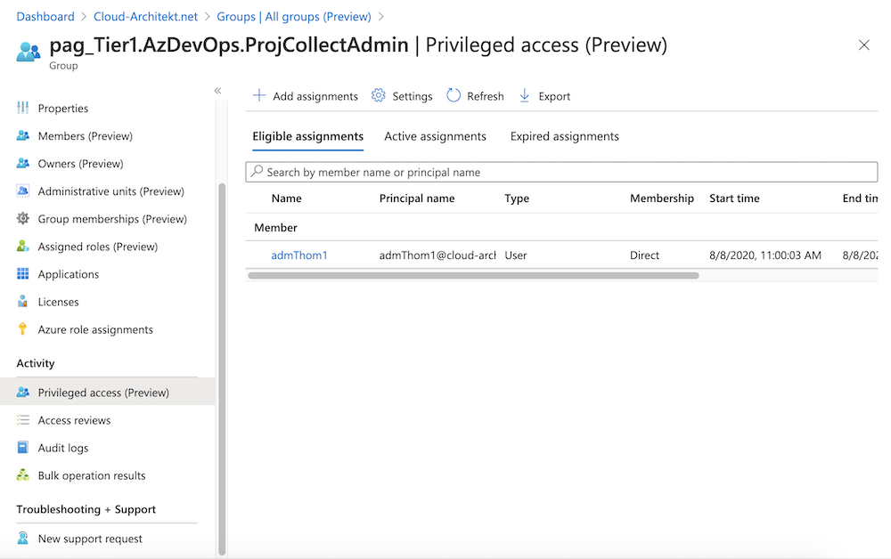

6. Optional: Go to the "Role settings" to adjust the default settings and configure further details (Activation, Assignment and Notification). Requirements for approval requests, enforcement of MFA or input of ticket information can be also configured here:

    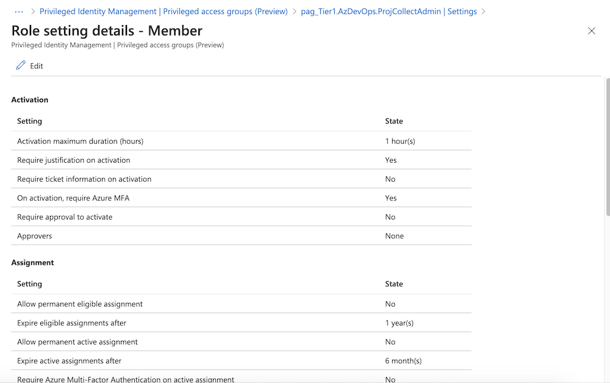

    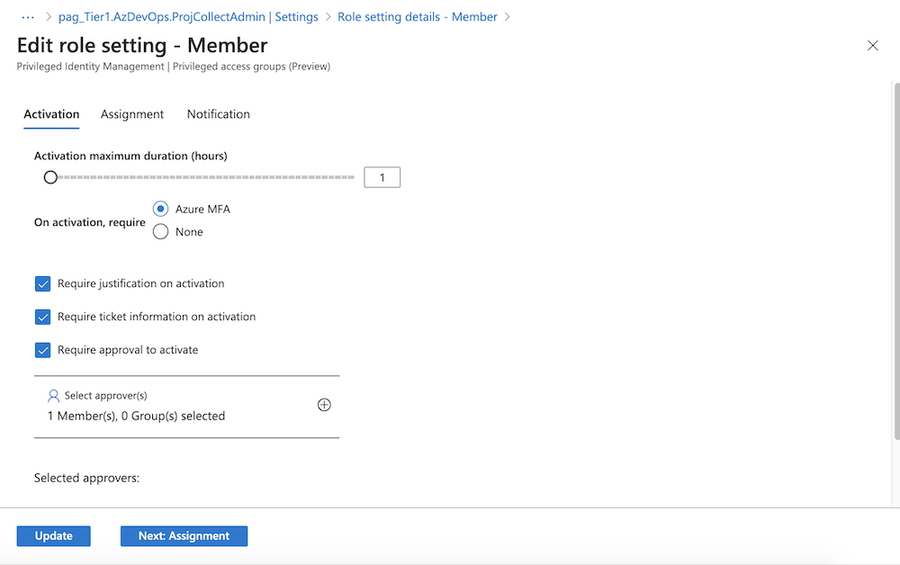

**Assign PAG to Azure DevOps role group**

1. Go to the Azure DevOps Organization settings and choose "Security" > "Permissions".
2. The application group "Project Collection Administrator" will be used in this example for JIT access. Add the PAG (similar to other Azure AD Groups) to the members:

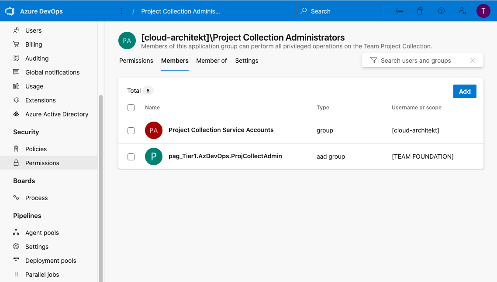

**Request PAG membership from your eligible user**

1. Sign-in with credentials of the DevOps admin user and go to the [PIM portal](https://portal.azure.com/#blade/Microsoft_Azure_PIMCommon/CommonMenuBlade/aadgroup) for requesting membership as part of "My roles" blade.

    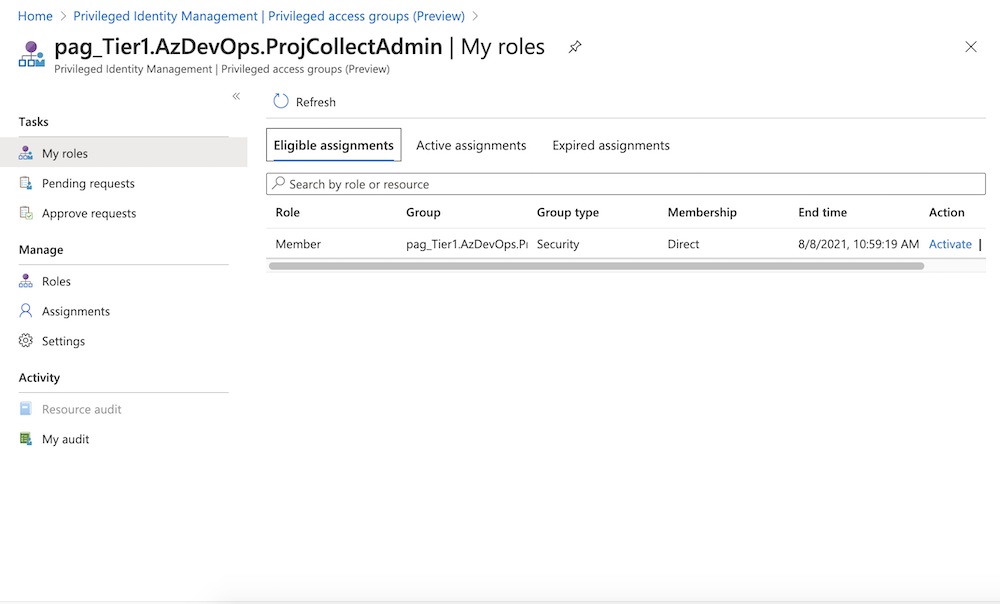

    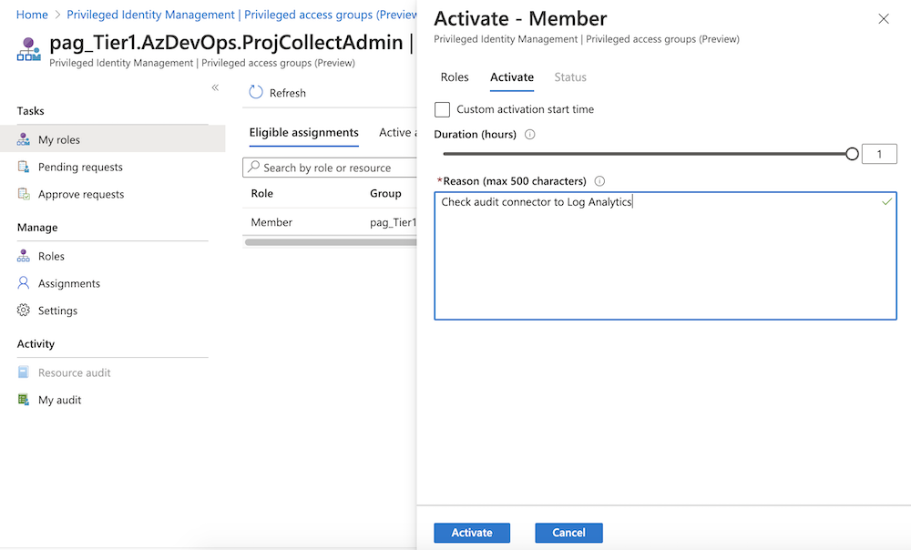

2. After activating the eligible assignment, the user will be added to the PAG in Azure AD immediately.
Move to the Azure DevOps portal to validate if the requested DevOps role assignment is now effective.

    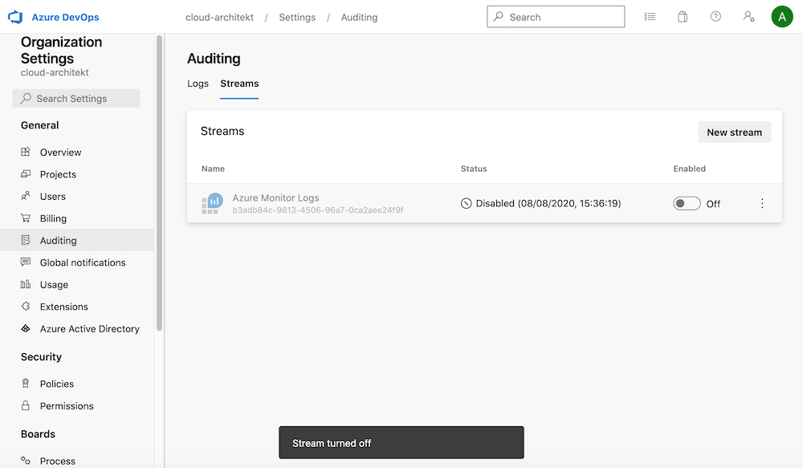

### Scenario II: Scoped privileged access to Intune objects

### Problem: Current challenges to assign "Intune (Service) Admin" role

"**Privilege Escalation" by Modification of Security Groups**

I've tried to build a relation between the permission scope of (built-in) directory roles in Azure AD and (the already known) "[Tier model (ESAE)](https://docs.microsoft.com/en-us/windows-server/identity/securing-privileged-access/securing-privileged-access-reference-material)" of Active Directory in my previous community talks. This analogy helps to understand the potential risk, scope and escalation path in delegation of administrative permission.  

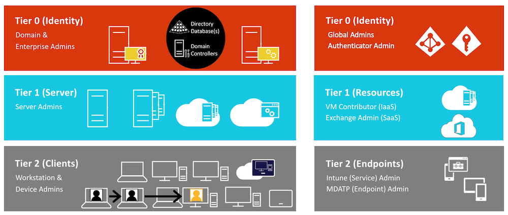

As example, Intune (Service) Administrators are [able to modify membership of Azure AD security groups as part of the built-in permission set](https://docs.microsoft.com/en-us/azure/active-directory/users-groups-roles/directory-assign-admin-roles#intune-service-administrator-permissions). This allows "Endpoint Administrators" (Tier2) to modify permission of Azure RBAC (Tier1) resources or manage "Conditional Access Exclusions" (Tier0) if admins are using security groups for their assignments.

It's not possible to customize the existing permission set of the built-in directory role (in this case, exclude group management of Intune Administrators). Currently [custom admin roles](https://docs.microsoft.com/en-us/azure/active-directory/users-groups-roles/roles-custom-overview) are limited to Application (registration) management only.

Therefore using a custom role as part of Intune RBAC seems to be the only option.
This allows to delegate full access to the Intune service without assigning any privileged access to Azure AD objects. But this means also to lose any advantages of PIM-managed directory role assignments as well.

**No option to delegate permission on custom scope of devices or users**

[Administrative Units (AUs)](https://docs.microsoft.com/de-de/azure/active-directory/users-groups-roles/directory-administrative-units) enables admins to scope permissions of admin roles to a certain subset of objects. But this isn't supported for "Intune Admins" and doesn't walk along with the object hierarchy of Intune.

Microsoft's implementation of RBAC in Intune and MDATP allows to delegate (fine-grained) control and permission on scope of device tags or device groups. This give us the option to implement a "Tier-based" delegation model on geo-location or any other separation of device types/categories.

Microsoft has documented the management of [portal access](https://docs.microsoft.com/en-us/windows/security/threat-protection/microsoft-defender-atp/rbac), usage of [device groups](https://docs.microsoft.com/en-us/windows/security/threat-protection/microsoft-defender-atp/machine-groups) and [tags](https://docs.microsoft.com/en-us/windows/security/threat-protection/microsoft-defender-atp/machine-tags) in MDATP very well.
Intune allows custom roles but also scoped permissions of existing Intune (built-in) roles. Check the Microsoft Docs article about [Intune RBAC](https://docs.microsoft.com/en-us/mem/intune/fundamentals/role-based-access-control) for further details on managing scope tags and custom roles. Peter Daalmans has also give a good summarized explanation of Intune RBAC aspects in his [blog post](https://configmgrblog.com/2018/10/03/rbac-in-azure-ad-intune-and-scope-tags-explained/).

One of my recommendation: You should separate and isolate admin- and non-admin objects in Intune and MDATP environments. Similar to separate any admin- and non-admin (productivity) identity and access. 

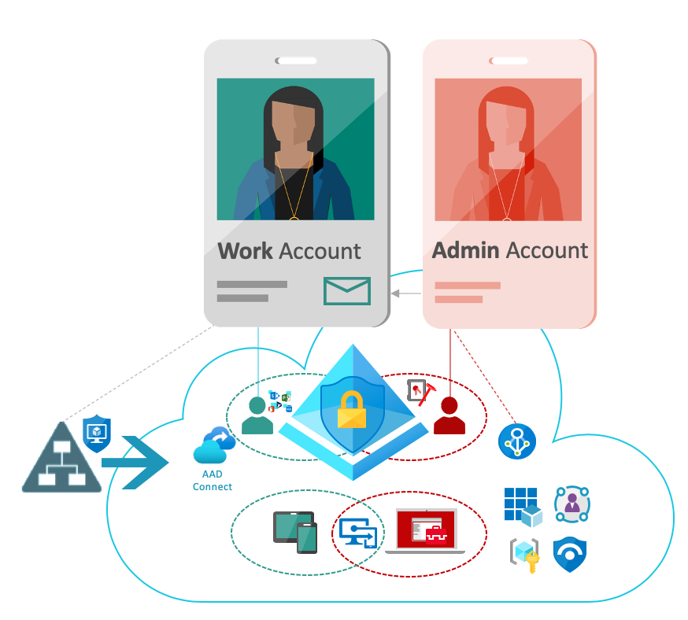

In my opinion this will increase the security of privileged access endpoints. For example, delegation to modify "Device or Compliance configuration" of Secure Admin Workstations (SAW) or Privileged Access Workstation (PAW) will be highly restricted.

Finally the "endpoint admins" (Tier2) should not be able to manage any high-privileged access workstation that will be used from Tier0 or Tier1 admins. SAW device admins should be protected similar to the target users (for example Global Admins).

### Solution approach: Scoped (just-in-time) access to Intune Standard and SAW objects

Before we start, you should verify that your client admin has no permission to Intune (such as access to "Compliance Policies"):

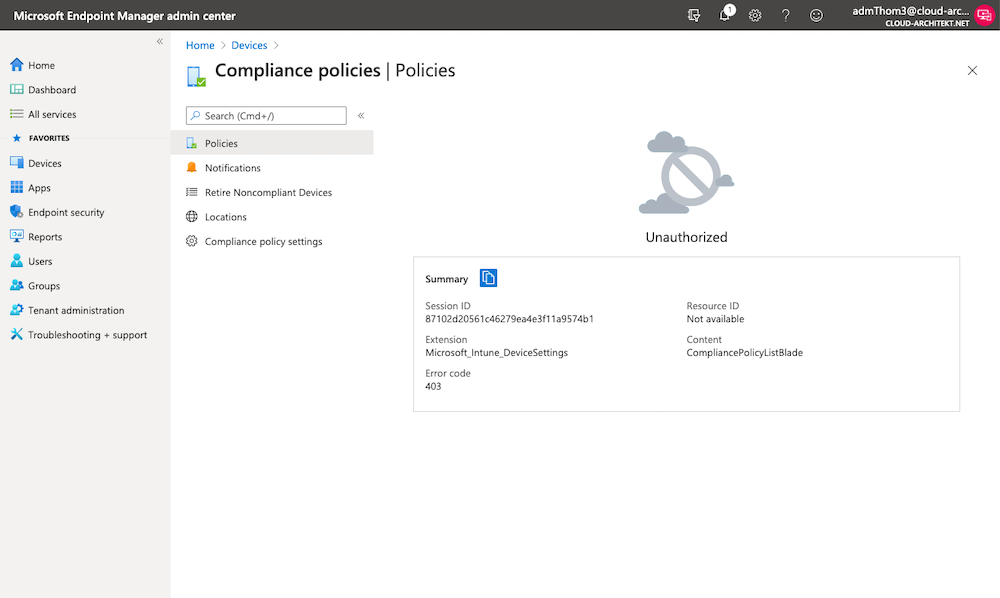

**Create PAG and configure role settings**

Follow the instructions to create a PAG as described in the first scenario. In this sample we will create one group for the scope of your non-admin objects and another group for all admin-objects (e.g. PAW and SAW devices). In my examples I've used the following PAG names:

- pag_Tier3.Intune.DefaultClientAdmin
- pag_Tier0.Intune.SAWClientAdmin

**Assign PAGs to Custom Scope tags and groups**

1. Go to one of the existing built-in roles or create a custom role from the "Tenant admin" blade in your "Endpoint Manager admin center".
2. Choose the assignment of the role and create for each scope (in this example "Default" and "SAW") a separately assignment to the according PAG. As follows you can see the properties of my SAW Client Admin assignment:

    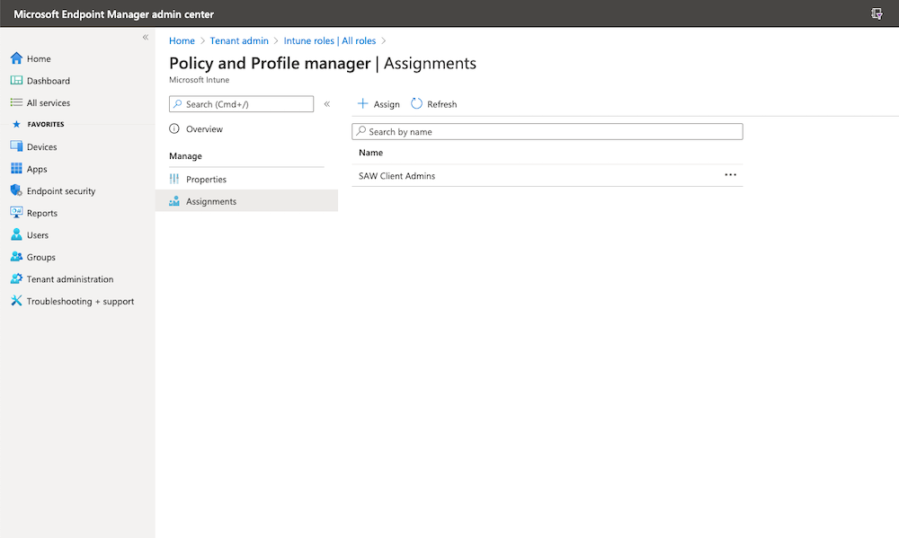

    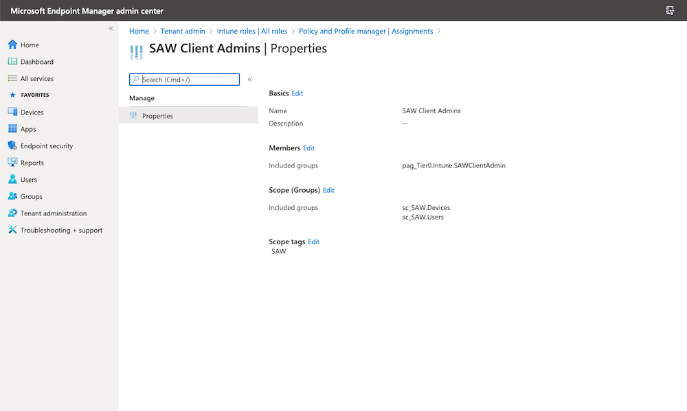

    I've used a scope tag and dynamic groups which includes all devices and users of my SAWs.

    _Advice: Nicola Suter has written a detailed blog post about "[Intune scope tags and RBAC](https://tech.nicolonsky.ch/intune-scope-tags-rbac-explained/)". Check his documentation if you need further instruction or information._

**Request PAG membership from your eligible user**

1. Request the eligible assignment to the PAG for managing SAWs:

    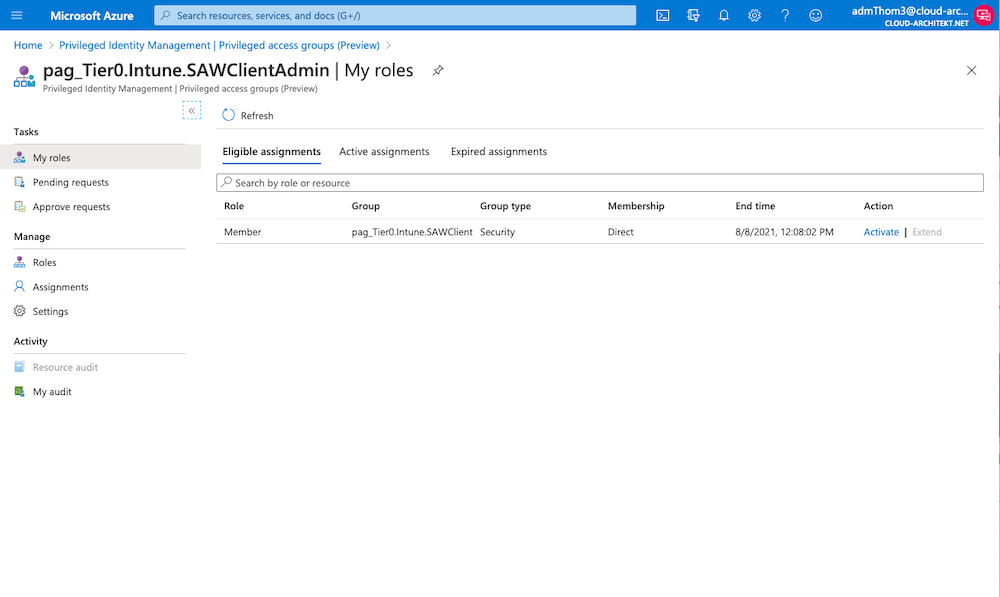

2. Navigate to the Endpoint Admin portal to verify privileged access to "Compliance policies" of SAWs:

    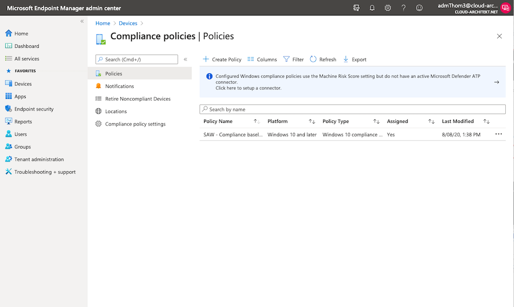

3. Deactivate your current eligible assignment or choose another user to request Intune permissions to manage all object within the scope of "Default".  

    

4. Now you should be able to modify your "Compliance Policies" of the requested scope only.  Deactivation of your PAG assignment to manage SAWs and activation of the new assignment for scope "Default" should limit the scope (as you can see in this screenshot):

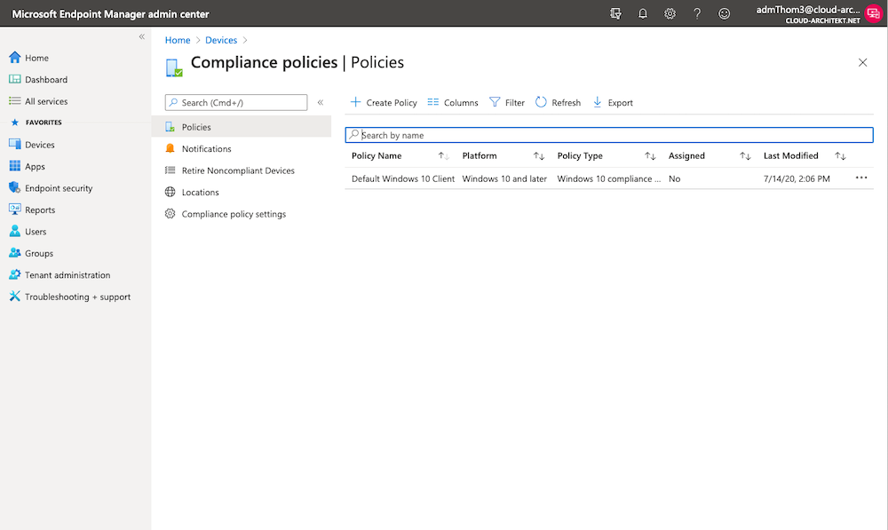

## Limitations and Considerations of using PAGs

1. Currently this feature is in public preview and my described use cases and solution approaches are not included in the technical documentation (as valid or supported scenario of PAG).
2. During my tests I have found some delays and latency until membership changes has been effected in Azure DevOps or Intune RBAC/portal. As always it's require to evaluate if this range of delay and result passed your security or compliance requirements.
3. Consider to protect users with assigned privileges outside of Azure AD admin roles. Users with assigned roles "Authenticator or Password Administrator" are able to reset credentials of PAG-assigned permissions. As already described in many previous blog posts, only user assignment to Azure AD directory roles (permanent or eligible) will protect them and restrict credential management (by "Privileged Authenticator or Password Administrators"). 

 
Original cover image by [mohamed Hassan / Pixabay](https://pixabay.com/illustrations/web-domain-service-website-3967926/)
