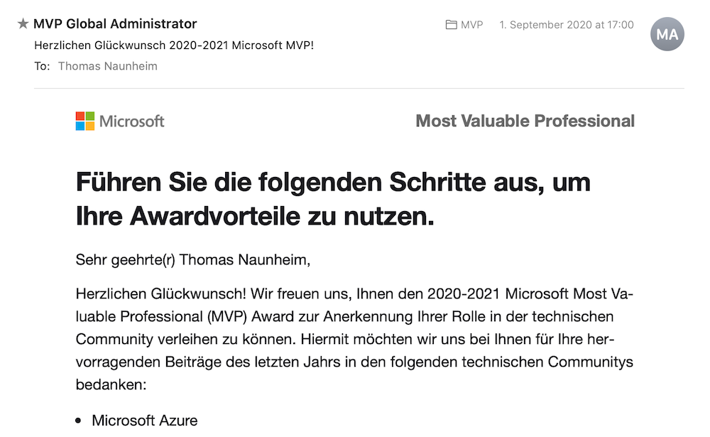
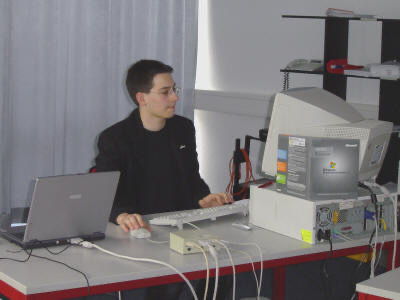
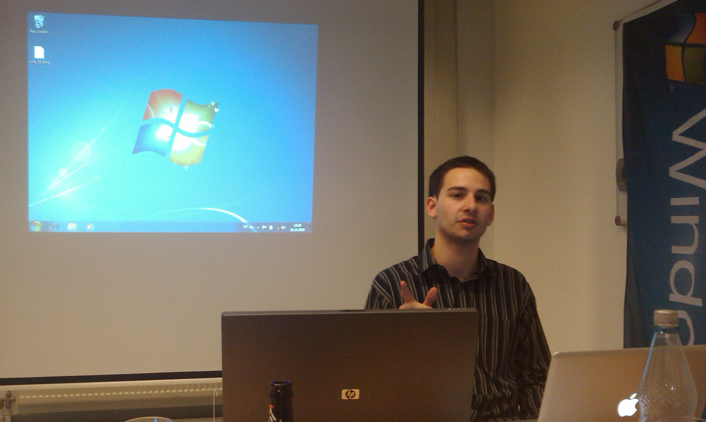
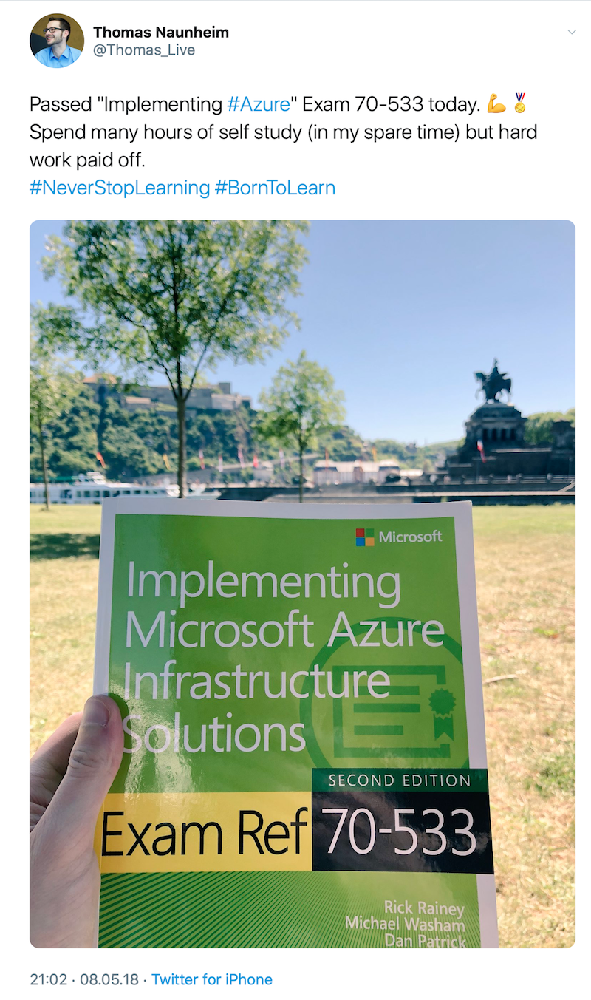
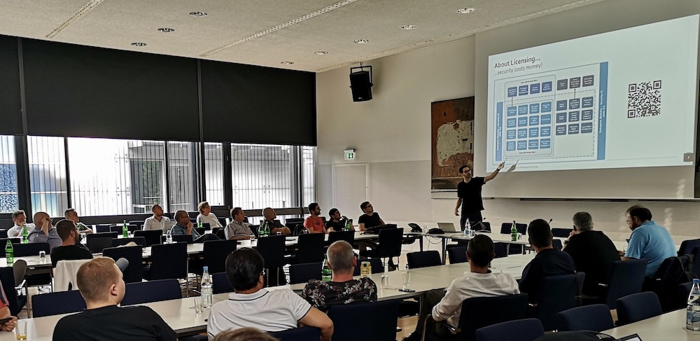
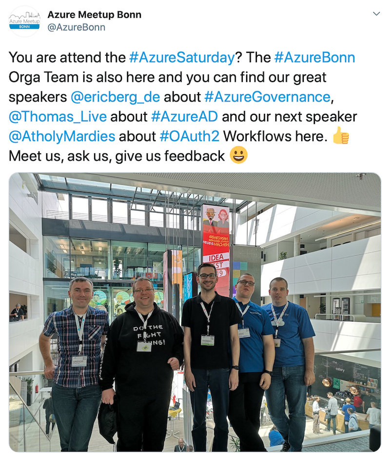
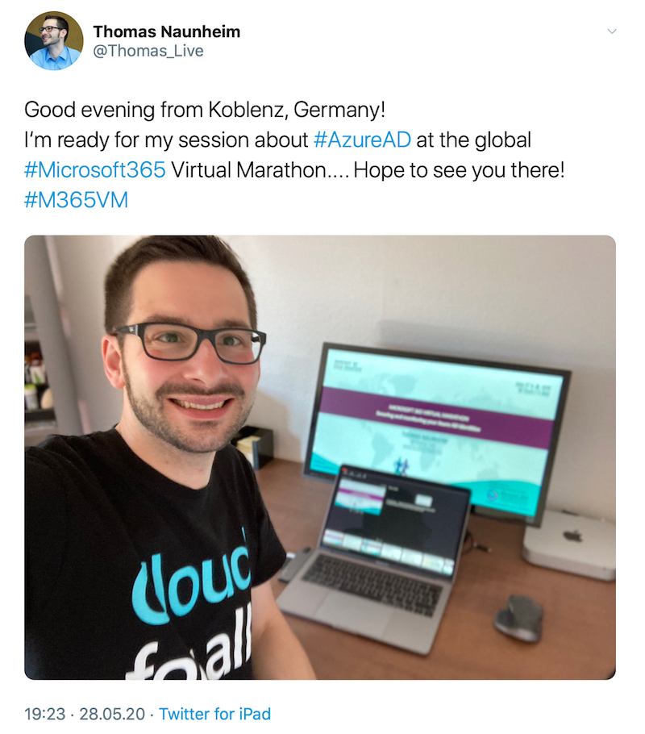

*Thank you all for congratulations and the kind words in the recent days!
On the weekend, I’ve used the opportunity to look back on my (Azure) learning journey and previous community experiences.
Finally, I’ve wrote a short blog post and try to share a few personal insights.*

## Thank You!
On 1st September, few hours before I gave a talk at Azure Meetup Bonn, I've received the confirmation mail that Microsoft awarded me as a  "Most Valuable Professional" (MVP) in the category "Microsoft Azure". I'm still overwhelmed, thankful and honored about this special recognition for my community engagement by Microsoft.

I would like to thank everyone for the congratulations and all the nice words which I have received the recent days.
I also like to thank you all for your interest in my community contributions!
Special thanks to Sarah Lean, Gregor Reimling and Alex Benoit for their incredible support.

In the past years, I spent spare time for writing blog posts, giving feedback to Microsoft's Product Groups, speaking or organizing community events and offering mentorship.
My main reason and motivation for community contribution is sharing my knowledge to support other people, learning from mutual exchange of experiences and live my passion for computing technology. This also gives me the opportunity to give something back to the community.

## Looking back...

In the early days of my IT career, I‘ve read many blog posts from MVPs about Active Directory and Exchange, such as "[Yusuf's Directory Blog](http://blog.dikmenoglu.de)" ([Yusuf Dikmenoglu](https://twitter.com/yusufsdsblog)) or "[MSXFAQ](https://www.msxfaq.de)" ( [Frank Carius](https://twitter.com/msxfaq)).
This helps me to learn from experts and build up my skills in the 2000s.
I've already started to give talks about Microsoft Server products (as part of internal training for other trainees) during my IT apprenticeship.

*Talking about "Small Business Server" and troubleshooting of Active Directory in 2004 .*

Few years later I've co-founded the .NET User Group (DNUG Koblenz) and gave one of my first talks (a session about Microsoft's "Team Foundation Server 2005").

*My first experiences as "speaker" in Koblenz, my hometown. The photo shows a presentation as part of the global lunch of "Windows 7" at DNUG Koblenz. Yes, it's true...on the picture you see a Mac.*

Attending community events (User Groups or Meetups) and conferences became an essential part to learn more about the "new" cloud solutions and technologies, too. I've started to invest free time to extend and transform my skills on Microsoft's Azure platform but also partly for Microsoft 365 services.

*Summer 2018: At that time, I've spent some sunny holidays for self-study and exam preparation for my Azure certifications.*

Nowadays, it‘s a great pleasure and delight to be an active member of the #AzureCommunity.
For me it's already a great appreciation if others are interested in my talks, articles and product feedback. It's a particularly honor that Microsoft also recognized my contributions (in a special way) with the MVP award for this year's community work.

I had the pleasure and privilege to talk at various events and met a lot of great people. This year, I've also joined the "Azure Meetup Bonn" team and I'm very pleased to support Melanie, Gregor and René in organizing events for the local Azure community. 

*Session about "Azure AD Security" at "Azure Meetup Bonn" in August 2019.*

*Azure Saturday in Munich (May 2019): Meetups and conferences are also great time and place to meet people from the community.*

## ...what's next?

The current situation around COVID-19 has also dramatically changed the way of community contribution and interaction. Virtual events, session recordings and blogging has become the "standard" and more common. Face-to-face meetings, talks and discussions are missed by myself and the many members of the community. Even if the current situation allows us to attend or speak at meetups or conferences world wide without any travel expenses.

*Microsoft 365 Virtual Marathon: My first talk at a virtual and international community event.*

Nevertheless, I hope that it will soon be possible to travel and meet you all in person!
Looking forward to speak at local meetups or conferences in other cities and dinner together in the evening after the events.

In the meantime, I'm organizing virtual events (with the Azure Meetup Bonn team) including the upcoming "Cloud Identity Summit". I also like to increase the support of the local area of my hometown (Koblenz) as part of my community work. Additionally I will try to expand my engagement in mentorship and volunteer projects (for non-profit organizations).

It would make me very happy to speak at meetups or user groups in the next time. I've worked on a few sessions in the past months (Azure Enterprise-Scale, Privileged Identities, External Identities,...). If you are hosting or organizing community events and looking for sessions, feel free to check my [current sessions](https://sessionize.com/ThomasNaunheim) and please don't hesitate to contact me!