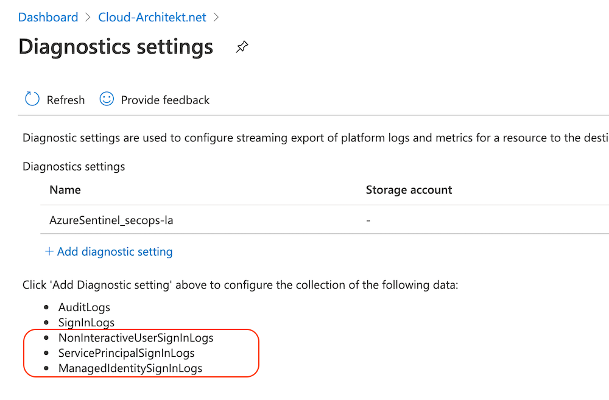
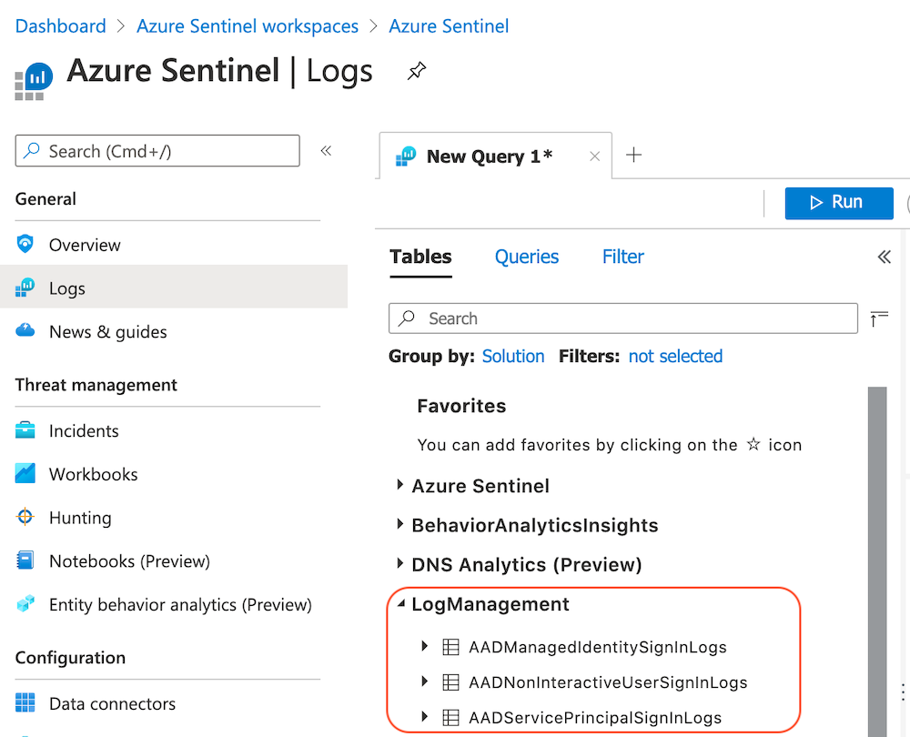
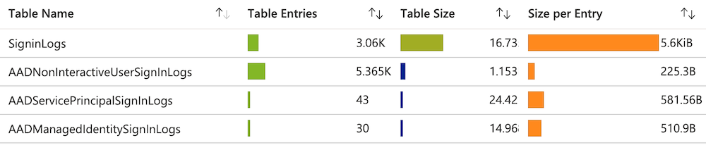
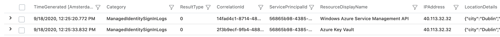
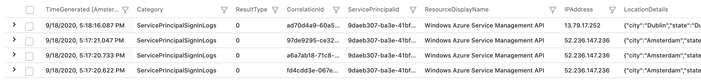
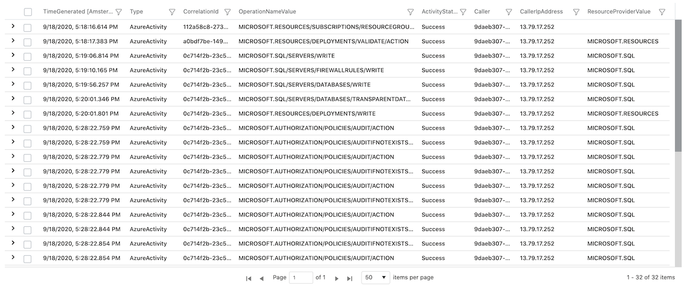
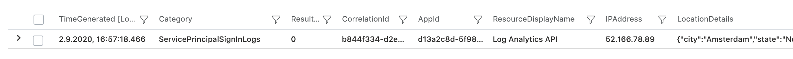
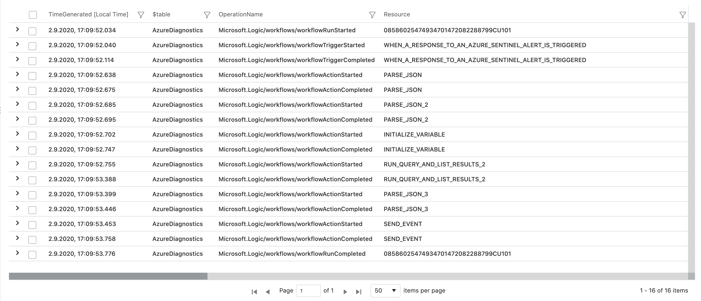
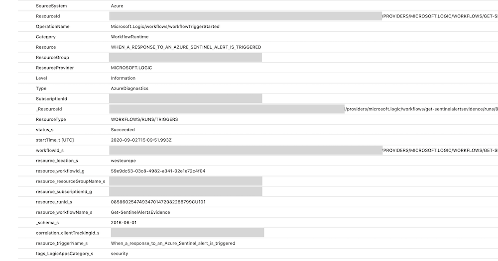

Recently, Microsoft added new categories for sign-in logs which includes auditing of non-interactive, managed or service principals in Azure AD.
In this blog post I will describe the configuration steps to forward the new collections to Azure Sentinel, some considerations from my first tests and a few examples of correlation to activity logs and potentially Azure Sentinel analytic rules.

*Note: Currently there's no official statement or documentation around this feature. Please wait for Microsoft's documentation and consider the log volume estimation before enabling the new collection in your production environment.*

## Limited security options and controls

Most organization are using non-interactive sign-ins for automation tasks or deployment tasks in (Azure) DevOps pipelines.
Until now, there are some missing security controls for managed identities or and service principals (comparing to user accounts):

- No restriction of access by conditions
(similar to the "condition" and "control" approach in  Conditional Access)
- Limited options of alternate authentication methods to existing key- or certificate-based credentials
    - Managed Identities in Azure aren't supported by every service or scenario.
    Therefore fallback to Service principals with keys or secrets is sometimes necessary.
- No sign-in log events to audit the authentication requests (and sign-in attempts)

Particularly the last point was one of the most requested feature. This is not only necessary for troubleshooting, it's also important from aspects of security, compliance and comprehensive (privileged) identity audit.

This seems to be also the reason for several Azure Feedback/User voice posts that exists:

- [Azure AD sign-in activity log should record and show sign-ins from service principal](https://feedback.azure.com/forums/223579-azure-portal/suggestions/33867259-azure-ad-sign-in-activity-log-should-record-and-sh](https://feedback.azure.com/forums/223579-azure-portal/suggestions/33867259-azure-ad-sign-in-activity-log-should-record-and-sh))
- [Make SPN (non-interactive) login events logged and available](https://feedback.azure.com/forums/169401-azure-active-directory/suggestions/31991029-make-spn-non-interactive-login-events-logged-and](https://feedback.azure.com/forums/169401-azure-active-directory/suggestions/31991029-make-spn-non-interactive-login-events-logged-and))

## Configuration of the new sign-in categories

In the past, Microsoft allows already to route Azure AD audit and sign-ins logs to blob storage, event hub or Log Analytics workspaces. This is well described in the Microsoft Docs article "[Azure AD logs in Azure Monitor](https://docs.microsoft.com/en-us/azure/active-directory/reports-monitoring/concept-activity-logs-azure-monitor#supported-reports)". At the time of writing this article, the following new categories are not covered by Microsoft's documentation. However, there are already visible and configurable in the diagnostic settings of the Azure AD portal
(Azure Portal > Azure AD Blade > Diagnostic Settings):



The last three (new) categories can be configured as already described in the Docs article "[Create diagnostic settings to send platform logs and metrics to different destinations](https://docs.microsoft.com/en-us/azure/azure-monitor/platform/diagnostic-settings?WT.mc_id=Portal-Microsoft_Azure_Monitoring)".

You'll find the following tables (and entries) in your destination resource (in this example I've used Azure Sentinel / Log Analytics workspace) after the first records of the respective logs was forwarded from Azure Monitor successfully.



### Data schema of the new sign-in logs

Even if there are no further documentation, the data schema of the new sign-in logs has been already documented in the [Azure Monitor Logs reference](https://docs.microsoft.com/en-us/azure/azure-monitor/reference/). Name of the collection in the diagnostic settings and the name of the table are not equal.

- NonInteracticeUserSignInLogs → [AADNonInteractiveUserSignInLogs](https://docs.microsoft.com/en-us/azure/azure-monitor/reference/tables/aadnoninteractiveusersigninlogs)
- ServicePrincipalSignInLogs → [AADServicePrincipalSignInLogs](https://docs.microsoft.com/en-us/azure/azure-monitor/reference/tables/aadserviceprincipalsigninlogs)
- ManagedIdentitySignInLogs → [AADManagedIdentitySignInLogs](https://docs.microsoft.com/en-us/azure/azure-monitor/reference/tables/aadmanagedidentitysigninlogs)

*Tip: It's interesting to compare the data schema of all three non-interactive logs with the existing (user) sign-in log. Most field names are identical (CorrelationId) but some others (as expected) are not included (User risk- oder Conditional Access details, client/device information). Sign-in log schema of users is described in the following Microsoft Docs article:
[Interpret the Azure AD sign-in logs schema in Azure Monitor](https://docs.microsoft.com/en-us/azure/active-directory/reports-monitoring/reference-azure-monitor-sign-ins-log-schema)*

## General considerations and notes from my tests

- Check the pre-requisites related to the [Azure AD licensing](https://docs.microsoft.com/en-us/azure/active-directory/reports-monitoring/concept-activity-logs-azure-monitor#prerequisites)
- No indication seems to be available if service principal authentication attempt
was made by client secret or certificate
- No direct correlation between sign-in and activity log entry
- Be aware of the differences between application, object and service principal ID
    - Application and ServicePrincipal ID are included in the AADServicePrincipalSignInLogs
- Currently only user sign-in logs are visible in the Azure Portal
- Table entries, size and size per entry should be actively monitored and considered in your test environment before enabling the new categories in your production. This also helps to calculate the estimated log volume.
    - I'm confident that Microsoft will update the [existing documentation about cost considerations soon](https://docs.microsoft.com/en-us/azure/active-directory/reports-monitoring/concept-activity-logs-azure-monitor#cost-considerations).
    - I've used the "[Workspace Usage report](https://techcommunity.microsoft.com/t5/azure-sentinel/usage-reporting-for-azure-sentinel/ba-p/1267383)" during my early tests in the Azure Sentinel playground environment. The latest version of the workbook is [available from GitHub](https://github.com/CliveW-MSFT/KQLpublic/blob/master/KQL/Workbooks/Workspace%20Usage%20report.workbook).
    It's super-helpful to get insights of table entries and sizes but also about latency.

        

## Scenarios and query examples

In the following scenarios, I want to give some examples of KQL queries to build a correlation between sign-in events and activity event by accessing resources.

### Managed Identity and Azure KeyVault Access

**Scenario:**

Access from (system-assigned) managed identity of an Azure VM to Azure KeyVault (for reading a secret value of the vault).

I have used the Azure PowerShell module and use the parameter "Identity" for sign-in. Afterwards I've tried to access the vault with the cmdlet "Get-AzureKeyVaultSecret".

**Logs:**

All Managed Identities sign-ins are located in the "AADManagedIdentitySignInLogs" table of the Log Analytics workspace. In the first query I'm looking for events of the system-assigned identity of the virtual machine:

```jsx
AADManagedIdentitySignInLogs
| where ServicePrincipalName == <VM or application name>
| project TimeGenerated, Category, ResultType, CorrelationId, ServicePrincipalId, ResourceDisplayName, IPAddress, LocationDetails
```

As we can see in the screenshot, two events will be displayed because of using the Az-Connect cmdlet and sending the request to the Azure KeyVault



Sign-in log entry of the resource "Azure KeyVault" includes a ResourceIdentity which is a fixed application ID of this service. Unfortunately it can not be used to find out which KeyVault instance in the Azure environment was be accessed. More details about how and when the key vault was accessed is available in the operational insights / diagnostics logs. 

This resource-level logs includes the identity from the token that was presented in the REST API request to the vault. As prerequisite for our query, we need the ServicePrincipalId of the Managed Identity which is displayed in the result of the previous sign-in event or can be displayed from the Get-AzADServicePrincipal cmdlet. 
*Tip: Further details are described in the Microsoft docs article "[View the service principal of a managed identity using PowerShell](https://docs.microsoft.com/en-us/azure/active-directory/managed-identities-azure-resources/how-to-view-managed-identity-service-principal-powershell)".*

```jsx
AzureDiagnostics
| where identity_claim_http_schemas_microsoft_com_identity_claims_objectidentifier_g == <ServicePrincipalId>
| project TimeGenerated, Category, CorrelationId, Resource, ResourceType, OperationName, ResultType, CallerIPAddress
```

AuditEvent with detailed information about the resource operation should be displayed:


*Note: In this sample, the CallerIPAddress will be shown as private IP address because of using a private endpoint for accessing Azure KeyVault.*

### Service Principal and Azure Deployment

**Scenario:**

Access from Azure DevOps CD pipeline to deploy SQL database via Azure Resource Manager (ARM) API endpoint. Assigned service connection to the deployment pipeline uses service principal and a client secret.

**Logs:**

The following query shows filtered Service principal sign-ins by the Resource Identity of "Windows Azure Service Management API" and the ServicePrincipalID
(ServicePrincipalName would have been also possible):

```jsx
AADServicePrincipalSignInLogs
| where ServicePrincipalId == <ServicePrincipalId>
| where ResourceIdentity == "797f4846-ba00-4fd7-ba43-dac1f8f63013"
| project TimeGenerated, Category, ResultType, CorrelationId, ServicePrincipalId, ResourceDisplayName, IPAddress, LocationDetails
```

Four different sign-in requests from the CD pipeline during the deployment:



Afterwards I've started a query to find all Azure Activity logs related to this service principal:

```jsx
AzureActivity | where Caller == <ServicePrincipalId>
| project TimeGenerated, Type, CorrelationId, OperationNameValue, ActivityStatusValue, Caller, CallerIpAddress, ResourceProviderValue
```

ARM operations will be audited in details, as you can see in the following screenshot (even if  successful activities will be displayed only):



*Note: I was able to find  activities from one of the four service principal sign-ins. The other 3 sign-ins from a single IP address (Azure data center in "West Europe") are without any activity log entry.*

### Service Principal und Logic Apps

**Scenario:**

Logic app is using a service principal for service / API connection. In this sample you will see an [Azure Sentinel playbook to sending enriched alerts](https://techcommunity.microsoft.com/t5/azure-sentinel/sending-enriched-azure-sentinel-alerts-to-3rd-party-siem-and/ba-p/1456976) from Azure Sentinel to an Event Hub. Service principal is assigned to get information from the workspace via Log Analytics API.

**Logs:**

All Service Principal sign-ins are located in the "AADManagedIdentitySignInLogs" table.
In this example I will use the "ServicePrincipalName" for filtering sign-in events: 

```jsx
AADServicePrincipalSignInLogs
| where ServicePrincipalName == "Azure Sentinel Alerts Evidence SIEM"
| project TimeGenerated, Category, CorrelationId, ServicePrincipalId, ResourceDisplayName, IPAddress, Location
```

Similar to the previous use case, the "ResourceIdentity" contains only the fixed Application ID of LogAnalytics API. It gives us no further details about the certain Logic App that was used:



However, in this use case we have another challenge then before. I was not able to find any relation between the Azure Logic App and the used service principal in the resource-level logs.
So far as I can see, the timestamp and type of resource (based on the ResourceIdentity we know it is a Logic App) are the only indications to find the related resource activity log entry.



Although there are detailed information about the workflow within the app in the diagnostic logs, 
the indications to the sign-in event is missing (e.g. Service Principal ID or caller IP address).



All security-related logs of a Logic App can be filtered by the following query:

```jsx
AzureDiagnostics
| where resource_workflowName_s == "Get-SentinelAlertsEvidence" and tags_LogicAppsCategory_s == "security"
```

### Service Principal (certificate authentication) and Microsoft Graph API

**Scenario:**

REST API calls to Microsoft Graph API for automation of Azure AD or Microsoft 365 related administrative tasks. This example shows the management of Conditional Access policies as part of an automation job and certificate-based authentication to the Microsoft Graph. I've used an Graph API operation to delete a Conditional Access Policy.

**Logs:**

In this example, we are looking for all sign-in activities to the Microsoft Graph:

```jsx
AADServicePrincipalSignInLogs
| where ResourceDisplayName == "Microsoft Graph"
```

The sign-in attempt of my Graph API call will be shows as follows:


Now we are able to find the related operational tasks from the Azure AD Audit Log by filtering the ServicePrincipalId:

```jsx
AuditLogs
| where InitiatedBy.app.servicePrincipalId == <ServicePrincipalId>
| extend TargetResource = tostring(TargetResources[0].id), InitiatedBy = tostring(InitiatedBy.app.servicePrincipalId)
| project TimeGenerated, Category, AADOperationType, CorrelationId, Result, InitiatedBy, TargetResource, AdditionalDetails
```

Details of the operation including ObjectId of the deleted policy are visible in the audit log entries:


*Tip: Azure AD audit log is not showing the source IP address if modification was initiated by a service principal. Correlation between Audit and Service Principal sign-in log allows to discover the IP address now.*

## Analytic rules of service principal sign-ins

Service principal sign-in logs gives us many opportunities to build simple but also complex analytic rules. In the next section I want to give two different examples that was part of my early tests. Advanced scenarios will be part of my next work such as correlation between IP address from the service principal sign-in and suspicious IP addresses from the Microsoft's Threat intelligence.

### Sign-in attempts from service principals with expired/wrong keys
**Rule logic:**
Sign-in logs of service principals includes ResultType which include if the sign-in was successfully. There could be many reasons for sign-in failure (ResultType is not equal "0") such as wrong client secrets or an expired certificate. The error codes are listed in a Microsoft Docs about "[Azure AD Authentication and authorization error codes](https://docs.microsoft.com/en-us/azure/active-directory/develop/reference-aadsts-error-codes)".

The following query checks for failure sign-in events of service principals and summarize the events by service principal, resource (target), result type (error) and IP address.

**Rule query:**
```jsx
let timeframe = 1d;
let threshold = 1;
AADServicePrincipalSignInLogs
| where TimeGenerated >= ago(timeframe)
| where ResultType != "0"
| summarize StartTimeUtc = min(TimeGenerated), EndTimeUtc = max(TimeGenerated), count(), applicationCount = dcount(ResourceDisplayName), 
applicationSet = makeset(ResourceDisplayName) by ServicePrincipalName, IPAddress, ResultType
| where applicationCount >= threshold
| extend timestamp = StartTimeUtc, AccountCustomEntity = ServicePrincipalName, IPCustomEntity = IPAddress, ResultType
```

### Detection of generate new key even service principal sign-ins are successfully

**Rule logic:**
Looking for audit events of updating certificates or secrets on service principals in a specific time range. Alerting if service principal has successfully sign-in events within a period of time before changing credentials. This could be a suspicious event that someone generates credentials without any obvious reasons.

[https://github.com/Cloud-Architekt/azuresentinel/blob/master/ResetMFAAuthCredByAdmin.kusto](https://github.com/Cloud-Architekt/azuresentinel/blob/master/ResetMFAAuthCredByAdmin.kusto)

**Rule query:**

```jsx
let timeRange = 1d;
let maxTimeBetweenSecretMgmtandSigninInMinutes=3*24*60; // per Default max. difference is set to 3 Days
 
AuditLogs
| where TimeGenerated >= ago(timeRange) 
| where OperationName == "Update application – Certificates and secrets management"
| extend ModifiedCred = TimeGenerated, ServicePrincipalName = tostring(TargetResources[0].userPrincipalName), ActorIP = tostring(InitiatedBy.user.ipAddress)
| extend objectId = tostring(TargetResources[0].id),
  ServicePrincipalName = tolower(tostring(TargetResources[0].displayName)), ActorIP = tostring(InitiatedBy.user.ipAddress)
| project ServicePrincipalName, objectId, ActorIP, ModifiedCredTime = TimeGenerated, CorrelationId
| join kind= leftouter (
    AADServicePrincipalSignInLogs
    | where datetime_add('minute',maxTimeBetweenSecretMgmtandSigninInMinutes,TimeGenerated) >= ago(timeRange)
    | where ResultType == "0"
    | extend ServicePrincipalName = tolower(tostring(ServicePrincipalName))
    | project ServicePrincipalId, ServicePrincipalName, SignInTime = TimeGenerated
) on ServicePrincipalName
| where ModifiedCredTime > SignInTime
| extend TimeDifferenceInMinutes= datetime_diff("Minute",SignInTime,ModifiedCredTime)
| where TimeDifferenceInMinutes >= -maxTimeBetweenSecretMgmtandSigninInMinutes
| summarize min(TimeDifferenceInMinutes) by ServicePrincipalName, ModifiedCredTime, ActorIP
| project timestamp = ModifiedCredTime, AccountCustomEntity = ServicePrincipalName, IPCustomEntity = ActorIP
```


<br>
<span style="color:silver;font-style:italic;font-size:small">Original cover image by [mohamed Hassan / Pixabay](https://pixabay.com/illustrations/audit-financial-advisor-table-2823174/)</span>