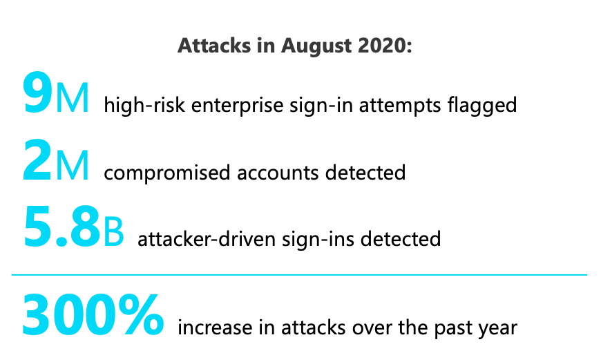
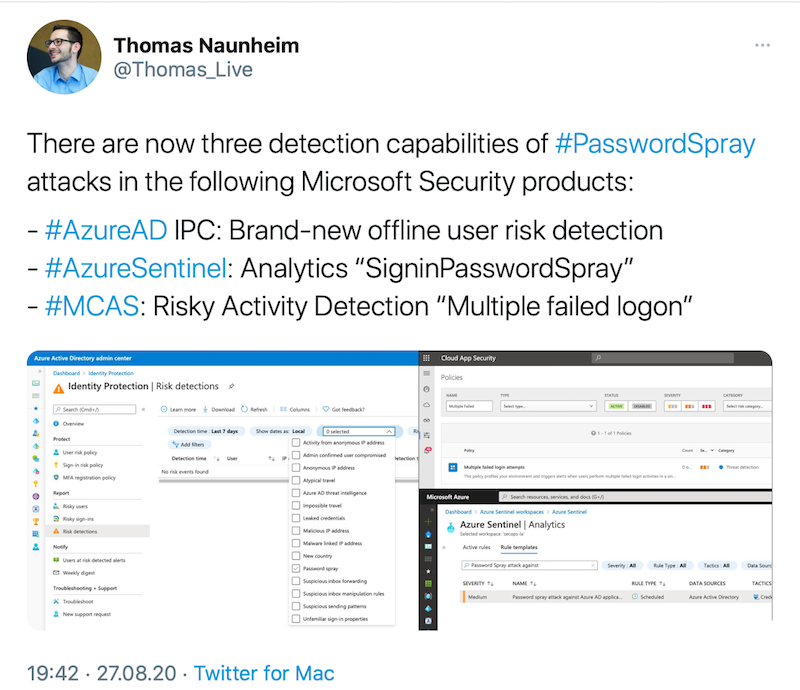
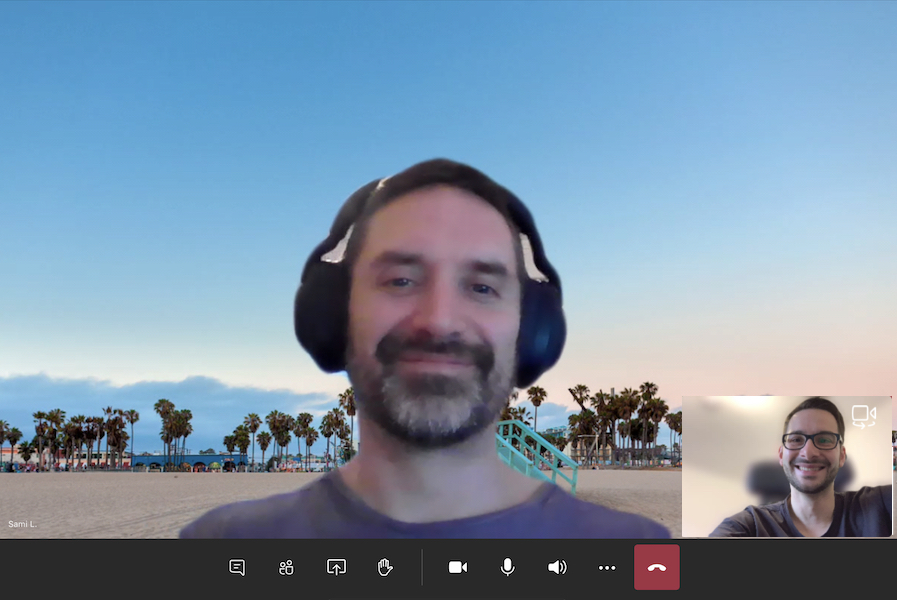

*In the recent weeks, I've worked together with Sami Lamppu on the first section of a playbook about common attack and defense scenarios in Azure AD.
In this article I would like to talk about the motivation, objective of the document and invite everyone from the community to participate in this project.*

## Current assault on Azure AD

There's no doubt... protection of identities is an essential part of the security architecture and strategy today. Over the years, transformation to the cloud and modernizing IT environments has led some companies to rethink about the existing security perimeter and move from traditional network to identity-driven / zero trust approach. The world-wide situation of the COVID-19 pandemic has enforced many organizations to enable employees working from home. On the other side, many attackers are trying to exploit the situation and riding attacks on infrastructure environments with weak protection or implementation gaps as a result of short-term implementation.

*Microsoft shared current statistics on identity theft attacks at this years' Ignite conference.
One of the key message: There are over 80 million identity attacks every single day with 98 percent precision.
An attacker group used a combination of tactics (including password spray) with activity attempted logins against 33,141 different tenants. Password Spray attacks are still popular and increased 230% in 2020.*

*Sources: [“The science behind Azure Active Directory Identity Protection”](https://myignite.microsoft.com/sessions/2c1d5ca9-3e73-4107-af81-02ea5bb8d734), [Microsoft Digital Defense Report](https://www.microsoft.com/en-us/security/business/security-intelligence-report), [Identity and Access Announcements from Ignite 2020](https://insights.perspicuity.co.uk/identity-and-access-announcements-from-ignite-2020)*

This shows, that Azure AD identities are in the centre of current cybersecurity attacks.

## Defense and protection of identities

Microsoft offers various security products and integrated solutions to protect identities and access. Many detailed documentations and recommendations concerning mitigation and configuration are already published on Microsoft Docs. At first glance, it can be a challenge to get an overview of the security portfolio and how those are linked or centrally manageable.

In the past, I attempted to give an practically view of the security features in my blog posts or talks at meetups. I've also tried to show insights from researches, share considerations and notes from the field. Therefore, I've spent many hours in my personal test lab which includes simulation of attack scenarios or trigger protection features. Sometimes those researches ended with surprisingly or unexpectedly results (for me).  

I've tried to use opportunities for mutual exchange of hands-on experience which also helps to get feedback on research work.
I had the pleasure to meet other members of the community who are also interested in identity security and discuss jointly results of research and experiences. Early last year, the idea of creating a detailed documentation on common attack and defense scenarios in Azure AD (as a community-driven project) came up.

## First chapter: "Password Spray Attack"

Microsoft has announced a new detection for "Password Spray Attacks" in August 20220. I was surprised to see that three detections are available in Microsoft's security products concerning this specific attack methods. Therefore, I thought it would be interesting to understand the differentiation, purpose of use or interaction of those detection methods.

A few weeks later, I had a call with [Sami Lamppu](https://twitter.com/samilamppu), who [published many blog posts](https://samilamppu.com/) with detailed insights of MCAS and Identity Protection. We were of the opinion that we need to trigger some (simulated) attacks to identify the various existing detections and protection features under near real-world conditions.
Therefore we decided to work together on this attack scenario and publish the results as part of an attack/defense playbook.

Back then, it seemed a good and easy start to choose "Password Spray Attacks" as first attack scenario for this documentation.
On the one hand, this attack method is widely used and responsible for more than a third of account compromise in organizations (according to Microsoft's statistics). On the other hands, various detection and signals are already integrated in Microsoft's security services and technical background is duly documented.

We've started our research work and divided them in four category:

- Attack (simulation)
- Detection (signals or rules and auto-remediation)
- Mitigation (defense measures)
- Side notes

We were a little surprised how many details or conditions needs to be considered (such as type of authentication method, license option, OAuth flow and API endpoints during attacks) and in some cases we have faced with unexpected results.

Nevertheless, the jointly research work was really a lot of fun! Once again, it has been shown that exchange or discussion of opinions and results from the lab are extremely valuable.

*Regular video calls and joint editing of documents in Microsoft Teams has enabled us to work on this project.*

## Community-driven project

The results from our first use case are available from the following GitHub repository:

[https://github.com/Cloud-Architekt/AzureAD-Attack-Defense](https://github.com/Cloud-Architekt/AzureAD-Attack-Defense)

We've decided to publish the document as "markdown" in GitHub to allow a common use and contributions from others.

We would be very pleased if other community members are also interested in research of further attack/defense scenarios in Azure AD and join us to work on this playbook.

Everyone is invited to contribute in various ways:

- **Update or new content (Pull Request):** As already mentioned, we like to have a living document which is driven by the Azure AD community! Share your results and insights as part of the project! Send a pull request to add your content to this project.
- **Issues/Outdated content:** Protection features or tools changes continually. Update the out-dated content (as part of pull request) or create an issue to point out
- **Reviewer:** We also look for experts who want to review or discuss the existing or new content before publishing!
- **Feedback:** Feel free to suggest attack/defense scenarios that could be interesting for the community. We will add them to the backlog and idea collection!

The current content is just a beginning, we hope this project will also grow by others that participate in this initiative.

Hopefully, everyone will have as much fun, valuable insights and discussions as Sami and I had during our work on "Password Spray" attacks.

 
Original cover image by [Tumisu / Pixabay](https://pixabay.com/photos/safety-encryption-ssl-world-2890768/)
