*Over the past 3 months, I spoke at community events and set my focus on research work. Unfortunately, there was no time left for blogging. But I'm planning to share the results of the recent community work also on my blog. Therefore I like to start with an overview and recap of my community contributions in the first quarter of 2021.*

## "Attack and Defense of Azure AD" Playbook

### "Illicit Consent Grant" Attack

At the beginning of the year, I've worked with [Sami Lamppu](https://samilamppu.com) and [Joosua Santasalo](https://securecloud.blog) on the [next chapter of the "Azure AD Attack and Defense" Playbook](https://twitter.com/thomas_live/status/1357615442995642369?s=21).

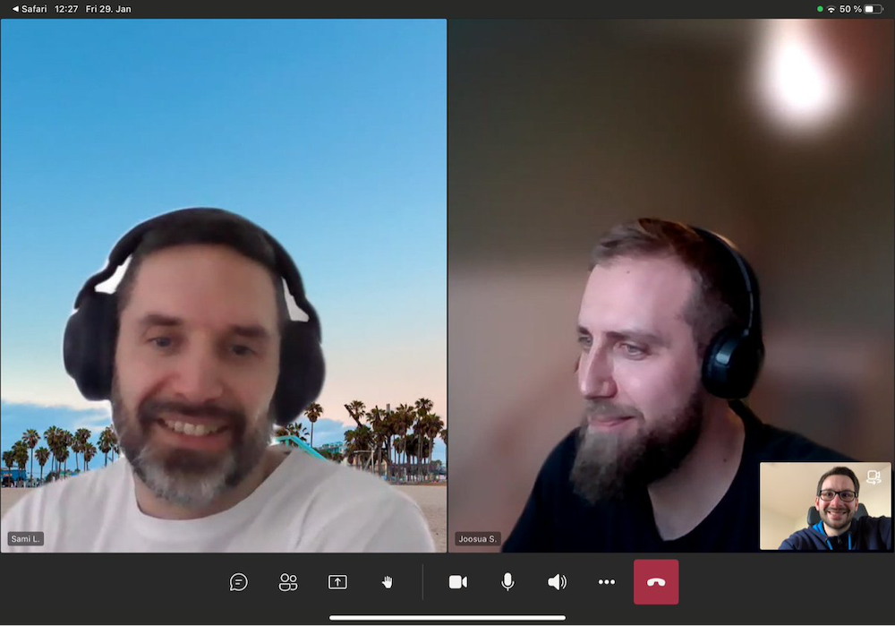

The result of our research work includes an overview of this attack technique, details on detection and mitigation.

Like last time, it was a great pleasure and fun to work on this project with Joosua and Sami.
I can only recommend to read and participate in this community-driven project.

I'm already looking forward to our next joint research of an identity attack and defense scenario.

➡ GitHub Project "[AzureAD-Attack-Defense/ConsentGrant](https://github.com/Cloud-Architekt/AzureAD-Attack-Defense/blob/main/ConsentGrant.md)"

### Identity Security Monitoring

A extensive and detailed blog post about "Identity Security Monitoring" was published on this blog at end of last year. Recently I've updated the content and publish the article as part of the "Attack and Defense" playbook. Many changes and updates, especially in aspects of the integration between Azure Sentinel and Microsoft 365 Defender, was released and announced by Microsoft in the last months. Therefore it seems to be a very "dynamic" content which doesn't fits to a blog post. I hope to keep the content constantly updated as part of the playbook project. Feedback and contributions are always welcome!

➡ GitHub Project "[AzureAD-Attack-Defense/IdentitySecurityMonitoring](https://github.com/Cloud-Architekt/AzureAD-Attack-Defense/blob/main/IdentitySecurityMonitoring.md)"

## Privileged Identity and Access in Microsoft Azure

I hold my first session as speaker in 2021 at the “Global Security & Compliance Community Conference”. Privileged IAM in Azure is one of my favorite session topics. 

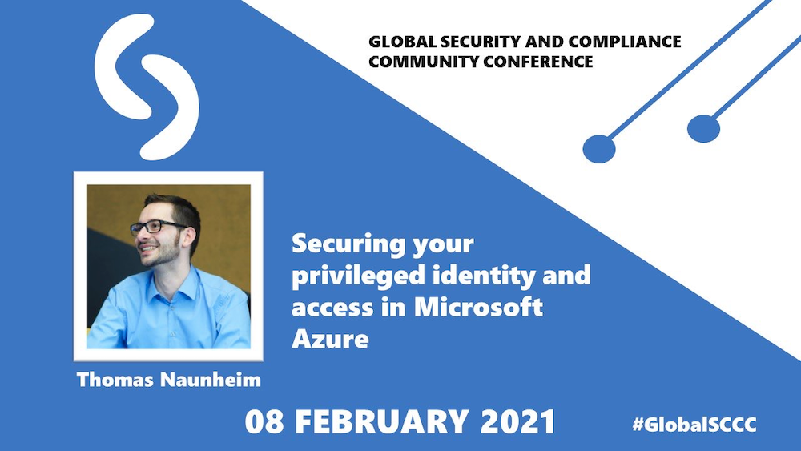

In preparation of my talk, I've invested many hours in implementing a practical "interpretation" and "adoption" of the brand-new "Enterprise Access Model" in combination with the existing "Enterprise-Scale Architecture" in my lab environment.

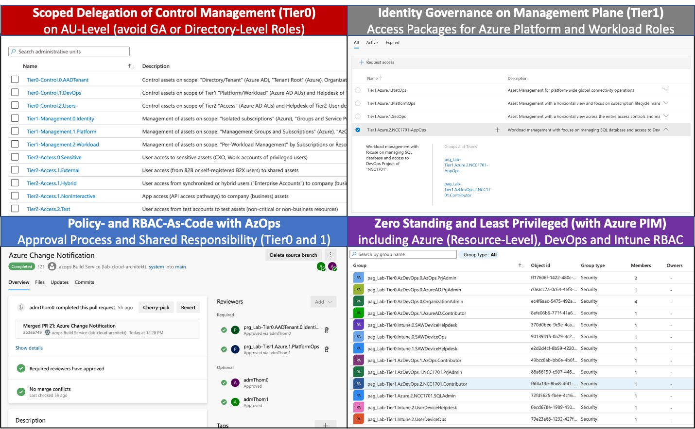

I have collected many experiences in automation, isolation/separation of duties but also identity governance which have been showed and discussed in my live demos and session.

➡ Slides: ["Securing Your Privileged Identity & Access in Microsoft Azure" (@Global SCCC)](https://github.com/Cloud-Architekt/meetups/blob/master/2021-02-08%20GCC%20Securing-Privileged-Identity-and-Access.pdf)

### Enterprise-Scale and AzOps

I had the great pleasure of holding a workshop together with [Gregor Reimling](https://www.reimling.eu) at "[Azure Saturday Hamburg](https://www.eventleaf.com/azuresaturdayhamburg)". Gregor has shared his experiences and practices around the subjects of Azure's Cloud Adoption Framework (CAF) and Policy-Driven Governance. 

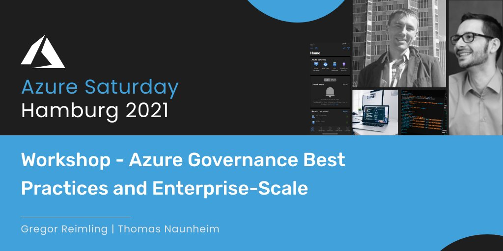

In the second part of the workshop, I've talked about "Enterprise-Scale" reference implementations and manage configuration of this environments at scale.

Considerations in security of AzOps pipelines and privileged access delegation was also covered during my live demos. For me one of the most exciting topic is operationalization of Azure Policies and RBAC "as Code".

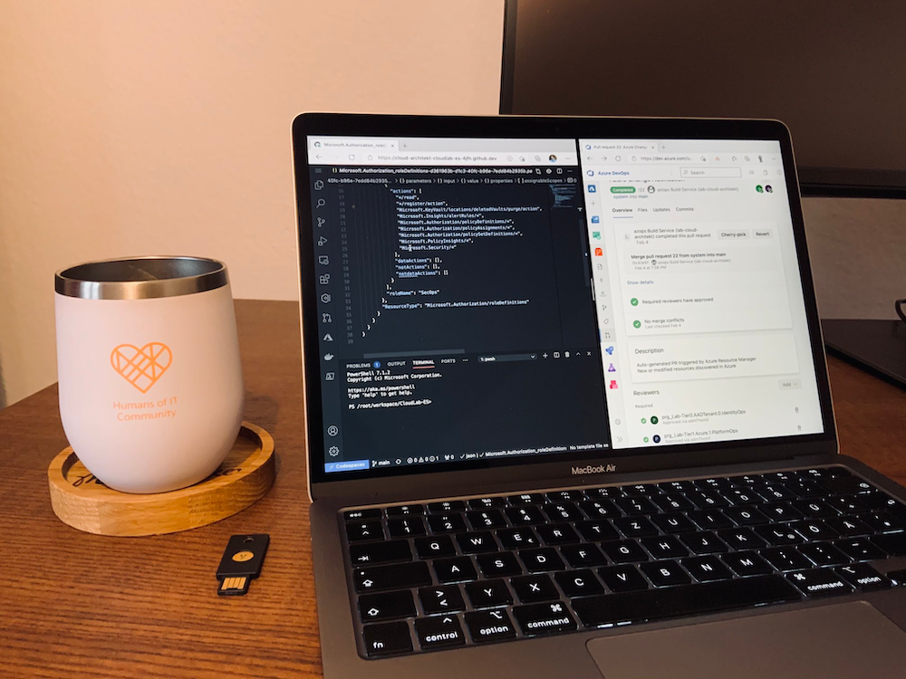

GitHub and Azure DevOps can be chosen to host repository or run pipelines.
So I decided to show both solutions which was helpful for comparison as well.

➡ Slides: [Azure Governance - Best Practices (@Azure Saturday Hamburg)](https://github.com/GregorReimling/Conferences/blob/master/2102%20Azure%20Saturday%20HH%20-%20Azure%20Gov%20Best%20Practices.pdf)

### Design and Operations of Azure AD B2C

In late February, the [Virtual Scottish Summit](https://scottishsummit.com) has taken place as online-only event with many parallel tracks in different languages. The sessions were streamed live and recorded for later on-demand streaming on the [YouTube Channel](https://www.youtube.com/channel/UCaF2SdamxFf6rc0q7UPombQ).

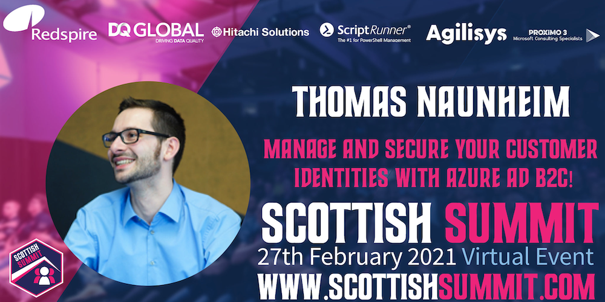

My session about "Azure AD B2C" was part of the "German" track.
In this talk I've tried to give a comprehensive but also overall view on Microsoft's CIAM solution.

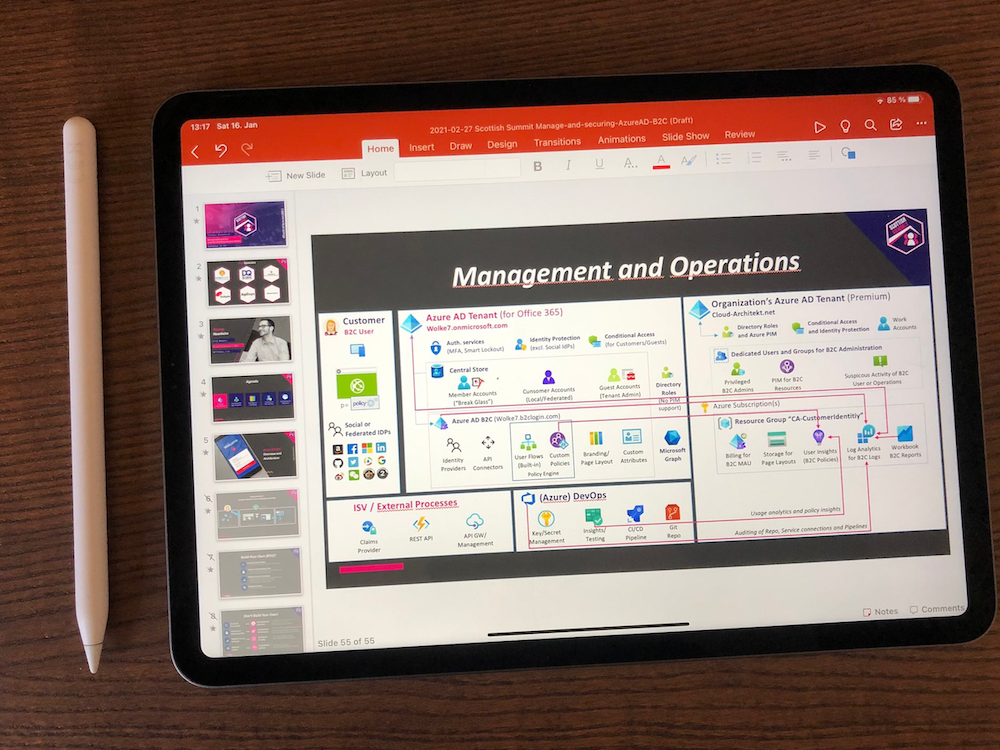

For this reason, I drew architecture overviews to explain the implementation, relations and dependencies. Operational aspects in monitoring and securing B2C resources was covered in the "hands on" part of this session. 

➡ Recording of my [Azure AD B2C session (in German) on YouTube](https://www.youtube.com/watch?v=1S8BQ6d5OjE)

➡ Slides: [Manage and Secure Your Customer Identities with Azure AD B2C (@Scottish Summit)](https://github.com/Cloud-Architekt/meetups/blob/master/2021-02-27%20Scottish%20Summit%20Manage-and-securing-AzureAD-B2C.pdf)

### Securing your apps with Conditional Access

Deep Dive on "Conditional Access" in Azure AD within a 90 Minute?
This was a nice challenge and great opportunity to share my experiences from the field about "Conditional Access Policies" with the local [Azure Meetup in Duesseldorf](https://www.meetup.com/de-DE/Azure-Dusseldorf-Meetup/).  

But this was a good occasion to work on a prototype to demonstrate the capabilities in automation and operationalization of Azure AD with Microsoft Graph, PowerShell and Azure DevOps. There have already been many great community-driven solutions such as M365DSC or PowerShell scripts by Daniel Chronlund. It was my aim to show a simple implementation and a declared focus on benefits by using "DevOps approach" for identity security-critical configuration items. 

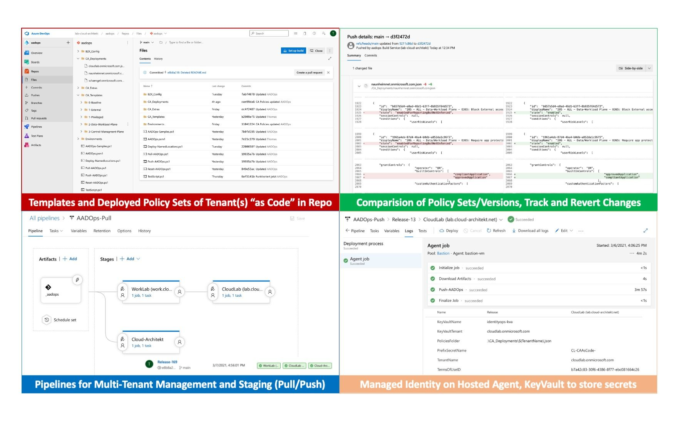

➡ Slides: [Securing Your Apps with Azure AD Conditional Access (@Azure Meetup Duesseldorf)](https://github.com/Cloud-Architekt/meetups/blob/master/2021-03-15%20AzDUS%20-%20Securing-Your-Apps-Identities-with-AzureAD-CA.pdf)

## Guest at GeekSprech Podcast

After the Ignite conference I had been invited to be guest at the German "GeekSprech" Podcast. It was a great fun to discuss with Alex, Eric and Gregor the latest Azure announcements from Microsoft's spring conference.

Check out the episode of the Podcast and subscribe "Geeksprech" if you are a German-speaking Azure Geek...

➡ [Geeksprech Podcast "Folge 56 – Ignite Recap und die schwarze Katze"](https://geeksprech.de/geeksprech-podcast-folge-56-ignite-recap-und-die-schwarze-katze/)

## Securing and Monitoring of Azure AD

It was a great pleasure to speak at the [first quarterly (virtual) edition of the Cloud Camp](https://cloudcamp.ie).
All proceeds was donated to [pieta](https://www.pieta.ie). A really great event with many interesting questions from the audience, great hosts and sessions from MVPs.

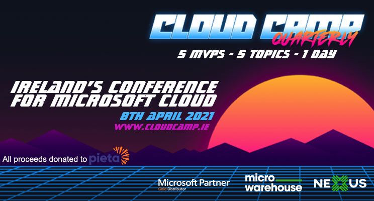

I talked about "[Securing and Monitoring of Azure AD identities](https://github.com/Cloud-Architekt/meetups/blob/master/2021-04-08%20CloudCamp%20Q1%20-%20Securing-and-Monitoring-Your-Identities-with-AzureAD.pdf)" in a 60-minute session.
Many live demos included about "Password-less On-Boarding", "Hybrid authentication with FIDO2", "Conditional Access Considerations" and Hunting of identity threats with "Azure Sentinel". Especially the preparations of this demos were very time-consuming but also an instructive work.  

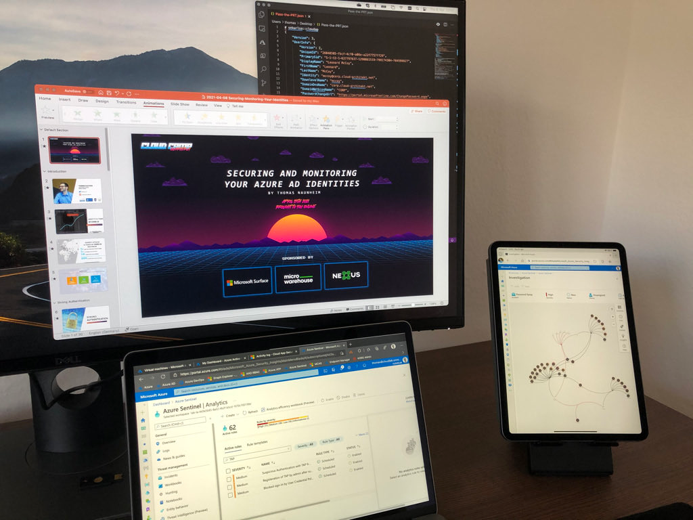

It was great for me to see also some research outcome from this session preparation.
I wrote a custom analytic rules to detect [suspicious activity around the new "Temporary Access Pass"](https://github.com/Cloud-Architekt/AzureSentinel/tree/master/AAD-TemporaryAccessPass) feature. The simulation of identity attacks gave me some further insights in detection mechanism and potential considerations of the security services.

➡ Slides: [Securing and Monitoring of your Azure AD Identities (@CloudCamp Quarterly Q1/21)](https://www.cloud-architekt.net/speaking)
➡ GitHub: [Analytic Rules of "Temporary Access Pass"](https://github.com/Cloud-Architekt/AzureSentinel/tree/master/AAD-TemporaryAccessPass)

## What's next?

Only few days up to the start of the **Global Azure** weekend.
I'm very happy to be part of the [Global Azure NEWS](https://www.meetup.com/de-DE/Azure-Bonn-Meetup/events/277018445/) (North East West South) Germany event.
I will give a talk (in German) about "Azure AD Identity Security" with the latest features from Ignite (Fall 2020/Spring 2021).

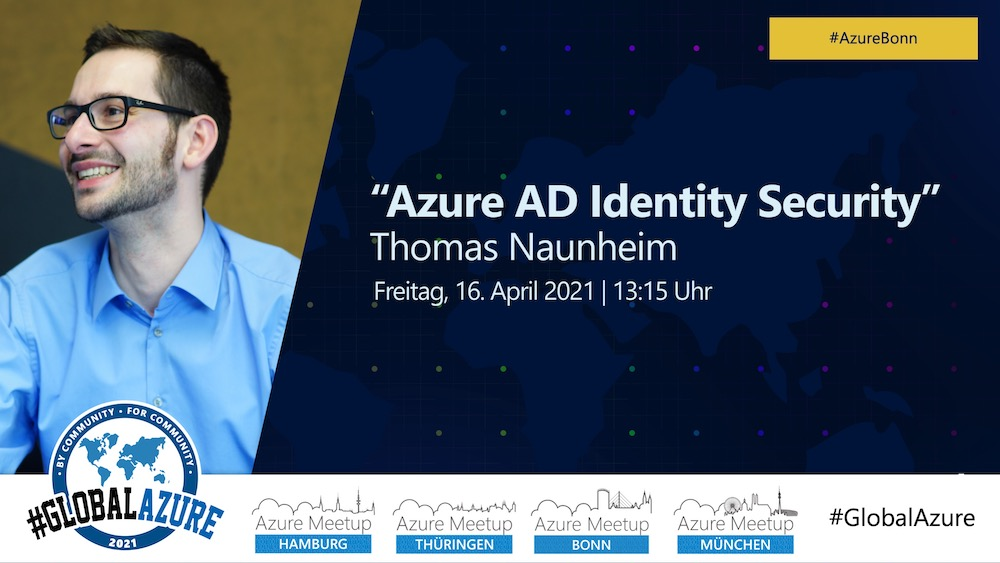

As I already mentioned, I will try to **spend more time on blogging** for the next months.
There are many results from my research work that I really like to share with the Azure Community in my blog posts.

Nevertheless, I'm always looking for opportunities to talk about Azure Security and Azure AD at **meetups or conferences**. So If you are hosting community events I would be excited to support your event as a speaker. Don't hesitate to contact me.

I'm already looking forward to the next events of "**Azure Meetup Bonn**".

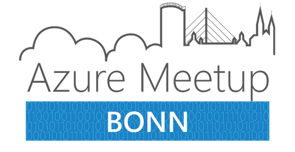

Join our [Meetup Group](https://www.meetup.com/de-DE/Azure-Bonn-Meetup/)! Very interesting topics and events are planned for the next months.
Stay tuned!

 
Original cover image by [kreatikar / Pixabay](https://pixabay.com/illustrations/woman-desk-computer-office-5439837/)
