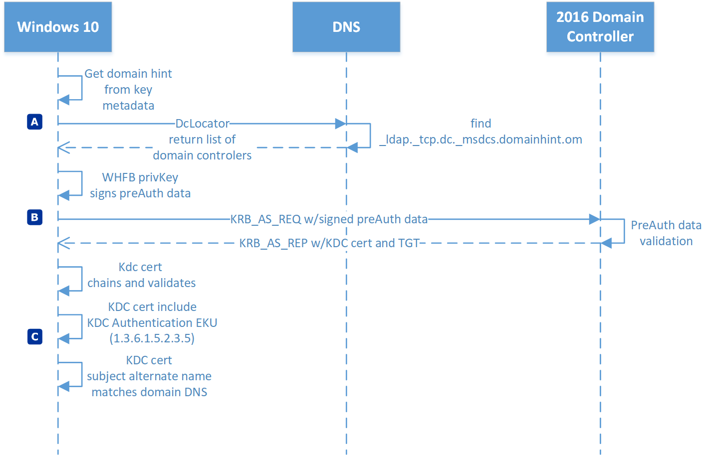
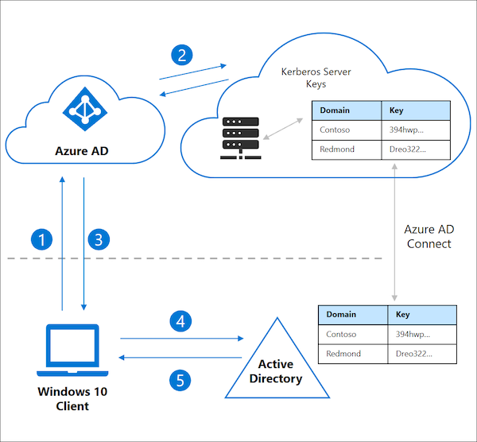
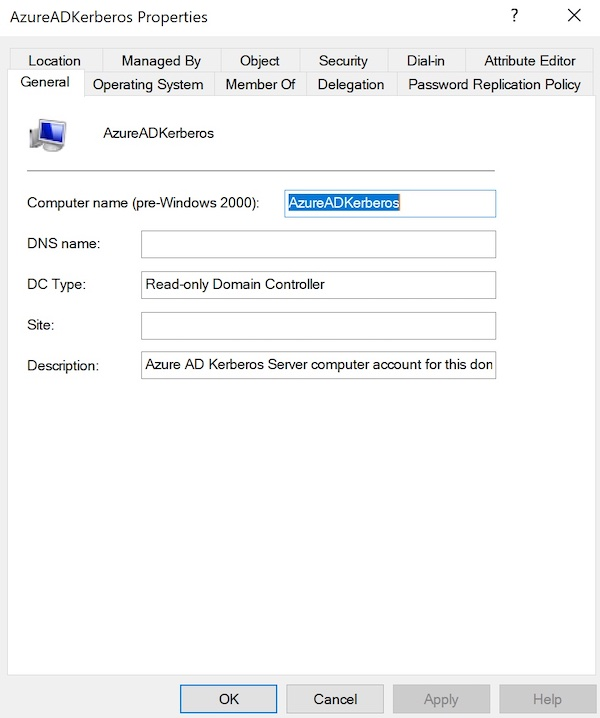
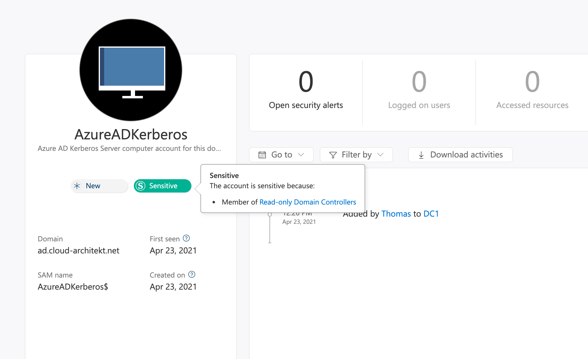
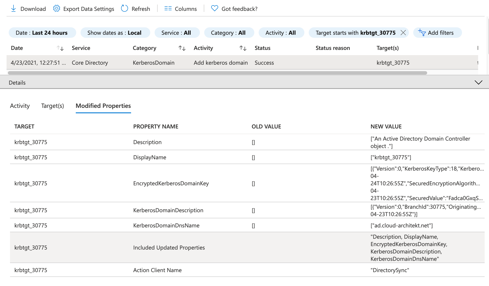
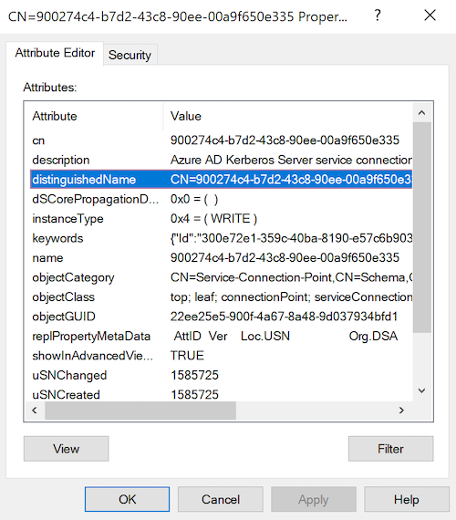
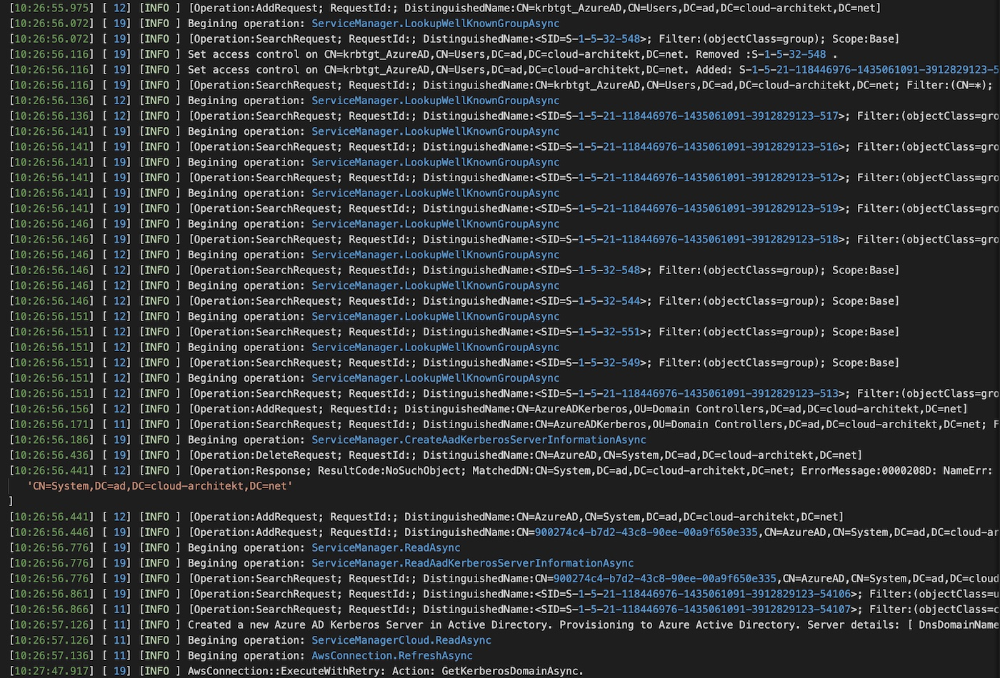
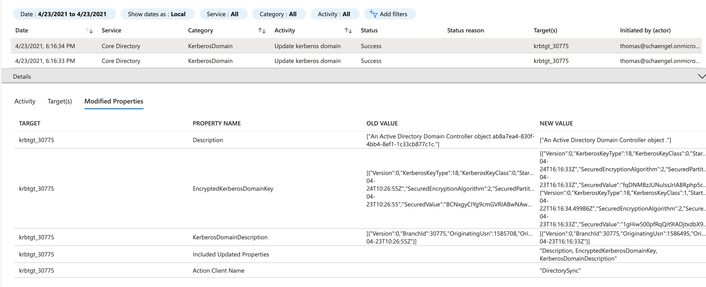
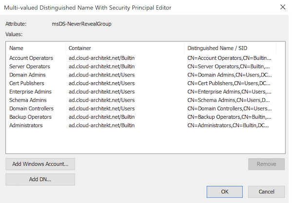
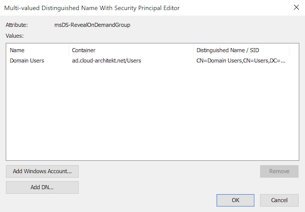

_Microsoft has announced the GA of FIDO2 support in Azure AD at Ignite Spring 2021. Previously, passwordless authentication in hybrid environments was only possible by implementing Windows Hello for Business (WHfB). The first of a two part blog post, gives you an overview about FIDO2 security keys in hybrid environments and differences to WHfB. This covers the prerequisites, limitations and initial configuration and deep-dive on the “Azure AD Kerberos Server” objects…_

#### Table of Content:
- <A href="#passwordless-options-in-azure-ad">Passwordless Options in Azure AD</A><br>
     - <A href="#authentication-of-hybrid-identities-with-whfb">Authentication of Hybrid Identities with WHfB</A><br>
     - <A href="#comparing-fido2-and-whfb-in-hybrid-environments">Comparing FIDO2 and WHfB in Hybrid Environments</A><br>
- <A href="#overview-of-fido2-support-in-hybrid-azure-ad-environments">Overview of FIDO2 support in hybrid Azure AD environments</A><br>
- <A href="#pre-requisites-and-initial-configuration">Pre-requisites and initial configuration</A><br>
     - <A href="#windows-10-clients">Windows 10 Clients</A><br>
     - <A href="#azure-ad-and-intune-configuration">Azure AD and Intune Configuration</A><br>
     - <A href="#hybrid-identity-components-and-active-directory">Hybrid Identity components and Active Directory</A><br>
- <A href="#review-of-created-azure-ad-kerberos-server-objects">Review of created “Azure AD Kerberos Server” Objects</A><br>
- <A href="#management-of-azure-ad-kerberos-objects">Management of “Azure AD Kerberos” Objects</A><br>
- <A href="#security-policy-to-restrict-azure-ad-kerberos-server">Security Policy to restrict "Azure AD Kerberos Server"</A><br>


## Passwordless Options in Azure AD
Azure AD supports three different passwordless options today:

- [Windows Hello for Business](https://docs.microsoft.com/en-us/azure/active-directory/authentication/concept-authentication-passwordless?WT.mc_id=AZ-MVP-5003945#windows-hello-for-business) (WHfB)
- [Microsoft Authenticator App](https://docs.microsoft.com/en-us/azure/active-directory/authentication/concept-authentication-passwordless?WT.mc_id=AZ-MVP-5003945#microsoft-authenticator-app)
- [FIDO2 Security Keys](https://docs.microsoft.com/en-us/azure/active-directory/authentication/concept-authentication-passwordless?WT.mc_id=AZ-MVP-5003945#fido2-security-keys)

[Microsoft’s deployment plan](https://docs.microsoft.com/en-us/azure/active-directory/authentication/howto-authentication-passwordless-deployment?WT.mc_id=AZ-MVP-5003945#passwordless-authentication-scenarios) includes a good overview of the authentication methods and their benefits or differences in user scenarios. 

In general, FIDO2 security key has (in my opinion) strong advantages in use cases where shared machines, high privileged identities, non-TPM hardware or non-Windows clients are included.

Governance policy that requires (physically) separated authenticator from the endpoint device can also be a good reason to choose security keys.
_Note: Windows 10 supports “[Multi-factor Unlock](https://docs.microsoft.com/en-us/windows/security/identity-protection/hello-for-business/feature-multifactor-unlock?WT.mc_id=AZ-MVP-5003945)” which allows to extend WHfB by another trusted signals (such as Trusted Signal via Bluetooth)._

A detailed comparison can be found in the Microsoft Docs article “[Choose a passwordless method](https://docs.microsoft.com/en-us/azure/active-directory/authentication/concept-authentication-passwordless?WT.mc_id=AZ-MVP-5003945#choose-a-passwordless-method)”. It's important to analyze and consider your compliance requirements, technical conditions of the environment and different personas (user groups). This should be one your initial tasks to plan and decide the suitable way on your passwordless journey.

### Authentication of Hybrid Identities with WHfB
In the past, some organizations has decided to implement Hybrid Azure AD-joined devices to enable modern authentication (Azure AD) but also allow single sign-on (SSO) to on-premises resources (Active Directory) .

However, it is also possible to provide a [SSO experience with an Azure AD-joined device](https://docs.microsoft.com/en-us/azure/active-directory/devices/azuread-join-sso?WT.mc_id=AZ-MVP-5003945). Windows Hello for Business (WHfB) can be used to get a “Primary Refresh Token” (PRT) from Azure AD and a “Ticket Granting Ticket” (TGT) from Active Directory Domain Services (AD DS).

Two deployment options are available to implement WHfB in a hybrid environment. The decision to use [Key](https://docs.microsoft.com/en-us/windows/security/identity-protection/hello-for-business/hello-hybrid-aadj-sso-base?WT.mc_id=AZ-MVP-5003945) or [Certificate Trust](https://docs.microsoft.com/en-us/windows/security/identity-protection/hello-for-business/hello-hybrid-aadj-sso-cert?WT.mc_id=AZ-MVP-5003945) deployment depends on pre-requisites and the [strategy or supported scenarios](https://docs.microsoft.com/en-us/windows/security/identity-protection/hello-for-business/hello-planning-guide?WT.mc_id=AZ-MVP-5003945#trust-types).

Regardless of the trust model, [Kerberos Authentication certificate for Domain Controllers](https://docs.microsoft.com/en-us/windows/security/identity-protection/hello-for-business/hello-hybrid-aadj-sso-base?WT.mc_id=AZ-MVP-5003945#windows-server-2016-domain-controllers) are required and thus the need of a “Public Key Infrastructure” (PKI). Azure AD Connect is involved for [synchronizing the public key to Active Directory](https://docs.microsoft.com/en-us/windows/security/identity-protection/hello-for-business/hello-hybrid-cert-whfb-settings-dir-sync?WT.mc_id=AZ-MVP-5003945) The value of the attribute “msDS-KeyCredentialLink”) will be created during the registration process of the key trust model.


*Source: ["How Windows Hello for Business works - Authentication" (Microsoft Docs)](https://docs.microsoft.com/en-us/windows/security/identity-protection/hello-for-business/hello-how-it-works-authentication?WT.mc_id=AZ-MVP-5003945#azure-ad-join-authentication-to-active-directory-using-a-key)*

Azure AD-joined devices allows SSO experiences to Azure AD and Active Directory in hybrid deployment models of WHfB. Both trust models of WHfB are relaying on valid and trusted KDC certificates.*

### Comparing FIDO2 and WHfB in Hybrid Environments
There are some important differences in implementation expense, operational effort and supported use cases from my current point of view:

* **Complexity (deployment and support):** FIDO2 as passwordless option simplifies the deployment without having to use certificates or a dependency on PKI. Common issues of Hybrid WHfB deployments are not relevant such as:
	* Invalid or inaccessible Certificate Revocation List (CRL)
	* Missing or invalid certificates for “KDC Authentication” on Active Directory Domain Controllers
	* Misconfiguration of Enterprise CA / PKI
* **Flexibility in shared desktop scenarios:** WHfB keys are stored locally on the TPM chip of the device, a user would need to enroll their account on each device. Security keys are intended for use on shared or various devices. Credentials are stored on the keys and not on the local device/TPM. 
* **Dependency on AAD Synchronization**: Provisioning process of WHfB needs to be written back as “key credential link” to the AD. Synchronization may take up to 30 minutes and SSO to on-premises doesn’t until the sync has been completed.
* **Some [scenarios are not supported for FIDO2 security keys](https://docs.microsoft.com/en-us/azure/active-directory/authentication/howto-authentication-passwordless-security-key-on-premises?WT.mc_id=AZ-MVP-5003945#unsupported-scenarios)**
	This includes explicit authentication on Remote Desktops (RDP) or “Run as”. Verify the full list of [unsupported scenarios to sign-in with FIDO2 keys](https://docs.microsoft.com/en-us/azure/active-directory/authentication/howto-authentication-passwordless-security-key-windows#unsupported-scenarios).
    * **[Remote Desktop and WHfB](https://docs.microsoft.com/en-us/windows/security/identity-protection/hello-for-business/hello-feature-remote-desktop?WT.mc_id=AZ-MVP-5003945) is supported** in certain scenarios. Certificate trust deployment of WHfB is able to emulate a smart card for application compatibility. Therefore it can be take advantage of the the integrated smart card capabilities in the Remote Desktop Protocol (RDP). Key trust model can only be used in combination of the “[Windows Defender Remote Credential Guard](https://docs.microsoft.com/en-us/windows/security/identity-protection/remote-credential-guard?WT.mc_id=AZ-MVP-5003945)”.


## Overview of FIDO2 support in hybrid Azure AD environments
Before we go into the details to implement FIDO2 security keys for hybrid authentication, I like to start with an high-level view.

Microsoft Docs describes the [SSO proceeding of FIDO2 keys to on-premises resources](https://docs.microsoft.com/en-us/azure/active-directory/authentication/howto-authentication-passwordless-security-key-on-premises?WT.mc_id=AZ-MVP-5003945) as follows:



> 1. User signs in to their Windows 10 device with a FIDO2 security key and authenticates to Azure AD.  
> 2. Azure AD checks the directory for a Kerberos server key matching the user’s on-premises AD domain.  
> a) Azure AD generates a Kerberos TGT for the user’s on-premises AD domain. The TGT only includes the user’s SID. No authorization data is included in the TGT.  
> 3. The TGT is returned to the client along with their Azure AD Primary Refresh Token (PRT).  
> 4. The client machine contacts an on-premises AD domain controller and trades the partial TGT for a fully formed TGT.  
> 5. The client machine now has an Azure AD PRT and a full Active Directory TGT and can access both cloud and on-premises resources.

_Source: ["Enable passwordless security key sign-in to on-premises resources with Azure Active Directory" (Microsoft Docs)](https://docs.microsoft.com/en-us/azure/active-directory/authentication/howto-authentication-passwordless-security-key-on-premises?WT.mc_id=AZ-MVP-5003945)_

The question(s) I ask myself is how the “Kerberos Server Keys” interacts with Active Directory? Where we can see the request to get a “fully formed TGT” Active Directory (in aspects of security monitoring). Another fundamental questions arises: What options are available to allow an easy onboarding and establish a secure connectivity using the new passwordless authentication method.

In the following section, I will set the focus of my (test) deployment scenario with synchronized hybrid identities (Password Hash Sync, no ADFS/federation) and Azure AD-joined devices with Windows 10 (managed by Intune).

## Pre-requisites and initial configuration

#### Windows 10 Clients
First of all, follow the checklist to verify that your client meets the requirements for our use case:
* Compatible FIDO2 security key:
	Microsoft established [partnerships with various FIDO2 key vendors](https://techcommunity.microsoft.com/t5/Azure-Active-Directory-Identity/Microsoft-passwordless-partnership-leads-to-innovation-and-great/ba-p/566493?WT.mc_id=AZ-MVP-5003945) and also offers a [list of known providers](https://docs.microsoft.com/en-us/azure/active-directory/authentication/concept-authentication-passwordless?WT.mc_id=AZ-MVP-5003945#fido2-security-key-providers). 
* Verify that your endpoint devices are running a latest version of Windows 10 (at minimum version 2004). The clients must be able to establish a [connectivity to Azure AD](https://docs.microsoft.com/en-us/azure/active-directory/authentication/howto-authentication-passwordless-faqs?WT.mc_id=AZ-MVP-5003945#what-are-the-specific-end-points-that-are-required-to-be-open-to-azure-ad) for registration and authentication.
* Make sure you are using a supported browser in combination of the device type (USB/NFC/BLE). [Browser support of FIDO2](https://docs.microsoft.com/en-us/azure/active-directory/authentication/fido2-compatibility?WT.mc_id=AZ-MVP-5003945) is documented on Microsoft Docs.
* Configure P2S VPN to establish a connectivity to your local “Active Directory Domain Controllers” and on-premises resources. In my example I’ve used a native Azure VPN solution for P2S connection. This allows me also to use [Azure AD authentication and include MFA and Conditional Access Policies](https://docs.microsoft.com/en-us/azure/vpn-gateway/openvpn-azure-ad-mfa?WT.mc_id=AZ-MVP-5003945). This is a perfect combination which offers an integration of the included identity and security services. Dishan Francis has written a great blog to implemented [Azure AD Authentication for P2S connectivity](https://www.rebeladmin.com/2020/04/step-step-guide-azure-ad-authentication-azure-point-site-p2s-vpn-powershell-guide/). 
    	
    _Note: Internet connectivity is required to enable and register the security keys. Connectivity must be ensured, especially for the initial user sign-ins (using FIDO2 security keys). Cached logon information should allows local sign-ins by using cached credentials. Nevertheless, a consistent experience requires connectivity to Azure AD and AD Domain Controllers_

#### Azure AD and Intune Configuration
* [Enable FIDO2 security key method](https://docs.microsoft.com/en-us/azure/active-directory/authentication/howto-authentication-passwordless-security-key?WT.mc_id=AZ-MVP-5003945#enable-fido2-security-key-method) in your Azure AD Tenant for all or a certain group of user. 
* 	Optional: Configure FIDO2 security key restriction to allow only specific types of hardware. FIDO2 standard specifies that an “Authenticator Attestation GUID” (AAGUID) must be provided. Mostly, you’ll find a list of the AAGUID on vendor’s product pages ([Example: YubiKey](https://support.yubico.com/hc/en-us/articles/360016648959-YubiKey-Hardware-FIDO2-AAGUIDs)). Check out the blog post about “[Configure FIDO2 security key restrictions](https://www.petervanderwoude.nl/post/configure-fido2-security-key-restrictions/)”  (by Peter van der Woude) if you are interested to learn more. 
* 	Enable “[Temporary Access Pass](https://docs.microsoft.com/en-us/azure/active-directory/authentication/howto-authentication-temporary-access-pass?WT.mc_id=AZ-MVP-5003945)” (TAP) to onboard users securely without (traditional) “password”. Consider to configure the policies on your security requirements (e.g. on-time use, lifetime) and restrict the target group (e.g. onboarding group). [I highly recommended that management activities and creation of TAPs will be monitored](https://twitter.com/thomas_live/status/1374991898553819139?s=21). 
* Turn on FIDO2 security keys for Windows sign-in as part of Credential Provider by [Intune Device Configuration](https://docs.microsoft.com/en-us/azure/active-directory/authentication/howto-authentication-passwordless-security-key-windows?WT.mc_id=AZ-MVP-5003945#enable-with-intune). 
* Enable “[Web Sign-in](https://docs.microsoft.com/en-us/windows/client-management/mdm/policy-csp-authentication?WT.mc_id=AZ-MVP-5003945#authentication-enablewebsignin)” for initial authentication by using (one-time) TAP. Windows logon UI doesn't support natively to sign-in with TAP as (initial) user password. During my tests, I've used "Web Sign-in” as workaround for initial onboarding of security keys on the user's device. 

#### Hybrid Identity components and Active Directory
* [Requirements and steps to configure “Azure AD Kerberos Server](https://docs.microsoft.com/en-us/azure/active-directory/authentication/howto-authentication-passwordless-security-key-on-premises?WT.mc_id=AZ-MVP-5003945#requirements)” has been well documented by Microsoft. Follow the steps to create the “[Kerberos server object](https://docs.microsoft.com/en-us/azure/active-directory/authentication/howto-authentication-passwordless-security-key-on-premises#create-kerberos-server-object?WT.mc_id=AZ-MVP-5003945)” and run the “Set-AzureADKerberosServer" cmdlet.
	* Keep in mind, latest version of Azure AD Connect is needed to use the “AzureADKerberos” PowerShell module for further configuration and management. Although, the sync engine isn’t required or part of the process to establish or provide FIDO2’s SSO functionality to on-premises resources.

## Review of created “Azure AD Kerberos Server” Objects
We can found the following objects, which represents the “Azure AD Kerberos Server” in the AD domain, after running the cmdlet.

### "CN=AzureADKerberos,OU=Domain Controllers,<domain-DN>"
This object represent a “Computer” object and “looks like” a “Read-Only Domain Controller” (RODC). 



Microsoft Defender for Identity (MDI) has been tagged the “Computer Object” as “Sensitive” because of the “Read-only DC” security membership:



### "CN=krbtgt_AzureAD,CN=Users,<domain-DN>"
Similar to regular deployments of RODC, the “Azure AD Kerberos Server” creates a separated “krbtgt” user object (SAMAccountName: krbtgt_<Number>). This user account will be used to sign and encrypt all Kerberos tickets. Microsoft’s seems to follow the same approach (as for RODC) to ensure a cryptographic security isolation between Azure AD’s Kerberos Sever Keys and On-Premises Domain Controllers. 
    
This object will be also published to “Azure AD” as part of the “Set-AzureADKerberosServer” cmdlet and will be created in context of the user credentials (provided value in the “Cloud Credentials” parameter). You’ll find the event in the “Azure AD Audit Logs” (Category: “KerberosDomain”):
    

    
_Note: The krbtgt_<Number> account seems not be visible in the Azure AD as user or any other type of object._

### "CN=900274c4-b7d2-43c8-90ee-00a9f650e335,CN=AzureAD,CN=System,<domain-DN>"
This object stores metadata as “Service-Connection-Point” to establish a relation of all related “Azure AD Kerberos Server” objects. Attribute “keywords” includes the following values:
* **Id**: GUID (unknown and undocumented value?)
* **UserAccountSid**:
SID of “CN=krbtgt_AzureAD,CN=Users,<domain-DN>”
* **ComputerAccountSid**:
SID of “CN=AzureADKerberos,OU=Domain Controllers,<domain-DN>”



## Management of “Azure AD Kerberos” Objects
The PowerShell Module “AzureADKerberos” can be also used to view details of the objects in Azure AD and Active Directory. Another use case of this module is the rotation of the encryption keys on both sides of your hybrid identity environment.

### List objects by using Get-AzureADKerberos
The “Azure AD Kerberos Server” PowerShell module includes also a cmdlet to get an overview of all objects and relevant attributes:

```
Id                 : 30775
UserAccount        : CN=krbtgt_AzureAD,CN=Users,DC=ad,DC=cloud-architekt,DC=net
ComputerAccount    : CN=AzureADKerberos,OU=Domain Controllers,DC=ad,DC=cloud-architekt,DC=net
DisplayName        : krbtgt_30775
DomainDnsName      : ad.cloud-architekt.net
KeyVersion         : 1585708
KeyUpdatedOn       : 4/23/2021 10:26:55 AM
KeyUpdatedFrom     : dc1.ad.cloud-architekt.net
CloudDisplayName   : krbtgt_30775
CloudDomainDnsName : ad.cloud-architekt.net
CloudId            : 30775
CloudKeyVersion    : 1585708
CloudKeyUpdatedOn  : 4/23/2021 10:26:55 AM
```

Description of the properties are listed in the [Microsoft Docs article](https://docs.microsoft.com/en-us/azure/active-directory/authentication/howto-authentication-passwordless-troubleshoot?WT.mc_id=AZ-MVP-5003945#viewing-the-azure-ad-kerberos-server-objects).

### Logs of AzureADKerberos PowerShell Module

Detailed operational logs of executing the cmdlets are stored in the Azure AD Connect Trace logs: “C:\ProgramData\AADConnect\trace-*.log”



### Rotation of Azure AD Kerberos encryption key
You should consider to rotate the password of the “krbtgt_AzureAD” on a regular basis. Key rotation is strongly recommended for all “krbtgt” accounts and the [AzureADSSOAcc](https://docs.microsoft.com/en-us/azure/active-directory/hybrid/how-to-connect-sso-faq) (in case you have deployed the “Seamless SSO” feature) 

Important note from [Microsoft Docs](https://docs.microsoft.com/en-us/azure/active-directory/authentication/howto-authentication-passwordless-security-key-on-premises#rotating-the-azure-ad-kerberos-server-key) about procedure and tools to rotate the key:
> Although there are other tools to rotate the krbtgt keys, you must  [use the PowerShell cmdlets to rotate the krbtgt keys](https://docs.microsoft.com/en-us/azure/active-directory/authentication/howto-authentication-passwordless-security-key-on-premises?WT.mc_id=AZ-MVP-5003945#rotating-the-azure-ad-kerberos-server-key)  of your Azure AD Kerberos Server. This method makes sure that the keys are updated in both the on-premises AD DS environment and in Azure AD.  

Therefore you should using the “Set-AzureADKerberosServer” alongside of the parameter “RotateServerKey” cmdlet. After successful completion, check the key versions as a result of running the “Get-AzureADKerberosServer” cmdlet:

```
Id                 : 30775
UserAccount        : CN=krbtgt_AzureAD,CN=Users,DC=ad,DC=cloud-architekt,DC=net
ComputerAccount    : CN=AzureADKerberos,OU=Domain Controllers,DC=ad,DC=cloud-architekt,DC=net
DisplayName        : krbtgt_30775
DomainDnsName      : ad.cloud-architekt.net
KeyVersion         : 1586495
KeyUpdatedOn       : 4/23/2021 4:16:33 PM
KeyUpdatedFrom     : dc1.ad.cloud-architekt.net
CloudDisplayName   : krbtgt_30775
CloudDomainDnsName : ad.cloud-architekt.net
CloudId            : 30775
CloudKeyVersion    : 1586495
CloudKeyUpdatedOn  : 4/23/2021 4:16:33 PM
```

The key versions of Active Directory (KeyVersion) and Azure AD (CloudKeyVersion) should be identical.
Check the logs of Azure AD connect for any troubleshooting or detailed review of the rollover process.

Azure AD Audit logs will shows two activities for this key rollover process:


## Security Policy to restrict "Azure AD Kerberos Server"
The FAQ of [“Hybrid FIDO2 security keys” in Microsoft Docs](https://docs.microsoft.com/en-us/azure/active-directory/authentication/howto-authentication-passwordless-faqs?WT.mc_id=AZ-MVP-5003945#fido2-security-key-sign-in-isnt-working-for-my-domain-admin-or-other-high-privilege-accounts-why) describes a “security policy” that disallow grant permission to high privilege accounts.

Let’s have a closer look on the following two properties of the “Azure AD Kerberos” Computer object (CN=AzureADKerberos,OU=Domain Controllers,<domain-DN):

**msDS-NeverRevealGroup**
This [property is used for RODCs](https://docs.microsoft.com/en-us/windows/win32/adschema/a-msds-neverrevealgroup?WT.mc_id=AZ-MVP-5003945) to manage the sensitive users/groups that should not be replicated to a RODC (“Denied replication”).
By default, Microsoft blocks high privileged accounts to use “FIDO2 security keys” to get access for on-premises resources:



**msDS-RevealOnDemandGroup**
[Another familiar property](https://docs.microsoft.com/en-us/windows/win32/adschema/a-msds-revealondemandgroup?WT.mc_id=AZ-MVP-5003945) which is used to define replication to RODCs.
All domain users are included to allow caching their passwords on RODC.
In this case, the property seems to control which users are allowed to use FIDO2 keys for SSO to on-premises.
No further documentation from Microsoft is available.


<br>

<br>
➡ <A>Part 2: Onboarding, Authentication and Monitoring (available later this week!)</A><br>
<br>
<br>
<br>
<span style="color:silver;font-style:italic;font-size:small">Original cover image by [Jan Alexander / Pixabay](https://pixabay.com/de/illustrations/sicherheit-technologie-4210502/)</span>
