_FIDO2 Security Keys are a passwordless and strong authentication method to sign-in to Windows devices and can be used for single sign-on (SSO) access to cloud and on-premises resources. This second part of my “Hybrid FIDO2” article covers the on-boarding process with “Temporary Access Pass” (TAP), authentication flow, considerations in identity monitoring with Azure Sentinel/M365 Defender and token security._

#### Table of Content:
- <A href="#on-boarding-of-fido2-security-keys">On-Boarding of FIDO2 Security Keys</A><br>
- <A href="#sign-in-on-windows-10-device">Sign-in on Windows 10 device</A><br>
- <A href="#prt-and-partial-tgt-from-azure-ad">PRT and “partial TGT” from Azure AD</A><br>
- <A href="#authentication-to-azure-ad-integrated-apps-and-resources">Authentication to Azure AD-integrated apps and resources</A><br>
     - <A href="#monitoring-of-sign-in-events-to-cloud-resources">Monitoring of sign-in events to cloud resources</A><br>
     - <A href="#attack-scenarios-on-prt">Attack scenarios on PRT</A><br>
- <A href="#vpn-connectivity-to-on-premises-network">VPN connectivity to on-premises network</A><br>
- <A href="#authentication-to-active-directory-and-on-premises-resources">Authentication to Active Directory/on-premises Resources</A><br>
     - <A href="#consideration-of-detections-by-microsoft-defender-for-identity">Consideration of detections by “Microsoft Defender for Identity”</A><br>
     - <A href="#analyzing-the-original-source-of-unresolved-device-names-by-ip-address">Analyzing the original source of unresolved “Device names” by IP address</A><br>
     - <A href="#attack-scenarios-on-kerberos-azure-ad-joined-device">Attack scenarios on Kerberos (Azure AD-joined device)</A><br>

## On-Boarding of FIDO2 Security Keys
In the first part of the blog post, you should have already seen the pre-requisites to enable “Temporary Access Pass” (TAP). In my use case, I’ve limited the creation of TAPs to a "user deployment group" and restrict them as “one-time use”:
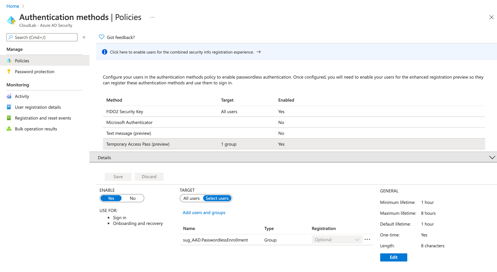

Afterwards, you should be able to [create a TAP for users](https://docs.microsoft.com/en-us/azure/active-directory/authentication/howto-authentication-temporary-access-pass?WT.mc_id=AZ-MVP-5003945#create-a-temporary-access-pass) within this policy as well as [delegated Graph API](https://docs.microsoft.com/en-us/graph/api/temporaryaccesspassauthenticationmethod-post?WT.mc_id=AZ-MVP-5003945&view=graph-rest-beta&tabs=http#permissions) or  “[Azure AD Directory Role](https://docs.microsoft.com/en-us/azure/active-directory/roles/permissions-reference?WT.mc_id=AZ-MVP-5003945#authentication-administrator)” permissions are assigned.

_Important note from the [“Limitations” section of the TAP documentation](https://docs.microsoft.com/en-us/azure/active-directory/authentication/howto-authentication-temporary-access-pass?WT.mc_id=AZ-MVP-5003945#limitations):_
> When using a one-time Temporary Access Pass to register a Passwordless method such as FIDO2 or Phone sign-in, the user must complete the registration within 10 minutes of sign-in with the one-time Temporary Access Pass. This limitation does not apply to a Temporary Access Pass that can be used more than once.  

I’m using the “Web Sign-in” option in Windows 10 to redeem the TAP for the first sign-in. This offers the opportunity to complete the user on-boarding and registration of the FIDO2 security key from the assigned device of the user or any shared device.


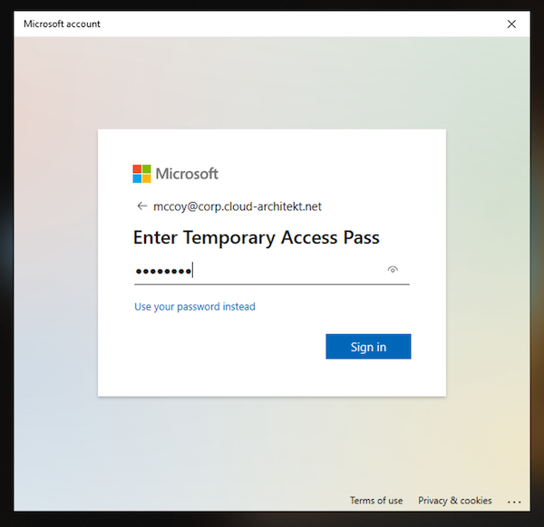

After the initial sign-in you should start with registering your FIDO2 key as your next step.

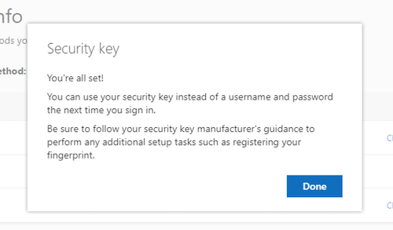

Next, we will check the audit logs and properties of the users…

Azure AD’s sign-in logs shows the initial authentication with “Temporary Access Pass” to the “Microsoft Authentication Broker”:

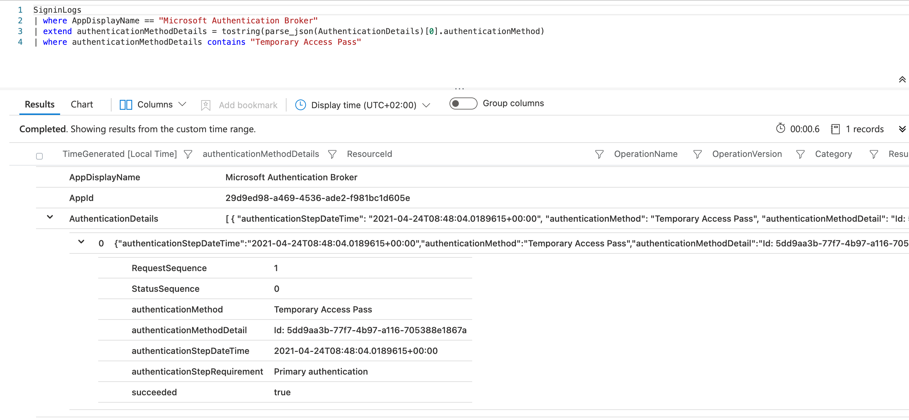

Audit logs of Azure AD gives you an overview about the various steps of the security key registration process:


_Note: As already described by Microsoft and mentioned in this blog post, I’ve seen no activity or changes in "Azure AD Connect" or "Active Directory" during the registration process._

## Sign-in on Windows 10 device 
Now it’s time to sign-in with the provisioned FIDO2 keys on the Windows 10 device. Choose “FIDO security key” in the “Sign-in options” on the login screen. After entering the PIN of the security key, the login should be successful. 


_Note: A list of collected or related data to [troubleshoot FIDO2 key issues on Windows Clients](https://docs.microsoft.com/en-us/azure/active-directory/authentication/howto-authentication-passwordless-troubleshoot?WT.mc_id=AZ-MVP-5003945#troubleshoot) are already documented on Microsoft Docs._

What happens behind the scene?
The [process is described in the Microsoft Docs article](https://docs.microsoft.com/en-us/azure/active-directory/authentication/concept-authentication-passwordless?WT.mc_id=AZ-MVP-5003945#fido2-security-keys) as follows:

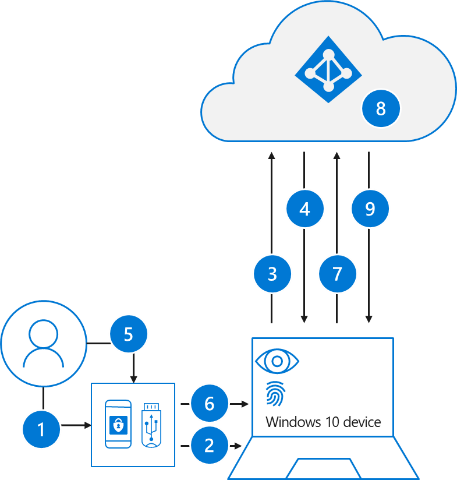  

> 1. The user plugs the FIDO2 security key into their computer.  
> 2.Windows detects the FIDO2 security key.  
> 3. Windows sends an authentication request.  
> 4. Azure AD sends back a nonce.  
> 5. The user completes their gesture to unlock the private key stored in the FIDO2 security key’s secure enclave.  
> 6. The FIDO2 security key signs the nonce with the private key.  
> 7. The primary refresh token (PRT) token request with signed nonce is sent to Azure AD.  
> 8. Azure AD verifies the signed nonce using the FIDO2 public key.  
> 9. Azure AD returns PRT to enable access to on-premises resources.  

But now let us consider what we can see on client- and Azure AD-side in my demo scenario.

## PRT and “partial TGT” from Azure AD
The results of the “dsregcmd /status” command shows you that I’m using a  Azure AD-joined (only) in my scenario:

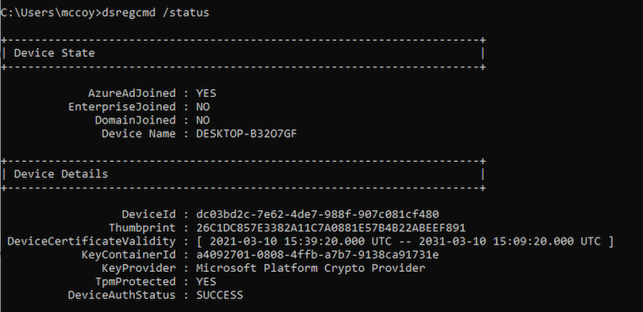

As you can see, Primary Refresh Token (PRT) was issued for SSO to Azure AD after the successful logon. So far, no surprise at all:


The command “klist” is not showing any Kerberos TGT in the cache:

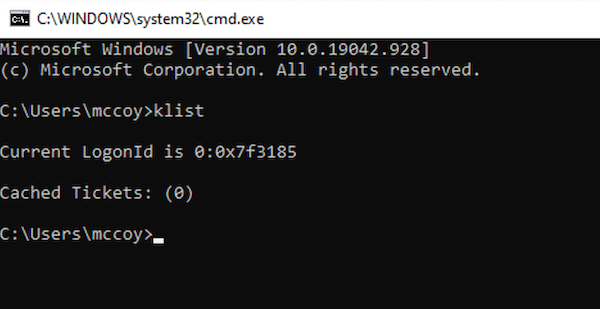

Sign-in logs of Azure AD includes the “Windows Sign-in” event with details of the authentication method:

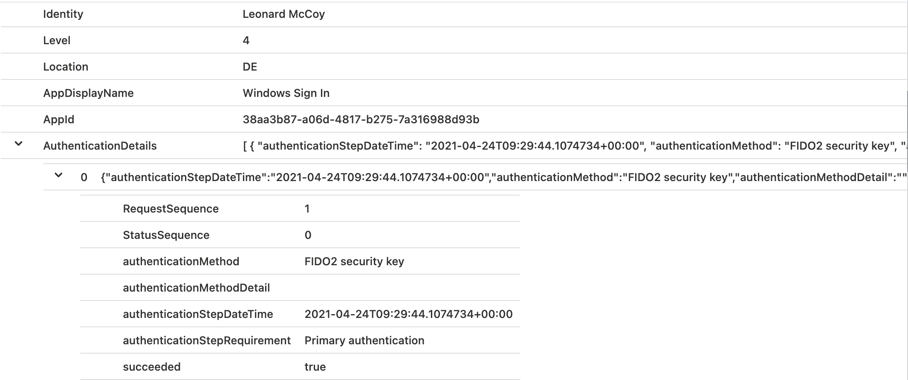

I haven’t seen any other related event in the logs of Azure AD, Azure AD Connect or Active Directory.

Mimikatz allows us to see more details of the token(s) in the “Cloud Authentication Provider” (CloudAP).

Here we can find the “partial TGT” (incl. TgtMessage and TgtClientKey) from Azure AD Kerberos alongside of the PRT:

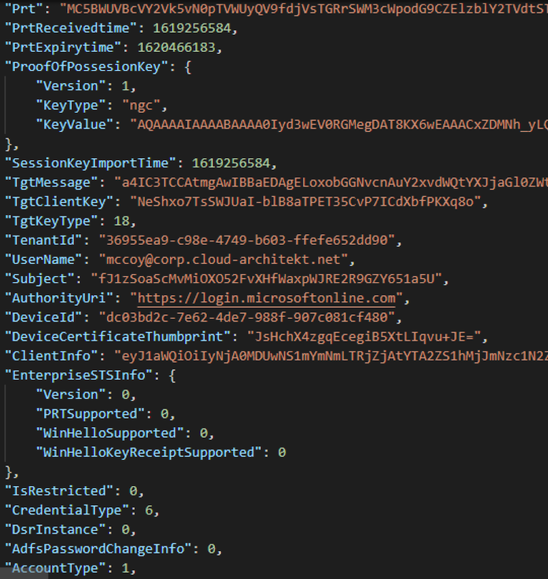

Microsoft describes that the "PRT request" includes a claim that indicates the need of a TGT. In addition, the [process of "PRT response" will be describes in Microsoft Docs](https://docs.microsoft.com/en-us/azure/active-directory/authentication/howto-authentication-passwordless-faqs?WT.mc_id=AZ-MVP-5003945#what-does-the-http-requestresponse-look-like-when-requesting-prt-partial-tgt) as follows:

> The HTTP request is a standard Primary Refresh Token (PRT) request. This PRT request includes a claim indicating a Kerberos Ticket Granting Ticket (TGT) is needed.  
>   
> Azure AD combines the encrypted client key and message buffer into the PRT response as additional properties. The payload is encrypted using the Azure AD Device session key.  

More investigation of the PRT request and response should be possible by capturing the HTTP traffic and analyze them with Fiddler.

Nevertheless, it’s interesting to note that a NTLM hash isn’t available in the LSAAS process on the Windows 10 device and therefore not visible in “LogonPasswords” of Mimikatz:

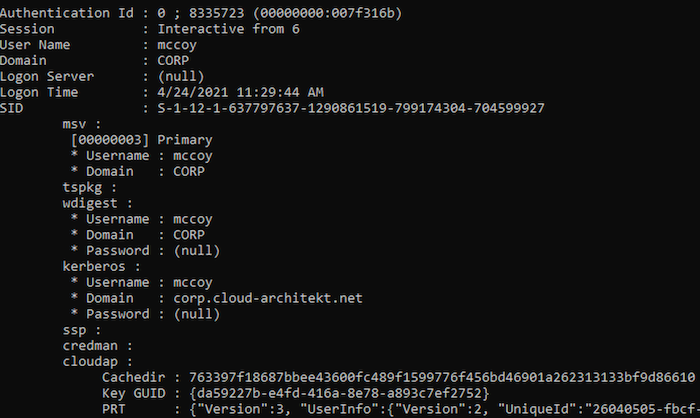


## Authentication to Azure AD-integrated apps and resources
The PRT allows users a "SSO experience" on Azure AD-integrated apps and resources (such as “Microsoft 365” services or any modern authentication app). In the following screenshots from my test lab, we will see a web access to “SharePoint Online” (by using Edge Chromium Browser).

_Note: Consider to use supported browsers and be familiar with the SSO authentication flow using the user’s PRT._

Microsoft Docs article about “[Primary Refresh Tokens](https://docs.microsoft.com/en-us/azure/active-directory/devices/concept-primary-refresh-token?WT.mc_id=AZ-MVP-5003945#browser-sso-using-prt)” explains the Browser SSO process in details:


### Monitoring of sign-in events to cloud resources
All sign-in event entries in the "Azure AD logs" includes details of the used authentication method. In this case, no indicator of using FIDO2 security key is available because of authentication as part of the Browser SSO flow.

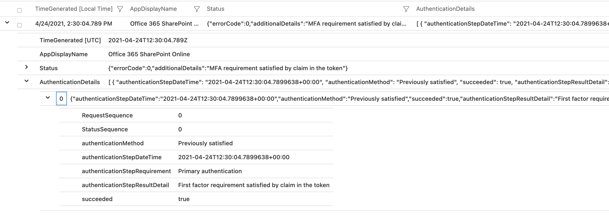

Explicit sign-ins to resources (with a security key) will showing you “FIDO2” as authentication method. This can be easily reproduce by using "InPrivate session" of the browser (Browser SSO flow will not working):


_Note: AuthenticationMethods will only be shown in the “raw” Azure AD Sign-in logs. M365D Advanced Hunting logs are not including this information yet._

### Attack scenarios on PRT
Implementing FIDO2 as secure authentication method will not protect you from all identity theft scenarios. One example which I like to mention is “Pass-the-PRT”. Dirk-Jan Mollema has published a [very interesting article about this scenario](https://dirkjanm.io/abusing-azure-ad-sso-with-the-primary-refresh-token/) which is strongly recommended to read. Another great blog post about this scenarios was written by Dr. Nestori Syynimaa: [Getting user’s access with “Pass-the-Token” and “Pass-the-Cert”](https://o365blog.com/post/prt/) 

The following actions should be considered (in my opinion) to mitigate the risk of such attack scenarios and protect the PRT:

* Avoid to assign local admin permissions to users
* Create ["Attack Surface Reduction Rules" (ASR)](https://docs.microsoft.com/en-us/microsoft-365/security/defender-endpoint/enable-attack-surface-reduction?WT.mc_id=AZ-MVP-5003945) rules in Microsoft Intune to protect LSAAS process
* Enable ["tamper protection"](https://docs.microsoft.com/en-us/microsoft-365/security/defender-endpoint/prevent-changes-to-security-settings-with-tamper-protection?WT.mc_id=AZ-MVP-5003945#manage-tamper-protection-for-your-organization-using-intune) to protect your client’s security settings (such as threat protection and real-time AV)
* Actively monitor your endpoints to detect malicious credential theft tools (such as Mimikatz) 
	* Evaluate and implement “[Azure Sentinel fusion](https://docs.microsoft.com/en-us/azure/sentinel/fusion#credential-harvesting-new-threat-classification?WT.mc_id=AZ-MVP-5003945)” rules that indicates e.g. that someone used known identity theft tools in combination of a suspicious Azure AD sign-in (Sign-in risk by Identity Protection).
* Implement a process to [revoke refresh tokens](https://docs.microsoft.com/en-us/powershell/module/azuread/revoke-azureaduserallrefreshtoken?WT.mc_id=AZ-MVP-5003945)  (e.g. in case of lost or stolen devices)
* Use TPM chips to meet requirements if additional encryption or security capabilities are available.

## VPN connectivity to on-premises network
As already described in the first part of this blog post, I have configured an "Azure VPN P2S" to establish on-premises connectivity. This allows me easily to demonstrate the integrated support of "Azure AD authentication and" "Conditional Access".

VPN client in Windows 10 is shown the configured Authentication Type “Azure AD”: 

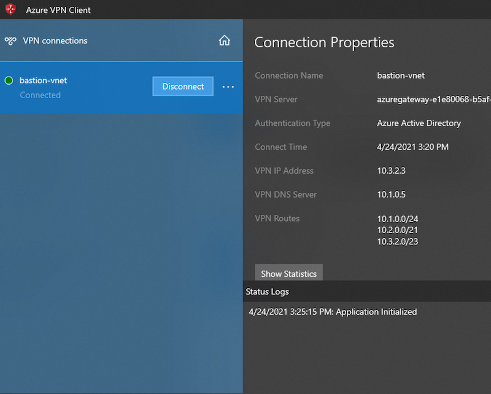

Establishing the VPN connection will be audited in the “Azure Diagnostic logs” of the “VPN Gateway”. It also shows you the received "AAD Token payload" as part of the authentication process:


 
The following command can be used to verify the connectivity and query DNS server for a list of AD domain controllers (DCs) from the client:
```
nltest /dsgetdc:contoso /keylist /kdc
```

## Authentication to Active Directory and On-Premises Resources 
In the final step, we will try to get access of a resource in the on-premises environment. In this case, I will try to access a file share from a member server of the Active Directory domain.

After a successful access attempt, I use the “klist” command to check if a Kerberos Ticket is available on the "Azure AD joined-device". As we can see, TGT of the user and TGS (service ticket) for CIFS (file share) is available in the cache:

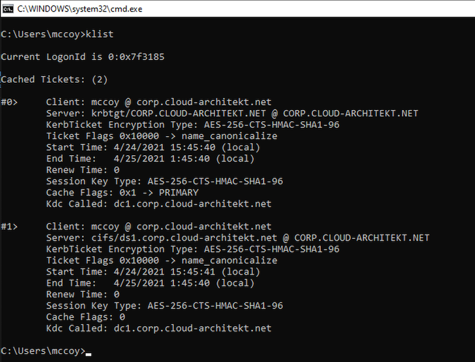

In the next step, the captured network traffic should helps us to see how the client trades the “partial TGT” (issued by Azure AD) for a fully formed TGT (from on-premises AD domain controller).

I can not find any AS-REQ and -REP between Azure AD-joined device and the DCs in the network traces. And I was also not able to detect any “TGT request” (such as EventID 4768) in the audit logs on the domain controllers.
But as you can see, TGS REQ/REP will be captured which shows the process to request the “krbtgt” service ticket from the domain controllers:


Afterwards, TGS for accessing the CFS on the domain member will be requested from the on-premises AD:
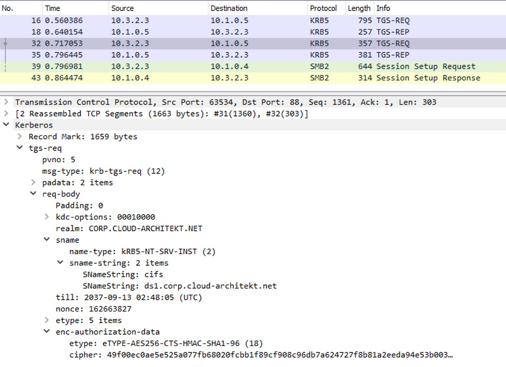


###  Monitoring of sign-in events to Active Directory
Logs of the domain controllers are confirming the described behavior.
Service ticket “krbtgt” was requested by the client:
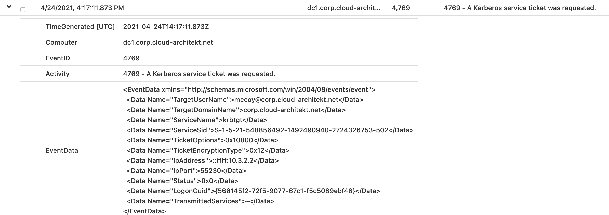

Event data of the audit log entry shows the differences in the TGS-Request of "krbtgt" from a "FIDO2" authenticated user on "Azure AD-joined device" (left) compare to a "password" authenticated user from "Hybrid Joined device" (right):


In the next step, we are looking for the event log of the TGS request which was used to gain access to the file share:
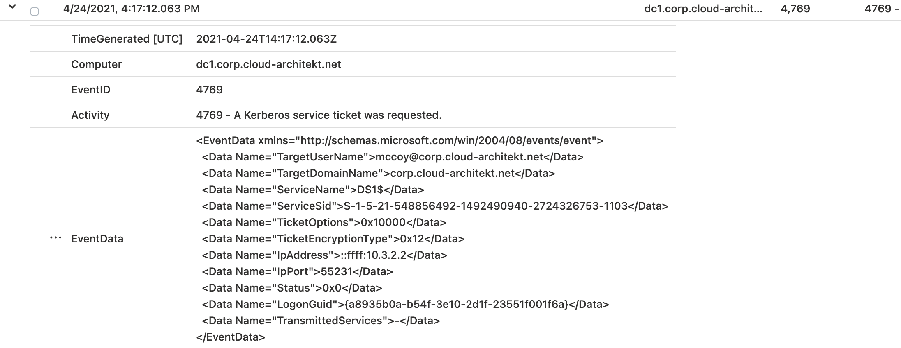

On the first view, there’s no difference in the “Resource Access” event which we can see in the “IdentityLogonEvents” table in Microsoft 365 Defender…

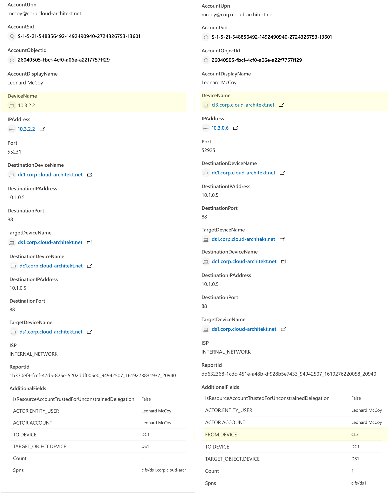

…but on closer inspection it becomes clear that the IP address of AAD-joined device can’t be resolved to the DeviceName.

### Consideration of detections by “Microsoft Defender for Identity”
The question is, therefore, how this affects the detections and recorded activities by “Microsoft Defender for Identity” (MDI).
[Network name resolution](https://docs.microsoft.com/en-us/defender-for-identity/nnr-policy?WT.mc_id=AZ-MVP-5003945) is responsible to build a correlation between all captured raw events  and the entity (Computer).
All methods that will be used to resolve IP address to computer names seems be unable to resolve the Kerberos authentication requests from Azure AD joined device (in my test scenario).

During my research, I’ve seen that the device name can not be retrieved when Kerberos Authentication was used. NTLM authentication will be resolved to the NetBIOS name of the device. The following screenshots shows the “User activity page” from the MDI portal:


Detections of attacks such as “Brute Force” or “Data exfiltration over SMB” can be correlated to the device object in MCAS.
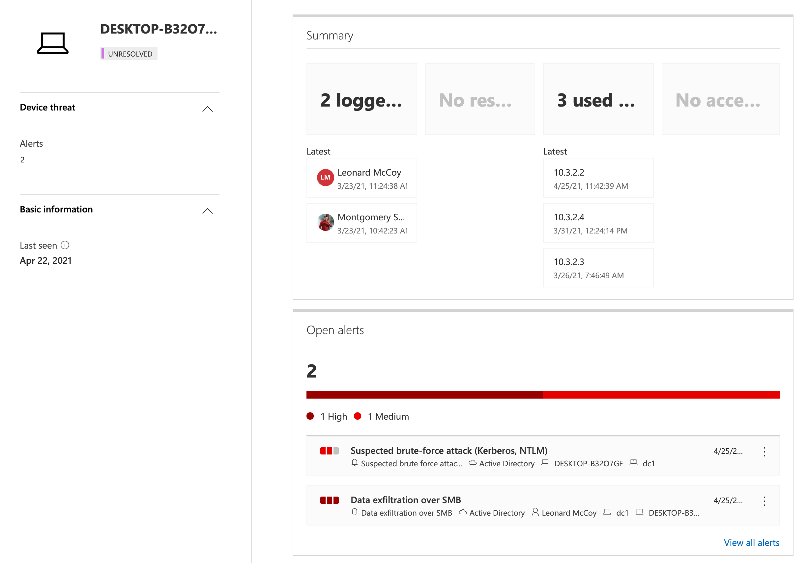

#### Analyzing the original source of unresolved “Device names” by IP address
It may be necessary to build a correlation between the activity event which includes unresolved (VPN) Client IP and the event when the VPN connection was established. This provides you full details and context of the access path for investigation of a suspicious activity or in case of an incident.

A query of the "VPN client"-IP address in the diagnostic logs of the P2S connection allows you to find detailed information. In this case, the “Connection successful” event includes a “message” property with the original “Username” and the related unique “OVPN activity ID”:

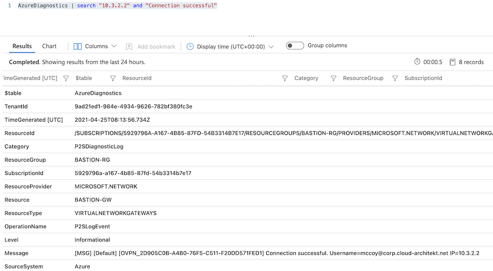

The “unique activity ID” helps us to find the related log entry of the “AAD Token payload event” from this VPN session. I’ve already described this event in the first part of the blog post. As you can see all related information (on-premises SID, Device ID, Public IP address) are part of this Diagnostic log:

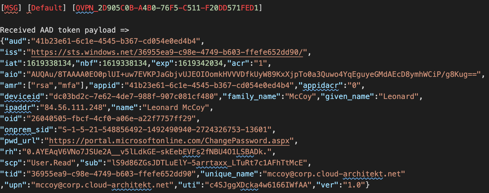

This should enable you to build a correlation between the unresolved (VPN) client IP and the related device/user object in Azure AD.

### Attack scenarios on Kerberos (Azure AD-joined device)
Obviously it's important to protect Kerberos tickets on the Azure AD-joined devices even if it’s a modern managed device and has no (direct) domain membership in Active Directory.

Therefore, restrict and monitor the access to the LSASS process which is one of the actions to avoid credential stealing.

Consider to deploy “[Windows Defender Credential Guard](https://docs.microsoft.com/en-us/windows/security/identity-protection/credential-guard/credential-guard-manage?WT.mc_id=AZ-MVP-5003945)” in combination of “[Hypervisor-protected code integrity](https://techcommunity.microsoft.com/t5/windows-it-pro-blog/comprehensive-protection-for-your-credentials-with-credential/ba-p/765314?WT.mc_id=AZ-MVP-5003945)” (HVCI).

As already described, strictly avoid the delegation of local admin permissions or create manage local “Administrator” accounts without unique/rotating passwords.
Mitigation actions from the “Pass-the-PRT scenario” should be also part of your defense to prevent most kinds of credential attacks on the client.

Active monitoring of your Active Directory environments is always important in “hybrid identity” scenarios and therefore also essential if you are using FIDO2 for on-premises access. As we already seen, “Microsoft Defender for Identity” should be used to detect suspicious activity (even from clients without “traditional” domain membership).

Otherwise, attackers will be able to gain on-premises access by using “Pass-the-Ticket” attacks or other offensive techniques on the Azure AD-joined device. As you can see in the following screenshot from mimikatz:

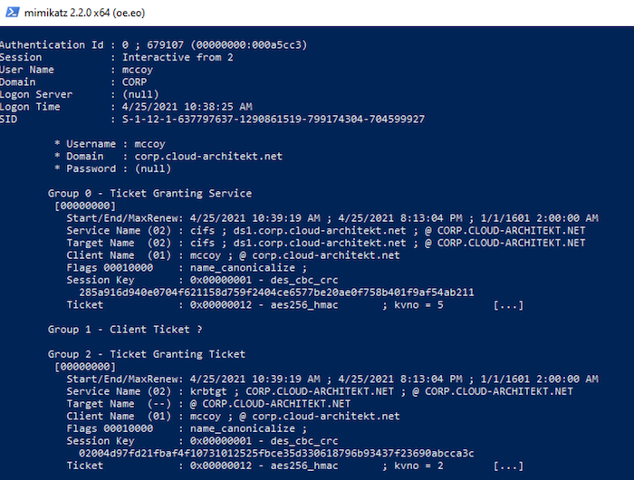

And finally, rotation of all “krbtgt” keys in your Active Directory domain should be part of your operational (security) tasks. This should also include the "krbtgt_AzureAD" <A href="https://www.cloud-architekt.net/hybrid-fido2-keys-part1#management-of-azure-ad-kerberos-objects">as described in the first part of this article.</A>
<br>
<br>
<br>
<span style="color:silver;font-style:italic;font-size:small">Original cover image by [cottonbro / Pexels](https://www.pexels.com/photo/hands-on-a-laptop-keyboard-5474285/)</span>