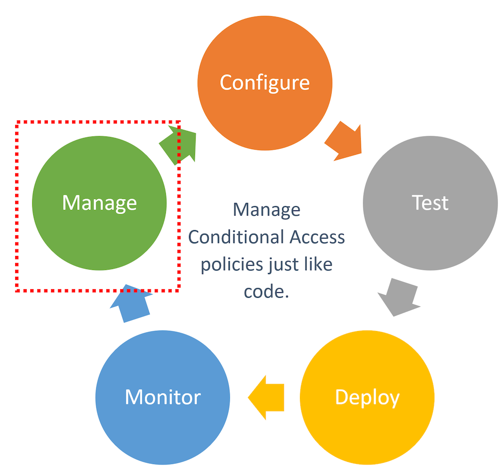
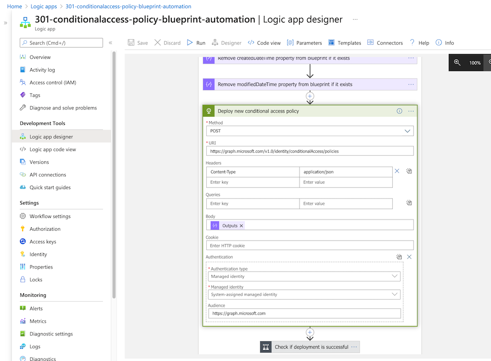
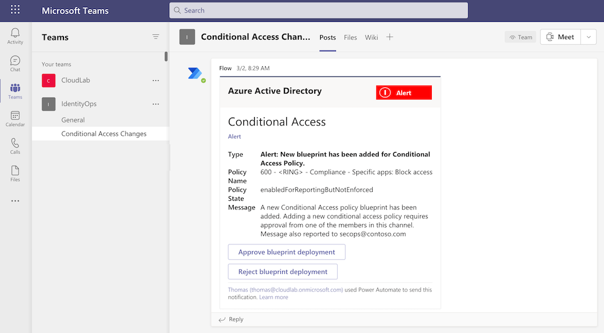
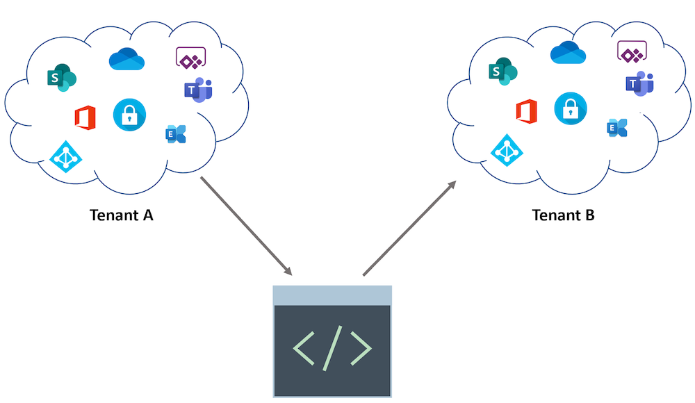
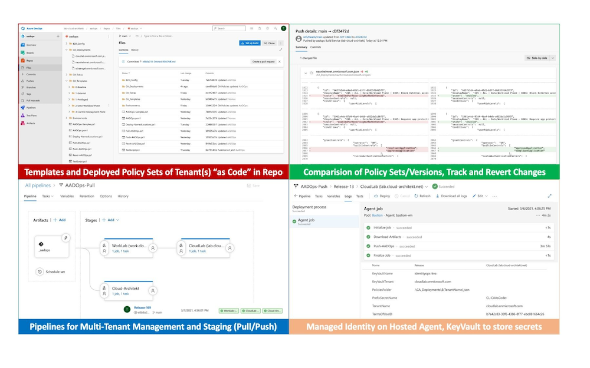
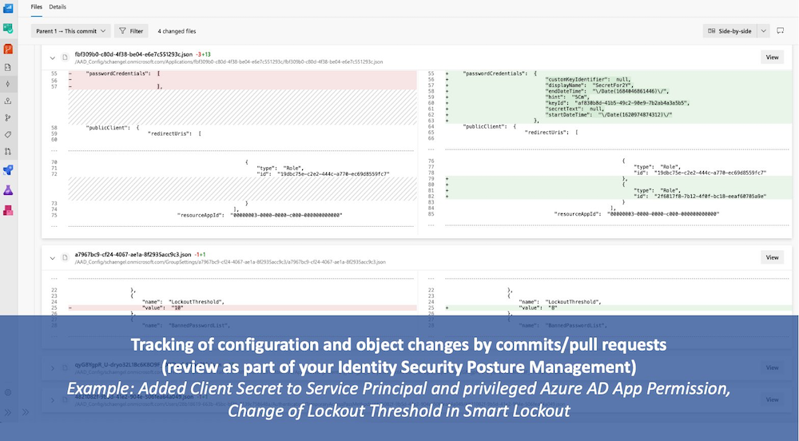
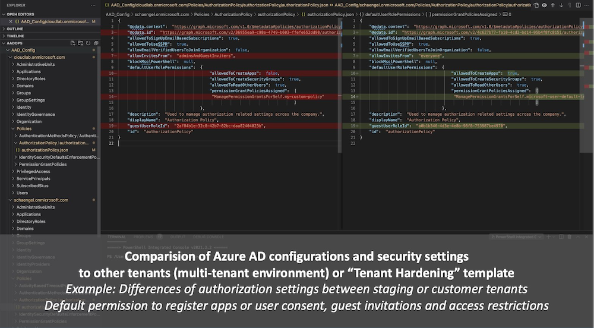

_Cloud Managed Service Providers and many other organizations are mostly interested to manage their environment(s) "as code" which enables advanced automation and scaling options.
For some time, improvements in programmatic access and community-driven projects for automation in Azure AD has been published. Therefore I want to give an overview about benefits and existing solutions to automate management of Conditional Access Policies._

#### Table of Content:
- [Benefits of using DevOps approach in Azure AD](#benefits-of-using-devops-approach-in-azure-ad)
- [Solutions to manage Conditional Access As Code](#solutions-to-manage-conditional-access-as-code)
  - [Logic App and OneDrive (Microsoft Ignite Sample)](#logic-app-and-onedrive-microsoft-ignite-sample)
  - [PowerShell Desired State Configuration (M365DSC)](#powershell-desired-state-configuration-m365dsc)
  - [PowerShell modules and scripts](#powershell-modules-and-scripts)
    - [Azure AD PowerShell Module / Microsoft Graph SDK](#azure-ad-powershell-module--microsoft-graph-sdk)
    - [DCToolbox and PowerShell Scripts by Daniel Chronlund](#dctoolbox-and-powershell-scripts-by-daniel-chronlund)
    - [Conditional Access as Code by Alex Filipin](#conditional-access-as-code-by-alex-filipin)
  - [AADOps (Prototype/POC to manage AAD as IdentityOps)](#aadops-prototypepoc-to-manage-aad-as-identityops)
  - [GraphAPI by Wesley Trust](#graphapi-by-wesley-trust)
  - [AADExporter](#aadexporter)

## Benefits of using DevOps approach in Azure AD

Automation of Azure services by using DevOps (lifecycle) approach are enjoying strong demand - especially in large enterprise environments or by managed service providers. There are some real advantages in the implementation by a DevOps operating model. This includes:

- Using approval workflows and repository/branch policies for advanced governance
- Version control which includes backup/restore and track changes of configuration items
- Deploy and manage multi-tenant environments at scale and consider staging process
- Compare configurations between staging or multi-tenant environments
- Using standardized configuration or policy sets as default templates for new Azure AD tenants
- Roll-out of [resilient access controls](https://docs.microsoft.com/en-us/azure/active-directory/authentication/concept-resilient-controls?WT.mc_id=AZ-MVP-5003945) (e.g. in case of MFA disruption or emergency access)
- Technical documentation by "Policy As Code"
- Continuous improvement by analyzing telemetry from audit and sign-in logs to improve coverage and efficiency
- Reduce manual efforts and costs
- and many many more...

*Side Note: There are several other security-related tasks or identity configuration tasks which are perfectly suitable for building an automated operational process based on the DevOps approach. Management of Service Principals/Enterprise Applications or Security Posture Management and Continuous Improvement with Identity Secure Score could be a topic for another blog post around this topic.* 🙂

## Solutions to manage Conditional Access As Code

All of the following solutions are using Microsoft Graph API.
CRUD operations are available under the resource type "[conditionalAccessPolicy](https://docs.microsoft.com/en-us/graph/api/resources/conditionalaccesspolicy?WT.mc_id=AZ-MVP-5003945)".

### Logic App and OneDrive (Microsoft Ignite Sample)

At Ignite 2020, Microsoft has published [documentations to build "programmatic access" to manage CA policies as code](https://docs.microsoft.com/en-us/azure/active-directory/conditional-access/howto-conditional-access-apis?WT.mc_id=AZ-MVP-5003945). This *includes a tutorial to build a lifecycle management of "Conditional Access Policies" which was published on GitHub.* This sample contains a full lifecycle management solution which is build on Logic Apps, OneDrive, Teams and Azure KeyVault. More details are available in the [GitHub repo](https://github.com/Azure-Samples/azure-ad-conditional-access-apis).

*Microsoft's sample from Ignite 2020 covers the lifecycle phases of managing CA policies.*

Details and the benefit of this solution was also shown during the "Ignite" session "[managing your Conditional Access policies at Scale](https://www.youtube.com/watch?v=2yYStaA2pfc)".

Using Logic Apps allows to deploy policies without any enormous investments in (DevOps) infrastructure. Furthermore, managed identities and integration of Microsoft Teams works natively.

But on the other hand, it is not providing full DevOps capabilities or a repository integration (in my opinion).
It uses OneDrive instead of Git as source to manage the policies.

*This solution could be suitable for organizations without multi-tenant environments and/or possibility to use DevOps platform to manage CA.*

### PowerShell Desired State Configuration (M365DSC)

M365DSC is a great solution if you are looking for a DevOps solution to manage Microsoft 365 services. This includes Conditional Access Policies in Azure AD as well. It allows to synchronize and export the configuration of multi-tenant environments and keeping their setup synchronized.

*Image source: [Microsoft365DSC - Configuration-As-Code for the Cloud](https://microsoft365dsc.com/)*

The project is hosted on [GitHub](https://github.com/microsoft/Microsoft365DSC) and lead by Microsoft engineers and driven by the community. Details on the configuration are very well-documented in the [M365DSC Whitepaper](https://microsoft365dsc.com/Pages/Resources/Whitepapers/Managing%20Microsoft%20365%20with%20Microsoft365Dsc%20and%20Azure%20DevOps.pdf).
Check out the [YouTube videos](https://www.youtube.com/channel/UCveScabVT6pxzqYgGRu17iw) to learn more about the solution.

This could be your preferred option (in my opinion) if you already have experience with PowerShell DSC and you are looking for a comprehensive solution across Azure AD and other Microsoft 365 services.

### PowerShell modules and scripts

#### Azure AD PowerShell Module / Microsoft Graph SDK

The "official" PowerShell Module for Azure AD includes ready-to-use cmdlets for CRUD operations on CA policies. Microsoft offers several samples in the "[Manage CA policies like code](https://github.com/Azure-Samples/azure-ad-conditional-access-apis/tree/main/01-configure/powershell)" GitHub repo.

*Side Note: Microsoft has announced to set focus on the "Microsoft Graph SDK" for all current and future investments in automation of identity-related functions. Therefore I would recommend you to use the "Microsoft.Graph" PowerShell module as supported and "lightweight wrapper" for the Graph API. More details are available from the TechCommunity Blog post "[Automate and manage Azure AD tasks at scale with the Microsoft Graph PowerShell SDK](https://techcommunity.microsoft.com/t5/azure-active-directory-identity/automate-and-manage-azure-ad-tasks-at-scale-with-the-microsoft/ba-p/1942489?WT.mc_id=AZ-MVP-5003945)".*

#### DCToolbox and PowerShell Scripts by Daniel Chronlund

Daniel Chronlund has done an excellent job and wrote a [PowerShell Module (DCToolbox)](https://danielchronlund.com/2020/11/09/dctoolbox-powershell-module-for-microsoft-365-security-conditional-access-automation-and-more/) which includes cmdlets to run CRUD operations on CA Policies (via Microsoft Graph API) in JSON-format. It supports the import and export of policy sets out of the box. Export of policy configuration as Excel sheet is also part of his PowerShell module. Check out [Daniel's GitHub repo](https://github.com/DanielChronlund/DCToolbox) to discover the included tools.

#### Conditional Access as Code by Alex Filipin

Alex Filipin has released ready-made policy sets and PowerShell scripts for automation on his [GitHub repo](https://github.com/AlexFilipin/ConditionalAccess). The policy templates are very well designed! The [wiki documentation](https://github.com/AlexFilipin/ConditionalAccess/wiki) describes the design approach and considered best practices in details. I very much recommend to take a look on his great work!

### AADOps (Prototype/POC to manage AAD as IdentityOps)

In spring, I've worked on a community session about "Conditional Access". Automation was also one of the objectives in this talk.  Therefore I've spent some time on a DevOps-style solution to manage the policies via Microsoft Graph API. Inspired by the AzOps project by Microsoft, I've decided to implement Alex Filipin's policy templates and some parts of Daniel Chronlund's and Alex's script as Azure DevOps project. In addition, I've developed and added some own-developed scripts to support "managed identities" and using pipelines to establish continuous integration/deployment (CI/CD) lifecycle for templates. Another key area was to automate the versioning and ring deployment in staging scenarios (intra- and inter-tenant).
I‘ve named this personal project „AADOps“, similar to the role name „IdentityOps“ which is used in most of my community sessions about privileged IAM in Azure.

It wasn't the goal to build a production-ready solution. This prototype should only demonstrate the capabilities in automation and lifecycle management of Azure AD assets with Azure DevOps, PowerShell and Microsoft Graph. It was my aim to show a simple implementation and a declared focus to address the advantages and security concerns of Azure DevOps in case of manage (identity) security-critical assets.

"AADOps" is used as a "POC" to demonstrate all the before mentioned advantages to use "DevOps" approach for Azure AD:

*Side Note: Personally, I prefer to use Azure DevOps in this use case because of governance and compliance features which are required in enterprise- and security critical environments. There are some compliance features in Azure Pipelines that aren't exist to GitHub Actions yet. A great overview of the [key differences are listed in the blog post from Max Yermakhanov](https://medium.com/objectsharp/azure-pipelines-vs-github-actions-key-differences-45390ab132ee).*

After working on my "AADOps" project, two other interesting projects was released which should be considered as option to build an automation solution for Azure AD:

### GraphAPI by Wesley Trust

Wesley Trust has build a great [GitHub project which includes Azure DevOps CI/CD pipelines and scripts to automate the configuration](https://github.com/wesley-trust/GraphAPI) of many areas of Azure AD (such as CA Policies, Groups, Subscriptions, Directory Roles, Named Locations,...). Check out his work which is also [well documented on his blog](https://www.wesleytrust.com)!

### AADExporter

Several weeks ago, Microsoft has released the "[Azure AD Exporter](https://github.com/microsoft/azureadexporter)" PowerShell module.
This solution is hosted on GitHub and allows you to export Azure AD configuration settings and assets (objects such as users, applications or groups).
All data will be exported in JSON which allows to store, compare and analyze them in a Git repository.

This module supports PowerShell Core and works on Linux and macOS agents/clients very well!
I've implemented the AAD Exporter as part of just another DevOps pipeline which is also [documented by Microsoft on the GitHub project site](https://github.com/microsoft/azureadexporter#integrate-to-azure-devops-pipeline).

I can strongly recommend to use AADExporter as reporting tool to discover and analyze your Azure AD settings. Even this solution supports only "export" of configs and not allows to "import" (push) changes from the repo to Azure AD.

*Side Note: Microsoft.Graph PowerShell module is the basis of the AADExporter solution and also used for the authentication process. So keep in mind, caching of tokens on the local storage is enabled by default. Further details about this can be found in a [Twitter thread by Dr. Nestori Syynimaa](https://twitter.com/drazuread/status/1392066914197938179?s=21).*

*In my lab environment, I've implemented a different way to gain an access token for the automated export in the pipeline tasks. My approach about using "Managed Identities" and KeyVault (optional in case of multi-tenant environments) will be part of the upcoming "AADOps" article.*

 
➡ <b>Follow up soon: Blog post about "AADOps" to implement a full DevOps lifecycle for CA Policies in Azure DevOps</b> 
 
 
 
[Original Image by Mudassar Iqbal from Pixabay](https://pixabay.com/illustrations/developer-programmer-technology-3461405/)