_AADOps is a personal study and research project which sets out to demonstrate how "operationalization" of Azure AD in Azure DevOps could look like. In this blog post, I've set the scope on the scenario to build automation and lifecycle management of Conditional Access - as Zero Trust policy. Furthermore, I like to share security aspects and solution approaches from my lab implementation._

#### Table of Content:
- [Introduction to AADOps](#introduction-to-aadops)
- [Plan: Designing and drafting of a new policy](#plan-designing-and-drafting-of-a-new-policy)
  - [Definition of requirement and plan deployment](#definition-of-requirement-and-plan-deployment)
  - [Plan and communicate deployment and changes](#plan-and-communicate-deployment-and-changes)
  - [Test and roll back plan for evaluation](#test-and-roll-back-plan-for-evaluation)
  - [Naming convention](#naming-convention)
- [Code: Create policy-as-code template in repo](#code-create-policy-as-code-template-in-repo)
  - [Azure DevOps Repo as Source of Truth](#azure-devops-repo-as-source-of-truth)
  - [Content and structure of the repository](#content-and-structure-of-the-repository)
  - [Ready-made templates for Multi-Tenant environments](#ready-made-templates-for-multi-tenant-environments)
  - [Restrict access and protect main branch](#restrict-access-and-protect-main-branch)
  - [Create feature Branches and Pull Requests to trigger deployments](#create-feature-branches-and-pull-requests-to-trigger-deployments)
- [Build: Verify JSON and publish pipeline artifacts](#build-verify-json-and-publish-pipeline-artifacts)
  - [Continuous integration of policy and template changes](#continuous-integration-of-policy-and-template-changes)
  - [Run build tasks on separated self-hosted agents](#run-build-tasks-on-separated-self-hosted-agents)
  - [Get Pull Requests details from Azure DevOps API](#get-pull-requests-details-from-azure-devops-api)
  - [Tagging of deployment type and target environment](#tagging-of-deployment-type-and-target-environment)
  - [Publish pipeline artifacts](#publish-pipeline-artifacts)
- [Push Pipeline: Deployment of CA changes](#push-pipeline-deployment-of-ca-changes)
  - [Continuous deployment trigger to create release automatically](#continuous-deployment-trigger-to-create-release-automatically)
  - [Multi-stage deployment to integrate approval and rings](#multi-stage-deployment-to-integrate-approval-and-rings)
  - [Access to Microsoft Graph by using Self-hosted Agents and KeyVault](#access-to-microsoft-graph-by-using-self-hosted-agents-and-keyvault)
  - [Versioning of policy templates in push pipelines](#versioning-of-policy-templates-in-push-pipelines)
  - [Automated ring-based deployment (Staging)](#automated-ring-based-deployment-staging)
- [Pull Pipeline: Import of current policy set in Azure AD](#pull-pipeline-import-of-current-policy-set-in-azure-ad)
  - [Update repository by changes outside of AADOps pipeline](#update-repository-by-changes-outside-of-aadops-pipeline)
  - [Same governance and approval workflow as other contributions to repository](#same-governance-and-approval-workflow-as-other-contributions-to-repository)
- [AADOps as serverless?](#aadops-as-serverless)
- [Live demo of AADOps](#live-demo-of-aadops)

#### Table of Content:

## Introduction to AADOps

In the this blog post, I like to go into details how the different deployment phases of a Conditional Access policy could be manage between Azure DevOps and Azure AD. The following descriptions shows my sample implementation of the "AADOps“ PoC project. Azure DevOps will be used for planning ("Azure Boards"), coding ("Azure Repos") and building and releasing ("Azure Pipelines") of policies. Deployment pipelines are available to push policy changes from the repository but also pull changes from Azure AD to the repo. Pipelines will be triggered automatically to establish continuous integration and deployment process.

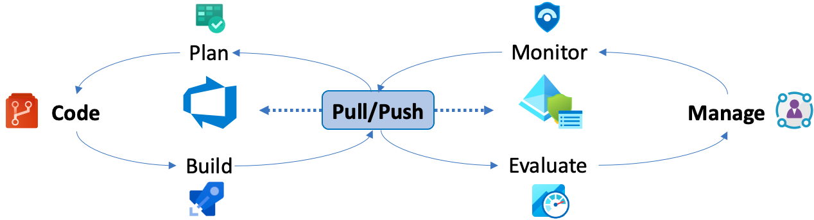

This ensures that the latest version of policy sets are stored in the repository and managed by Azure DevOps. In addition, it offers many governance workflows and advantages in auditing or track changes. All build and release (push) pipelines are created for two deployment scenarios:

- Creating or updating templates (across various environments)
- Individual modifications of deployed policies (to a single tenant environment).

Conditional Access templates and parts of the PowerShell scripts are sourced from [Alex Filipin's "CA as Code" GitHub project](https://github.com/AlexFilipin/ConditionalAccess). Kudos to his great and inspirational work!

After deployment of policies, Azure AD (portal) can be used by "Identity Operations" to evaluate impact of policy changes ("Azure AD Workbooks"), manage exclusions ("Azure AD Identity Governance") and monitor configuration of the policies ("Azure Sentinel").

## Plan: Designing and drafting of a new policy

### Definition of requirement and plan deployment

"Good planning is half the work". This motto is also valid for designing your policies. Therefore you should ensure that all relevant information about your target environment, business and security requirements are available before you start drafting the policy set. Create a questionnaire and checklist to standardize the design process for new policies.

[Ask the right questions](https://docs.microsoft.com/en-us/azure/active-directory/conditional-access/plan-conditional-access?WT.mc_id=AZ-MVP-5003945#ask-the-right-questions-to-build-your-policies) to the requester, as Microsoft recommends in his "how-to guide" to create a deployment plan. 

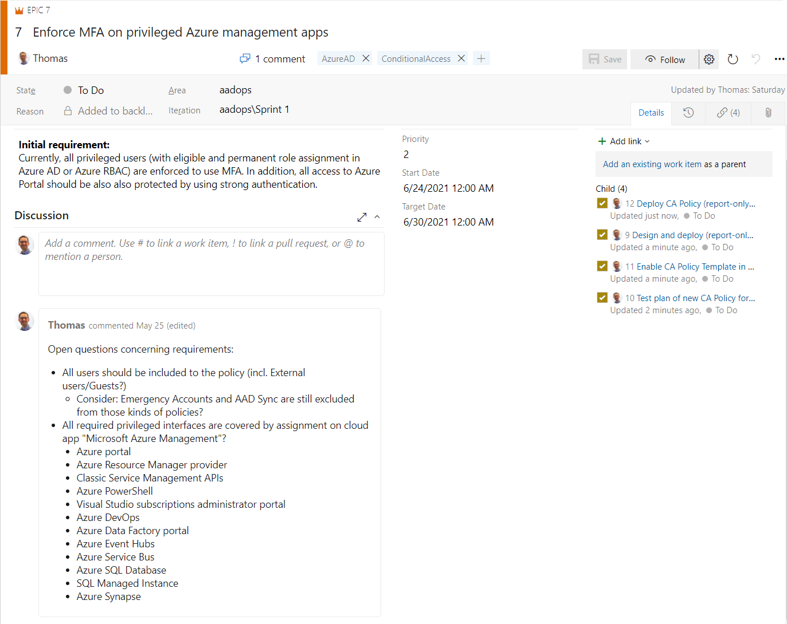

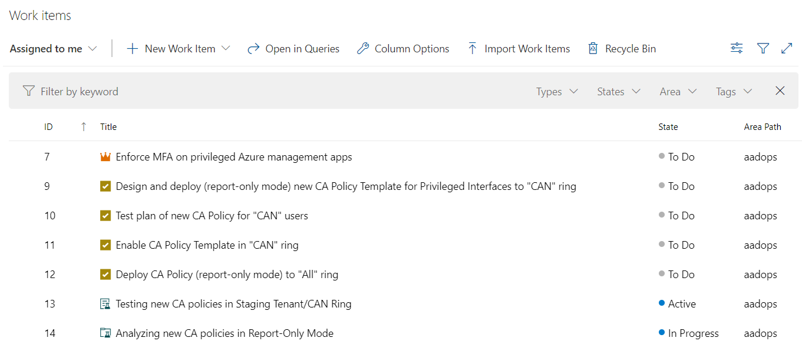

*Work items in "Azure Boards" can be used to track the initial requirements and following tasks to plan and implement the policy changes. Detailed definition (to avoid unclear requirements) should be also verified and documented in this early stage.* 

Before starting the technical implementation, [consider latest best practices from Microsoft](https://docs.microsoft.com/en-us/azure/active-directory/conditional-access/plan-conditional-access?WT.mc_id=AZ-MVP-5003945#follow-best-practices) but also the evaluation and work flow of the Conditional Access Policy (engine).
[Kenneth van Surksum](https://www.vansurksum.com) has given a great example on how to visualize and document the [workflow (as sheet)](https://github.com/kennethvs/blog/blob/master/Conditional%20Access%20Workflow%20-%20v1.2.pdf).

A workflow chart could be also an efficient way to visualize the policy design as draft and discuss possible reliance or negative impact. It's also a solid foundation for a discussion (with the IT security department), initial documentation or description for testing plan.

### Plan and communicate deployment and changes

As with all technical changes, the deployment of Conditional Access Policies has to be communicated. Identify all stakeholders on your planned change (such as Security Architects, Infrastructure or Endpoint Security Engineers or Application Developers/DevSecOps). 

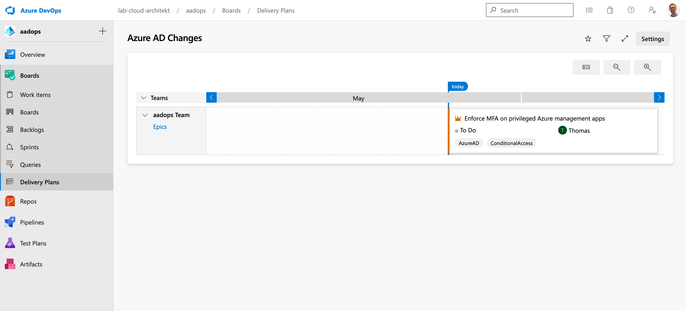

*Delivery Plans can be used to communicate and offer transparency to upcoming changes in the Azure AD environment. All related work items and information of this change should be assigned to tasks in Azure Boards. This includes the different phases of deployment and rollout plan (e.g. assignment to pilot group, report-only mode, etc.).*

### Test and roll back plan for evaluation

Describe the test scenarios based on the requirements and define an (technical) expected result. This helps to have a [comparison between the expected results and the actual results](https://docs.microsoft.com/en-us/azure/active-directory/conditional-access/plan-conditional-access?WT.mc_id=AZ-MVP-5003945#create-a-test-plan) during your testing or staging.

- Defined target scenario (e.g. "Require MFA on privileged Azure Management Apps")
- Types or groups of "end-users"
    - Privileged Users (Cloud-Only)
        - incl. External Service Provider/Partners with Privileged Access?
    - External Users (Invited B2B Guests)
    - Standard Users (Hybrid Identity)
- Types of endpoints and access source (e.g. [SAW/PAW](https://docs.microsoft.com/en-us/security/compass/privileged-access-devices?WT.mc_id=AZ-MVP-5003945) from Trusted Location or Device Filters)
- Defined exclusions (e.g. "Emergency Access" or "Synchronization Service Accounts")

[What-if tool](https://docs.microsoft.com/en-us/azure/active-directory/conditional-access/what-if-tool?WT.mc_id=AZ-MVP-5003945) should be also included in the "coding" phase to understand the impact of the new policy set before deploying them to a pilot user group.

### Naming convention

Discussions to define a naming convention can also include some aspects of "matter of taste" or philosophical questions. Nevertheless, there are some key points that [Microsoft includes in his recommendation to name policies](https://docs.microsoft.com/en-us/azure/active-directory/conditional-access/plan-conditional-access?WT.mc_id=AZ-MVP-5003945): 

- A Sequence Number
- The cloud app(s) it applies to
- The response
- Who it applies to
- When it applies (if applicable)

In aspects of automation, it should be helpful to built a naming convention based on a logical pattern so that it can be validated and created by scripting or using (dynamic) parameters.

As I already mentioned, it's up to you to modify or extend Microsoft's naming schema.
Here are two very "different approaches" to name or design your policies:

Personas for grouping policy sets:
"CA11 - Privileged Identities - Azure Management: Require MFA"
```jsx
<Tenant><SequenceNumber> - <Personas/Groups> - <Cloud App Target> : <Response>
```

Using "Access level" from the "[Enterprise Access Model](https://docs.microsoft.com/en-us/security/compass/privileged-access-access-model?WT.mc_id=AZ-MVP-5003945)" to design user access pathways:
"303 - ALL - Control/Management Plane - Privileged interfaces or intermediaries: Require MFA"
```jsx
<SequenceNumber> - <Ring/Staging> - <AccessLevel> - <Target / Scope> : <Response>
```

It's is widely spread and a (general) valuable approach to use "personas" or "categories" to group and name a set of policies.

Version number could be also part of the naming pattern if you like to manage multiple versions of a single policy within one tenant (especially in case of intra-tenant staging).

## Code: Create policy-as-code template in repo

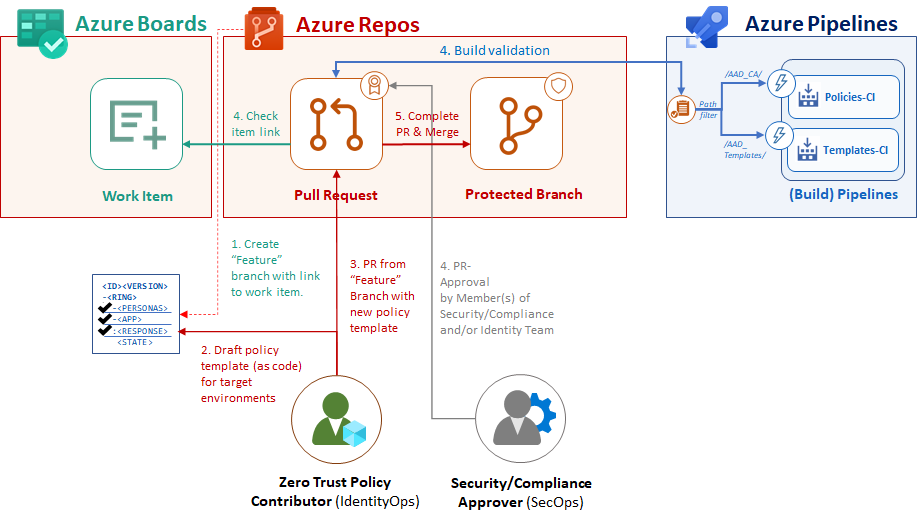

### Azure DevOps Repo as Source of Truth

Storing policies of the "Zero Trust (ZT) Engine" in Azure Repos means also to protect and secure "Control plane" assets in Azure DevOps. Therefore, security of your Azure DevOps Organization is becoming also essential for the ZT + identity security in case of automation. Follow the best practices to secure repos, projects and pipelines. Consider potential privilege escalation paths and verify the posture management of the DevOps platform. More information are included in the [Azure AD Attack and Defense playbook about Service Principals and Azure DevOps.](https://github.com/Cloud-Architekt/AzureAD-Attack-Defense/blob/main/ServicePrincipals-ADO.md#securing-azure-devops-environment)

### Content and structure of the repository

The following two subfolders exists in my repository:

- **AAD_CA**: Current configuration of the deployed policies are stored here. Each policy is named with the object ID of the certain staging/tenant and stored in a flat hierarchy. JSON files will be also updated as part of the pull pipeline ("Policy-Pull"). This ensures that the latest version of the configured policies are stored in the repository, even if a manual change in the Azure Portal was made. Changed policy files will be validated and added as build artifacts by the "Policies-CI".

    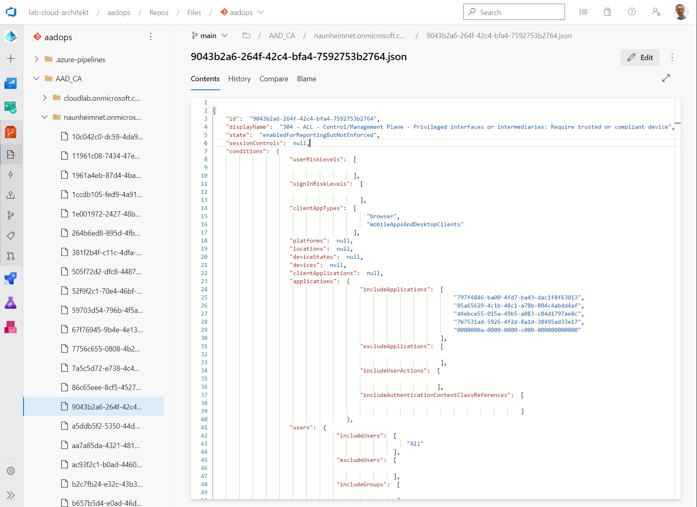

    *Side Note: It can be a challenge to work with GUIDs instead of displayNames. Especially when it comes to compare the "same" policy from various tenants because of the different object IDs or to follow commit messages. [Fortigi has published some build scripts on GitHub](https://github.com/Fortigi/ConditionalAccess) to convert those GUIDs to readable display names. This also covers known GUIDs such as AAD Role and Application ID to DisplayName.*

    *There are some pros and cons to use GUIDs over displayNames. I personally prefer the original values (incl. GUIDs) in templates and exported policies in the repository to automate and establish a technical 1:1 relation (resistant from renaming/duplicated names etc.). Human-readable values are mostly useful and relevant in reports or visualization of policies. Another aspect: Microsoft has already changed names of directory roles which must be updated and considered in automated translation of "GUID-name" mapping.*

- **AAD_CA_Templates:** Templates across all environments (tenants) are located in this folder. Subfolder can be used to split the various templates in personas/groups/access levels. Changes to this folder will trigger continuous integration of the build pipeline "Templates-CI".

    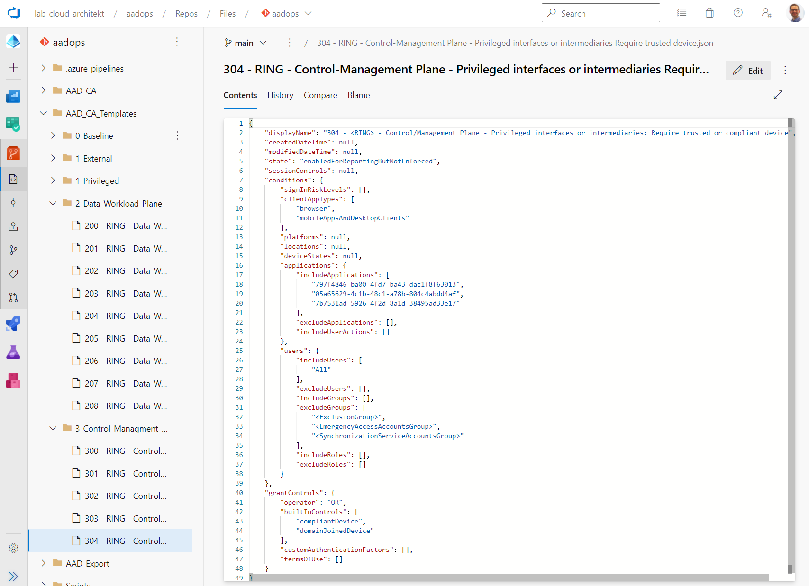

### Ready-made templates for Multi-Tenant environments

I can recommend to use parameters to replace dynamic values of group names and IDs (e.g.  Groups of Exclusions, Synchronization Service Accounts and Emergency Access Accounts).

As you can seen, the template folder contains "blueprint" CA policies with parameterized values of "Exclusion Groups" but also targeting to "Ring Groups" or versioning. The idea came from  Alex Filipin's project which is described in his wiki as "[Ring-based Deployment](https://github.com/AlexFilipin/ConditionalAccess/wiki/Ring-based-deployment)". This allows to manage multiple deployments of a template for different staging groups (in my example: Canary as pilot group, similar to CAN channel of preview versions of Microsoft products) or various versions within one tenant.

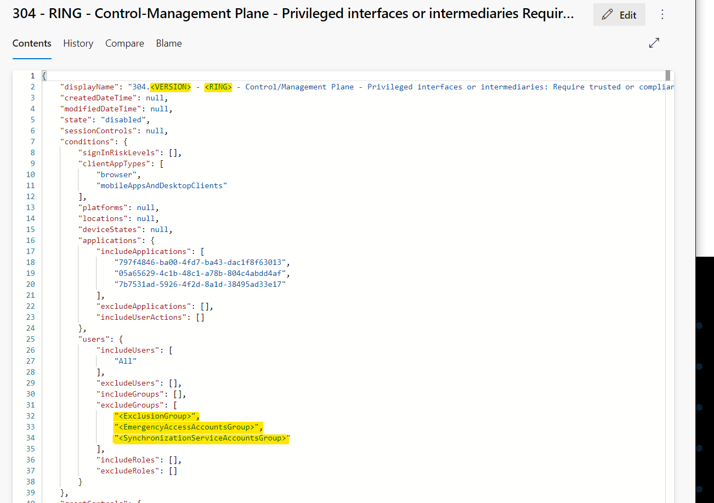

### Restrict access and protect main branch

As already mentioned, the build/release pipelines are configured for continuous integration and deployment. Therefore it's important to establish a limited access to the "main" branch and implement governance workflow to verify changes of policies. Therefore, [branch policies](https://docs.microsoft.com/en-us/azure/devops/repos/git/branch-policies?view=azure-devops) and [enforcement of Pull-Request (PR) workflow](https://docs.microsoft.com/en-us/azure/cloud-adoption-framework/secure/best-practices/secure-devops?WT.mc_id=AZ-MVP-5003945#restrict-access-to-protected-branches) in Azure DevOps are an important part of the AADOps project configuration.

Required policies can be used to define requirements for the "pull request" review process. In this example, I've enabled the enforcement of using work items (to ensure a complete tracking and documentation between "commit" of policy change and task planning from the designing/plan phase).

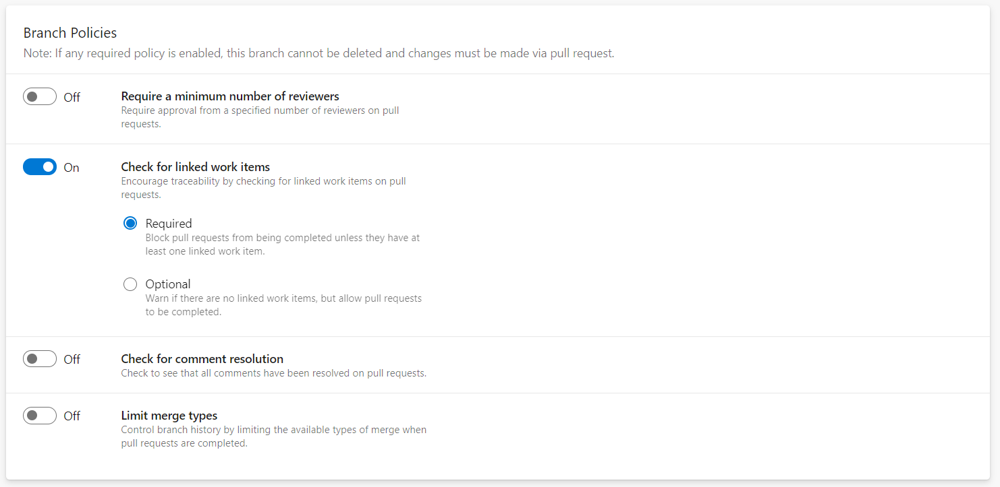

Furthermore, I've added a "build validation" which triggers the certain "<Template/Policy>-CI pipeline" and validates JSON format of the policy file(s). 

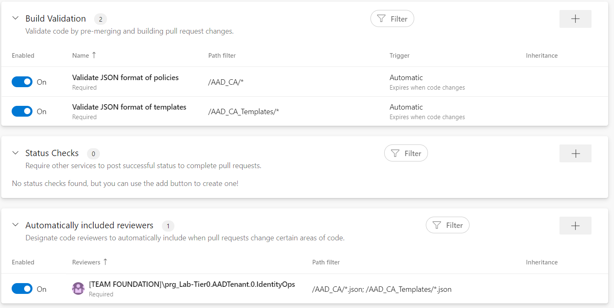

Member of the "IdentityOps"-Team needs to review the changes of the policies and templates before the PR will be completed. In this case, I'm following the double­-check principle for an appropriate quality control and approval process on the important assets in the "Zero Trust Policy."

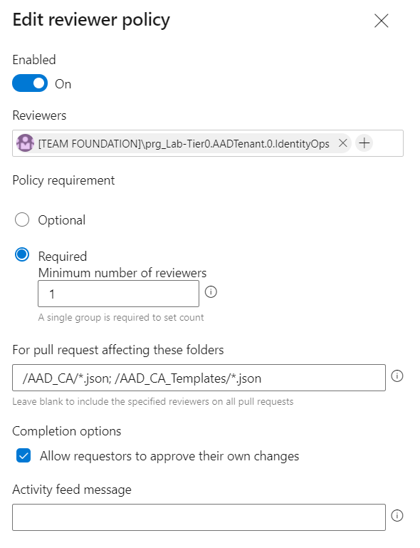

### Create feature Branches and Pull Requests to trigger deployments

In the next step, we will create a new branch from the work-item view in "Azure Boards" to start working on the new policy template and see the approval workflow from perspective of a "Zero Trust Policy Contributor". It's needed to choose a name for the "feature" branch (e.g. including change number or relation to epic item) and make sure to create a link to work item(s). This allows to establish a relation to the pull requests. In this case, I'm using the work item because the branch will be used only for adding the template to the repository:

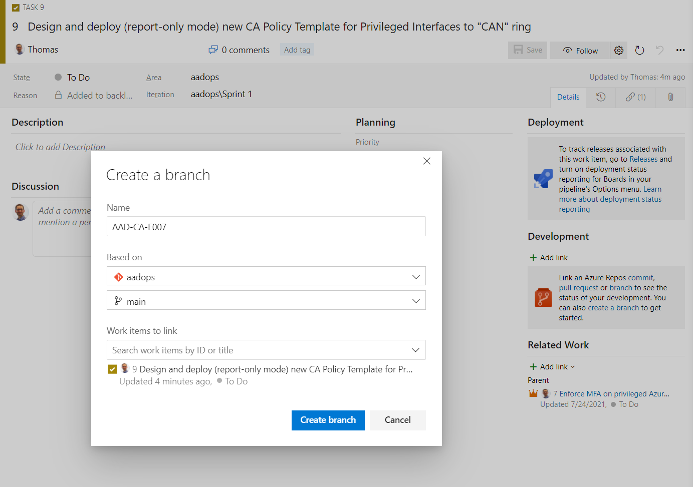

The new JSON file will be added to the folder "AAD_CA_Templates" and includes "dynamic" parameters (Version, Ring). The draft of the new template follows the specification of requirement (from the work-item task) to set policy state to "enabledForReportingButNotEntforced").

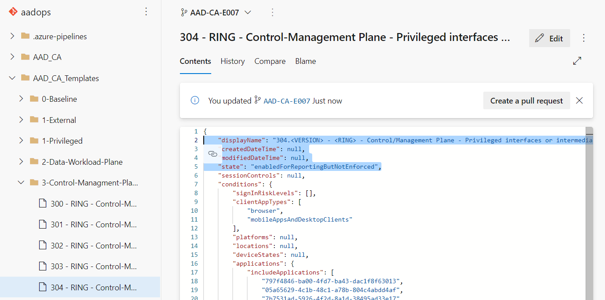

After coding the policy, a pull request will be created to the "main" branch:

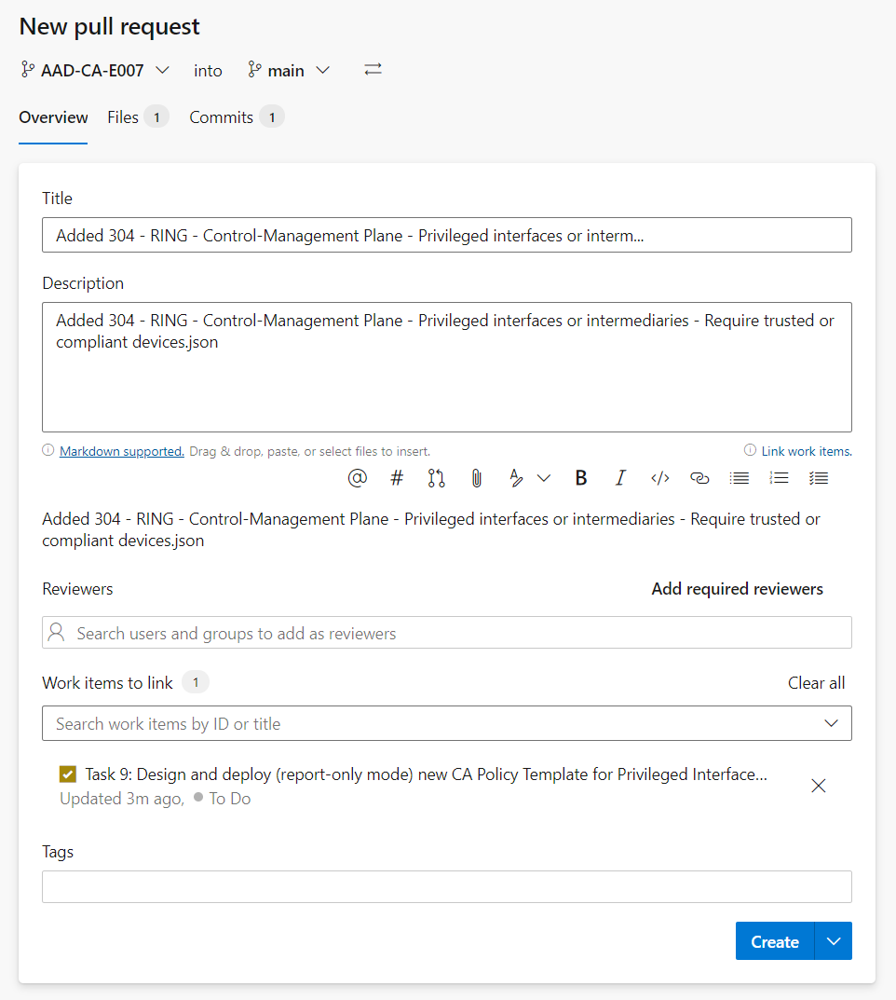

As we can see, the reviewers and approval checks will be triggered automatically:

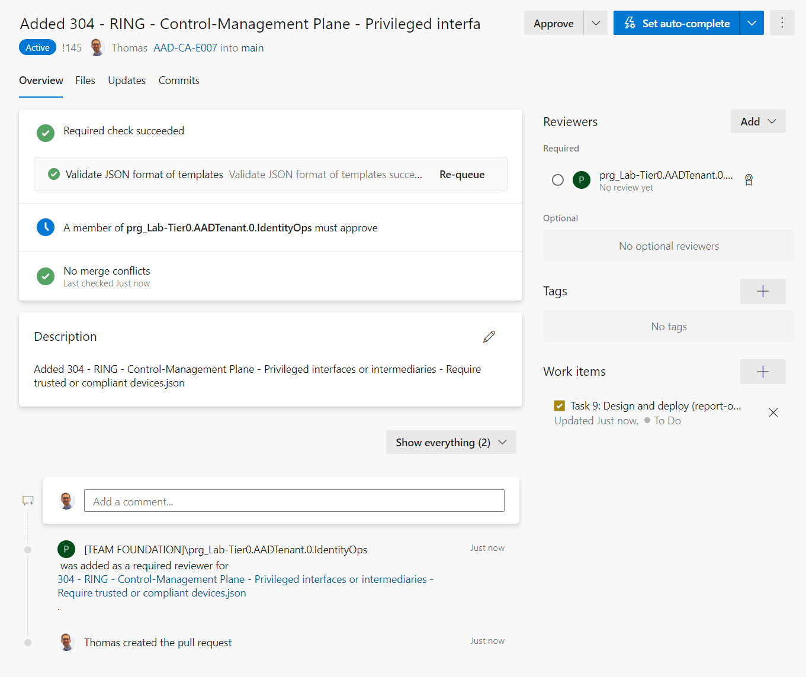

If the PR request was completed, the work item will be updated with links to the various development activities:

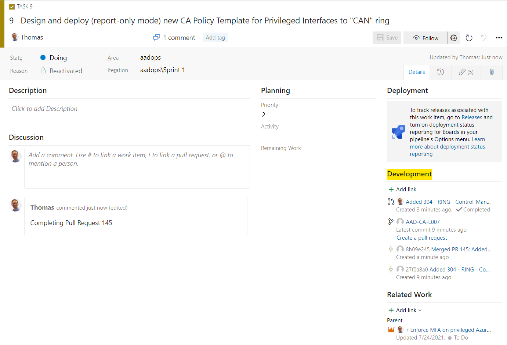

## Build: Verify JSON and publish pipeline artifacts

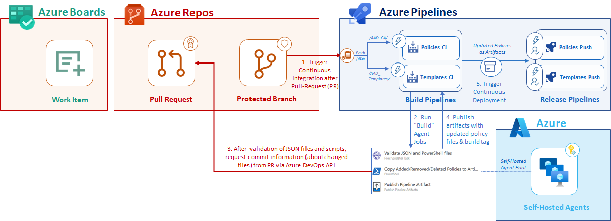

### Continuous integration of policy and template changes

As already described, the build pipelines (Policies-CI and Templates-CI) will be triggered to validate the JSON files by pre-merging and building pull request changes. I've configured branch and path filters to trigger the certain pipeline of the corresponding deployment type (templates or policies). Separated build pipelines allows me to integrate different tasks, checks, approval workflows or build validation settings.

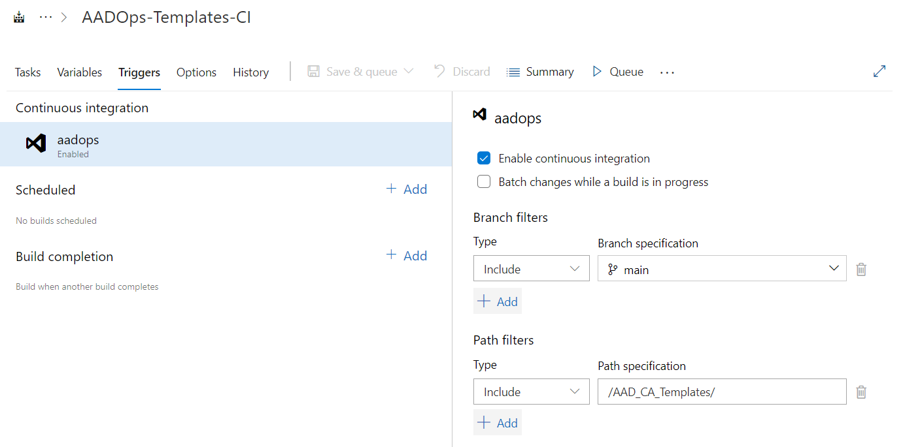

"Continuous integration" enables the trigger to run the build pipeline whenever a push to the specified branch ("main") and the specific path (template- or policy-folder) was made.

### Run build tasks on separated self-hosted agents

All tasks will be executed on [self-hosted agent(s)](https://docs.microsoft.com/en-us/azure/devops/pipelines/agents/agents?WT.mc_id=AZ-MVP-5003945) which are used and reserved for "control plane" (identity)-related automaton jobs only. Therefore, the host of the agent(s) must be designed as isolated and secured virtual machines (Windows Server Core) or containers with the highest security standards in your Azure infrastructure. This includes also to validate and verify integrated scripts and tasks (from the Azure DevOps marketplace) by a supply-chain security process. In this case, I'm using a 3rd party task ("[Files Validator](https://marketplace.visualstudio.com/items?itemName=roshkovski.Files-Validator)") to validate JSON and PowerShell files which was installed from the Visual Studio Marketplace. This extension and installation source has to be verified to pass security and governance requirements.

### Get Pull Requests details from Azure DevOps API

The following example shows an implementation of the pipeline which is designed to apply added or changed policies only. Therefore, I'm calling the [Azure DevOps API to retrieve the commit files from the Pull Request](https://docs.microsoft.com/en-us/rest/api/azure/devops/git/pull%20requests/get%20pull%20request?WT.mc_id=AZ-MVP-5003945). This helps me to build a structure in the artifact folder which can be easily used by the release pipeline to identify added or updated (existing) policies.

OAuth token of the build pipeline will be used for authorization to the Azure DevOps API.

```powershell
$Project = "$env:SYSTEM_TEAMPROJECT"
$RepoId = "$env:BUILD_REPOSITORY_ID"
$CommitId = "$env:BUILD_SOURCEVERSION"
$AdoOrgaUrl= "$env:SYSTEM_TEAMFOUNDATIONCOLLECTIONURI"

$Header = @{
            Authorization = "Bearer $env:SYSTEM_ACCESSTOKEN"
}

# API URL to get files of the commit(s)
$Url = $AdoOrgaUrl + $Project + "/_apis/git/repositories/" + $RepoId + "/commits/" + $CommitId + "/changes?api-version=5.0"

# Added Policies
$Added = ((Invoke-RestMethod ($Url) -Headers $Header).changes | Where-Object {$_.changetype -eq "Add" -and $_.item.gitObjectType -eq "Blob"}).Item.Path

(...)
```

### Tagging of deployment type and target environment

Azure DevOps API will be used for just another use case at the end of the build jobs.
[Build tags](https://docs.microsoft.com/en-us/rest/api/azure/devops/build/tags/add%20build%20tag?WT.mc_id=AZ-MVP-5003945) will be added during the build process which allows filtering artifacts (from the same build branch) on the continuous deployment trigger (release pipelines). 

In the following sample, I'm using the sub-folder name ("<TenantName">) of the "AAD_CA" folder hierarchy to identify the target environment. 

```powershell
# Using Folder structure for taging (which AAD_CA and certain TenantName as ID for Policy changes and trigger CD pipeline)
$Tags = (Get-ChildItem -Path $env:BUILD_STAGINGDIRECTORY -Depth 1).Name

$Tags | ForEach-Object {
    $Url = $AdoOrgaUrl + $Project + "/_apis/build/builds/" + $BuildNumber + "/tags/" + $_ + "?api-version=4.1"
    Invoke-RestMethod ($Url) -Method PUT -Headers $Header
}
```

### Publish pipeline artifacts

Finally, the build pipeline publishes a current work folder to the artifact location (in this case "Azure Pipelines"). The folder structure of the "Templates-CI" includes the change type ("Added" or "Updated") in the folder hierarchy.

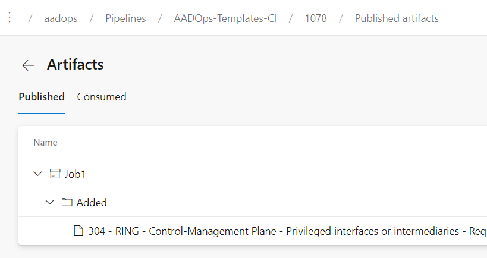

In case of using build pipeline for changed policies ("Policies-CI"), the "AAD_CA" repo folder includes the full folder hierarchy (of the original repository) to identify the target environment:

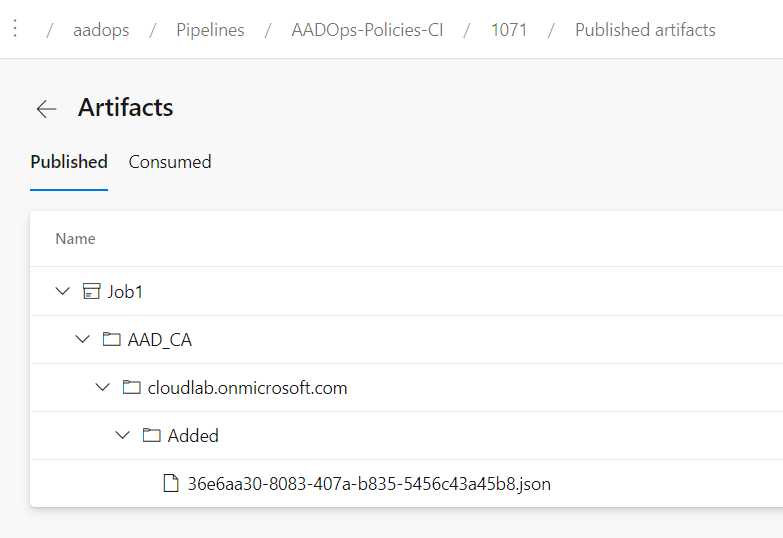

## Push Pipeline: Deployment of CA changes

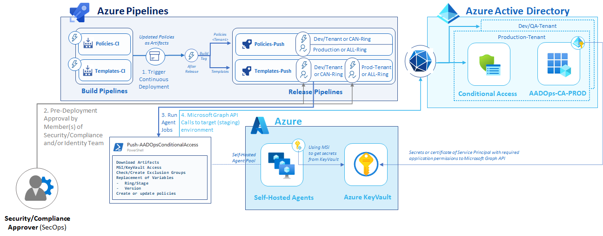

### Continuous deployment trigger to create release automatically

After the build pipeline has published an artifact (incl. all updated policies or templates), the continuous deployment trigger will be our initial step in the deployment process.

Filtering of build branch and tags are part of the artifacts trigger in the "Templates-Push" pipeline:

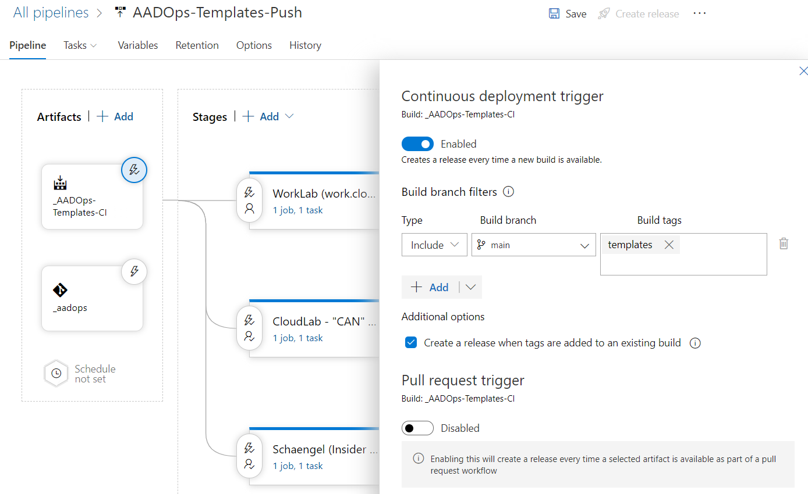

Filtering of the target environment will set to the stage-level in the "Policies-Push" pipeline:

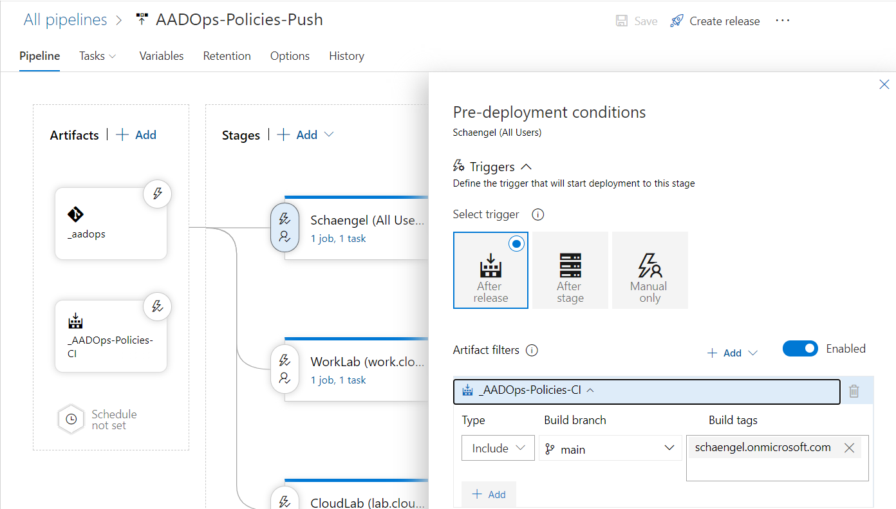

*Side Note: Deletion process was not implemented during my PoC. In my opinion there are many dependencies to consider if you like to remove template deployments of a CA policy (e.g. missing GUIDs in template files, used exclusion groups, extended approval checks?). At that time, I've decided to reduce the scope on added and updated policies.*

### Multi-stage deployment to integrate approval and rings

As you can see in the following picture of the "Templates-Push" release pipeline, I've created stages for every target environment ("tenant") and the staging groups ("rings" in the policy templates),.

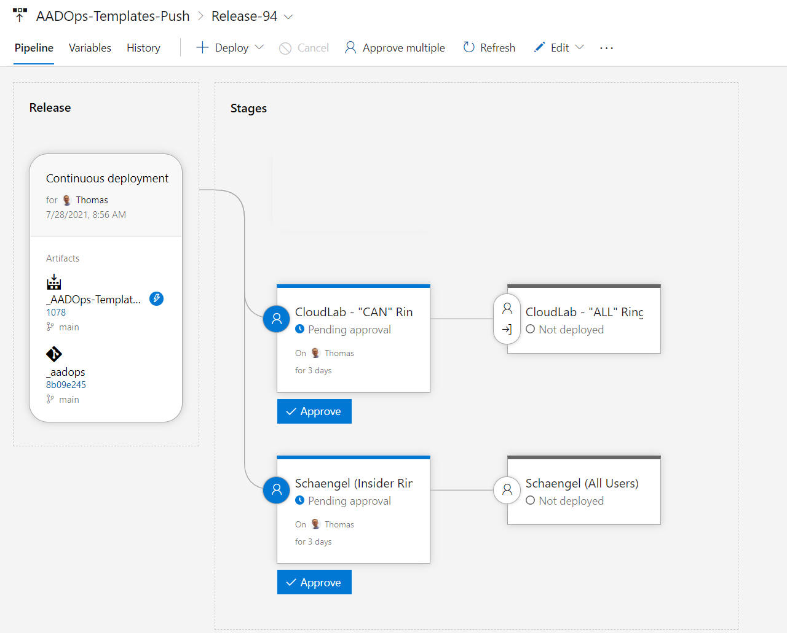

Deployment to the various stages is pending until all [(pre-deployment) approvals](https://docs.microsoft.com/en-us/azure/devops/pipelines/release/approvals/approvals?WT.mc_id=AZ-MVP-5003945) are completed.
This allows to re-check the artifacts and deployment tasks before they will be executed on the release pipeline. [Approval notifications](https://docs.microsoft.com/en-us/azure/devops/pipelines/release/approvals/approvals?WT.mc_id=AZ-MVP-5003945#approval-notifications) can be configured to notified the approvers (e.g. members of the Security or Compliance-Team). Another interesting option are the definition of gates which will be evaluated before the deployment starts:

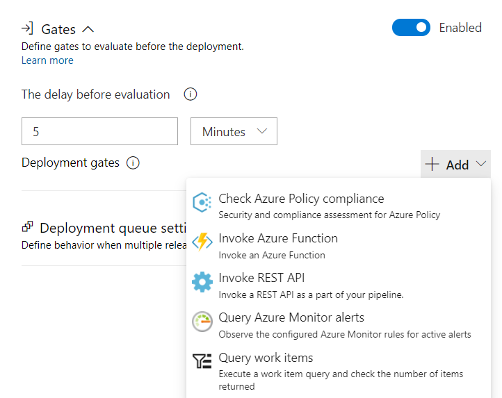

This gives you the opportunity for advanced integration like the following samples:

- Azure Monitor alerts
(e.g. high-rate of Conditional Access sign-in interrupt before new policies will be deployed),
- Azure Functions or REST APIs
(integration to ITSM/Change Management systems)
- Requests to work items in the Azure Boards.

### Access to Microsoft Graph by using Self-hosted Agents and KeyVault

[Managed Identities](https://docs.microsoft.com/en-us/azure/active-directory/managed-identities-azure-resources/overview?WT.mc_id=AZ-MVP-5003945) (compared to service principals) are offering advantages in security and lifecycle management. This presupposes to use "self-hosted agents" for running agent jobs on the release pipeline. Protected and hardened "self-hosted agents" are already in configured for (build) agent jobs. Keep in mind, isolation and separation from Azure management or workload admins are essential. Follow [Microsoft‘s best practices to secure Azure Pipelines](https://docs.microsoft.com/en-us/azure/devops/pipelines/security/resources?WT.mc_id=AZ-MVP-5003945), e.g. avoid privilege escalation (from Azure DevOps admins or project members).

There are two options to use the "Managed identity" of the self-hosted agents to gain privileged access for Microsoft Graph API operations.

1. If you are running the release pipeline to a single-tenant/-environment, delegate the required Microsoft Graph permissions directly to the "Managed Identity". The following few lines of the PowerShell cmdlets from the "Az" module allows you to get an Microsoft Graph API access token:

    ```powershell
    Connect-AzAccount -Identity
    $AccessToken = (Get-AzAccessToken -ResourceUrl "https://graph.microsoft.com").Token
    Disconnect-AzAccount
    ```

2. The following approach can be a valid option if you prefer to run a single pipeline to pull/push policies from various environments:
"Azure KeyVault" stores the secrets or certificates (recommended) of the various service principal(s) to get access to the target environments. Managed Identity will be used to receive the secrets from the secret store:

    ```powershell
    $AzConnect = Connect-AzAccount -Tenant $KeyVaultTenant -Identity
    $KVAEntryClientID = $PrefixSecretName + "ClientId"
    $KVAEntryClientSecret = $PrefixSecretName + "ClientSecret"
    $clientId = Get-AzKeyVaultSecret -VaultName $KeyVaultName -Name $KVAEntryClientID -AsPlainText
    $clientSecret = Get-AzKeyVaultSecret -VaultName $KeyVaultName -Name $KVAEntryClientSecret -AsPlainText
    $TenantId = (Invoke-WebRequest https://login.windows.net/$TenantName/.well-known/openid-configuration|ConvertFrom-Json).token_endpoint.Split('/')[3]
    ```

    This example shows an implementation of a KeyVault in a "managing tenant" to store secrets of the service principals of each "managed tenant" centrally.
    All required values to get access to the the centralized KeyVault and names of the secret will be stored in Pipelines variables:

    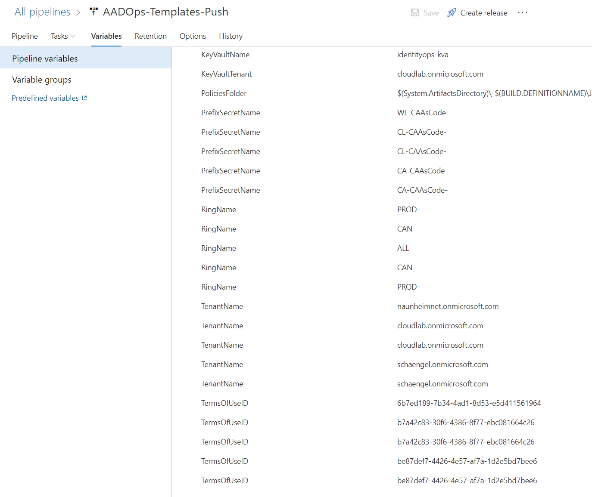

*Side Note: Managed Identities (in case of direct permissions to deploy policies) or service principals requires the following application permissions to deploy "Conditional Access" policies:*

- *Policy.Read.All*
- *Policy.ReadWrite.ConditionalAccess*
- *Application.Read.All*
- *User.Read*

*Permissions to "Groups.ReadWrite.All" are  needed if you like to create "Inclusion"- (Pilot group / Ring target groups) or "Exclusion"-Groups as well.*

*Monitoring and protection of the the service principals are strongly recommended because of the wide range of permissions.*

*The high-privileged service principals could be also used in case of emergency access (e.g. Conditional Access misconfiguration and lockout). But I still recommend to have [emergency access accounts](https://www.cloud-architekt.net/how-to-implement-and-manage-emergency-access-accounts/) implemented.* 

### Versioning of policy templates in push pipelines

I've have chosen to create new policies in the target environment if a template was updated in the repository. This allows to evaluate and test various version of the same template within a single tenant.

The required version numbers of the templates will be generated automatically.
The release name of the "AADOps-Templates-Push" pipeline will be used which contains a sequence number (Release-123). This gives me also the chance to build a relation between the deployed policy in the targeted tenant and the certain release deployment (based on the release number).

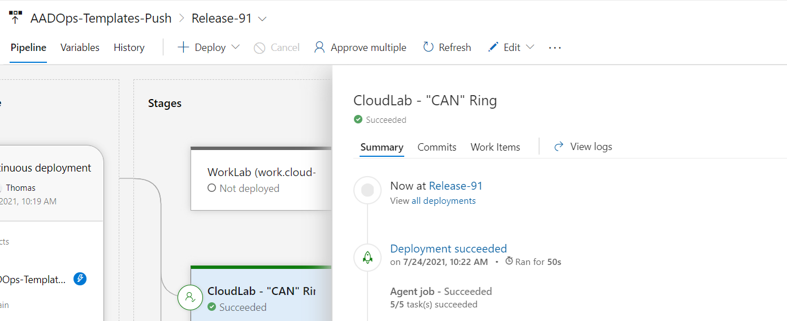

At the end, the displayname of the deployed CA policy shows me the template ID (in my case a three-digit number, grouped by personas/categories of policy set) and the release number of the (template) push pipeline:

*<TemplateId>.<Version> - <Staging/PilotGroup) - ...*

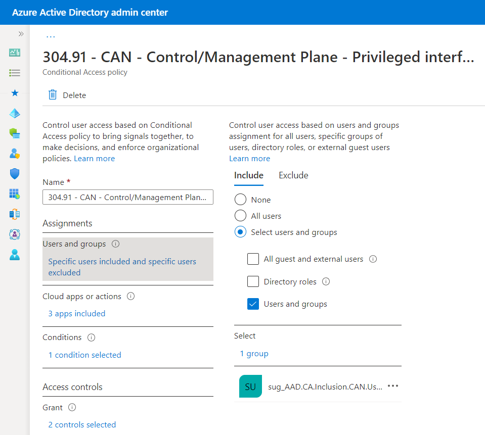

### Automated ring-based deployment (Staging)

In the following example, the target environment ("CloudLab") has two stages ("CAN" and "ALL" ring). This means that all templates will be deployed to the stage "CAN" in the first step.
The "ALL" ring includes all users of the target environment ("Production") and will be triggered after all [post-deployment conditions of the pre-stage are successfully and/or the pre-deployment approvals was made](https://docs.microsoft.com/en-us/azure/devops/pipelines/release/approvals/approvals?WT.mc_id=AZ-MVP-5003945) (e.g. manual approve by reviewer).

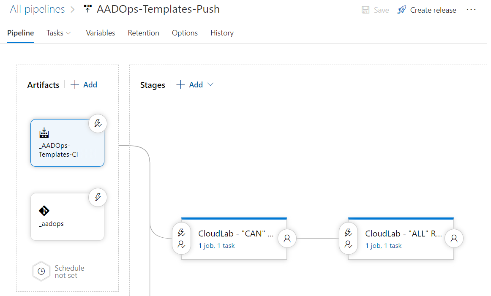

The variables of the pre-stage ("CAN") includes the parameter "RingName" which will be used in the deployment script to assign the policy to this pilot group only:

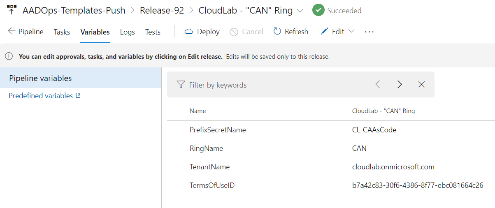

```powershell
Creating or receiving group: sug_AAD.CA.Inclusion.CAN.Users
ObjectId for sug_AAD.CA.Inclusion.CAN.Users 4ce0b86e-a0eb-44f1-b86e-d66c3195724c
Importing policy templates
Working on policy: 304.<VERSION> - <RING> - Control/Management Plane - Privileged interfaces or intermediaries: Require trusted or compliant device
Creating or receiving perm exclusion group
ObjectId for sug_AAD.CA.Exclusion.304.CAN c4d7cc31-df4f-4981-9e84-2addd1bc26c2
Working on replacements
Policy Name: 304.92 - CAN - Control/Management Plane - Privileged interfaces or intermediaries: Require trusted or compliant device
```

In this case only one group for the "CAN" ring was created (instead of pilot group for each policy in the ring). This depends on your requirements for granular scoping of the pilot group.

## Pull Pipeline: Import of current policy set in Azure AD

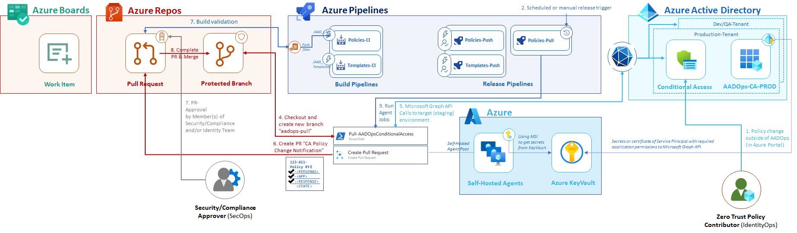

### Update repository by changes outside of AADOps pipeline

The pipelines of "AADOps" are designed on a similar approach as "AzOps".
Besides "pushing" changes to Azure AD, another pipeline is responsible to "pull" the latest policy set from the various environments to the repository. I've created a "Policies-Pull" pipeline which includes the different environments as stages and will be triggered on a schedule set (e.g. every hour on every week day).

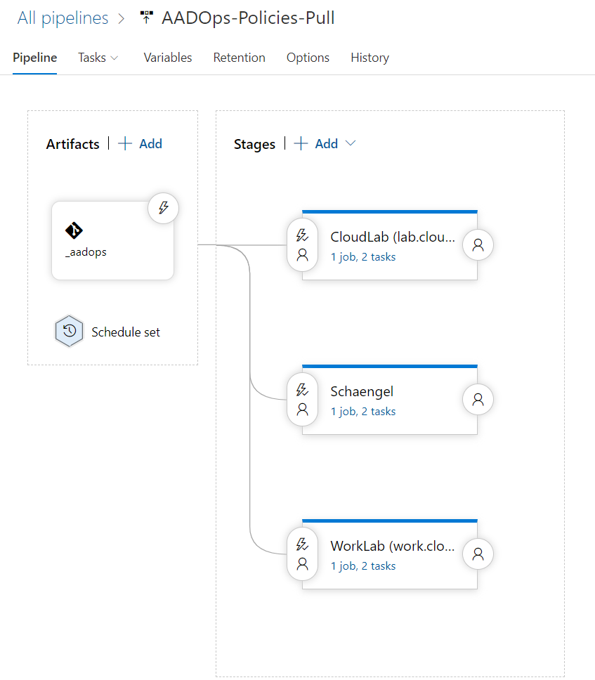

### Same governance and approval workflow as other contributions to repository

All policies will be exported as JSON and a "Pull request" will be generated if the policy files has been changed (compared to the "main" branch). The same security and governance process will be used in the "PR workflow" (as described in the "Coding" section) to validate and verify the commits.

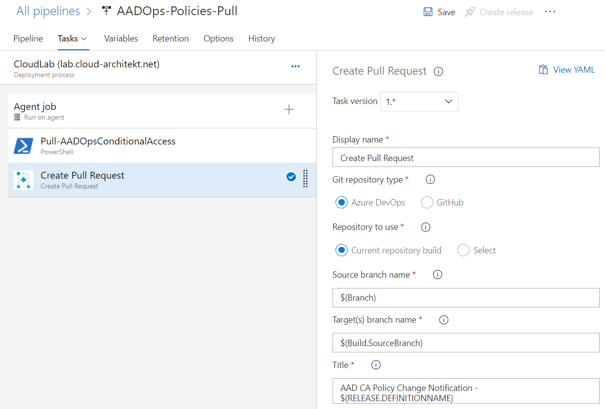

This includes build validation and reviewer approvals to protect the source of truth ("main" branch in the AADOps repo).

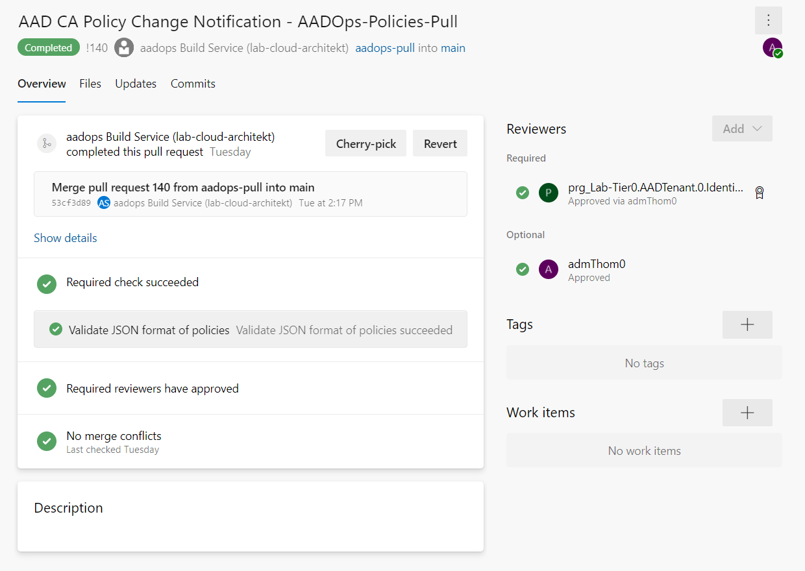

The PR request allows to review the details of the manual changes (from the Azure Portal) before it will be stored in the repository:

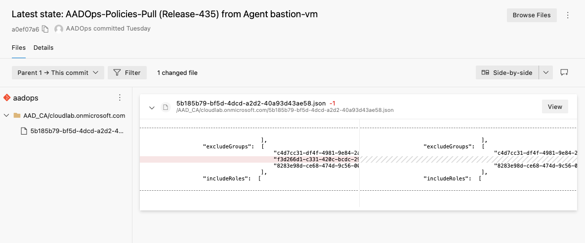

After the Pull Request has been completed, the push pipeline will be triggered to re-deploy the policy based on the configuration state in AADOps. This ensures that tasks from the "Policies-Push" pipeline will be applied to every "managed" policy which is stored and collected by AADOps. Even they are created or modified outside of AADOps.

Let's take just another sample... back to our original scenario to deploy a new policy.
A member of the IdentityOps-Team has enabled the policy in the "CAN" ring (deployed by the Template-Push pipeline in "Report-only" mode). This was planned as next deployment step after the template deployment.

"Governance/Security Reviewer" will get an notification about this change:

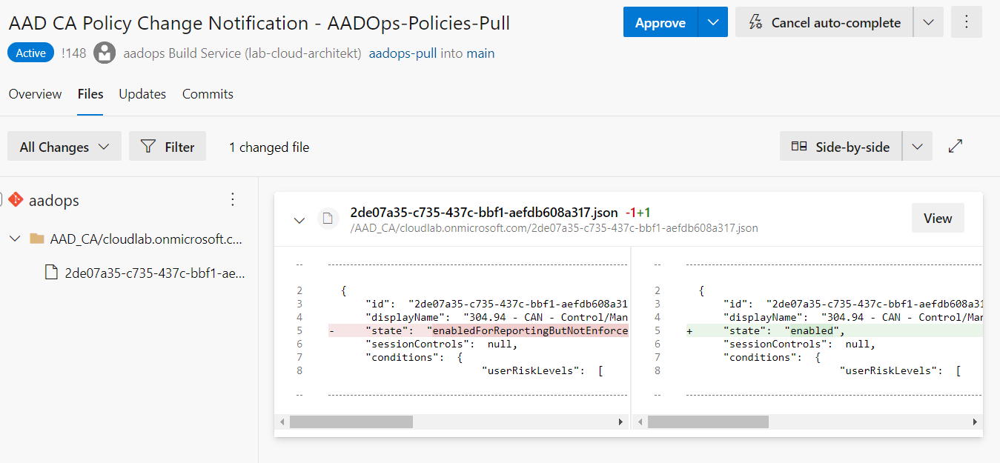

Before the change get a subsequent ratification and stored in the repository, a member of "IdentityOps" has to link the related work item in "Azure Boards" to this change outside of AADOps:

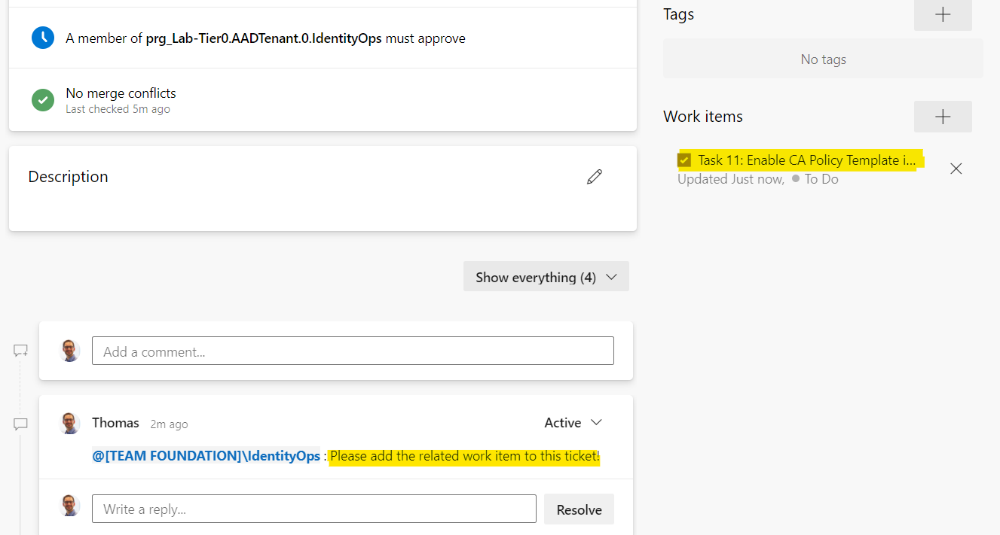

After the final approval by the "Governance/Security Reviewer", the enabled policy state is updated in the repository and the work item has been updated:

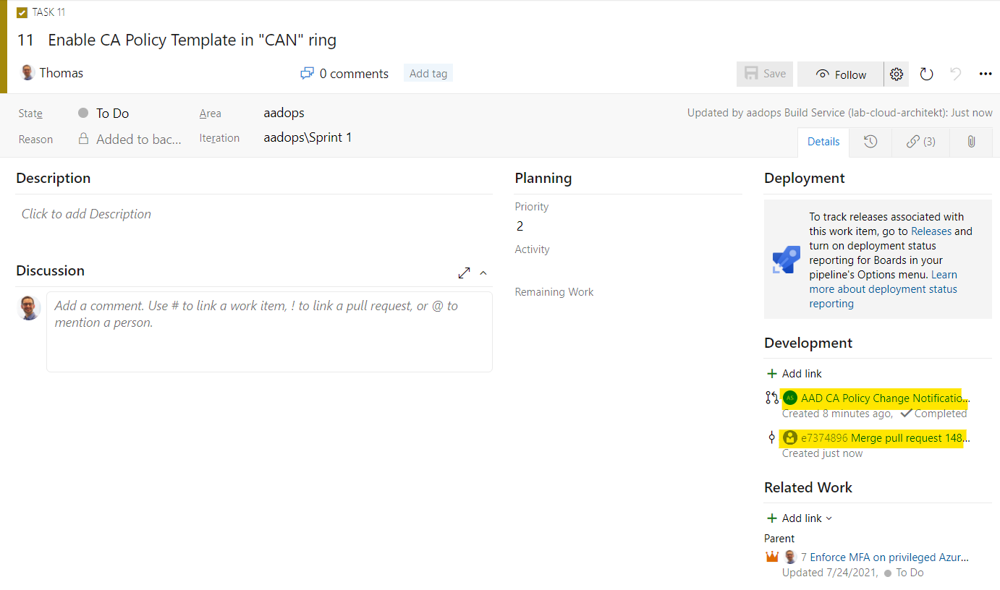

## AADOps as serverless?

Most of the functions and tasks in the AADOps pipelines are based on REST API Calls (to Microsoft Graph or Azure DevOps API). Therefore it would be also possible to trigger those actions as part of a Logic App. In this case, Azure Repos or GitHub can be still used as repository including PR request as trigger. Protection and workflows for the repository (as source of truth) are still in-place but the efforts (and costs) to manage servers (as hosted agents) will be reduced. This solutions seems to be a real „cloud-native“ solution. But on the other hand, compliance and security of a Logic App to manage critical assets on „Control plane“ must be also considered. This includes to enable a similar approval workflows as already described in the DevOps release pipelines (e.g. approving deployment to another stage). Conditional statement and various connectors to ITSM or collaboration tools in Logic Apps should allow such kind of integration. Therefore, I would like to build the next PoC of AADOps as serverless solution (with Azure Logic App and/or Azure Functions).

GitHub Actions could be another alternate solution. But you also need "self hosted agents" to use "Managed Identities". Another disadvantages (in my opinion) are the limited governance features (currently) which I mentioned in the blog post earlier.

## Live demo of AADOps
AADOps as implementation example will be part of my session about "Deep Dive into Conditional Access"  at the Workplace Ninja Summit 2021. If you are interested to see the CI/CD pipeline in action, join my session on September 2nd, 2021! Registration and more details are available on the [event page](https://www.wpninjas.ch/events/workplace-ninja-virtual-edition-2021/).

If you are hosting a Azure Meetup or other community-driven events and you are interested in this topic, it would be a pleasure for me to share my insights and a demo of "AADOps" in a hands-on session at your event.

Feel free to contact me if you have any feedback or interested to learn more.

<br>
<br>
<br>
<span style="color:silver;font-style:italic;font-size:small">Original cover image by [Vojtech Bruzek / Unsplash](https://unsplash.com/photos/Jb1ca3NO2f0)</span>
<span style="color:silver;font-style:italic;font-size:small">DevOps lifecycle illustration by [
Kharnagy / Wikimedia.org](https://commons.wikimedia.org/wiki/File:Devops-toolchain.svg)</span>