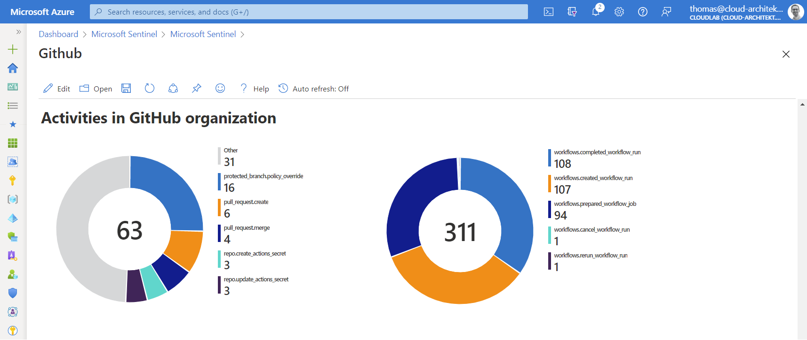
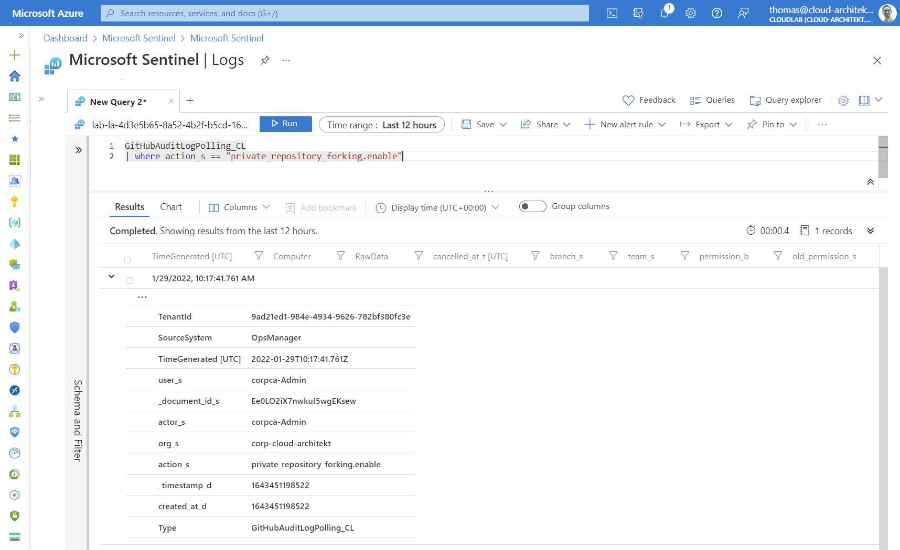

*GitHub Enterprise is more than a platform to manage developer's code in a repository. It will be also used to automate deployment of cloud resources and manage "infrastructure-as-code" or even the entire platform (M365DSC, AzOps). Compromised or unsecured DevOps platform could be leading in privileged escalation to take control of your cloud deployments. Let's have a look on the latest solution to monitor a GitHub Enterprise environment with Microsoft Sentinel.*

- [Microsoft Sentinel “Continuous Threat Monitoring” for GitHub](#microsoft-sentinel-continuous-threat-monitoring-for-github)
  - [Configuration of Data Connector](#configuration-of-data-connector)
  - [Monitoring of collecting audit data](#monitoring-of-collecting-audit-data)
  - [Workbook](#workbook)
  - [Analytics Rules and Parser](#analytics-rules-and-parser)
  - [Available data fields and columns in audit log](#available-data-fields-and-columns-in-audit-log)
- [Advanced Analytics Rules](#advanced-analytics-rules)
  - [Sensitive and suspicious administrative tasks and access](#sensitive-and-suspicious-administrative-tasks-and-access)
  - [Protecting policies and secrets in Repository](#protecting-policies-and-secrets-in-repository)
  - [Abusing Azure AD Federated Identity Credentials in GitHub Actions](#abusing-azure-ad-federated-identity-credentials-in-github-actions)
- [Incident Enrichment and Automated Response](#incident-enrichment-and-automated-response)
  - [Block user in GitHub](#block-user-in-github)
  - [Disable repository or organization to use GitHub actions](#disable-repository-or-organization-to-use-github-actions)
  - [Correlation between GitHub and Azure AD user names](#correlation-between-github-and-azure-ad-user-names)
- [Limitations in auditing](#limitations-in-auditing)
- [Comparison to other solutions](#comparison-to-other-solutions)
  - [Exporting audit data to Azure EventHub or Blob Storage](#exporting-audit-data-to-azure-eventhub-or-blob-storage)
  - [Microsoft Defender for Cloud Apps (MDCA)](#microsoft-defender-for-cloud-apps-mdca)

## Microsoft Sentinel “Continuous Threat Monitoring” for GitHub

Microsoft has been released (in December 2021) a solution with then name **“[Continuous Threat Monitoring for GitHub](https://docs.microsoft.com/en-us/azure/sentinel/whats-new#ingest-github-logs-into-your-microsoft-sentinel-workspace-public-preview)” as public preview in the Sentinel content hub**. This solution offers a data connector to ingest audit data from GitHub Enterprise but also includes a workbook to visualize the log data. In addition, analytics rules and a parser will be installed to work with the raw logs from the included data connector.

*Keep in mind: This solution works only in licensed GitHub enterprise environments.*

It can be installed for free from the “Content hub” blade in Microsoft Sentinel directly or by using the [Azure Marketplace](https://azuremarketplace.microsoft.com/en-us/marketplace/apps/microsoftcorporation1622712991604.sentinel4github?tab=overview).


Installation of the solution is quite simple. Select your Microsoft Sentinel workspace and choose a "Display Name" of the workbook. That’s it...

### Configuration of Data Connector

Next, you need to configure the required data connector after the solution has been deployed successfully. You will find them under the name “**GitHub Enterprise Audit Log (Preview)**” in the “**data connectors**” blade of Microsoft Sentinel.

Ingestion of audit log data from GitHub Enterprise to Microsoft Sentinel requires a personal key/token, named as “Personal Access Token” (PAT) in GitHub.
Therefore you’ll need to switch over to your **GitHub account (with Organization owner permissions)** to **create a PAT with “admin:org” scope**.

Detailed steps to create a PAT in GitHub are documented [here](https://docs.github.com/en/authentication/keeping-your-account-and-data-secure/creating-a-personal-access-token).

My current experience leads to the following **remarks and considerations**:

- PAT expiration needs to be configured with “no expiration” or limited expiration with key rotation. Microsoft **Sentinel will not be able to ingest data from GitHub if the used PAT has expired**. This is also the case if the **issued GitHub user has been disabled or removed** from the organization or the required permissions.
Therefore I recommend you to use a ["machine user" GitHub user account](https://docs.github.com/en/developers/overview/managing-deploy-keys#machine-users) which has been used originally to create the GitHub Enterprise instance or will be used for other automation tasks only. Strictly monitoring of this account is required!

- **Access scope on “admin:org” requires also “write:org” permissions**. GitHub API documentation named "admin:org" as required scope to access audit data. I’ve tested the connection with limited scope on “admin:org with “read:org” which has been failed. The required scope has **sensitive access** permissions which should be considered. Protect your PAT by implementing a key rotation/lifecycle and regular review of the [security log](https://docs.github.com/en/authentication/keeping-your-account-and-data-secure/reviewing-your-security-log) from the GitHub account.
- Data connector is designed for **auditing on organization-level**:
GitHub Enterprise with multi-organization environments needs to create **separate data connector for each organization**. During my tests, I was able to connect more than one organization by installing the GitHub solution for each organization.

- **[Enable SSO for PAT](https://docs.github.com/en/enterprise-cloud@latest/authentication/authenticating-with-saml-single-sign-on/authorizing-a-personal-access-token-for-use-with-saml-single-sign-on) and authorize them for SSO** to your GitHub organization if you have [implemented](https://docs.github.com/en/enterprise-cloud@latest/organizations/managing-saml-single-sign-on-for-your-organization/enabling-and-testing-saml-single-sign-on-for-your-organization) and [enforced](https://docs.github.com/en/enterprise-cloud@latest/organizations/managing-saml-single-sign-on-for-your-organization/enforcing-saml-single-sign-on-for-your-organization) SAML-SSO.

After the token has been created, enter the value of the **PAT as “API key”** in the configuration field of the data connector:


You’ll should be able to see the first entries in the custom table “GitHubAuditLogPolling_CL” after a few minutes (and some audited events in GitHub later). 🙂

### Monitoring of collecting audit data

[Health Monitoring workbook](https://docs.microsoft.com/en-us/azure/sentinel/monitor-data-connector-health#use-the-health-monitoring-workbook?WT.mc_id=AZ-MVP-5003945) and  [SentinelHealth data table](https://docs.microsoft.com/en-us/azure/sentinel/monitor-data-connector-health#use-the-sentinelhealth-data-table-public-preview?WT.mc_id=AZ-MVP-5003945) are not supporting the GitHub data connector. Nevertheless, anomalies queries can be written to visualize and trigger alerts based on counted event entries:


```jsx
GitHubAuditLogPolling_CL
| make-series count() on TimeGenerated from ago(14d) to now() step 1d 
| extend (anomalies, score, baseline) = series_decompose_anomalies(count_, 1.5, 7, 'linefit', 1, 'ctukey', 0.01)
| project-away anomalies, score
| render timechart
```

### Workbook

As already described, a workbook is also part of the **solution to visualize the ingested data**.
The information is very basic and covers general status of repository and management activities:


At next step, I would recommend you to **add existing and related (visualized) queries from other workbooks** (such as “sign-in statistics” from Azure AD or “User Traffic to GitHub” from MCAS Cloud Discovery) to extend the visibility of events to your GitHub organization (across data sources).

Copy the existing queries and modify the scope to the GitHub application only:


Creating **visualization on own-written queries** can be also a great addition to the workbook.
Let’s start with a simple example which shows a count of all activities in your GitHub organization (stored in column ”action_s”).

```jsx
GitHubAuditLogPolling_CL
| where action_s !startswith "workflows"
| summarize count() by action_s
```


*Side note: **GitHub Audit logs in Microsoft Sentinel also covers events from workflows** (GitHub Actions). Therefore I’ve divided the counting between GitHub (e.g. configuration and repository activities) and all workflow related events.*



Another custom workbook sample is covering the authentication from GitHub to deploy Azure resources. GitHub Actions supports Azure AD “[Workload identity federation](https://docs.microsoft.com/en-us/azure/active-directory/develop/workload-identity-federation#supported-scenarios?WT.mc_id=AZ-MVP-5003945)” which will be later a focus and use case in writing custom analytics rules. One simple query allows us to **visualize changes on service principals with federated identity credentials.** In this case, entities of the workload identity (GitHub repository) will be displayed:

```jsx
AuditLogs
  | where OperationName has_any ("Update application","Update service principal")
  | where Result =~ "success"
  | extend keyEvents = TargetResources[0].modifiedProperties
  | mv-expand keyEvents
  | where keyEvents.displayName =~ "FederatedIdentityCredentials"
  | extend new_value_set = parse_json(tostring(keyEvents.newValue))
  | mv-expand new_value_set
  | extend issuer = tostring(new_value_set.Issuer)
  | where issuer == "https://token.actions.githubusercontent.com"
  | extend subject = tostring(new_value_set.Subject)
  | extend federatedCredentialName = tostring(new_value_set.Name)
  | extend repository = tostring(split(subject, ":")[1])
  | summarize count() by repository
```


The previous query can be easily modified to show also the most used Azure AD account (column “initiatedby”) for changing objects of this type of service principals.

As you can see, there’s a couple of interesting charts that could be integrated to your GitHub workbook in Microsoft Sentinel.

### Analytics Rules and Parser

**Templates for analytics rules** are also part of the GitHub solution.
Four different detections are available and can be found in the analytics blade of Microsoft Sentinel:


Two “Workspace functions” with the name **“GitHubAuditLog” and “GitHubRepoLog” have been installed as product-specific “Parsers”** to map the ingested data to “normalized” column names (such as IPaddress, OperationType,...). You’ll find them in the “Functions” tab of the “Log” blade in Microsoft Sentinel.

Unfortunately the used table and column names **doesn’t fit to the related data connector**.
It seems that Microsoft has deployed the [original parser from the previous solution to ingest audit data from the GitHub API](https://techcommunity.microsoft.com/t5/microsoft-sentinel-blog/protecting-your-github-assets-with-azure-sentinel/ba-p/1457721?WT.mc_id=AZ-MVP-5003945) via Logic Apps/Azure Functions.


I’ve created an [issue on the Azure Sentinel GitHub repository](https://github.com/Azure/Azure-Sentinel/issues/4042) to request an update for included parsers.

### Available data fields and columns in audit log

I’ve always recommend to have a closer look on the schema and columns from the custom table before writing analytics rules based on my own-developed use cases.

It’s also interesting to **compare the raw events from the source (GitHub audit logs) with the data from the custom table in Log Analytics**. Therefore, I’ve created a [manual export (as CSV) in the GitHub Audit Log](https://docs.github.com/en/organizations/keeping-your-organization-secure/reviewing-the-audit-log-for-your-organization#exporting-the-audit-log) and checked the [documentation about audited actions](https://docs.github.com/en/organizations/keeping-your-organization-secure/reviewing-the-audit-log-for-your-organization#audit-log-actions) in the logs.

Already on the first look in the GitHub UI, it becomes clear that not all data will be ingested from/to Microsoft Sentinel. For example, location of the audited event is not visible in Sentinel:




It seems the [REST API](https://docs.github.com/en/organizations/keeping-your-organization-secure/reviewing-the-audit-log-for-your-organization#using-the-rest-api) will be used by the data connector which does not contain some detailed information. This can be reproduced by using this PowerShell script to ingest data:

```powershell
$pat  = "<GitHubPersonalAccessToken>"
$org  = "<GitHubOrgName>"
$url = "https://api.github.com/orgs/$org/audit-log"
    $headers = @{
        "Authorization" = "Bearer $pat"
    }

Invoke-RestMethod -Method GET -Uri $url -Headers $headers -Body $body -ContentType "application/vnd.github.v3+json"
```

**Some relevant data fields are missing, such as IP address of the actor or other client information**.
Using [query parameter (include=all)](https://docs.github.com/en/rest/reference/orgs#get-the-audit-log-for-an-organization--parameters) gives you the opportunity to see audited [Git events](https://docs.github.com/en/organizations/keeping-your-organization-secure/reviewing-the-audit-log-for-your-organization#git-category-actions). This category of events seems not to be covered by the data connector.

Audit log data can also be collected by using the [GraphQL API](https://docs.github.com/en/organizations/keeping-your-organization-secure/reviewing-the-audit-log-for-your-organization#using-the-graphql-api) which have been used (as one of the API endpoints) by the previous Microsoft solution (“[Protecting your GitHub assets with Azure Sentinel](https://techcommunity.microsoft.com/t5/microsoft-sentinel-blog/protecting-your-github-assets-with-azure-sentinel/ba-p/1457721?WT.mc_id=AZ-MVP-5003945)”).

The following PowerShell script allows us to see audit events from GraphQL API. I’ve used a PowerShell Module for [GraphQL](https://github.com/anthonyg-1/PSGraphQL) (by [Tony Guimelli](https://github.com/anthonyg-1)) which allows easily to send some queries to the GitHub GraphQL API:

```powershell
$pat  = "<GitHubPersonalAccessToken>"
$url = "https://api.github.com/graphql"
    $headers = @{
        "Authorization" = "Bearer $pat"
}
$query = 'query {
  organization(login: "<YourOrg>") {
    auditLog(first: 50) {
      edges {
        node {
          ... on OrganizationAuditEntryData {
            organization {
              name
            }
          }
          ... on AuditEntry {
            actorResourcePath
            action
            actorIp
            actorLogin
            createdAt
            actorLocation {
              countryCode
              country
              regionCode
              region
              city
            }
          }
        }
        cursor
      }
    }
  }
}'

(Invoke-GraphQLQuery -Headers $headers -Uri $url -Query $query).data.organization.auditlog.edges.node
```

Location and IP address of the actor will be part of the audit entry:


On the other side, there's a couple of disadvantages in getting audit data from GraphQL API in relation to the REST API.
**Git events can not be retrieved by GraphQL API** and events from GitHub Actions were not visible during my tests. Coverage of audit data by **GraphQL API (up to 90 to 120 days)** and **REST API calls (retained for up to seven months, Git events for 7 days)** are different.

*Side note: I was not able to use [GitHub GraphQL API Explorer](https://docs.github.com/en/graphql/overview/explorer) for this query successfully. This can be used to trigger GraphQL queries from a simplified and web-based explorer (similar to Microsoft Graph Explorer). But audit events seems not be accessible from this authorized GitHub app even the token has the right permissions (”...does not have permission to retrieve auditLog information.”).*

Many important detections and queries can be executed on the available audit data in the table “GitHubAuditLogPolling_CL” (by the new data connector from the GitHub solution). But keep in mind, some information are missing which can be a challenge for entity mapping, enrichment from other sources or cross queries (e.g. based on IP addresses).

## Advanced Analytics Rules

In the past weeks, I’ve worked on the following KQL queries to give some examples on potential detections for suspicious activities in GitHub Enterprise environments. You’ll find all queries as YAML template in my GitHub repository: [AzureSentinel/Detections/GitHub](https://github.com/Cloud-Architekt/AzureSentinel/tree/main/Detections/GitHub).

### Sensitive and suspicious administrative tasks and access

**[Sensitive changes and activities in GitHub organization](https://github.com/Cloud-Architekt/AzureSentinel/blob/main/Detections/GitHub/GitHubOrgSensitiveChangeActions.yaml)**

A list of sensitive actions (some of them are already pre-defined) but also authorized organization owner will be defined in the query. Result of the related actions will be mapped to the original timestamp from the GitHub audit event (instead of the TimeGenerated from Log Analytics).

**[New GitHub App added to GitHub Enterprise organization](https://github.com/Cloud-Architekt/AzureSentinel/blob/main/Detections/GitHub/GitHubAppAddedToOrg.yaml)**

Incident will be created if a [GitHub Apps has been installed](https://docs.github.com/en/developers/apps/managing-github-apps/installing-github-apps) outside of a list with “allowed apps” (defined as dynamic variable in this sample but can be also part of a watchlist).
**[Invited "outside collaborators" as owner to GitHub organization](https://github.com/Cloud-Architekt/AzureSentinel/blob/main/Detections/GitHub/InvitedOutsideCollabsAsOwner.yaml)**
This query is looking for members that have been invited from external (outside collaborator) and added as owner of the GitHub organization.

**[GitHub repository becomes public](https://github.com/Cloud-Architekt/AzureSentinel/blob/main/Detections/GitHub/RepoVisibilityChangeToPublic.yaml)**

Next we have a very simple but efficient detection for changing visibility and exposure of a GitHub repository from private to public. Full GitHub repository name (organization/repo) will be split in organization and repository name for further investigation.

### Protecting policies and secrets in Repository

**[GitHub Pull Request Policy Bypassing - Historic allow list](https://github.com/Cloud-Architekt/AzureSentinel/blob/main/Detections/GitHub/PullRequestPolicyByPass.yaml)**

The following query was inspired by a similar rule template for Azure DevOps.
Enforced pull request by using privileged permissions ([defined in branch protection rules](https://github.blog/changelog/2021-11-19-allow-bypassing-required-pull-requests/)) will be detected by this analytics rules. Reducing noise can be achieved by adding authorized GitHub users ("AuthorizedBypassers") to the query. In addition, a dynamic (historic) will be automatically included  ("historicBypassers") with actors which has been override the policy in the past.

**[New GitHub workflow is using secrets - Historic allow list](https://github.com/Cloud-Architekt/AzureSentinel/blob/main/Detections/GitHub/NewWorkflowUsingSecrets.yaml)**
Secrets in GitHub repositories will be used to store sensitive credentials or certificates (incl. Service Principals). This rule is written to detect workflows which used secrets for the very first time. A list to exclude repositories ("BypassRepositories") from this query can be defined. A dynamic “historic allow list” (as previously described) will be used to exclude existing workflows. Threshold for covering workflows only after a certain numbers of secret usage ("SecretUsageThreshold") but also a alert threshold ("NewSecretUsageThreshold") is included by default. I would recommend you to use this detection (in production) in combination of a [WatchList](https://docs.microsoft.com/en-us/azure/sentinel/watchlists?WT.mc_id=AZ-MVP-5003945).

### Abusing Azure AD Federated Identity Credentials in GitHub Actions

As already named, WatchList in Microsoft Sentinel should be used to store data for correlation and enrichment. Therefore, I’ve created a WatchList for the following queries to store information about the trust relationship between Azure AD and GitHub repo.
This includes Service Principal/Application ID from Azure AD and the specified entity name/type:

```powershell
ServicePrincipalName,ServicePrincipalId,AppId,Repo,Environment,Issuer,SubjectIdentifier
AzOps,deea7af6-XXXX-XXXX-XXXX-XXXX,e96c653b-XXXX-XXXX-XXXX-XXXX,corp-cloud-architekt/azops,prod,https://token.actions/githubusercontent.com,repo:corp-cloud-architekt/azops:environment:prod
AutomateMSGraph,5b0542ae-XXXX-XXXX-XXXX-XXXX,8ef8-XXXX-XXXX-XXXX-XXXX,,corp-cloud-architet/AbuseFederatedCreds,https://token.actions.githubusercontent.com,repo:corp-cloud-architekt/AutomateMSGraph:ref:refs/heads/main
```

*Side note: Consider to automate the creation of WatchList which includes all “Federated Identity Credentials”. This can be achieved by periodically run of a Logic Apps to get all applications with [federatedIdentityCredentials](https://docs.microsoft.com/en-us/graph/api/application-list-federatedidentitycredentials?WT.mc_id=AZ-MVP-5003945) via Microsoft Graph API.*

**[Federated credentials has been created for unknown GitHub entity or repository outside of organization](https://github.com/Cloud-Architekt/AzureSentinel/blob/main/Detections/GitHub/FedCredCreatedForUnknownEntity.yaml)**

Federated identity credentials will be [configured with scope on a GitHub organization and repository](https://docs.microsoft.com/en-us/azure/active-directory/develop/workload-identity-federation-create-trust-github?tabs=azure-portal#configure-a-federated-identity-credential). Adding credentials outside for another GitHub organization or unknown entity can be a indicator for suspicious activity or configuration mistake from an administrator. This detection is using a “join” operator to check if the named repository exists (based on the GitHub audit information).

**[Sensitive actions in GitHub repository with Azure AD Federated Credentials](https://github.com/Cloud-Architekt/AzureSentinel/blob/main/Detections/GitHub/FedCredIssuedRepoSensitiveAction.yaml)**

This analytics rule is using the named WatchList ("GitHubFederatedCredentials") and triggers a incident if a sensitive activity has been applied on repositories with a trust relationship to Azure AD.

**[Sign-in with Azure AD Federated Credentials from new GitHub workflow](https://github.com/Cloud-Architekt/AzureSentinel/blob/main/Detections/GitHub/FedCredAuthFromNewWorkflow.yaml)**

New workflows or existing ones which are using a "Workload federated identity" for the first time can be detected by this query. This rule works on a similar approach than the previous secret detection.

Query across two action categories was needed (workflows.prepared_workflow_job & completed_workflow_run) to get the required entities for correlation.

In addition, correlation between Azure AD and GitHub events isn’t easy because of missing entities (such as IP address, shared correlation ID or advanced sign-in information about used Federated identity). Therefore, I was forced to use specific time range of workflow run for correlation to the related sign-in event in Azure AD.

**[Azure Activity with Federated Credentials outside of GitHub Workflow activity](https://github.com/Cloud-Architekt/AzureSentinel/blob/main/Detections/GitHub/FedCredAzActivityWithoutSignInWorkflow.yaml)**

Abuse of service principals from (Azure DevOps) deployment pipelines is one of my favorite topics and part of the “[Azure AD Attack & Defense](https://github.com/Cloud-Architekt/AzureAD-Attack-Defense/blob/main/ServicePrincipals-ADO.md)” playbook with Joosua Santasalo and Sami Lamppu last year. Same attack scenario exists also in GitHub Actions in combination with Federated identity credentials. Even if the output (Write-Host) from an access token will be (partially) masked, replay the token as part of an output artifact is still possible.
This complex KQL query can be used to correlate Service Principal sign-ins (from Federated identity) with GitHub workflow runs and try to match all events from “Azure Activity” based on the ServicePrincipal ID, TimeStamps and IP Addresses. The result should be include all “suspicious” Azure activities outside of the workflow runtime and runner's IP address.

Special thanks to [Stephan Waelde](https://stephanwaelde.com/) for supporting me to handle and understand the different ways to use “join” operators.

## Incident Enrichment and Automated Response

As we have already seen in the analytics rules, **WatchLists are very helpful to maintain enrichment information** within analytics rules but also to define exclusion/inclusion of entities. But this requires also to update WatchLists on a regular basis. Automation by Logic Apps, Azure Functions or as part of a GitHub workflow (similar to automation of Microsoft Sentinel analytics rules) helps reducing operational efforts. Furthermore, **Logic Apps can be used to enrich incidents after creation or trigger automated response.**

*Side note: Automation to GitHub API requires a Personal Access Token which should be protected in Azure KeyVault. Especially if you are using automated response with privileged actions to GitHub Enterprise! Keep in mind, secure your Logic Apps and access to the KeyVault...*

### Block user in GitHub

GitHub allows you to [block users](https://docs.github.com/en/communities/maintaining-your-safety-on-github/blocking-a-user-from-your-organization) with permissions in repositories.
This security action can be easily [triggered from the GitHub API](https://docs.github.com/en/rest/reference/orgs#block-a-user-from-an-organization) and tested (in the first step) as part of a PowerShell script to evaluate this option:

```powershell
$org  = "<YourOrg>"
$pat  = "<GitHubPersonalAccessToken>"
$blockuser = "<UserName>"
$url  = "https://api.github.com/orgs/$org/blocks/$blockuser"
    $headers = @{
        "Authorization" = "Bearer $pat"
    }
    Invoke-RestMethod -Method PUT -Uri $url -Headers $headers -Body $body -ContentType "application/vnd.github.v3+json"
```

Use the API to “[list users blocked by an organization](https://docs.github.com/en/rest/reference/orgs#list-users-blocked-by-an-organization)” and verify if the account has been blocked.
It’s very easy to [unblock the user](https://docs.github.com/en/rest/reference/orgs#unblock-a-user-from-an-organization) by using the same API (as blocking the user) but with “DELETE” request method.

Let’s build our first automated response to a GitHub security incident by building a Azure Sentinel Playbook:

- First of all, create a KeyVault which stores the "Personal Access Token" (PAT) for GitHub API access.
Enable Managed Identity (MSI) for the Logic App for accessing the PAT from the KeyVault.
- Afterwards, create a Logic App with “Microsoft Sentinel Incident” trigger and [assign permission to Sentinel for triggering the playbook](https://azurecloudai.blog/2021/06/15/access-required-to-adjust-azure-sentinel-permissions-to-run-playbooks/).
- We are using the "Account" entity from the incident (in this case the GitHub account name) to identify the target "GitHub user" for blocking action. Secrets can be (securely) read by using the native KeyVault connector.
    
    
    
- The second part of the playbook is using a “foreach” function on the list of accounts from the incident entity. Add the HTTP action for the API request to GitHub and choose the secret from the KeyVault as part of the “Authorization” header:
    
    
    
- Optional: As final step in the playbook, we can add a comment to the incident if blocking the user has been successful.
    
    
    

Finally, a [playbook automation](https://docs.microsoft.com/en-us/azure/sentinel/tutorial-respond-threats-playbook?WT.mc_id=AZ-MVP-5003945) will trigger the Logic App (on the defined rule conditions) to apply automated response. Comments in the incident show the result of our playbook:


### Disable repository or organization to use GitHub actions

Disabling repositories to use GitHub actions in your organization can be a automated response on critical/massive abuse of secrets or federated identity credentials. A simple API call is needed to [block further access to use workflows](https://docs.github.com/en/rest/reference/actions#disable-a-selected-repository-for-github-actions-in-an-organization), similar to the approach of blocking users.

### Correlation between GitHub and Azure AD user names

It should be the goal to include Azure AD user account as “Account” entity in the analytics rules.
Therefore consider to **implement a correlation between GitHub user and Azure AD account in the analytics rules**. This can be achieved by a WatchList or “join” operations to a table which contains the information.
GitHub allows to create [SAML SSO link](https://docs.github.com/en/enterprise-cloud@latest/organizations/managing-saml-single-sign-on-for-your-organization/about-identity-and-access-management-with-saml-single-sign-on#adding-members-to-an-organization-using-saml-sso) between GitHub and IdP (Azure AD) users which could be an indicator to build the account relation.

A list of SAML SSO link accounts to Azure AD can be easily generated by GraphQL query:

```powershell
query {
  organization(login: "<Organization>") {
    samlIdentityProvider {
      ssoUrl
      externalIdentities(first: 100) {
        edges {
          node {
            guid
            samlIdentity {
              nameId
            }
            user {
              login
            }
          }
        }
      }
    }
  }
}
```

Some organizations are using [SCIM for provisioning users to GitHub](https://docs.microsoft.com/en-us/azure/active-directory/saas-apps/github-provisioning-tutorial?WT.mc_id=AZ-MVP-5003945). In addition, the new feature of “[Enterprise Managed Users](https://docs.github.com/en/enterprise-cloud@latest/admin/identity-and-access-management/managing-iam-with-enterprise-managed-users/about-enterprise-managed-users)” allows advanced control and management of GitHub users by Azure AD. This will be content for a next blog post. 🙂

*Side note: Include your “machine user” GitHub accounts (outside of SSO-linked or synchronized Azure AD accounts) as sensitive accounts which should be particularly monitored.*

## Limitations in auditing

As already described, some information is missing.
Especially IP addresses, Location or other client-related information and correlation to the SAML-IdP user would be helpful.

A few categories of security relevant events are also not included:

- [Secret Scanning](https://docs.github.com/en/code-security/secret-scanning/about-secret-scanning)
- [Code security and analysis](https://docs.github.com/en/code-security/supply-chain-security/managing-vulnerabilities-in-your-projects-dependencies/about-alerts-for-vulnerable-dependencies)
(Dependency graph, Dependabot alerts and security and updates)
- [Repository (Traffic) log](https://docs.github.com/en/rest/reference/repos#traffic)

The [previous solution to ingest data by Logic Apps](https://techcommunity.microsoft.com/t5/microsoft-sentinel-blog/protecting-your-github-assets-with-azure-sentinel/ba-p/1457721?WT.mc_id=AZ-MVP-5003945) used [various audit and APIs endpoints](https://github.com/Azure/Azure-Sentinel/tree/master/DataConnectors/GithubFunction#ingest-github-auditlog-and-api-data) to include this event data. An advanced version (built on Azure Functions) is also available and can be used as (alternate) custom connector to the new content hub solution.

However, this solution is more complex and needs additional effort for implementation.
The new content hub solution is very simple to use and gives you essential insights of your GitHub organization. It’s still in preview and maybe the scope and audit data will be extended in the near future. Missing alerts from GitHub security features (incl. "Secret Scanning") could be added by using GitHub API and dedicated Azure Functions or Logic Apps.

I can only recommend to [implement and enforce SAML-SSO](https://docs.github.com/en/enterprise-cloud@latest/organizations/managing-saml-single-sign-on-for-your-organization/enforcing-saml-single-sign-on-for-your-organization) to your IdP (Azure AD) which increases the visibility of user activities as well. Otherwise you won't be to audit sign-in events. Visibility of creating PATs in GitHub Enterprise is only visible if GitHub users needs to authorize them for SAML-SSO.

```powershell
GitHubAuditLogPolling_CL
| where action_s == "org_credential_authorization.grant"
```

Sign-in and sensitive authorization events in GitHub (enabled PATs for SAML-SSO) should be correlated with risk detections (from Azure AD Identity Protection) or [UEBA Behaviour Analytics tables (in Microsoft Sentinel)](https://docs.microsoft.com/en-us/azure/sentinel/enable-entity-behavior-analytics?WT.mc_id=AZ-MVP-5003945) to detect suspicious activities.

## Comparison to other solutions

### Exporting audit data to Azure EventHub or Blob Storage

[Audit log streaming](https://docs.github.com/en/enterprise-cloud@latest/admin/user-management/managing-organizations-in-your-enterprise/streaming-the-audit-logs-for-organizations-in-your-enterprise-account) can be also configured in GitHub Enterprise.
Currently a couple of storage providers are supported:

- Amazon S3
- Azure Blob Storage
- Azure Event Hubs
- Google Cloud Storage
- Splunk

Native support for exporting audit to Azure Event Hubs could be an alternate solution to ingest data without using a data connector in Microsoft Sentinel. This eliminate needs to have a privileged PAT token in data connector configuration and could reduce handling in multi-organization environments.

Unfortunately I was not able to test this feature because it seems to be excluded from the GitHub Enterprise trial.

### Microsoft Defender for Cloud Apps (MDCA)

Microsoft’s Cloud Access Security Broker allows to [integrate GitHub Enterprise as “connected app”](https://docs.microsoft.com/en-us/defender-cloud-apps/protect-github?WT.mc_id=AZ-MVP-5003945).
Audit events includes information about IP addresses (and Locations) and all source data will be normalized to the default schema. This allows to use the GitHub audit data in the “Advanced Hunting” tables from the “Microsoft 365 Defender” portal


You will be able to write custom queries, e.g. to search for alerts in “Microsoft 365 Defender” filtered by IP addresses in GitHub Audit logs:

```powershell
CloudAppEvents
| where Application contains "GitHub"
| join
    (AlertEvidence | where EntityType == "Ip" | project ServiceSource, AlertId, IPAddress = RemoteIP)
on IPAddress
| join 
    (AlertInfo | project Title, Severity, AlertId, ServiceSource, DetectionSource)
on AlertId
| summarize count() by Title, Severity, ServiceSource, IPAddress, AccountDisplayName
```


Azure AD sign-in events are also available in the advanced hunting tables.
Let’s use this simple query to match IP addresses from GitHub activities with sign-in events in Azure AD which helps us to get a list of used devices and locations:

```powershell
CloudAppEvents
| where Application contains "GitHub"
| join
    (AADSignInEventsBeta)
on IPAddress
| summarize count() by AccountDisplayName, IPAddress, DeviceName, City, Country
```


Correlation between GitHub and SAML-SSO linked Azure AD account will not be resolved.
All GitHub user accounts (invited/externals) are included in the “Accounts” overview.
Owners of the GitHub organization will be marked as “Administrators” (Privileged Accounts).


MDCA could be also use to trigger governance actions (suspend accounts in Azure AD) without the need to create a playbook in Microsoft Sentinel. Additional (app-specific) governance actions are not part of the "App Connector". Policy templates for GitHub activity covers the basic use cases (incl. Repository access level becomes public).
Visibility of IP addresses from GitHub activities will be included in MDCA detections (such as ["Activity from anonymous IP address"](https://docs.microsoft.com/en-us/defender-cloud-apps/anomaly-detection-policy#activity-from-suspicious-ip-addresses?WT.mc_id=AZ-MVP-5003945)).

Some audit events on organization-level and also **repository events (incl. changes on secrets) are not collected** from the app connector and not visible in the activity log.
GitHub **workflow events from the audit log are also not part of the activity logs in MDCA**.

I would recommend you to use MDCA audit logs in combination with Microsoft Sentinel. Especially as long some entities are not collected by the new (public preview) data connector in Sentinel. [Real-time control in MDCA](https://techcommunity.microsoft.com/t5/security-compliance-and-identity/secure-your-github-deployment-using-microsoft-cloud-app-security/ba-p/1882423?WT.mc_id=AZ-MVP-5003945) is also a great addition to manage your governance and user access of GitHub Enterprise and should be a good argument to connect your GitHub organization.