- [macOS Keychain items from Microsoft products](#macos-keychain-items-from-microsoft-products)
- [AAD Authenticated Edge Profile and Keychain](#aad-authenticated-edge-profile-and-keychain)
  - [Microsoft Bing Search and Family Refresh Token](#microsoft-bing-search-and-family-refresh-token)
  - [Primary Refresh Token (PRT) on macOS?](#primary-refresh-token-prt-on-macos)
- [Security considerations on cached tokens in Keychain](#security-considerations-on-cached-tokens-in-keychain)
  - [Cached tokens still alive after sign-out from Edge profile](#cached-tokens-still-alive-after-sign-out-from-edge-profile)
  - [Synchronization of tokens across Apple devices by iCloud Keychain](#synchronization-of-tokens-across-apple-devices-by-icloud-keychain)
- [Exfiltration and replay of (Primary) Refresh Token](#exfiltration-and-replay-of-primary-refresh-token)
  - [Access to token (secrets) from Keychain](#access-to-token-secrets-from-keychain)
  - [Using Token Tactics to request refresh and access tokens](#using-token-tactics-to-request-refresh-and-access-tokens)
- [Sign-in logs and detection options](#sign-in-logs-and-detection-options)
  - [Risk Detection of Azure AD Identity Protection](#risk-detection-of-azure-ad-identity-protection)
- [Reduced attack surface and mitigations](#reduced-attack-surface-and-mitigations)
  - [Re-authentication if sign-in risk has been detected](#re-authentication-if-sign-in-risk-has-been-detected)
  - [Continuous Access Evaluation (CAE) and Critical Event of User/Sign-in risk](#continuous-access-evaluation-cae-and-critical-event-of-usersign-in-risk)
  - [Limit token lifetime on non-corporate or non-managed devices](#limit-token-lifetime-on-non-corporate-or-non-managed-devices)
  - [Securing managed macOS devices](#securing-managed-macos-devices)
  - [Monitoring of macOS devices](#monitoring-of-macos-devices)

*Microsoft is using Keychain to store cached Azure AD tokens for “logged in” Edge profiles on macOS devices. Apple’s integrated password management system offers “encryption at rest” and built-in security features. Nevertheless, options to exfiltrate user’s token and abuse them for token replay attacks should be considered. In this blog post, I like to give an overview about the potential attack scenarios and some security considerations.*

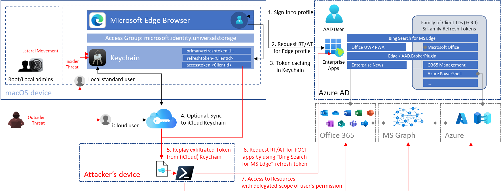

*Overview of the sign-in, token cache flow and potential replay attack paths on macOS devices.*

## macOS Keychain items from Microsoft products

According to Microsoft docs, Keychain plays a central role to store cached tokens which provides [SSO between MSAL apps](https://docs.microsoft.com/en-us/azure/active-directory/develop/single-sign-on-macos-ios):

> When the [Microsoft Authentication Library for iOS and macOS](https://docs.microsoft.com/en-us/azure/active-directory/develop/msal-overview) (MSAL) signs in a user, or refreshes a token, it tries to cache tokens in the keychain. Caching tokens in the keychain allows MSAL to provide silent single sign-on (SSO) between multiple apps that are distributed by the same Apple developer. SSO is achieved via the keychain access groups functionality.

*Source: [Configure keychain - Microsoft identity platform | Microsoft Docs](https://docs.microsoft.com/en-us/azure/active-directory/develop/howto-v2-keychain-objc?tabs=objc)*

I have found the following Keychain entries in relation to authentication for various Microsoft products on a macOS device:

<style>
table {
    border-collapse: collapse;
}
table, th, td {
   border: 1px solid black;
}
blockquote {
    border-left: solid blue;
    padding-left: 5px;
}
</style>

| Product | SSO | Item Type | Keychain Entry | Access (Group) to Keychain item | Token/Credentials |
| --- | --- | --- | --- | --- | --- |
| Microsoft 365 Apps | Only between M365 Apps | application password | MicrosoftOffice15_2_Data:<br />ADAL:<UserObjectID>, com.microsoft.adalcache | com.microsoft | No secrets or tokens in Keychain |
| Microsoft Teams | No | application password | Microsoft Teams Identities Cache, com.microsoft.oneauth.<UserObjectId> | Microsoft Teams | No secrets or tokens in Keychain |
| Microsoft Edge | No | application password | com.microsoft.oneauth.<UserObjectID>, Microsoft Edge Safe Storage com.microsoft | UBF8T346G9.com.microsoft<br />.identity.universalstorage | After initial profile sync: Various refresh token, primary refresh and access token are stored. Reference to user’s objectId is included. |

<br/>

*Note: I’ve used an Azure AD unregistered device without [Enterprise SSO plug-in](https://docs.microsoft.com/en-us/azure/active-directory/develop/apple-sso-plugin)* *for the following tests and use cases. Token caching in Keychain (by using access group “com.microsoft.identity.universalstorage”) seems to be the default for apps using MSAL. Therefore, most of the research results should be covered scenarios with „Enterprise SSO plug-in“ as well.*

*Side note: Azure CLI on macOS uses also MSAL in the recent versions. According to [Microsoft docs](https://docs.microsoft.com/en-us/cli/azure/msal-based-azure-cli), the cached tokens will be stored in files as cleartext if you are using Service Principals for authentication on macOS:*

> *The MSAL token cache and service principal entries are saved as encrypted files on Windows, and plaintext files on Linux and MacOS.*

Let’s have a closer look on the Edge profile sync with Azure AD account and the cached tokens...

## AAD Authenticated Edge Profile and Keychain

A Keychain entry with the name “Microsoft Edge Safe Storage” will be created immediately after initial startup. At next, a user sign-in to “Edge” profile for [using Azure AD SSO and satisfying (device compliant-based) Conditional Access Policies](https://docs.microsoft.com/en-us/deployedge/ms-edge-security-conditional-access#accessing-conditional-access-protected-resources-in-microsoft-edge).

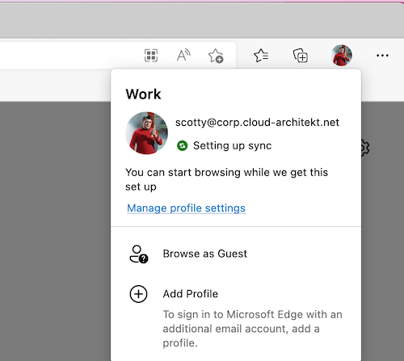

After synchronization has been finished, Microsoft Edge has assigned permissions for the following existing Keychain entries:

- “com.microsoft.adalcache”
- “com.microsoft.oneauth.*<UserObjectId>*”

In addition, token artifacts can be found in the Keychain after you signed into a Microsoft Edge profile with Azure AD credentials:

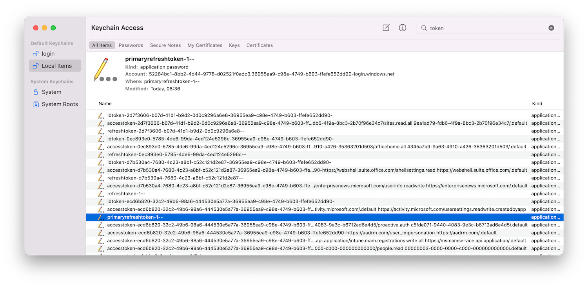

The GUIDs after “accesstoken-” and “refreshtoken-” are representing the “ClientId” of 1st Party (Microsoft) Enterprise applications. The listed Azure AD tokens are issued for the following apps:

| ClientId | Resource Application | Token Type |
| --- | --- | --- |
| 0ec893e0-5785-4de6-99da-4ed124e5296c | Office UWP PWA | Refresh, Access and ID Token |
| d7b530a4-7680-4c23-a8bf-c52c121d2e87-<TenantID>  | Microsoft News Feed (enterprisenews.microsoft.com) | Refresh, Access and ID Token |
| 2d7f3606-b07d-41d1-b9d2-0d0c9296a6e8  | Microsoft Bing Search for Microsoft Edge | Refresh, Access and ID Token |
| ecd6b820-32c2-49b6-98a6-444530e5a77a | Microsoft.AAD.BrokerPlugin / Microsoft Edge | Access and ID Token  |

<br/>
All types of cached tokens are stored in JWT format and can be displayed by unlocking the associated Keychain entries with the credentials of the local macOS user. 

It’s really interesting to see that these cached tokens are stored and readable from Keychain compared to other Microsoft products on macOS (such as Microsoft Teams or Microsoft Office apps). I was not able to see cached tokens on an equivalent way from those other products.

You’ll find the following non-interactive sign-ins in a regular start of Edge browser on macOS:

```powershell
union SigninLogs, AADNonInteractiveUserSignInLogs
// Timerange of the Browser lunch
| where TimeGenerated > todatetime('2022-05-12T19:55:00Z')
| where DeviceDetail_string contains "macOs"
// Filtering for the AAD authenticated user in Edge profile
| where UserDisplayName contains "Scott"
| project TimeGenerated, Identity, AppDisplayName, ResourceDisplayName, AppId, Category
```

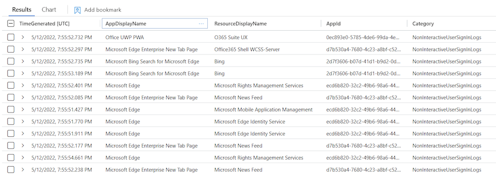

Refresh (RT) and access token (AT) will be updated in the Keychain immediately after launch.

### Microsoft Bing Search and Family Refresh Token

One of the cached tokens by using an authenticated Edge Profile needs to pay special attention. The token issued to “Microsoft Bing Search for Microsoft Edge” (2d7f3606-b07d-41d1-b9d2-0d0c9296a6e8) is one of the clients in the “Family of Client IDs Support”. Secureworks has done an amazing research work on this topic and published a [detailed documentation](https://github.com/secureworks/family-of-client-ids-research). Thanks to Nestori Syynimaa for discussing this interesting topic.

In summary, some [Microsoft client applications are compatible with each other](https://github.com/secureworks/family-of-client-ids-research#which-client-applications-are-compatible-with-each-other) which means refresh token can be redeemed for token as any other client in the family. This allows to take benefit from their scope.

For example, refresh token of the named “Microsoft Bing Search for Microsoft Edge” application has a very limited delegated permission scope. But it can be used to get a refresh token for “Microsoft Office” (d3590ed6-52b3-4102-aeff-aad2292ab01c) which allows to gain delegated access on a comprehensive user scope including the following sensitive Microsoft Graph API permissions:

- DeviceManagementConfiguration.Read.All
- Directory.AccessAsUser.All
- Files.ReadWrite.All
- Group.ReadWrite.All
- User.ReadWrite

In addition, the “Microsoft Office” refresh token can be used to acquire a refresh token for “Azure Management” and “Azure Core Management”:

```powershell
$AzureManagementToken = RefreshTo-AzureManagementToken -domain "cloudlab.onmicrosoft.com" -refreshToken $Secret
Parse-JWTtoken -token $AzureManagementToken.Access_Token | fl aud, name, oid, scp, groups, appid
```

```jsx
aud    : https://management.azure.com
name   : Spock
oid    : dc15ccec-73ad-48b1-8eb2-a4c4c1f1c73c
scp    : user_impersonation
groups : {2670b5ae-d1e0-4d31-ba6a-bd7317206e37, 66de7365-2b11-4432-8e0b-80138c8af96a,
         7d2ae0fd-af63-4a7c-9a4e-7949eada6406, df5b8a26-3ac4-44df-a1ca-250368968a29}
appid  : d3590ed6-52b3-4102-aeff-aad2292ab01c <-- Application Id of "Microsoft Office"
```

This  token allows get an access token to Azure Resource Manager (ARM) API with Azure RBAC role permissions of the user by using the “Az” PowerShell Module:

```powershell
PS C:\Attack\TokenTactics> Connect-AzAccount -AccessToken $AzureManagementToken.access_token -AccountId dc15ccec-73ad-48b1-8eb2-a4c4c1f1c73c

Account                              SubscriptionName TenantId                             Environment
-------                              ---------------- --------                             -----------
dc15ccec-73ad-48b1-8eb2-a4c4c1f1c73c                  36955ea9-c98e-4749-b603-ffefe652dd90 AzureCloud
```

Because of the various potential use cases, I’ve used the cached refresh token with ClientId scope on “Microsoft Bing Search” for further abuse and token replay scenarios.

### Primary Refresh Token (PRT) on macOS?

A keychain entry with the name “refreshtoken-1—” and “primaryrefreshtoken-1—” exists alongside of client-specific refresh and access tokens:

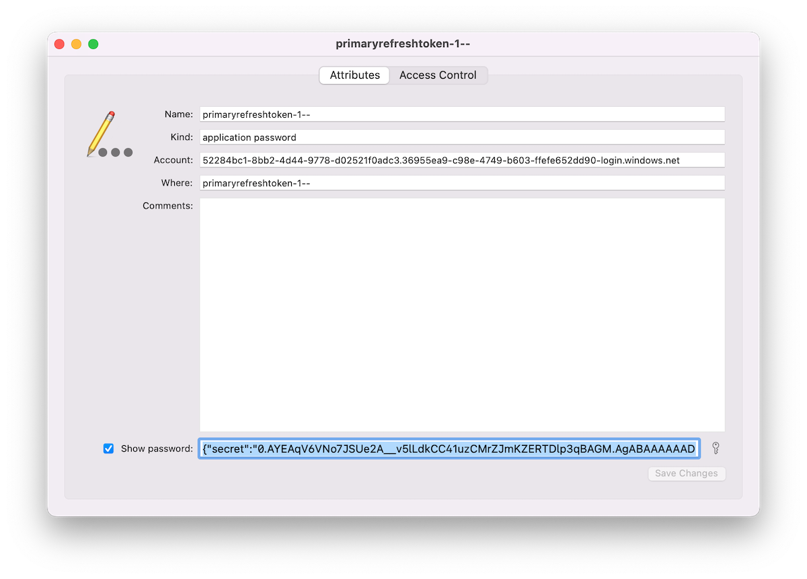

It’s interesting to see a “Primary Refresh Token” (PRT) on a macOS device. Microsoft docs describes the PRT artifact in relation to Windows, iOS and Android but without any words regarding macOS:

> A Primary Refresh Token (PRT) is a key artifact of Azure AD authentication on Windows 10 or newer, Windows Server 2016 and later versions, iOS, and Android devices. It is a JSON Web Token (JWT) specially issued to Microsoft first party token brokers to enable single sign-on (SSO) across the applications used on those devices. In this article, we will provide details on how a PRT is issued, used, and protected on Windows 10 or newer devices.

*Source: [Primary Refresh Token (PRT) and Azure AD](https://docs.microsoft.com/en-us/azure/active-directory/devices/concept-primary-refresh-token)*

The JWT of the “PRT” can be read in cleartext by local user after unlocking the related Keychain entry. It contains the “Secret” but also a “Session_Key”. PRT is defined as “credential_type” in “Protocol Version” 3.0. I was not able to replay or “pass” the PRT in combination with various offensive tools (such as [AADInternals](https://www.google.com/search?client=safari&rls=en&q=aadinternals&ie=UTF-8&oe=UTF-8) or [ROADtools](https://github.com/dirkjanm/ROADtools)). It seems to be “incompatible” because of the different PRT Protocol version.

Compared to Windows 10 or newer devices, sensitive keys of the PRT will be not protected particular on macOS. The session key seems readable for the related user and value in the Keychain item is not encrypted by a transport key. On Windows devices, a “session key” can be only decrypted by using a “private transport key” which is secured by the TPM chip.

More details on PRT protection on Windows can be found on [Microsoft Docs](https://docs.microsoft.com/en-us/azure/active-directory/devices/concept-primary-refresh-token#how-is-the-prt-protected).

## Security considerations on cached tokens in Keychain

During my research, I’ve discovered the following two “behaviours” which should be considered:

### Cached tokens still alive after sign-out from Edge profile

Azure AD users are able to “sign out” from profile and choose "Clear favorites, history, passwords, and other browsing data from this device when signing out from profile:

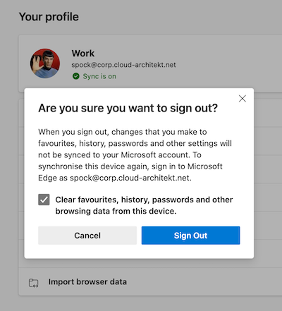

Microsoft Edge for macOS stores refresh tokens persistently (incl. PRT and session key) even if the user has been signed out from profile and deleted "all profile data".

Cached tokens are still valid (until token lifetime has expired) and can be used for token replay. A user needs to enter their credentials for “re-signing” to the Edge profile. In this case, Microsoft Edge is not using the remaining cached tokens for re-authentication.

Nevertheless, I would consider deleting all related Keychain entries manually or as part of a script if no device reset can be executed. Alternatively, Azure AD admins should revoke all refresh tokens to prevent abuse of the remained refresh tokens.

*Comparison to other Microsoft apps on macOS: Sign-out from Microsoft 365 Apps and Teams will also prevent users from resign-in without entering credentials. But all related Keychain entries will be removed after logout as well.*

### Synchronization of tokens across Apple devices by iCloud Keychain

All cached tokens from the Microsoft Edge profile synchronization will be synchronized to iCloud if the user has been enabled “Keychain” sync.

This offers an access path for users (or attackers) to “synchronize” the related tokens to other iCloud connected devices for token replay and satisfying MFA requirements and/or conditions by Conditional Access policies (part of token claims) from another device.

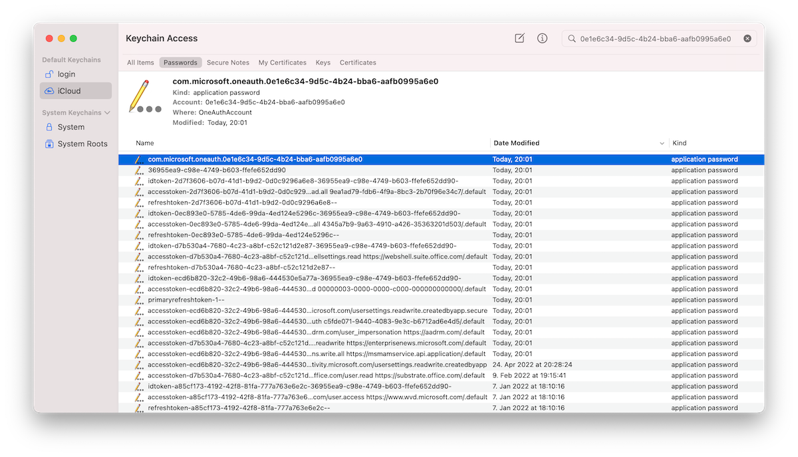

## Exfiltration and replay of (Primary) Refresh Token

### Access to token (secrets) from Keychain

In my opinion the following examples of attack paths exists where user or attacker could gain access to the cached token in the keychain of the user:

- Compromised macOS user password and running local script to unlock Keychain item
- Compromised iCloud account with access to the synchronized Keychain entries
or security exploit to dump (iCloud) keychain (for example, using a [CVE-2019-8526](https://nvd.nist.gov/vuln/detail/CVE-2019-8526) exploit)
- Compromised credentials or access to (other) local admin account to reset password of the user account with cached Azure AD token in keychain

### Using Token Tactics to request refresh and access tokens

In this example, I’m using the PowerShell module “TokenTactics” to demonstrate the replay and abuse of the described token(s). It allows to request new refresh and access tokens (RT/AT) for other 1st party applications in Microsoft Azure AD.

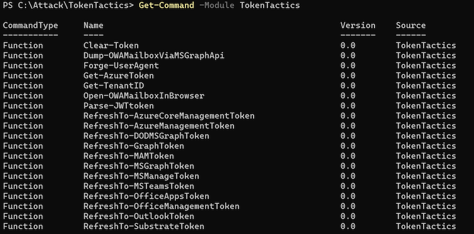

As already discussed, the refresh token of “Microsoft Bing Search for Microsoft Edge” (2d7f3606-b07d-41d1-b9d2-0d0c9296a6e8) is one of the “**Family Refresh Tokens” (FOCI).**

The “Token handler” in the “TokenTactics” module uses the “ClientId” of “Microsoft Office” to get other refresh and access tokens to FOCI apps. But this can be also replaced by other FOCI apps (e.g. Microsoft Azure Management):

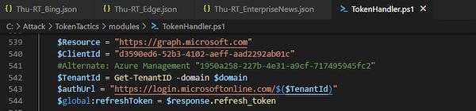

I’ve extracted the secret of “Microsoft Bing Search for Microsoft Edge” from the Keychain entry and provided them as “RefreshToken” parameter to the “RefreshTo-MSGraphToken” cmdlet:

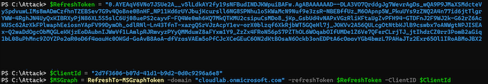

Even if Microsoft Graph is not a direct known FOCI "family" client, I’m able to get an access token to this resource as part of the “Microsoft Office” resource delegation. The issued access token can be used to get full scoped (delegated) access to the Microsoft Graph API. For example, by using „Microsoft.Graph SDK“ and using the “AccessToken” parameter in the “Connect-MgGraph“ cmdlet:

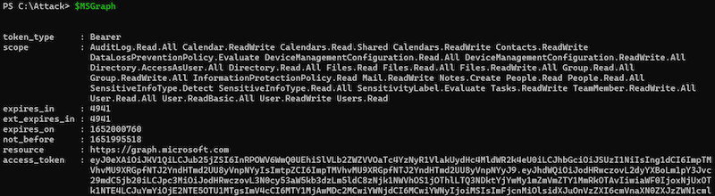

Another example: I’m able to get a refresh and access token to Microsoft Outlook which includes also a wide range of user scope:

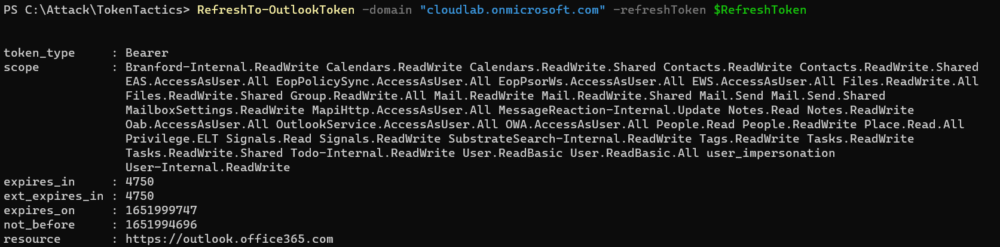

Using “RefreshTo-AzureManagementToken” cmdlet allows to request a refresh or access token for “Azure Management” if the affected user has privileged access to Azure resources and no Conditional Access policy protects privileged interfaces (enforce usage of SAW/PAW devices with Device Filters). Otherwise, you should receive this error message:

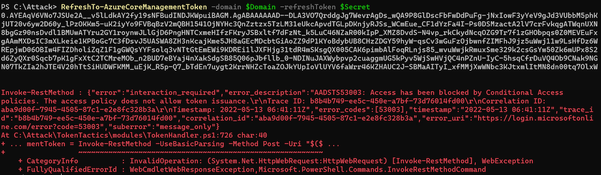

Sign-ins will be audited in the “non-interactive” sign-in logs and displays “Microsoft Office” as application because “Token Tactics” is using (by default) this “ClientId” to get access to other FOCI apps and delegated resources (Microsoft Graph):

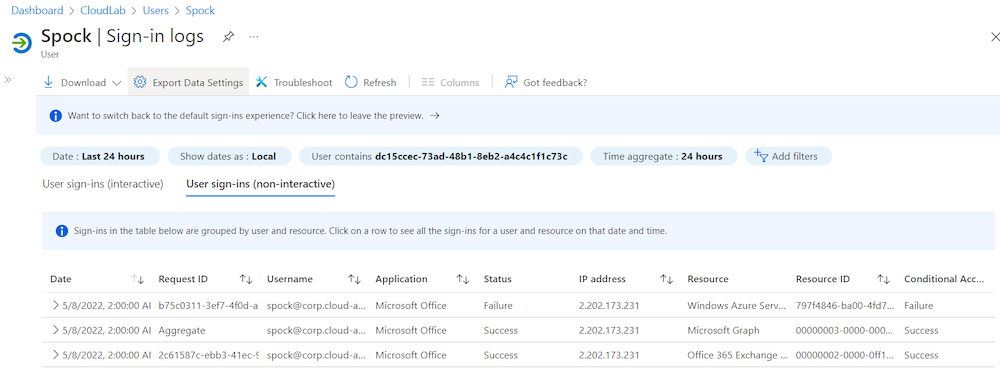

## Sign-in logs and detection options

Sign-in logs shows “MacOs” as operating system because it’s included in the original refresh token. User Agent covers the current value of requests to refresh or access token but can be easily manipulated. Token tactics includes a “Browser” and “Device” parameter to change the values. Therefore, triggering a mismatch between Operating System in “UserAgentString” and “Device Info” isn’t a good indicator:

```powershell
union SigninLogs, AADNonInteractiveUserSignInLogs
| extend operatingSystem = tostring(parse_json(DeviceDetail_string).operatingSystem)
| extend Browser = tostring(parse_json(DeviceDetail_string).browser)
| project TimeGenerated, Category, IPAddress, AppDisplayName, ResourceDisplayName, operatingSystem, Browser, UserAgent
```

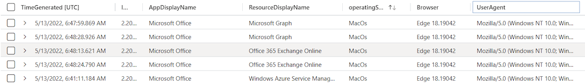

### Risk Detection of Azure AD Identity Protection

Microsoft offers many different sign-in risk detections which also applies to replay tokens from a macOS device and further requests of refresh or access tokens.

One of the latest added detections is named “Anomalous Token” which detects “abnormal characteristics” or if a token “has been played from a unfamiliar locations”.
During my tests, this risk detection was triggered once.

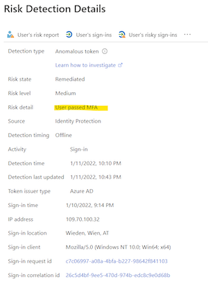

There’s one challenge of all risk detection: Even a token was replayed from a source with a detected risky IP address, the exfiltrated refresh tokens contains a strong authentication (MFA) claim which allows to “pass” sign-in risk policies with “Require MFA” access control.

## Reduced attack surface and mitigations

### Re-authentication if sign-in risk has been detected

As already named, sign-in risk policy could be easily “by passed” (self-remediation) because of the included strong authentication claimed in the replayed token.

New session sign-in frequency option to require re-authentication can be scoped on users based on defined sign-in or user risk levels:

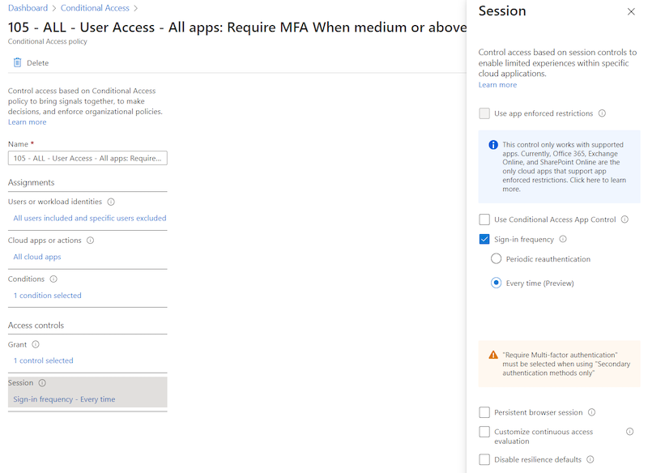

This offers the opportunity to expire presented MFA claim in the replayed token:

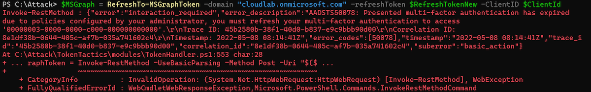

### Continuous Access Evaluation (CAE) and Critical Event of User/Sign-in risk

Microsoft has been implemented [CAE to trigger re-evaluation of Conditional Access policies](https://docs.microsoft.com/en-us/azure/active-directory/conditional-access/concept-continuous-access-evaluation) if a condition has been changed (e.g. IP/location change or risk state of user). Unfortunately, this works only if you are using a CAE-capable client. This isn’t the case in my described token replay scenarios.

Until now, CAE can not be enforced for certain users and clients. Therefore, the trigger event could not be used as solution to revoke the replayed token.

### Limit token lifetime on non-corporate or non-managed devices

The described scenarios includes a macOS device which is not full managed by Microsoft Intune. I would recommend you to limit the token lifetime of refresh token on such kind of devices. This session management settings reduces the time window for abusing a valid cached tokens.

### Securing managed macOS devices

Limit local administrator permissions for macOS users to reduce attack surface on changing (local) macOS user passwords to get access to the Keychain. Define strong device compliance including the risk score for detection on suspicious client activities.

### Monitoring of macOS devices

Microsoft protects cached tokens on OS-level in Windows. [Many features are included](https://twitter.com/dwizzzlemsft/status/1493761186092834817?s=21) to avoid exfiltration of “Primary Refresh Token” (PRT) and also detections from MDE. A [new risk detection](https://docs.microsoft.com/en-us/azure/active-directory/identity-protection/concept-identity-protection-risks#premium-user-risk-detections) is also available in “Azure AD Identity Protection” to ingest alert from Windows devices if someone try to access the PRT. This seems not be working on macOS. Therefore, unlock events from users to get access or dump Keychain entries should be strictly monitored.

*Thanks to Nestori Syynimaa and Oliver Kieselbach for sparring on this topic.*
*Cover image original by [Sergey Zolkin](from Unsplash)*