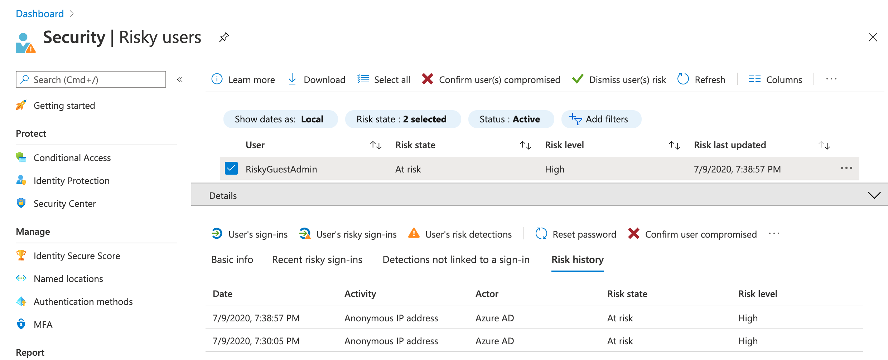
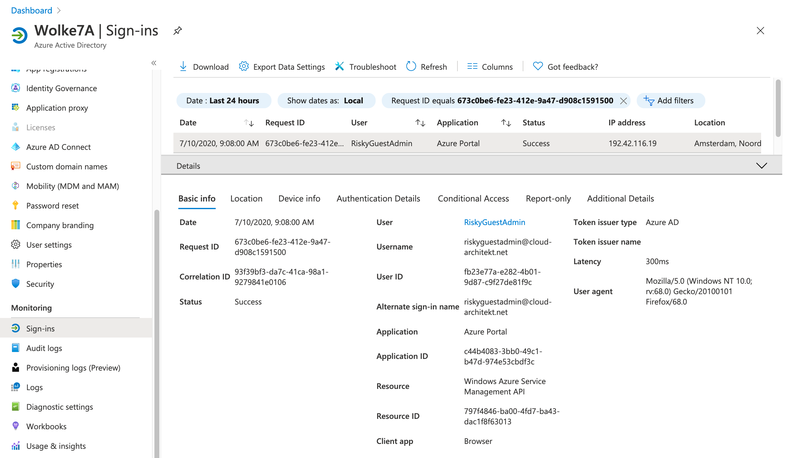
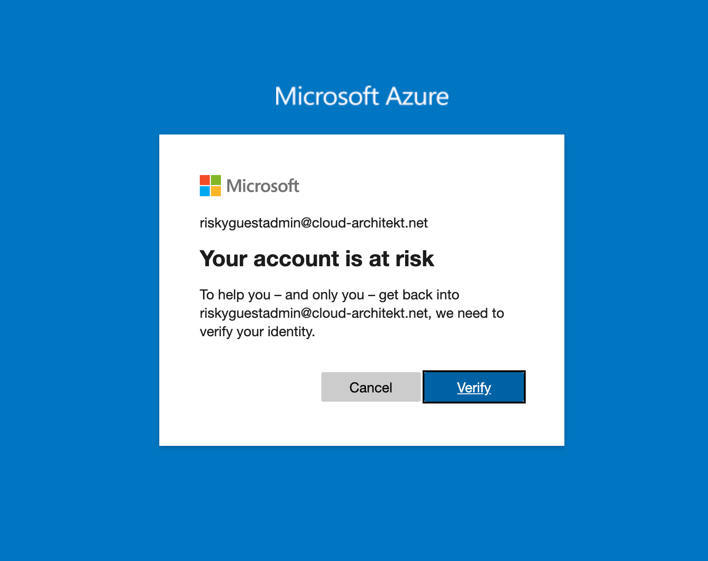

*In the recent months I‘ve spent time on research of identity security in B2B scenarios (when users are invited to another Azure AD tenant). In this blog post I like to share a few insights about known but also undocumented limitations or concerns of identity protection in Azure AD B2B. All results of my research was double checked in my lab environment, but I would be very interested to hear feedback from others about their experiences or technical insights.* 

*Note: The following security concerns was submitted to „Microsoft Security Response Center“ (MSRC) during a case in June and July 2020. I‘ve shared details of my research work and potential attack scenarios. In the end the MSRC give me the following feedback:*

*„Upon investigation, we have determined that this submission does not meet the bar for security servicing. This report does not appear to identify a weakness in a Microsoft product or service that would enable an attacker to compromise the integrity, availability, or confidentiality of a Microsoft offering.“*

## Use cases of invited users (outside of the resource tenant)

Before we go into details ... I like to list some use cases where users will be invited to other Azure AD tenants as part of the Azure AD B2B feature:

- **Business-to-Business (B2B) collaboration or partnership to other organizations:**<br>
I guess this is the most familiar example and many aspects of Azure AD B2B are designed for this scenario. One organization invites member (work accounts) from a partner organization to the Azure AD tenant for sharing infrastructure or access to project/business resources. This may be the case, if guest users needs access to shared files (OneDrive) or different project teams have to collaborate closely (Microsoft Teams).
- **External administrators to manage your Azure AD or Azure resources:**<br>
External users will be invited to Azure AD tenant for delegation of administrative or privileged tasks. [Azure Security Center (ASC)](https://docs.microsoft.com/en-us/azure/security-center/security-center-identity-access) shows as recommendation to remove external identities from Azure (subscription) RBAC roles. From my point of view there are cons and pros around the dependency of identity (lifecycle) from an external organization. However, you should verify on your conditions if it‘s an prefer (secure) option to have a full-managed privileged identity in your tenant.
- **Administration of Azure AD B2C tenant from Azure AD Premium (B2E) tenant:**<br>
As you may already know, Azure AD B2C tenants are not supporting premium protection features (licensed as "Azure AD for O365" tenant only) yet. Conditional Access and Identity Protection for B2C was already announced at Ignite 2019. Until now it is an (undocumented) good practice to use privileged identities from Azure AD (B2E) Premium tenant. External administrators from the Azure AD Premium can be assigned to Conditional Access and Identity Protection risk-based policies/reports in the home tenant.
- **Centralized Azure AD „Management“ tenant to manage a multi-tenant (enterprise) environment:**<br>
I‘ve heard a few times that some (large) organizations implemented an internal „management“ tenant in the past. All privileged identities and resources will be located in this directory to use „shared services“ across a multi-tenant environment. Azure AD introduced in the recent year(s) many enhancements to separate or isolate resources within one tenant (e.g. Administrative Units, Custom Roles, fine-grained policies etc.). In the past Microsoft already recommended to use one tenant per organization but from historical or technical reasons (company merge, geo-political, technical limitations) real-world practice shows some (valid) alternate approaches.

In this diagram you can see the environment and "wordings" that I will use for further explanation about the B2B scenarios and examples of my security considerations: 


## Limitations or considerations that could allow „bypassing“ of your identity protection mechanism in B2B scenarios

**The follow findings can be reproduced as far your accessing resources by the TenantID parameter of the inviting tenant (such as PowerShell, Az CLI or Portal URL).**

**Portal URLs**:

```powershell
https://portal.azure.com/<TenantIDOfInvitingTenant>
https://aad.portal.azure.com/<TenantIDOfInvitingTenant>
```

**PowerShell**:

```powershell
$Credential = Get-Credential
$TenantID = <TenantIDOfInvitingTenant>
Connect-AzureAD
       -Credential $Credential
       -TenantId $TenantID
```

### No sign-in failure events if sign-in attempts of invited users in inviting tenant has failed

**Description:**

Sign-in failures of invited users will not be audited (neither in invited nor inviting tenant). This only applies to authentication scenarios where Azure AD will be used for primary credential validation (Password Hash Sync). ADFS- or PTA-Authentication allows you to see the failed validation attempts to your Active Directory (On-Premises) infrastructure.
As far as I know, this limitation is not documented by Microsoft. 

**Potential risk or security concern:**

Any kind of sign-in failures (including "Password Spray" or "Brute force" attacks) from an inviting tenant are not visible for SecOps.

Currently there are no options to restrict "inbound" invitations (list of domains that are allowed to invite users of your tenant). Only inviting domains of "outbound" invitation can be limited. In combination with the missing sign-in failure events it may lead to the concern that you have limited control and visibility of invited users by external partners (B2B).

*Note: The following blog post by SecurePractice.co describes also attack scenarios where [Azure AD B2B invitations](https://securepractice.co/blog/phishing-with-azure-ad-b2b-collaboration) can be used for phishing attacks. The inviting user will be forwarded to "MyApps" portal which includes a published apps with attacker's own login page to phishing credentials.*

**Technical Background and Reproducing:**

1. Search for the Tenant ID of the inviting tenant:
Anonymous (e.g. [](https://www.whatismytenantid.com)OpenID Discovery (wellknown) or [online tool "WhatIsMyTenantID.com"](https://www.whatismytenantid.com)) or as [authenticated user via PowerShell](https://docs.microsoft.com/de-de/powershell/module/azuread/Get-AzureADTenantDetail?view=azureadps-2.0)
2. Navigate to a resource of the inviting tenant (https://portal.azure.com/<TenantIDOfInvitingTenant>)
3. Enter the name of the invited user or try to enumerate a user name that could be invited.
*Note: David Chronlund has written a great blog post with some insights on "[Automatic Azure AD User Account Enumeration with PowerShell](https://danielchronlund.com/2020/03/13/automatic-azure-ad-user-account-enumeration-with-powershell-scary-stuff/) "*
4. Enter (various) wrong credentials to generate failed sign-in attempts until account is temporarily locked (by default a lockout threshold of 10 attempts is configured). You will see the following message, which shows that [Smart Lockout was triggered](https://docs.microsoft.com/en-us/azure/active-directory/authentication/howto-password-smart-lockout#how-to-determine-if-the-smart-lockout-feature-is-working-or-not):

    

    *Note: Smart Lockout of the home tenant will applied to invited users which can be verified by changing the lockout threshold to any non-default value.*

5. Check if sign-in failures are visible in the Azure AD Sign-in logs and MCAS activity (Azure App Connector/Azure AD events). In my tests this was not the case:

    

6. Optional: Check the MCAS activity logs if you have connected your Azure ATP instance and using PTA or ADFS as primary authentication. You'll find a failed logon event as part of Azure AD authentication request. In my sample the „Authentication Agent“ of PTA is located on server "DS1". This is the internal credential validation between "PTA Agent" and domain controller but not the original request.

    

**Mitigation or workaround:**
Migration to Pass-trough Authentication (PTA) as primary authentication method is technically an option but may also lead to several other disadvantages (depending on your availability and environment requirements).

Azure AD Smart Lockout will throttle the attempts and risks of „Password Spray“ or „Brute Force“ attacks to invited users even if you have no visibility to this events. In my opinion there's no option to increase the visibility of sign-in attempts for the invited organization yet.

It should be recommend to implement a security process and monitoring for B2B invitation of your users to other tenants..
Unfortunately the tenantID of the inviting tenant seems not be included in the sign-in logs to the "Microsoft Invitation Acceptance Portal".
So it's hard to detect the tenantID of the inviting tenant on a early stage.

*Note: Have a look on the "[Tenant restrictions](https://docs.microsoft.com/en-us/azure/active-directory/manage-apps/tenant-restrictions)" feature if you want to define a list of tenants that are permitted to access (requires proxy HTTP header insertion and TLS interception).*

### Conditional Access Policy from home tenant will not be applied

**Description:**
Microsoft has already acknowledged the fact that Conditional Access Policies from the home tenant will be not enforced (such as MFA requests):

> "The inviting tenancy is always responsible for MFA for users from the partner organization, even if the partner organization has MFA capabilities".

*Source: Microsoft Docs ("[Conditional Access for B2B collaboration users](https://docs.microsoft.com/en-us/azure/active-directory/b2b/conditional-access)")* 

Therefore it's important to be aware of the technical detail that policies from the home tenant will not be applied when a inviting user accessing resources of the inventing tenant directly (by using the TenantID parameter).

Details on "bypassing" Conditional Access Policies from the home tenant as invited users was already described in a [great blog post by Stephan Waelde](https://stephanwaelde.com/2019/12/26/guest-sign-ins/). He has also figured out that invited users are able to read all applied and non-applied policies in the inviting tenant (MySignIn reports)

**Potential risk or security concern**

- No option to protect or restrict access of (Azure AD) work accounts by Conditional Access (CA) Policies across company / tenant boundaries:
    - _Example of user-based policy_: Invited users may not requested for MFA registration and strong authentication in the resource tenant. Some organizations excluded B2B users to avoid "double MFA" and additional management of MFA method. Recommendation to require MFA for B2B users in the inviting tenant (if strong authentication is required) could be overlooked in misunderstanding of responsibility to enforce MFA.
    - _Example of device-based policy_: Invited users are able to access resources in inviting tenant from non-compliant devices. Inviting organizations may excluding B2B users from device-based policies because they're not managed and can't be compliant with the device policies of the resource tenant.
- Additional administrative efforts (and higher risk of misconfiguration) to enforce CA strategy across all tenants (in case of a  multi-tenant-environment) within an organization.

**Technical Background and reproducing:**

1. Create various "Conditional Access Policies" in the home tenant that will apply to the test user. Check sign-in activities from the user in the home tenant to get an overview of all policies that was applied:

    

    Optional: Check "What if" to simulate conditions and control of enabled CA policies

    

2. Try to access resources of the inviting tenant from your invited user (and a non-compliant / unmanaged device like in this sample). Don't forget to use the TenantID parameter! Afterwards check the sign-in logs in home and resource tenant for applied policies:

    

    

    As you can see only Conditional Access policies from the inviting tenant was applied to the invited user. In this case the user has access to the resource tenant without any device- or MFA requirements (as defined in the home tenant).

**Mitigation or workaround:**

**Multi-Tenant Environment**

Ensure that required "Conditional Access Policies" are also deployed and assigned in resource tenants. Misconfiguration and administrative efforts/costs can be reduced by automated deployment (to your multi-tenant-environment). Alexander Filipin has started an awesome [GitHub project](https://github.com/AlexFilipin/ConditionalAccess) to provide a fully automated solution for achieving an "As Code" approach for Conditional Access.

**Delegated Privileged Access to Azure AD B2C or other Azure AD "Free" Tenants**

All new created tenants starting from October 2019 will be protected by a minimum set of policies ("Security Defaults"). This is not the case in creation of B2C tenant because it is not supported for this kind of directories. This includes that all new tenants will be created  without security defaults. Previous ["Baseline policies"](https://docs.microsoft.com/en-us/azure/active-directory/conditional-access/concept-baseline-protection) are deprecated and can't be used anymore. The announced support of Conditional Access and Identity Protection for Azure AD B2C will resolve this security concern finally.

Enabling of “Security defaults” for all other (free) Azure AD tenants is supported and will enforce MFA for administrators in the tenant (this also covers invited privileged users). But you will have no option to exclude “emergency access accounts” (aka “break glass” accounts). This also prevents you to configure other condition/controls as part of Conditional Access Policies (registered device required for privileged access). And you will be losing the access to the tenant in MFA outage scenarios without break-glass.

**Monitoring access to inviting tenant from privileged users without MFA**
I've tried to write a simple Azure Sentinel / KQL query to detect sign-ins without MFA from privileged users. In many cases the sign-in logs of the inviting tenant shows the detail that MFA requirement was satisfied by a claim in the token even if it wasn't required.
The query can be used in the inviting tenant and filtered users by the account prefix of your admins. This is still an experimental query without any warranty. You'll find the latest version in my GitHub repository: [azuresentinel/SignInFromExternalPrivilegedUserWithoutMFAClaim.kusto](https://github.com/Cloud-Architekt/azuresentinel/blob/master/SignInFromExternalPrivilegedUserWithoutMFAClaim.kusto)

### No enforcement of sign-in risk and user risk policy in inviting Azure AD tenants (without Identity Protection)

**Description:**

Every inviting tenant without configured sign-in or user-risk policy will not response to the evaluated risk from the invited tenant. This was the result of my research which seems to be also covered by Microsoft's statement:

> The user risk for B2B collaboration users is evaluated at their home directory. The real-time sign-in risk for these users is evaluated at the resource directory when they try to access the resource.

*Source: Microsoft Docs ("[Identity Protection and B2B users](https://docs.microsoft.com/en-us/azure/active-directory/identity-protection/concept-identity-protection-b2b)")* 

In addition Microsoft also consider the following limitation as part of the Identity Protection documentation:

> Currently, risk-based sign-in policies cannot be applied to B2B users because the risk evaluation is performed at the B2B user’s home organization.

*Source: Microsoft Docs ("[Risk-based Conditional Access for B2B](https://docs.microsoft.com/en-us/azure/active-directory/b2b/conditional-access)")*

**Potential risk and security concerns:**

- Users with risky state in home tenant are able to accept invitation from inviting tenants.
- Azure AD tenants without sign-in risk or user risk policy for guests: Users are able to access resources in the inviting tenants even if they are flagged as risky users in the invited tenant or sign-in risk to inviting tenant was detected.

**Technical Background and Reproducing:** 

1. Create a user account in home tenant with assigned Azure AD Premium license, Identity Protection sign-in risk and user risk policy. Control of sign-in risk policy should be set on risk-level "Medium and above" to require "multi-factor authentication". User Risk policy should be configured to require "Password change" by user risk level "high".

    *Note: Be aware of latency of some detections and algorithm requirements (e.g. 14 days / 10 logins for atypical travel). Check out the "[Simulate risk detection](https://docs.microsoft.com/en-us/azure/active-directory/identity-protection/howto-identity-protection-simulate-risk)" documentation by Microsoft for more details.*

2. Invite the user from Azure AD Tenant without configured (Identity Protection) risk-based policies.
*Note: In one of my tests I've used an account which was already flagged as risky (in the home tenant) before invitation was redeemed and sign-in successfully:*

    

    

3. Try to sign-in from an Tor browser by accessing the Azure Portal with TenantID parameter (https://portal.azure.com/<TenantID>) as already described. Access from an anonymous IP address is one of the real-time detections that could be used to trigger a sign-in risk policy. 

    In my tests, user was not be prompted for MFA (sign-in risk response) which underlines the statement that sign-in risk is evaluate in the resource tenant (as we can see it is not the case if it’s not available).
    *Note: Sign-in process stopped by forwarding from [login.microsoftonline.com](http://login.microsoftonline.com) to portal.azure.com in some test scenarios. If this happens try another portal that is supporting TenantID parameter such as Azure AD portal (aad.portal.azure.com) or Azure AD Preview portal (preview.portal.azure.com).*

4. Check the identity risk detection in the home/invited tenant after few minutes. Real-time risk (anonymous IP address) was detected by Identity Protection: 

    


5. The following screenshot shows the original sign-in event that is audited in the home and resource tenant:

    

    

6. Navigate to a resource of the home tenant ([https://portal.azure.com/<TenantIDOfInvitedTenant>](https://portal.azure.com/<TenantIDOfInvitedTenant>))
in the Tor Browser to verify that user risk detection will be triggered if risk-based policies are enabled:

    

7. Optional: Invite your test user to any other tenant with enabled Identity Protection and assigned user risk and sign-in risk policies to all users (including guest). The risk-based policies will be triggered in real-time and works as expected (e.g. access from risky users will be blocked).

**Mitigation or workaround:**
Blocked sign-in (disabled user) of sensitive or privileged Azure AD accounts that are flagged as risky, can be used as replacement for automated response. This will prevent further authentication to resources (located in tenant without Identity Protection). [Azure Sentinel playbooks](https://github.com/Azure/Azure-Sentinel/tree/master/Playbooks) can be used to run automation with additional security operations such as revoke user‘s refresh token or reset user password. 

Enabling sign-in and user risk policy in the inviting / resource tenant (if possible) should be the best mitigation. This will also enforce risk-based policies to your other company tenants. Consider that remediation of user risk must be performed in the home tenant and access could be blocked to resource tenant.

**Detection of risky "non-applied policies" sign-ins to Azure Portal**
The following query was be used in my tests to detect sign-ins with risk detection and non-applied "Conditional Access policies" from the home tenant. This query is simple but very experimental. Feel free to use it (without any warranty)! The latest version of this query is available from my GitHub repo: [azuresentinel/RiskySignInToAzurePortal.kusto](https://github.com/Cloud-Architekt/azuresentinel/blob/master/RiskySignInToAzurePortal.kusto)

### Side note: Offline detection and sign-in risks

I've tested during my research also various [offline detections](https://docs.microsoft.com/en-us/azure/active-directory/identity-protection/concept-identity-protection-risks) such as „Atypical travel“ or "Malicious IP address". Therefore I created two accounts (GuestUser and GuestAdmin) and invite them to a Azure AD Premium and Azure AD B2C tenant. I’ve used various public proxy servers to simulate the sign-ins from geographically (far) distant locations . It's interesting to see that sign-ins with offline calculated risks will be also detected and reported in the home tenant.


But keep in mind to monitor them explicit and build an automation to response this identity risk if the resource tenant hasn’t any risk-based policy for auto-response.

<br>
<br>
<br>
<span style="color:silver;font-style:italic;font-size:small">Original cover image by [mohamed Hassan / Pixabay](https://pixabay.com/illustrations/insurance-life-protect-help-secure-4004023/)</span>